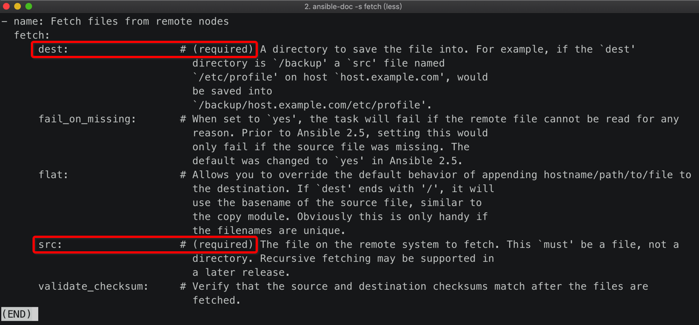
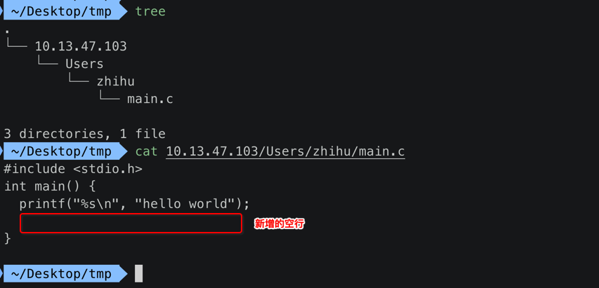
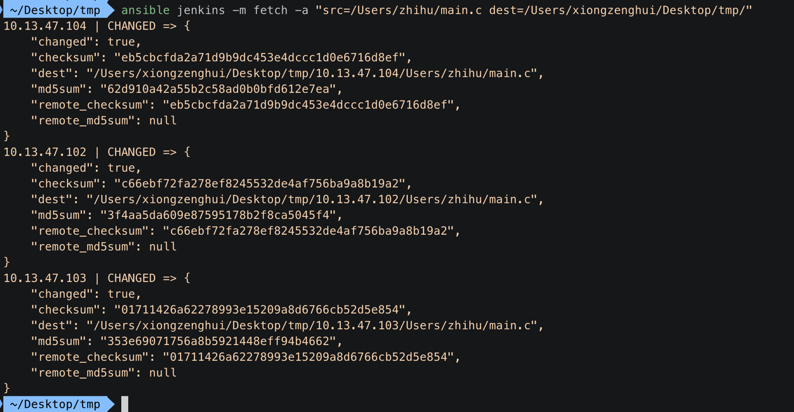

## 1. 参考教程

本模块全部教程来自: http://www.zsythink.net/archives/2523

写得非常好!


## 2. 在远程【被控机】准备一个【文件】

```
 ~/Desktop  ssh zhihu@10.13.47.103
Last login: Tue Apr  2 15:49:54 2019 from 10.14.8.16
```


```
➜  ~ pwd
/Users/zhihu
```

```
➜  ~ cat main.c
#include <stdio.h>
int main() {
  printf("%s\n", "hello world");
}
```

在远程【被控机】有一个 miain.c 文件。


## 3. `ansible-doc -s fetch` 查看 fetch 模块



调用 fetch 模块，**必须** 传递 2个参数:

- 1. src : 从哪里读取文件 ==> 被控机
- 2. dest : 将文件写入哪里 ==> ansible 安装机


## 4.【ansible 主机】上的 `/etc/ansible/hosts` 被控机清单

```
[jenkins]
10.13.47.103 ansible_user=zhihu
```


## 5.【ansible 主机】【第一次】执行 fetch 拉取【被控机】上的文件

```shell
 ~  ansible jenkins -m fetch -a "src=/Users/zhihu/main.c dest=/Users/xiongzenghui/Desktop/tmp/"
10.13.47.103 | CHANGED => {
  "changed": true,
  "checksum": "0a0a6c882a8d4b356fe40786dc64fc7df11d6ccc",
  "dest": "/Users/xiongzenghui/Desktop/tmp/10.13.47.103/Users/zhihu/main.c",
  "md5sum": "c2c251949fcdfb0d95265c228c963053",
  "remote_checksum": "0a0a6c882a8d4b356fe40786dc64fc7df11d6ccc",
  "remote_md5sum": null
}
```

上述命令行截图:


- 注意点1: 内容输出是 **黄色**
- 注意点2: **"changed": true**
- 注意点3: 会在执行 ansible fetch 模块的主机上，自动创建 `/Users/xiongzenghui/Desktop/tmp/` 目录

## 6. 打开【ansible 主机】上的存储拉取到文件的目录

进入到在上面执行 **fetch** 拉取被控机上文件的存入目录:

```
 ~  cd /Users/xiongzenghui/Desktop/tmp/
```

发现目录中内容，是以 **ip 地址** 为 **目录** 分目录进行存储:

```
 ~/Desktop/tmp  tree
.
└── 10.13.47.103
    └── Users
        └── zhihu
            └── main.c

3 directories, 1 file
```

被拉取到的 main.c 文件，按照路径进行存储:

```
- ansible fetch 指定的 dest 目录
  - remote ip
    - fetch 拉取文件的全路径
```

## 7. 【ansible 主机】【第二次】执行 fetch 拉取【被控机】上的文件


- 注意点1: 内容输出是 **绿色**
- 注意点2: **"changed": false**


## 8.【修改】远程【被控机】上的 main.c 文件


## 9. 【ansible 主机】【第三次】执行 fetch 拉取【被控机】上的文件


- 注意点1: 内容输出是 **黄色**
- 注意点2: **"changed": true**


## 10. ansible 输出内容的【颜色】区别

- 1) **绿色** 的输出 => "changed": **false** => **没有** 变化
- 2) **黄色** 的输出  => "changed": **true** => **发生** 变化


## 11. 查看【第三次】执行 fetch 拉取【被控机】上的文件




## 12. 【ansible 主机】拉取【组内】所有被控机的同一个文件

### 1.【ansible 主机】上的 `/etc/ansible/hosts` 被控机清单

```
[jenkins]
10.13.47.102 ansible_user=zhihu
10.13.47.103 ansible_user=zhihu
10.13.47.104 ansible_user=zhihu
```

### 2. 【ansible 主机】【第二次】执行 fetch 拉取【jenkins 组】所有主机的文件

清处掉上面拉取到的文件后，重新执行 ansible fetch 拉取【jenkins 组】所有【被控机】的文件

```
 ~/Desktop/tmp  ansible jenkins -m fetch -a "src=/Users/zhihu/main.c dest=/Users/xiongzenghui/Desktop/tmp/"
10.13.47.104 | CHANGED => {
  "changed": true,
  "checksum": "eb5cbcfda2a71d9b9dc453e4dccc1d0e6716d8ef",
  "dest": "/Users/xiongzenghui/Desktop/tmp/10.13.47.104/Users/zhihu/main.c",
  "md5sum": "62d910a42a55b2c58ad0b0bfd612e7ea",
  "remote_checksum": "eb5cbcfda2a71d9b9dc453e4dccc1d0e6716d8ef",
  "remote_md5sum": null
}
10.13.47.102 | CHANGED => {
  "changed": true,
  "checksum": "c66ebf72fa278ef8245532de4af756ba9a8b19a2",
  "dest": "/Users/xiongzenghui/Desktop/tmp/10.13.47.102/Users/zhihu/main.c",
  "md5sum": "3f4aa5da609e87595178b2f8ca5045f4",
  "remote_checksum": "c66ebf72fa278ef8245532de4af756ba9a8b19a2",
  "remote_md5sum": null
}
10.13.47.103 | CHANGED => {
  "changed": true,
  "checksum": "01711426a62278993e15209a8d6766cb52d5e854",
  "dest": "/Users/xiongzenghui/Desktop/tmp/10.13.47.103/Users/zhihu/main.c",
  "md5sum": "353e69071756a8b5921448eff94b4662",
  "remote_checksum": "01711426a62278993e15209a8d6766cb52d5e854",
  "remote_md5sum": null
}
```



可以看到输出，成功拉取到三个【被控机】上的 main.c 文件。

### 3. 查看【ansible 主机】上的存储拉取文件目录

```
 ~/Desktop/tmp  tree
.
├── 10.13.47.102
│   └── Users
│       └── zhihu
│           └── main.c
├── 10.13.47.103
│   └── Users
│       └── zhihu
│           └── main.c
└── 10.13.47.104
    └── Users
        └── zhihu
            └── main.c

9 directories, 3 files
```

finish !
