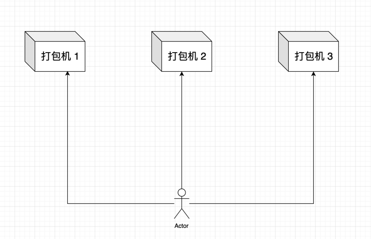
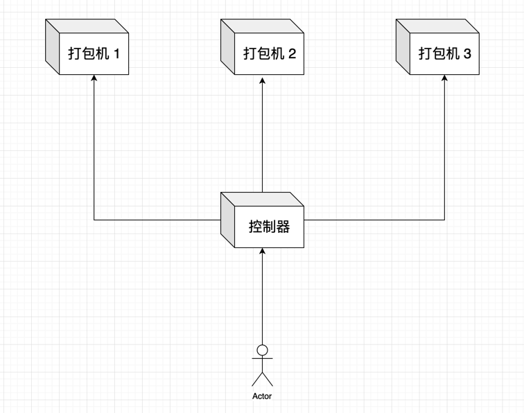
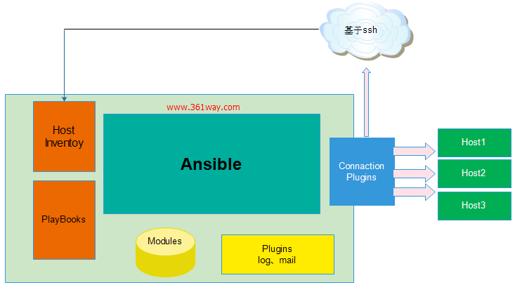
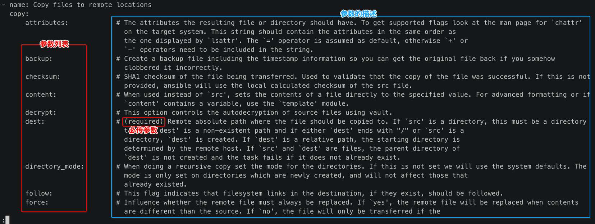
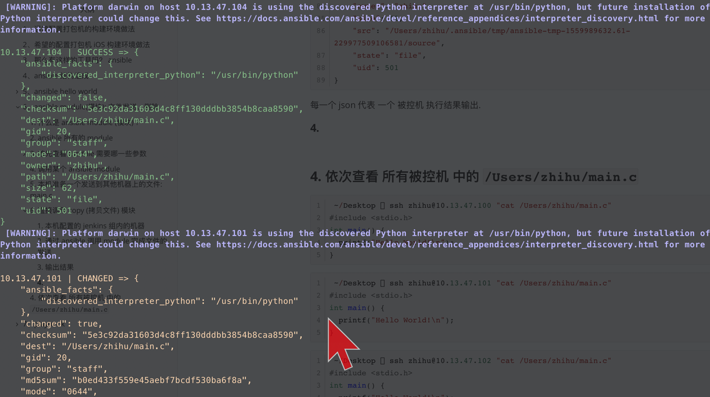
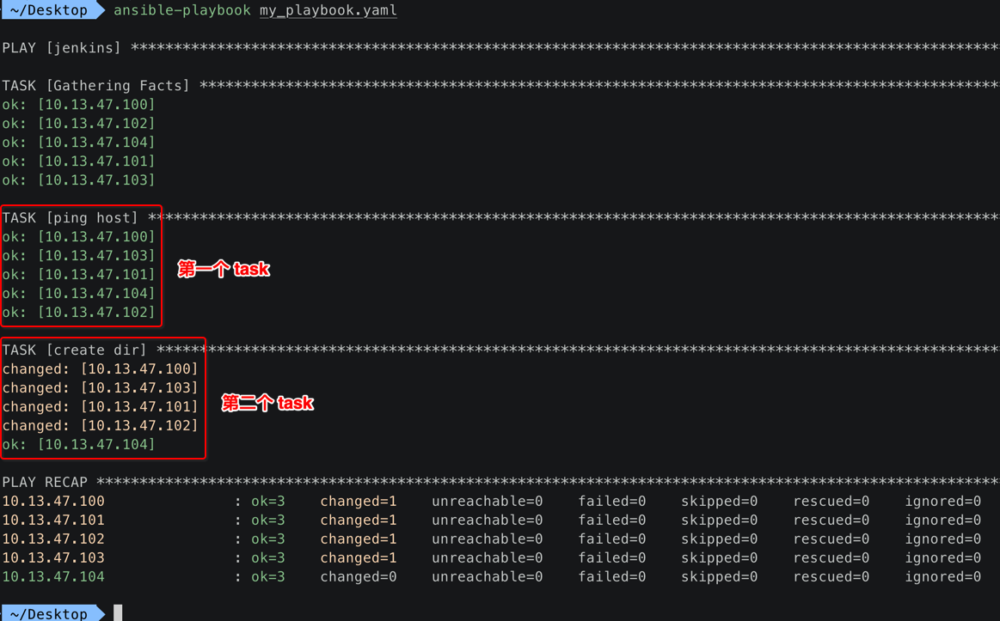
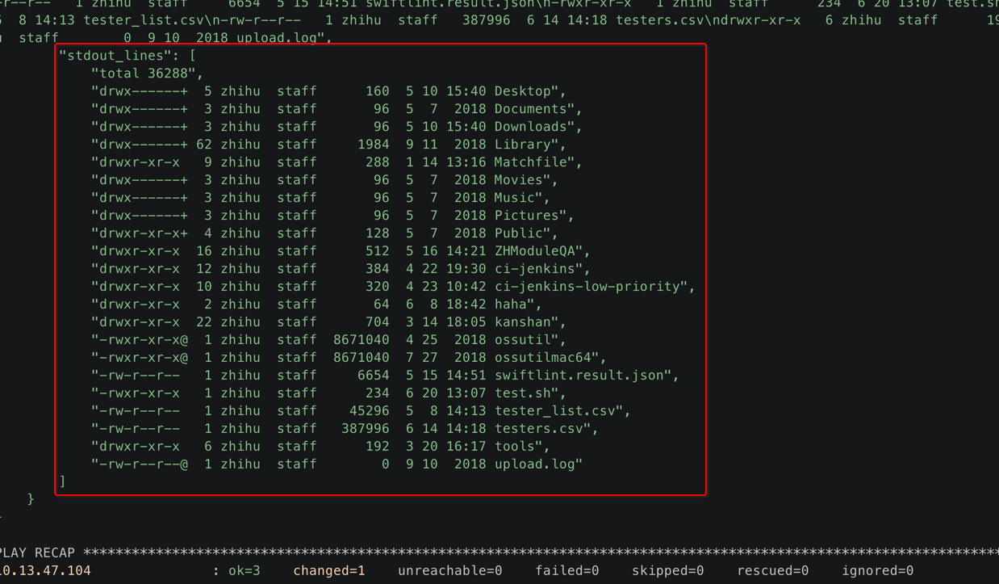

[TOC]


## 1、通常配置打包机的构建环境做法



-----

- 对于部署构建环境的人来说，需要**重复完成3遍**
- 如果有10+台以上的打包机环境配置，一台一台的搞 … 那就头大了
- 在想有没有什么工具能够 **减少重复** 部署多台机器的工作


## 2、希望的配置打包机 iOS 构建环境做法



-------------

- 对于部署构建环境的人来说，只需要完成 **1遍**
- 然后由 **控制器** 去通知 **其他的打包机器** 按照指定的规则按步执行即可
  - super0
  - super1
  - super2
  - super3
  - ….
  - superN


## 3、那么有这样的工具吗？ ansible

- ansible 就是上图中的 **控制器** 部分
- ansible 可以 **控制** 成百上千台的机器
- 我们只需要告诉 ansible **要做哪些事情** 

- ansible 帮助通知其他所有的被控主机，按照我们指定的任务全都执行完毕
- 如下场景就非常合适使用 ansible 
  - 需要在 **100台** 服务器 上的 **nginx 服务** 安装、配置、启动 ..
  - 而且每当有 **新服务器** 加入工作环境时，重新部署 **新服务器** 


## 4、ansible 结构组成



------

- 1) **核心**模块（Core Modules）：这些都是 ansible 自带的模块, 一些封装好的命令, 可以简单理解为类似 shell 这样的可执行文件
  - shell
  - copy
  - fetch
- 2) **扩展**模块（Custom Modules）：如果核心模块不足以完成某种功能，可以添加扩展模块
- 3) **插件**（Plugins）：完成模块功能的补充
- 4) **剧本**（Playbooks）：可以简单理解类似 shell 脚本，将多个任务定义在剧本中，告诉 ansible 执行
- 5) **连接插件（Connectior Plugins）**：ansible 基于连接插件连接到各个主机上，虽然 ansible 是使用 ssh 连接到各个主机的，但是它还支持其他的连接方法，所以需要有连接插件
- 6) **主机群**（Host Inventory）：定义哪一些需要被 ansible 管理的 **被控机** 
  - **安装 ansible** 的机器, 叫做 **主控机**
  - **被 ansible 管理** 的机器, 叫做 **被控机**


## 5、ansible hello world

### 1. install

```
git clone https://github.com/ansible/ansible.git --recursive
cd ./ansible
source ./hacking/env-setup
sudo pip install -r ./requirements.txt
sudo python setup.py install
```

### 2. 在被控机添加本地 ssh 秘钥

```
ssh-copy-id user@password
```

### 3. 设置 inventory (控制哪一些机器)

#### 1. 配置文件 `/etc/ansible/hosts`

配置文件路径:

```
/etc/ansible/hosts
```

注意: 如果没有 `/etc/ansible/` 目录，则 **自己创建** 即可.

```
/etc/ansible  sudo vim hosts
```

将需要 **被管理** 的 **远程主机** 的 **IP 地址 或 域名** 配置到 `/etc/ansible/hosts` 配置文件中：

```ini
# cat /etc/ansible/hosts
[jenkins]
10.13.47.100 ansible_user=zhihu
10.13.47.101 ansible_user=zhihu
10.13.47.102 ansible_user=zhihu
10.13.47.103 ansible_user=zhihu
10.13.47.104 ansible_user=zhihu
```

- 1) 开头的 `[jenkins]` 表示 **1个组**
- 2) 组下的都是 **一个 被控制 主机** (ip、登录用户名、登录端口 …)

#### 2. 配置完成测试

```
ansible all -m ping
```

#### 3. 如果报错如下

```
 ~/Desktop  ansible all -m ping
10.13.37.56 | UNREACHABLE! => {
    "changed": false,
    "msg": "Failed to connect to the host via ssh: ssh: connect to host 10.13.37.56 port 22: Connection refused",
    "unreachable": true
}
```

#### 4. 报错详细信息

```shell
 ~  ansible all -m ping -vvv
ansible 2.8.0.dev0
  config file = None
  configured module search path = [u'/Users/xiongzenghui/.ansible/plugins/modules', u'/usr/share/ansible/plugins/modules']
  ansible python module location = /Users/xiongzenghui/.pyenv/versions/2.7.10/lib/python2.7/site-packages/ansible-2.8.0.dev0-py2.7.egg/ansible
  executable location = /Users/xiongzenghui/.pyenv/versions/2.7.10/bin/ansible
  python version = 2.7.10 (default, Aug 18 2018, 02:36:32) [GCC 4.2.1 Compatible Apple LLVM 9.1.0 (clang-902.0.39.2)]
No config file found; using defaults
host_list declined parsing /etc/ansible/hosts as it did not pass it's verify_file() method
script declined parsing /etc/ansible/hosts as it did not pass it's verify_file() method
auto declined parsing /etc/ansible/hosts as it did not pass it's verify_file() method
Parsed /etc/ansible/hosts inventory source with ini plugin
META: ran handlers
<10.13.37.56> ESTABLISH SSH CONNECTION FOR USER: None
<10.13.37.56> SSH: EXEC ssh -C -o ControlMaster=auto -o ControlPersist=60s -o KbdInteractiveAuthentication=no -o PreferredAuthentications=gssapi-with-mic,gssapi-keyex,hostbased,publickey -o PasswordAuthentication=no -o ConnectTimeout=10 -o ControlPath=/Users/xiongzenghui/.ansible/cp/0ef963cf5f 10.13.37.56 '/bin/sh -c '"'"'echo ~ && sleep 0'"'"''
<10.13.37.56> (255, '', 'ssh: connect to host 10.13.37.56 port 22: Connection refused\r\n')
10.13.37.56 | UNREACHABLE! => {
    "changed": false,
    "msg": "Failed to connect to the host via ssh: ssh: connect to host 10.13.37.56 port 22: Connection refused",
    "unreachable": true
}
```

可以看出有一行明显的报错信息:

```
<10.13.37.56> ESTABLISH SSH CONNECTION FOR USER: None
```

- 用户名为 **None** 

- 也就是说缺少登录 **远程服务器** 的 **用户名**

#### 5. 修改 `/etc/ansible/hosts` 添加登录用户名

```ini
[jenkins]  # 分组名
10.13.37.56 ansible_user=zhihu # 远程主机的【ip 地址】和【用户名】
```

当然配置 **登录用户名** 还有其他更好的方法.

#### 6. 我当时还是报错

```
 /etc/ansible  ansible all -m ping -u zhihu
10.13.37.56 | UNREACHABLE! => {
    "changed": false,
    "msg": "Failed to connect to the host via ssh: ssh: connect to host 10.13.37.56 port 22: Connection refused",
    "unreachable": true
}
```

#### 7. 查看被控机的 ip 是否正常

```
➜  /Users ifconfig | grep inet
	inet 127.0.0.1 netmask 0xff000000
	inet6 ::1 prefixlen 128
	inet6 fe80::1%lo0 prefixlen 64 scopeid 0x1
	inet6 fe80::14fe:7d54:426d:a536%en0 prefixlen 64 secured scopeid 0x6
	inet 10.13.47.103 netmask 0xffffff00 broadcast 10.13.47.255
	inet6 fe80::b938:cfd2:964f:69e0%utun0 prefixlen 64 scopeid 0x12
```

- ip 地址为 **10.13.47.103** 
- 所以 `/etc/ansible/hosts` 中配置的 ip 地址是 **错误** 的

#### 8. 修改 `/etc/ansible/hosts` 添加正确的被控机 ip 地址

```ini
[jenkins]  # 分组名
10.13.47.103 ansible_user=zhihu # 远程主机的【ip 地址】和【用户名】
```

#### 9. 再测试 ok

```shell
 ~/Desktop  ansible all -m ping
 [WARNING]: Platform darwin on host 10.13.47.104 is using the discovered Python interpreter at /usr/bin/python, but future installation of another
Python interpreter could change this. See https://docs.ansible.com/ansible/devel/reference_appendices/interpreter_discovery.html for more
information.

10.13.47.104 | SUCCESS => {
    "ansible_facts": {
        "discovered_interpreter_python": "/usr/bin/python"
    },
    "changed": false,
    "ping": "pong"
}
 [WARNING]: Platform darwin on host 10.13.47.103 is using the discovered Python interpreter at /usr/bin/python, but future installation of another
Python interpreter could change this. See https://docs.ansible.com/ansible/devel/reference_appendices/interpreter_discovery.html for more
information.

10.13.47.103 | SUCCESS => {
    "ansible_facts": {
        "discovered_interpreter_python": "/usr/bin/python"
    },
    "changed": false,
    "ping": "pong"
}
 [WARNING]: Platform darwin on host 10.13.47.102 is using the discovered Python interpreter at /usr/bin/python, but future installation of another
Python interpreter could change this. See https://docs.ansible.com/ansible/devel/reference_appendices/interpreter_discovery.html for more
information.

10.13.47.102 | SUCCESS => {
    "ansible_facts": {
        "discovered_interpreter_python": "/usr/bin/python"
    },
    "changed": false,
    "ping": "pong"
}
 [WARNING]: Platform darwin on host 10.13.47.101 is using the discovered Python interpreter at /usr/bin/python, but future installation of another
Python interpreter could change this. See https://docs.ansible.com/ansible/devel/reference_appendices/interpreter_discovery.html for more
information.

10.13.47.101 | SUCCESS => {
    "ansible_facts": {
        "discovered_interpreter_python": "/usr/bin/python"
    },
    "changed": false,
    "ping": "pong"
}
 [WARNING]: Platform darwin on host 10.13.47.100 is using the discovered Python interpreter at /usr/bin/python, but future installation of another
Python interpreter could change this. See https://docs.ansible.com/ansible/devel/reference_appendices/interpreter_discovery.html for more
information.

10.13.47.100 | SUCCESS => {
    "ansible_facts": {
        "discovered_interpreter_python": "/usr/bin/python"
    },
    "changed": false,
    "ping": "pong"
}
```

#### 10. 也可以指定 remote user 测试

```shell
 ~  ansible all -m ping -u zhihu
 [WARNING]: Platform darwin on host 10.13.47.103 is using the discovered Python interpreter at /usr/bin/python, but future installation of another
Python interpreter could change this. See https://docs.ansible.com/ansible/devel/reference_appendices/interpreter_discovery.html for more information.

10.13.47.103 | SUCCESS => {
    "ansible_facts": {
        "discovered_interpreter_python": "/usr/bin/python"
    },
    "changed": false,
    "ping": "pong"
}
```

### 4. 让被控机 执行 一条命令 (称作 adhoc 命令)

```
 ~  ansible all -a "echo hello"
 [WARNING]: Platform darwin on host 10.13.47.103 is using the discovered Python interpreter at /usr/bin/python, but future installation of another
Python interpreter could change this. See https://docs.ansible.com/ansible/devel/reference_appendices/interpreter_discovery.html for more information.

10.13.47.103 | CHANGED | rc=0 >>
hello

```

- 虽然没有看到输出 **hello** 
- 但其实这条命令已经执行完毕了
- 如果想看到 **命令的输出结果** 需要往后深入更多的 **ansible 语法** 

### 5. 有一个 WARNING 

- 警告告诉我们自己 **没有设置 python 解释器的路径**
- 而是使用的 ansible 自己检测到的 系统 python 解释器
- 最简单的可以让【被控机】执行远程命令时，直接 **指定 python 解释器的路径**

```
 ~  ansible localhost -m ping -e 'ansible_python_interpreter="/usr/bin/env python"'

localhost | SUCCESS => {
    "changed": false,
    "ping": "pong"
}s
```

- 警告已经消失了，警告强迫症 
- 这是最简单的方式，有更高级的方式来指定 python 解释器的路径
- 总而言之截止到此，我们已经把 ansible 能够跑起来了


## 6、ansible module(模块): 文件发送、删除

### 1. 什么是 ansible module (模块) ？

- bash 无论在命令行上执行，还是 bash 脚本 中，都需要调用 **cd,ls,copy,yum 等命令** 完成具体的事情
- 那么 **ansible** 好比是 bash，也同样需要  **cd,ls,copy,yum 等命令** 完成具体的事情
- 而 **module** 就是 Ansible的 **命令** 
- 在后续的不管是直接通过 **ansible 执行命令**、还是编写 **ansible 脚本**，都需要使用到 **module**

### 2. ansible 所有的 module

https://docs.ansible.com/ansible/latest/modules/modules_by_category.html

- 粗略看了下，至少几百个 module，基本包括了常见的各种操作
- 而且还可以 **编写自己的 module**

### 3. 首先查看 module 需要哪一些参数

#### 1. 命令

```
ansible-doc -s <module_name>
```

#### 2. 示例: 查看 copy 这个模块的所需参数



----

- 描述 module 需要哪一些参数
- 参数 用来干什么的
- 参数 必须、可选
- 当然更简单的是直接 百度谷歌 看别人怎么用的 ..

### 4. 调用某个 ansible module

```
ansible <group_name> \
	-m copy \
	-a "src=... dest=..."
```

### 5. 本机准备一个发送到其他机器上的文件: main.c

```c
// cat ~/Desktop/main.c
#include <stdio.h>
int main() {
  printf("Hello World!\n");
}
```

### 6. 调用 copy 模块: 将本地文件拷贝到被空机器中

#### 1. 本机配置的 jenkins 组内的机器

```yml
# ~/Desktop  cat /etc/ansible/hosts
[jenkins]
10.13.47.100 ansible_user=zhihu
10.13.47.101 ansible_user=zhihu
10.13.47.102 ansible_user=zhihu
10.13.47.103 ansible_user=zhihu
10.13.47.104 ansible_user=zhihu
```

#### 2. 通过 ansible 调用 module 完成文件的发送

```
ansible jenkins \
	-m copy \
	-a "src=/Users/xiongzenghui/Desktop/main.c dest=/Users/zhihu/main.c"
```

#### 3. 输出结果

```shell
10.13.47.103 | CHANGED => {
    "ansible_facts": {
        "discovered_interpreter_python": "/usr/bin/python"
    },
    "changed": true,
    "checksum": "5e3c92da31603d4c8ff130dddbb3854b8caa8590",
    "dest": "/Users/zhihu/main.c",
    "gid": 20,
    "group": "staff",
    "md5sum": "b0ed433f559e45aebf7bcdf530ba6f8a",
    "mode": "0644",
    "owner": "zhihu",
    "size": 62,
    "src": "/Users/zhihu/.ansible/tmp/ansible-tmp-1559989632.62-171704370932891/source",
    "state": "file",
    "uid": 501
}

10.13.47.101 | CHANGED => {
    "ansible_facts": {
        "discovered_interpreter_python": "/usr/bin/python"
    },
    "changed": true,
    "checksum": "5e3c92da31603d4c8ff130dddbb3854b8caa8590",
    "dest": "/Users/zhihu/main.c",
    "gid": 20,
    "group": "staff",
    "md5sum": "b0ed433f559e45aebf7bcdf530ba6f8a",
    "mode": "0644",
    "owner": "zhihu",
    "size": 62,
    "src": "/Users/zhihu/.ansible/tmp/ansible-tmp-1559989632.6-48709655162519/source",
    "state": "file",
    "uid": 501
}

10.13.47.104 | CHANGED => {
    "ansible_facts": {
        "discovered_interpreter_python": "/usr/bin/python"
    },
    "changed": true,
    "checksum": "5e3c92da31603d4c8ff130dddbb3854b8caa8590",
    "dest": "/Users/zhihu/main.c",
    "gid": 20,
    "group": "staff",
    "md5sum": "b0ed433f559e45aebf7bcdf530ba6f8a",
    "mode": "0644",
    "owner": "zhihu",
    "size": 62,
    "src": "/Users/zhihu/.ansible/tmp/ansible-tmp-1559989632.63-93583756593541/source",
    "state": "file",
    "uid": 501
}

10.13.47.100 | CHANGED => {
    "ansible_facts": {
        "discovered_interpreter_python": "/usr/bin/python"
    },
    "changed": true,
    "checksum": "5e3c92da31603d4c8ff130dddbb3854b8caa8590",
    "dest": "/Users/zhihu/main.c",
    "gid": 20,
    "group": "staff",
    "md5sum": "b0ed433f559e45aebf7bcdf530ba6f8a",
    "mode": "0644",
    "owner": "zhihu",
    "size": 62,
    "src": "/Users/zhihu/.ansible/tmp/ansible-tmp-1559989632.59-76839073712766/source",
    "state": "file",
    "uid": 501
}

10.13.47.102 | CHANGED => {
    "ansible_facts": {
        "discovered_interpreter_python": "/usr/bin/python"
    },
    "changed": true,
    "checksum": "5e3c92da31603d4c8ff130dddbb3854b8caa8590",
    "dest": "/Users/zhihu/main.c",
    "gid": 20,
    "group": "staff",
    "md5sum": "b0ed433f559e45aebf7bcdf530ba6f8a",
    "mode": "0644",
    "owner": "zhihu",
    "size": 62,
    "src": "/Users/zhihu/.ansible/tmp/ansible-tmp-1559989632.61-229977509106581/source",
    "state": "file",
    "uid": 501
}
```

每一个 json 代表 一个 被控机 执行结果输出.

#### 4. 你看到的结果可能是这样的: 有绿色输出，也有黄色的输出



- **绿色** 的输出 => "changed": **false** => 没有变化 => 已经有 main.c 这个文件了
- **黄色** 的输出  => "changed": **true** => 发生变化 => 没有 ...

#### 5. 依次查看所有被控机中的 `/Users/zhihu/main.c`

```c
 ~/Desktop  ssh zhihu@10.13.47.100 "cat /Users/zhihu/main.c"
#include <stdio.h>
int main() {
  printf("Hello World!\n");
}
```

```c
 ~/Desktop  ssh zhihu@10.13.47.101 "cat /Users/zhihu/main.c"
#include <stdio.h>
int main() {
  printf("Hello World!\n");
}
```

```c
 ~/Desktop  ssh zhihu@10.13.47.102 "cat /Users/zhihu/main.c"
#include <stdio.h>
int main() {
  printf("Hello World!\n");
}
```

```c
 ~/Desktop  ssh zhihu@10.13.47.103 "cat /Users/zhihu/main.c"
#include <stdio.h>
int main() {
  printf("Hello World!\n");
}
```

```c
 ~/Desktop  ssh zhihu@10.13.47.104 "cat /Users/zhihu/main.c"
#include <stdio.h>
int main() {
  printf("Hello World!\n");
}
```

这 5台 被控制机器 都已经存在 main.c 文件了.

### 7. 调用 file 模块: 删除被控机器中的 /Users/zhihu/main.c

```
ansible jenkins \
	-m file \
	-a "path=/Users/zhihu/main.c state=absent"
```

此时再查看被控机中的这个路径文件，已经不存在了

```shell
 ~/Desktop  ssh zhihu@10.13.47.104 "cat /Users/zhihu/main.c"
cat: /Users/zhihu/main.c: No such file or directory
```


## 7、playbook

### 1. 上面通过 ansible 执行的 单次 命令

```
ansible jenkins \
	-m copy \
	-a "src=/Users/xiongzenghui/Desktop/main.c dest=/Users/zhihu/main.c"
```

### 2. sh 脚本文件

#### 1. 编写好 sh 脚本文件

```shell
#!/bin/bash

# 1. 
rpm -ivh http://nginx.org/packages/centos/7/noarch/RPMS/nginx-release-centos-7-0.el7.ngx.noarch.rpm

# 2. 
yum install -y nginx

# 3. 
service nginx start
```

#### 2. 执行 sh 脚本

```
chmmod a+x nginx.sh
./nginx.sh
```

### 3. ansible 中的 sh 脚本文件 =>  playbook

```yaml
# vim ~/Desktop/my_playbook.yaml
---
- hosts: jenkins
  remote_user: zhihu
  tasks:
    - name: ping host
      ping:
    - name: create dir
      file:
        path: /Users/zhihu/haha
        state: directory
```

- 第3行: `-hosts: jenkins` 表示一个完整的操作集合
- 第4行: `remote_user: zhihu` 表示登录远程机器的用户名
- 第5行: `tasks:` 表示下面都是一个个的 task 任务节点，其中基本都是调用 ansible module
- 第6行 ~ 第7行: 第一个 task 
  - 名字是 ping host , 整个名字可以随便起
  - 执行的是 **ping** module
- 第8行 ~ 第11行: 第二个 task 
  - 名字是 create dir
  - 执行的是 **file** module ，让被控机都创建一个 `/Users/zhihu/haha` 目录
    - 参数1 path = /Users/zhihu/haha
    - 参数2 state = directory

### 4. 执行 test_playbook.yaml



在5个被控机上全部执行完毕.

### 5. 查看所有被控机上的 `/Users/zhihu/haha` 目录

```
 ~/Desktop  ssh zhihu@10.13.47.104 "stat /Users/zhihu/"
16777220 999320 drwxr-xr-x 63 zhihu staff 0 2016 "Jun  8 18:43:51 2019" "Jun  8 18:42:23 2019" "Jun  8 18:42:23 2019" "May  7 13:34:11 2018" 4194304 0 0 /Users/zhihu/
```

- 其他主机的输出就不贴了
- 到此为止基本上 ansible 入门了 … haha ~


## 8. playbook 脚本中, 获取 module 返回值

### 1. playbook

```yaml
---
- hosts: 10.13.47.104
  remote_user: zhihu
  tasks:
    - name: cat main.c
      shell: "ls -l /Users/zhihu"
      register: ret #=> 将上面 shell 命令的 stdout 输出值，注册到变量 ret 中
    - name: debug
      debug:
        var: ret
```

### 2. ansible 执行 playbook


