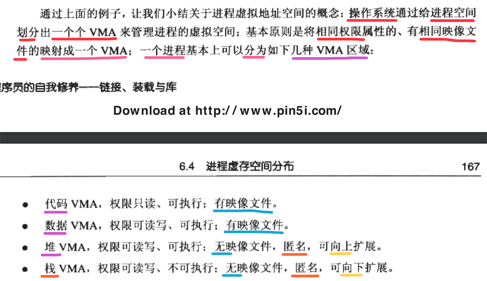

[TOC]


##  List


## 1. 程序(a.out) vs 进程


## 2. 一个 ==程序== 运行后，唯一对应一个 ==进程==，并拥有自己 ==独立的进程空间==


## 3. C 语言中的 ==指针类型== 占用的 ==字节数== 刚好等于 ==CPU 位数(寻址长度)==

```c
sizeof(void*)
```

- 在 **32 位** 的 编译器 和 操作系统 中，值为 **4 字节 (32 位)**
- 在 **64 位** 的 编译器 和 操作系统 中，值为 **8 字节 (64 位)**


## 4. 虚拟地址空间，并不能任意使用 (32位 虚拟地址空间 为例)


## 5. 进程 不能完全使用剩下的 3G 虚拟空间


## 6. 程序执行(==装载==) 的 2种 方式


-----

- 1、覆盖 Overlay
- 2、页映射 Paging


## 7. 程序装载1: 覆盖 (Overlay)

### 1. ==模块== 为 ==单位== 划分与装载 程序文件


### 2. 实际中使用 ==树结构== 组织所有的 ==模块==


### 3. 调用 路径


## 8. 程序装载2: 页映射 (Paging)

### 1. ==页== 为 ==单位== 划分与装载 程序文件


### 2. 页 ==映射==


通常是 LRC 页淘汰算法。


## 9. 从 ==操作系统== 角度来看 ==可执行文件== 的 ==加载== (创建进程)

### 1. 主要是 3 件事情


### 2. 事情1: 创建 ==虚拟地址空间==


### 3. 事情2: 读取 可执行文件 ==头部== ，建立 ==虚拟地址空间== 与 ==可执行文件== 映射关系 (由 ==VMA== 存储 ==映射关系==)


### 4. 事情3:  将 CPU ==指令 寄存器== 的值，设置为 可执行文件 ==入口符号== 开始执行


## 10. 页 ==错误==


## 11. elf 文件 ==链接视图(LinkingView)== vs ==运行视图(ExecutingView)==

### 1. elf 文件中包含的 ==多个段(section)== 如果载入到进程空间中 ==不同地址处(VMA)==


### 2. 当段的 ==数量增多== 时，就会产生 ==空间浪费(页对齐)== 问题


### 3. 段的 ==权限== 种类基本 3种


### 4. 解决因 ==页对齐== 造成的空间浪费: 将多个 ==权限相同== 的段，==当做一个段== 一起映射到虚拟地址空间


---

- 将 **多个段(section)** 在 **运行(加载到内存)** 时，**当做** 一个 **大的段** 分配 **页**
- 可大大减小因为 **页对齐** 带来的 **空间浪费**
- 一个 **Segment** 只是在 **运行时** 表示 将多个段 **逻辑上当做** 一个大的段完成 **页分配**
-  **Segment** 并 **不是** 在 **物理** 上合并了多个段

### 5. elf ==可执行文件== 中的 ==Segment== : 在程序 ==运行== 时，将多个物理段，一起映射到一个虚拟空间中


### 6. ==目标文件== 链接生成 ==可执行文件== 后存在的 ==段(section)==


### 7. readelf -l 查看 ==可执行文件== 包含的 ==Segment==


------

- 只关心 **LOAD** 类型的 Segment
- 因为只有 **LOAD** 类型的 Segment 才会被 **装载到内存**
- 其他类型的 Segment 仅仅只是在 **装载** 时起到 **辅助作用**

### 8. 只有 ==LOAD== 类型的 ==Segment== 才会被 ==装载到内存==


### 9. Segment(==执行==视图) vs Section(==链接==视图)


### 10. elf 可执行文件 中的 ==Program Header Table== 保存 Segment 信息

#### 1. Program Header Table 就是一个 ==结构体== 的 ==数组==


#### 2. 结构体成员变量含义


### 11. 但是 elf ==目标文件== 没有 ==Program Header Table==

- 因为 elf **目标文件** 仅仅只是 **编译阶段** 的产物，是 **不能够运行** 的
- 也就是说 elf **目标文件** 根本就 **不需要载入到内存** 
- 所以 elf **目标文件** 根本就 **不需要 Program Header Table 保存 Segment 信息**


## 12. (Linux) 查看 一个进程 的虚拟地址空间 (`/proc` 目录)


- 第1列: VMA 所在的虚拟空间的 **地址范围**
- 第2列: VMA 记录的 **权限**
- 第3列: VMA 对应的 **Segment** 位于 **映像文件(可执行文件)** 中的 **偏移量**
- 第4列: **映像文件(可执行文件)** 所在设备的 **主设备号** 和 **次设备号**
- 第5列: **映像文件(可执行文件)** 的 **节点号**
- 第6列: **映像文件(可执行文件)** 的 **路径**


## 13. 如上 进程的 5个 VMA


---

- 1、如上 **进程** 总共有 **5个 VMA**
- 2、只有 **前2个 VMA** 映射到 **elf 文件**
- 3、**后三个** VMA 的 **4、5 列** 都是 **0** ，表示 **不会映射** 到 **elf 文件** 内
- 4、而 **不会映射** 到 **elf 文件** 的这种 **VMA** 叫做 **匿名虚拟内存区域**
  - 1) 堆 Heap
  - 2) 栈 Stack
- 5、特殊的 **内核 VMA**


## 14. 操作系统 基于 ==VMA== 管理 ==进程的虚拟地址空间==



---

- 1、一个进程最终的 整个虚拟地址空间，划分为 n 个不同的 **VMA 区域**

- 2、主要的 VMA 区域类型
  - 1) 代码 VMA 、会映射 elf 文件
  - 2) 数据 VMA 、会映射 elf 文件
  - 3) 堆 VMA 、不会映射 elf 文件、 匿名映射 、 **向上** 生成
  - 4) 栈 VMA  、不会映射 elf 文件、 匿名映射 、 **向下** 生成 (与 Heap 相反)


## 15. Sention(链接) : Segment(装载) : 进程虚拟空间 : VMA


----

- 1、所有的 **目标文件** 链接在一起生成 **可执行文件** 之后
- 2、在 **可执行文件** 中，存在 n 多个不同的 **物理段(section)**
- 3、**链接器** 会额外的对 所有的 **物理段(section)** 按照 **相同权限属性** 归属到 **一个Segment** 中
- 4、但是 **Segment** 结构，只在当 **程序装载到内存** 时才会起作用，防止 **页对齐** 浪费空间
- 5、不同的 **Segment** 对应不同的 **VMA**


## 16. Linux ==VMA= 并非与 ==Segment== 完全对应


------

**Segment** 并不是一定与 **VMA** 完全对应。


## 17. 堆区 最大申请 数量


## 18. 装载 elf 可执行文件 Segment

### 1. 假设有 3个 Segment


### 2. 分开 装载(映射) 页分配 : 造成空间浪费


### 3. 让 Segment 之间 ==接壤== 部分 ==共享1个物理页== ，然后映射到虚拟内存中


### 4. 好处是将所有 Segment 在 ==逻辑上连在一起== 按照 4096 整数倍来 分配页


---

这种映射方式，会造成 **一个物理页** 中可能同时包含 **多个段的数据**。


## 19. 进程 ==环境变量== 与 ==命令行参数==

### 1. 通常 ==环境变量== 与 ==命令行参数== 都会使用 ==栈== 来存储


### 2. 比如如下在执行可执行文件 ==之前== ，设置 ==环境变量== 再执行，并传入 ==命令行参数==


### 3. 程序执行后，创建的进程中栈的初始状态


注意: **栈 生长方向** 与 **物理地址 生长方向** 是 **相反** 的.

### 4. 栈结构 解析


## 20. elf 可执行文件 的 ==装载过程==

### 1. ==fork()== 创建一个 新的进程，==execve()== 执行 elf 可执行文件

```c
#include <stdio.h>
#include <stdlib.h>
#include <unistd.h>

int main(int argc, char * argv[])
{
  int pid;

  // 1.【核心】创建一个新的进程
  pid = fork();

  // 2. 判断 fork() 函数的返回值
  if (pid < 0)
  { // 2.1 fork() 执行失败
    fprintf(stderr,"Fork Failed!");
    exit(-1);
  }
  else if (pid == 0)
  { // 2.2 fork() == 0 ， 当前处于【子进程】
    /**
     * 【核心】在【子进程】中加载指定的【可执行文件】
     */
    execlp("/bin/ls","ls",NULL);
  } 
  else
  { // 2.3 fork() > 0 ， 当前处于【父进程】，获取【子进程 pid】

    	// parent will wait for the child to complete
      wait(NULL);
      printf("Child Complete!");
      exit(0);
  }
}
```

### 2. execve()  ==读取== 可执行文件


----

- 1、execve()
- 2、sys_execve()
- 3、do_execve() 读取 **可执行文件**
  - 1) 前4个字节：魔数
  - 2) 前128个字节：可执行文件的 **类型**
    - 1) a.out
    - 2) 动态库
    - 3) 脚本文件 (sh、perl、python、lua、ruby …..)

### 3. search_binary_handle() 查找出适合 ==当前== 可执行文件 ==类型== 对应的 ==处理过程(回调函数)==


---

- 1、do_execve() 读取 **可执行文件**
- 2、search_binary_handle() 查找出适合 ==当前== 可执行文件 ==类型== 对应的 ==处理过程(回调函数)==
- 3、调用找到的  ==处理过程(回调函数)== 完成最终的 **加载可执行文件**
  - 1) **a.out** ==> load_aout_binary()
  - 2) elf ==> load_elf_binary()
  - 3) 脚本文件 ==> load_script()

### 4. load_xx_binary() 执行完毕返回到 do_execve() 再返回到 sys_execve()


## 21. WinPE 可执行文件的 加载过程

不太关心，就没看了 ...

