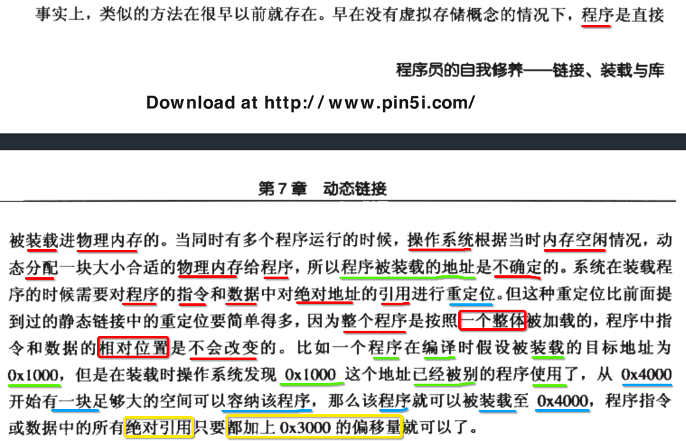
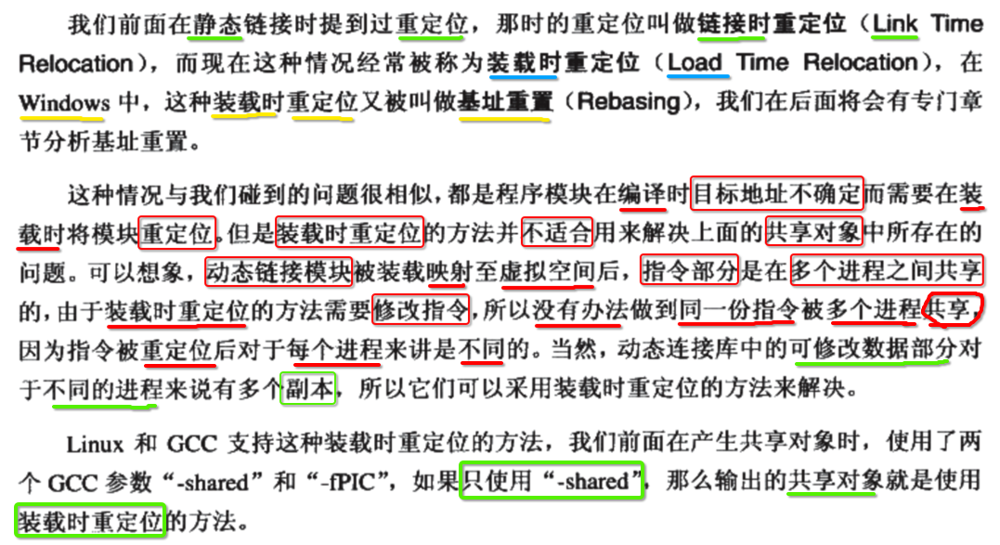
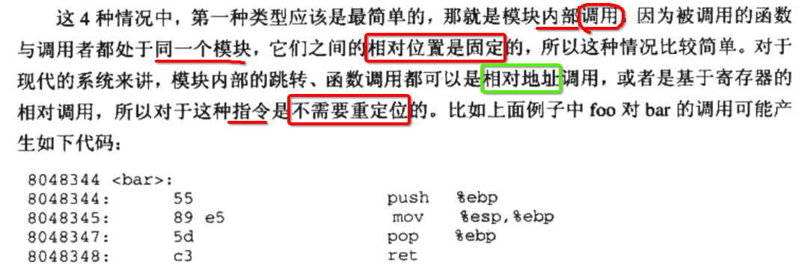
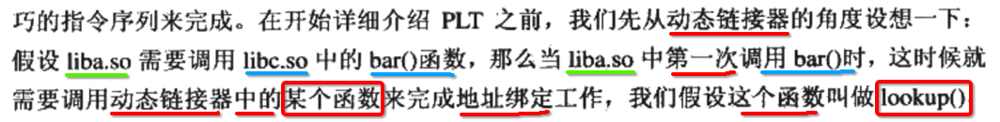
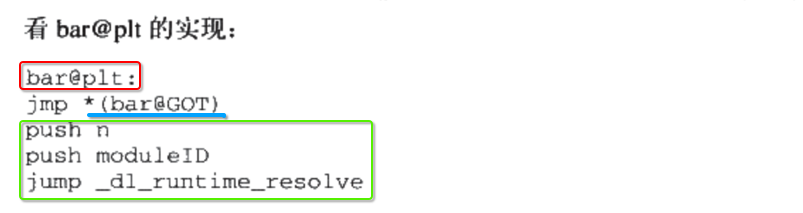
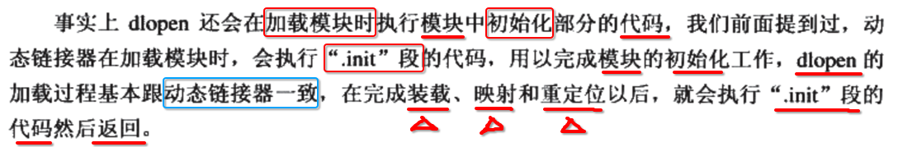

[TOC]


##  List


## 1. ==静态== 链接


可以看到 **lib.o** 这个目标文件，既存在于 **可执行文件1** 也存在于 **可执行文件2** .


## 2. 为何需要 ==动态链接== ？

### 1. ==静态== 链接缺点1: ==空间浪费==


----

结论: **静态** 链接，会造成可执行文件体积的 **增大** ，因为存在大量的 **重复性** 的 **目标文件** .

### 2. ==静态== 链接缺点2: ==整个== 客户端重新 ==发版==


----

结论: 

- 一旦所依赖的静态链接中的 **任何目标文件** 发生一点点的 **改变**，
- 都必须与 **主程序的目标文件** 重新链接生成 **最新的、完整的** 可执行文件，
- 然后再将 **最新的、完整的** 可执行文件 提供给 用户下载使用


## 3. ==动态== 链接

### 1. 动态链接: 1) 模块==独立== 2) ==运行时==链接


### 2. 动态链接的内存结构


相比之前的 **静态** 链接，对于 lib.o 这个目标文件，只会 **独立的** 存在于 **一份** .

### 3. 加载 ==可执行文件== 时，顺便加载 ==动态链接的文件==


## 4. 动态链接带来的 ==好处==

### 1. 模块独立的开发、升级只需替换调用对应的模块


----

- 1、**升级** 时只需要单独的 **替换** 掉对应的模块
- 2、每一个模块可以 **独立** 
  - 开发
  - 测试
  - 不同语言编写

### 2. 插件


### 3. 提高程序在 ==不同操作系统== 下的 ==兼容性==


## 5. 动态链接 需要有 ==操作系统== 的支持


## 6. 普通的可执行文件 与 动态链接库 区别不大


## 7. glibc 库


## 8. 静态链接 vs 动态链接


## 9. Linux gcc 生成一个 ==动态共享对象== (Dynamic Shared Objects)


## 10. 编译 main.c ==链接== 动态共享对象


## 11. 但是从上面的命令行中看到 Lib.so 却参与了 ==链接== 过程？


## 12. 模块 (module)


----

- 1) 静态 (static) 链接
  - 产物只有一个文件 (可执行文件) 整体 (**不可分割**)
  - 那么 可执行文件 成为 **模块**
- 2) 动态 (dynamic) 链接
  - 产物 **不再是** 一个 不可分割 的整体了，而是分为
    - A) 主程序 (可执行文件)
    - B) 动态链接共享库 (dynamic shared link library)
  - 不管是 A 还是 B 都可以称作 **模块**


## 13. 如果链接的是 ==动态链接库== 中的符号，会被标记为 ==动态链接==


----

- **链接器(静态)** 如果发现链接的是一个 **共享库** 中的符号
- 此时这个 **被链接的符号** 会被标记位 **需要重定位**


## 14. 链接器通过 ==静态库== 或 ==动态库== 来区分引用的是一个 ==静态符号== 还是 ==动态符号==


----

- 1) 静态(库)符号: 在 **静态链接** 阶段完成 地址重定位
- 2) 动态(库)符号: 在 **程序运行时** 阶段完成 地址重定位 


## 15. ==静态链接== 可执行文件的 ==进程虚拟地址空间==


----

整个进程空间内，只有 **一个文件(可执行文件)** 被映射进来。


## 16. ==动态链接== 可执行文件的 ==进程虚拟地址空间==


----


-----


-----

进程空间内，会映射 **多个文件** 进来:

- 1) **主程序** (可执行文件) 文件
- 2) 主程序 依赖的 **所有 动态链接共享库** 文件


## 17. readelf -l 查看 Lib.so ==装载属性==


-----


----

- 只有 **LOAD** 类型的 Segment 会映射到 进程空间
- 动态共享库 的 **装载地址** 在 **编译期** 是 **不确定** 的


## 18.  ==Static Shared== Library (静态的 共享库)


----

- 1) **静态库** 与 **静态共享库** 有明显的差别
- 2) 操作系统 预先给要加载的 静态共享库 **预留** 出一部分空间
- 3) 这种方式存在很大的 **限制**
  - 限制1: 需要保证 **静态共享库** 每次加载到的 **地址相同** ，否则会出现崩溃
  - 限制2: 即使加载地址 **相同** 但仍然不能 **增长太多** ， 会 **超出** 被分配的空间
- 4) 只有一些 **比较老** 的操作系统才支持 **静态共享库**
  - Unix 3.2
  - 比较老的 Linux
  - BSD 4.4


## 19. 解决模块加载到固定地址: 支持装载到 ==任意地址== 


----

- 可执行文件) 第一个被加载的文件，由操作系统选择一个空间的地址加载
- 共享库) 在编译、链接结束时，写入的地址是一个 **临时** 假地址


## 20. ==装载时 (运行时)== 地址 重定位



----

- 1、在 **静态链接** 时，被链接脚本指定分配到的地址为 **0x1000**

- 2、在 **运行** 时
  - 1) 如果 **0x1000** 已经被 **其他程序** 使用
  - 2) 操作系统只能分配到一个 **其他未使用** 的地址处 **0x4000**

- 3、前后两次 **装载地址** 的 **偏移量** 为 **0x3000**
  - 1) 在 **静态链接** 时的 装载地址 **基础** 上
  - 2) 给 **指令** 和 **数据** 中引用的 **绝对地址** 加上一个 **偏移量 0x3000** 即可完成 **修正符号的地址(地址重定位)**


## 21. 链接时(==Link== Time Relocation)重定位 vs 装载时(==Load== Time Relocation)重定位



----

- **链接** 时(==Link== Time Relocation)重定位: 编译、**链接** 生成 可执行文件
- **装载** 时(==Load== Time Relocation)重定位: 可执行文件 **运行(由操作系统载入到内存，分配进程）**


## 22. ==与地址无关== 的代码: 将指令中 ==物理地址值(变化)== 抽取出放到 ==数据段== 中


----

- 1、**虽然** 可以通过 **实时修改** 装载时(Load Time Relocation)重定位 重新修正  **指令部分** 中的 **绝对地址的引用**
- 2、但是会造成在 **多个不同进程** 之间 **无法共享** 动态模块内的 **指令** 
  - 因为一旦 **实时修改指令** 
  - 那么造成 一条指令对于 **不同的进程** 来说，都是不一样的，也就不能重用
- 3、分析 **动态模块** 内的 **指令** 中的 **可变** 与 **不变**
  - 1) 不变: 指令的 **执行逻辑**
  - 2) 可变: 指令中引用的 **绝对地址值**
- 4、将 **动态模块** 内的 **指令** 中的 **可变** 部分 **单独** 出来，与 **数据** 放在一起
  - 1) 对于 **多个不同进程** 共享 **动态模块** 内的 **指令逻辑**
  - 2) 但是对于 **绝对地址** 引用时可通过修改 **数据段** 
  - 3) 而 **数据段** 在 **每一个进程** 中都拥有 **自己的拷贝**


## 23. 共享对象 中的 ==地址引用== 类型


----

- 1) 符号的 **定义地方** 
  - 1.1) 模块 内部
  - 1.2) 模块 外部
- 2) 符号的 **类型**
  - 2.1) 指令
  - 2.2) 数据

2 x 2 = 4 种类型的 地址引用.

----


## 24. 具体 4种 ==地址引用==

### 1. 模块内 : 函数调用、指令跳转 => 相对(偏移量)跳转

####  1. 汇编代码示例




#### 2. 汇编指令 ==E8 E8 FF FF FF== 结构


----

- 1) 第一个字节 E8 : 
  - **操作码** 
  - 表示在 **当前指令的 ==下一条== 指令** 地址处，执行 **相对** 跳转
- 2) 后4个字节 E8 FF FF FF 
  - 因为是 **小端(低位 存 高位)** 存储，所以实际值为  FF FF FF E8
  - FF FF FF E8 实际就是 **-24** 补码形式 (负数都使用 **补码** 存储)
  - 表示在  **当前指令的 ==下一条== 指令** 地址处的 **偏移量**

#### 3. 汇编指令 ==E8 E8 FF FF FF== 跳转


---

- 1) 已经知道 汇编指令 后4个字节 **E8 FF FF FF**  表示 **偏移量 -24**

- 2)  当前指令的 ==下一条== 指令 **mov $0x0, %eax** 地址 **0x804835c** 加上一个 **偏移量 -24**

  ```
  跳转到 0x8048344 = 0x804835c + (-24)
  ```

- 3) 最终跳转到 **0x8048344** 地址处执行


### 2. 模块内 (非共享库) : 数据访问 => PC 寄存器值 + offset

#### 1. 某个页内模块中定义的符号的地址 = ==PC==(当前执行指令的地址) + ==偏移量==


#### 2. bar() 函数内部，执行模块内变量 ==a = 1== 汇编代码


#### 3. 第一条 ==call== 指令: 保存 ==下一条== 要执行的 指令地址


------

- call 指令调用 **get_pc_trunck.cx** 
- 最终完成 **mov (%esp), %ecx** 
- 就是将当前 **栈顶 (esp 寄存器值)** 保存的 **下一条指令地址** 临时写入到 **ecx 寄存器** 中暂存，方便后续恢复

#### 4. 后2条 ==add、mov== 指令: 计算 ==变量 a 实际地址== = 当前装载到的基地址 + ==PC== + ==0x118C(哪一页)== + ==0x28(页内偏移)==


-------

- 1、当前装载到的基地址
- 2、在计算最终找到动态库模块内的符号的实际地址的 **总偏移量**
  - 1) **PC** 寄存器值: 记录的当前指令地址值
  - 2) 第一个 **偏移量** 0x118C: 先定位到动态模块内的符号位于 **哪一页**
  - 3) 第二个 **偏移量** 0x28: 再根据 **页内的偏移** 最终定位到指定的 **符号**

#### 5. 变量 a 实际地址


### 3. 模块外 : 数据访问  => 全局偏移表 Global Offset Table (GOT) 间接跳转

#### 1. 创建 ==指向== 其他模块中的 ==全局变量== 的 ==指针数组== (Global Offset Table) (GOT)


#### 2. 引用方 => ==GOT== => 动态库装载地址中的 ==全局变量== 符号的 ==装载地址==


#### 3. ==a.out==  查找 ==动态库符号== 过程

- 1、引用方 a.out => **固定的偏移值** => ==GOT== 
- 2、==GOT==  => **记录项中的地址值** =>动态库装载地址中的符号的地址
- 3、GOT 表中的记录项的地址值，由 **动态链接器** 负责更新填充

#### 4. ==动态链接器== 装载完动态模块之后，就会 ==更新 GOT 表== 中对应记录


### 4. 模块外 : 函数调用、指令跳转 => 同上 GOT 间接跳转

#### 1. 与上访问 其他模块 中的 ==全局变量== 同样使用 ==GOT 表== ，只不过此时 GOT 中的记录项地址值是 ==函数的地址==


#### 2. 引用方 => ==GOT== => 动态库装载地址中的 ==函数== 符号的 ==装载地址==


### 5. 小结 地址引用 方式


------

- 1、模块 **内** =》**相对** 地址
- 2、模块 **外** =》**GOT (全局偏移表)** ==间接== 地址


## 25. ==GOT 间接跳转== 三大步骤


----

- 1) 暂存当前 **PC** 寄存器值
- 2) 符号的装载地址 = PC + 偏移量(2个)
  - 1) 定位到 **GOT 段** 位于 **哪一个页**
  - 2) 继续通过 **页内偏移量** 定位到 GOT 段中对应项，获取到记录的 **装载地址值**
- 3)  跳转到找到的 **装载地址值** 执行


## 26. -fpic 与 -fPIC


## 27. 判断一个 SO库 是不是 ==PIC (地址无关)==


## 28. PI==E== (与地址无关的 ==Executale==)


## 29. 如果 ==extern== 修饰 ==定义在模块内== 的 ==未初始化== 的 ==全局变量==

### 1. 一个 ==模块 (module.c)== 引用了一个定义在 ==共享库== 中的 ==全局变量==


### 2. 编译 ==模块 (module.c)== 时，无法确定 ==global== 是否是 ==跨模块== 间调用


----

- 1、同一个模块(可执行文件)内 ？
- 2、动态共享库内 ？

### 3. 因为 ==未初始化的全局变量== 会分配在 `.bss` 中，但是会存在于 ==2处 `.bss`== 内


### 4. 解决: 将所有使用这个 ==全局变量== 的指令，都指向 ==可执行文件== 中的那个拷贝


----

- 1、所有使用这个 ==全局变量== 的指令，都指向 ==可执行文件== 中的那个拷贝

- 2、**动态共享库** 在 **编译** 时，默认把定义在模块内的 **全局变量** 都看做 **其他模块中的** ，通过 **GOT** 间接访问

- 3、当 **动态共享库** 被 **装载** 时，如果该 **全局变量** 在 **可执行文件** 内有 **副本** ，那么 **GOT** 中相应地址值会指向他

- 4、如果该 **全局变量** 在 **动态共享库** 内部 **初始化** ，那么 **初始值** 会由 **动态链接器** 拷贝到 **可执行文件** 模块内

- 5、如果该 **全局变量** ==没有== 在 **动态共享库** 内部 **初始化** ，那么 **GOT** 中相应地址值会指向 **可执行文件** 模块内的 **拷贝**

### 5. 假设 ==模块 (module.c)== 是 ==动态共享库== 的一部分


### 6. ==减少== 共享库中定义 ==全局变量==

- 增加对共享库的 **耦合性**
- 增加共享库在 **运行时 地址重定位** 的消耗


## 30. ==共享库== 中的 ==数据段== 映射到 ==不同进程== 内都是 ==独立== 的


## 31. 共享库 ==数据段== 中符号，引用 ==绝对地址==

### 1. ==共享库== 内的 ==数据== 也存在 ==引用绝对地址== 问题


### 2. 创建 ==重定位表== 记录需要 ==重定位== 的符号


### 3. 这种方式 (==装载时==重定位) 也能解决 ==共享库== 内的 ==指令== 地址修正


----

- 通过创建 **重定位表** 来 **记录** 需要进行 **重定位** 的符号 => **装载时** 重定位
- **装载时** 重定位，是 **不使用** `-fPIC` 生成的代码


## 32. ==装载时==重定位 vs ==与地址无关==重定位


-----

- 如果 **不使用** `-fPIC` 生成 **共享库**
  - **不** 生成 **与地址无关** 的代码段
  - 走的是 **装载** 时，完成 **地址重定位**
  - 对于 **不同的程序**，都需要在 **启动(分配进程)** 时，重新完成 **地址重定位**
  - 这样就需要实时修改 **共享库** 中的 **指令**
  - 那么 **共享库** 中的 **代码段** ，在 **不同的进程** 之间都是 **相互独立** 无法共享
- 此时虽然也是可以完成 **地址重定位** ，但是有很大的 **缺点**
  - 1) 是对于每一个 **不同的进程** 都要 **单独的修改** 共享库中 **代码(指令)** 中包含的 **绝对地址值**
  - 2) 也就是说对于 **不同的进程** 代码段都是 **不可共享**


## 33. 对于 ==可执行文件== 时，GCC 默认使用 `-fPIC` 生成 ==与地址无关代码==


## 34. ==动态== 链接 ==影响运行速度== 的两大原因


----

- 1) 共享库 **自己** 访问 **自己** 内部的 **全局变量** 和 **静态变量** 都需要通过 **GOT 全局偏移表** 间接寻址访问
- 2) **动态链接器** 加载 **共享库** 到内存后，也需要完成 
  - 1) **查找** 符号的 **装载地址**
  - 2) 使用最新的 **装载地址** 去 **更新 GOT 表** 中对应的记录项的 **地址值**


## 35. ==延迟==绑定 (PLT): 只有当函数 ==被用到== 的时候，才会去执行 ==地址重定位==


## 36. lookup(module id, function) 

### 1. 函数 声明



- 1) module id (参数1): 地址绑定 **发生** 在 **哪一个模块** (模块id)
- 2) function (参数2): **哪个函数**

### 2. lookup() 需要知道 ==哪些信息== 才能完成 ==地址重定位(绑定)== ?


### 3. lookup() 参数 1: module id (第2次 push 参数压栈)


### 4. lookup() 参数 2: function (第1次 push 参数压栈)


### 5. lookup() 函数的 ==汇编== 调用

从 **右** 往 **左** 将参数压入 **栈顶**

```asm
push <参数2: 函数>
push <参数1: 模块>
jmp _dl_runtime_resolve
```


## 37. ==延迟==绑定 (PLT) 是在 ==GOT 表的间接寻址== 基础上 ==又增加一次间接寻址==


----

- 1) 先调用 **PLT** 中的符号
- 2) 再由 **PLT** 中调用 **GOT** 中的符号


## 38. 一个 ==外部函数== bar() 在 ==PLT (延迟绑定) 表== 中的记录项的地址值 ==bar@plt== 

### 1. bar@plt 符号对应的 汇编指令



-----

- 1) 跳转 GOT 表中记录的符号的 **装载地址**
- 2) 调用 `_dl_runtime_resolve(moduleid, function)` 函数进行 **重定位修正** 符号的装载地址

### 2. bar@plt 中 ==第一条== 指令


-----

- 当 **第一次** 调用 bar() 时，动态链接器 **没有更新** GOT 表中对应项的 **真实装载地址**
- 也就是说 `jmp *(bar@GOT)` 没啥作用，直接结束返回，然后接着往下执行 **第二条** 指令

### 3. bar@plt 中 ==第二条== 指令


-----

- 实际上就是调用 **lookup(module, function) 函数** 对被调用符号完成:
- 1) 符号的 **地址解析** (找到符号当前的 **装载地址**)
- 2) 再将找到的 **装载地址** 更新到 **GOT表** 中对应项

### 4. 如果直接调用 ==bar== 符号，会造成 ==启动时== 立刻要执行 ==修正为装载地址== 的操作

```asm
_main
  call bar
```

### 5. 改为调用 ==bar@plt== 中间符号，起到 ==延迟(真正调用 bar 时)== 地址重定位

```asm
_main:
  call bar@plt

bar@plt:
  jmp *(bar@GOT)
  push <参数2: 函数>
  push <参数1: 模块>
  jmp _dl_runtime_resolve
```

- 1) **bar** => 才是最终 **重定位结束** 之后函数符号所在的 **装载地址** 

- 2) **bar@plt** 只是一个 **中间** 符号
  - 1) **主程序** 中调用的是 **bar@plt** ，而不是 **bar**
  - 2) 当 **静态链接器** 完成链接时，只会确定 **主程序中的调用处** 与 **bar@plt** 之间的关系 (**绝对** 地址引用)
  - 3) 避免在 **启动** 时候，需要 **立刻** 重定位修正 **bar 装载地址**
  - 4) (**延迟**) 只有当程序执行到 **使用该符号** 的时候才去 **修正** 地址

- 3) main、**bar@plt**、bar 三个符号之间的依赖关系
  - 1) **链接** 阶段确定: main ==> **bar@plt** 
  - 2) **运行时，并且调用 bar@plt** 阶段确定: **bar@plt** ==> 动态链接器 ==> GOT ==> **bar**

- 4) **bar@plt** 内的逻辑
  - 1) **第一次** 调用
    - 1) 查找 **GOT 表** 中是否更新了符号的 **装载地址**
    - 2) 如果 **没有** 则走 **地址重定位** 的逻辑
  - 2) **第二次** 调用
    - 1) **jmp *(bar@GOT)** 直接从 GOT 表中找到 **装载地址** 完成跳转

### 6. 有两次 调用关系 确定 (绝对地址引用)

- 1) 程序 **静态链接** 时: `_main` 确定调用 **bar@plt**
- 2) 程序 **运行某个时刻** 时: **bar@plt** 确定调用 **bar**


## 39. GOT 表的 ==两种类型==


----

- 1) `.got` => 保存 **全局变量** 类型符号的 **引用地址(1.plt 表中偏移 2.装载地址)**
- 2) `.got.plt`  => 保存 **函数** 类型符号的 **引用地址(1.plt 表中偏移 2.装载地址)**


## 40. `.got.plt` 表中的 ==前三项==


其中的 **第二项** 和 **第三项** 会在 **动态链接器** 加载(初始化) **动态共享库** 的时候更新。


## 41. elf 文件中 `.got.plt` 段的结构


## 42. 通过 PLT 延迟重定位 过程


-----

- 1) lookup() **第2个** 参数 (第1次 push) 是在 **bar@plt 符号** 中给出
- 2) lookup() **第1个** 参数 (第2次 push) 是在 **`*(plt + 4) 内存块`** 中给出
- 3) lookup() **函数地址** 是在 **`*(plt + 8) 内存块`** 中给出


## 43. 动态链接器 (dynamic linker)


----

- 1) 系统内核 **首先** 加载 **可执行文件**

- 2) 然后 **再** 加载 **可执行文件 依赖的** 所有 **动态共享库** 
  - 1) **动态链接器** 也是一个 **共享对象** (在 Linux 中叫做 ld.so)
  - 2) 系统也会将 **动态链接器** 加载到物理内存，然后再 **映射** 到用户程序的 **进程空间** 内
  - 3) **动态链接器** 首先会自己做一系列初始化
  - 4) 最终将找到的真实 **装载地址** 更新到 **GOT** 表中

- 3) 清除所有 **动态链接器** 函数调用栈，开始调用 **用户程序 main** 符号


## 44. `.interp` 段 (动态链接器)

### 1. elf ==可执行== 文件中的 `.interp` 段


### 2. `objdump -s` 查看 ==可执行== 文件的 `.interp` 段的内容


### 3. `.interp` 段的内容: ==动态链接器== 在当前 Linux 系统中的存放路径


----

- 1) `.interp 段` 的内容就是一个 **字符串** `/lib/ld-linux.so.2`
- 2) `/lib/ld-linux.so.2` 就是 **动态链接器** 在当前 Linux 系统中的 **存放路径**
- 3) 但是 `/lib/ld-linux.so.2` 只是一个 **软链接** ，并 **不是** 真正使用的
- 4) `/lib/ld-linux.so.2` 最终 **指向** `/lib/ld-2.6.1.so` 某个 **具体版本号** 的 so 共享库文件

### 4. 动态链接器(ld-xxx.so) 是 ==Glibc== 的一部分 (Linux 环境)


----

- 1) **动态链接器(ld-xxx.so)** 由 **Glibc(GNU Linux 系统下对 标准C库 的具体实现)** 提供

- 2) 动态链接器(ld-xxx.so) 的 **版本号** 与 **Glibc 库的版本** 基本对应

- 3) **动态链接器(ld-xxx.so)** 通常只是一个 **软链接** 

- 4) 一旦 Glibc 库 **更新版本** 之后  
  - 1) 修改 **软链接** 指向 **新版本** Glibc 库提供的 **ld-版本号.so** 共享库文件
  - 2) 而不需要修改 **elf 可执行文件** 中的 `.interp 段`

### 5. `readelf -l` 也可查看 ==可执行文件== 中记录的 ==动态链接器== 的路径


## 45. `.dynamic` 段 (记录依赖的 动态库共享库)

### 1. `.dynamic` 段记录的信息

- 1) 可执行文件 **依赖** 哪些 **共享库**
- 2) **动态** 链接 **符号表(段)** 的位置
- 3) **动态** 链接 **重定位表(段)** 的位置
- 4) **共享库** 的 **初始化代码** 的位置

### 2. `.dynamic 段` 内存结构: `struct Elf32_Dyn arr[n]` 数组

> ubuntu: /usr/include/elf.h

#### 1. 32

```c
typedef struct
{
  Elf32_Sword d_tag;      /* Dynamic entry type */
  union
    {
      Elf32_Word d_val;     /* Integer value */
      Elf32_Addr d_ptr;     /* Address value */
    } d_un;
} Elf32_Dyn;
```

#### 2. 64

```c
typedef struct
{
  Elf64_Sxword  d_tag;      /* Dynamic entry type */
  union
    {
      Elf64_Xword d_val;    /* Integer value */
      Elf64_Addr d_ptr;     /* Address value */
    } d_un;
} Elf64_Dyn;
```

#### 3. 结构组成

- 1) 类型值

- 2) **union** 联合体 (二选一)
  - 2.1) **Integer** value (**数值**)
  - 2.2) **Address** value (**地址、指针**)

### 3. d_tag 与 d_un (union) 对应关系


------

- 1) 图的 **左侧** 表示 **d_tag** 可选的 **类型** 值
- 2) 图的 **右侧** 表示 **具体某个 d_tag 类型** 时，**d_un** 对应值的含义

### 4. `.dynamic 段` 中的内容 类似 ==Elf Header (静态链接)== 中保存的内容

```
xzh@xzh-VirtualBox:~/src$ readelf -h a.out
ELF Header:
  Magic:   7f 45 4c 46 02 01 01 00 00 00 00 00 00 00 00 00
  Class:                             ELF64
  Data:                              2's complement, little endian
  Version:                           1 (current)
  OS/ABI:                            UNIX - System V
  ABI Version:                       0
  Type:                              DYN (Shared object file)
  Machine:                           Advanced Micro Devices X86-64
  Version:                           0x1
  Entry point address:               0x5a0
  Start of program headers:          64 (bytes into file)
  Start of section headers:          6496 (bytes into file)
  Flags:                             0x0
  Size of this header:               64 (bytes)
  Size of program headers:           56 (bytes)
  Number of program headers:         9
  Size of section headers:           64 (bytes)
  Number of section headers:         29
  Section header string table index: 28
```


---

`.dynamic 段` 可以 **看做** 是在 **动态链接** 下的 **elf heaer**

### 5. `readelf -d` 查看 `.dynamic 段` 中的内容

```
xzh@xzh-VirtualBox:~/src$ readelf -d a.out

Dynamic section at offset 0xdc0 contains 27 entries:
  Tag        Type                         Name/Value
 0x0000000000000001 (NEEDED)             Shared library: [libc.so.6]
 0x000000000000000c (INIT)               0x548
 0x000000000000000d (FINI)               0x794
 0x0000000000000019 (INIT_ARRAY)         0x200db0
 0x000000000000001b (INIT_ARRAYSZ)       8 (bytes)
 0x000000000000001a (FINI_ARRAY)         0x200db8
 0x000000000000001c (FINI_ARRAYSZ)       8 (bytes)
 0x000000006ffffef5 (GNU_HASH)           0x298
 0x0000000000000005 (STRTAB)             0x378
 0x0000000000000006 (SYMTAB)             0x2b8
 0x000000000000000a (STRSZ)              159 (bytes)
 0x000000000000000b (SYMENT)             24 (bytes)
 0x0000000000000015 (DEBUG)              0x0
 0x0000000000000003 (PLTGOT)             0x200fb0
 0x0000000000000002 (PLTRELSZ)           48 (bytes)
 0x0000000000000014 (PLTREL)             RELA
 0x0000000000000017 (JMPREL)             0x518
 0x0000000000000007 (RELA)               0x458
 0x0000000000000008 (RELASZ)             192 (bytes)
 0x0000000000000009 (RELAENT)            24 (bytes)
 0x000000000000001e (FLAGS)              BIND_NOW
 0x000000006ffffffb (FLAGS_1)            Flags: NOW PIE
 0x000000006ffffffe (VERNEED)            0x428
 0x000000006fffffff (VERNEEDNUM)         1
 0x000000006ffffff0 (VERSYM)             0x418
 0x000000006ffffff9 (RELACOUNT)          3
 0x0000000000000000 (NULL)               0x0
```

### 6. ==ldd== 查看依赖哪一些 ==共享库==

#### 1. 正常情况

```
xzh@xzh-VirtualBox:~/src$ ldd a.out
	linux-vdso.so.1 (0x00007fff89a55000)
	libc.so.6 => /lib/x86_64-linux-gnu/libc.so.6 (0x00007fce9b6cf000)
	/lib64/ld-linux-x86-64.so.2 (0x00007fce9bcc2000)
```

a.out 依赖了 **3个** 动态共享库

#### 2. 特殊情况


## 46. `.dynsym` (==动态链接== 的符号表)

### 1. `.dynsym` (dynamic 链接) 对比 `.symtab` (static 链接)


------

- 1) `.dynsym` **只** 保存与  **动态链接** 相关的 **符号**
- 2) `.symtab` **都** 保存 **静态链接** 和 **动态链接** 中的 **所有符号**

### 2. ==目标文件== 只存在 ==静态== 符号表 => `.symtab`

```
xzh@xzh-VirtualBox:~/src$ readelf -s sub.o

Symbol table '.symtab' contains 9 entries:
   Num:    Value          Size Type    Bind   Vis      Ndx Name
     0: 0000000000000000     0 NOTYPE  LOCAL  DEFAULT  UND
     1: 0000000000000000     0 FILE    LOCAL  DEFAULT  ABS sub.c
     2: 0000000000000000     0 SECTION LOCAL  DEFAULT    1
     3: 0000000000000000     0 SECTION LOCAL  DEFAULT    2
     4: 0000000000000000     0 SECTION LOCAL  DEFAULT    3
     5: 0000000000000000     0 SECTION LOCAL  DEFAULT    5
     6: 0000000000000000     0 SECTION LOCAL  DEFAULT    6
     7: 0000000000000000     0 SECTION LOCAL  DEFAULT    4
     8: 0000000000000000    18 FUNC    GLOBAL DEFAULT    1 sub
```

### 3. ==静态库(n个 目标文件)== 同样只存在 ==静态== 符号表 => `.symtab`

```
xzh@xzh-VirtualBox:~/src$ readelf -s libMath.a

File: libMath.a(add.o)

Symbol table '.symtab' contains 9 entries:
   Num:    Value          Size Type    Bind   Vis      Ndx Name
     0: 0000000000000000     0 NOTYPE  LOCAL  DEFAULT  UND
     1: 0000000000000000     0 FILE    LOCAL  DEFAULT  ABS add.c
     2: 0000000000000000     0 SECTION LOCAL  DEFAULT    1
     3: 0000000000000000     0 SECTION LOCAL  DEFAULT    2
     4: 0000000000000000     0 SECTION LOCAL  DEFAULT    3
     5: 0000000000000000     0 SECTION LOCAL  DEFAULT    5
     6: 0000000000000000     0 SECTION LOCAL  DEFAULT    6
     7: 0000000000000000     0 SECTION LOCAL  DEFAULT    4
     8: 0000000000000000    20 FUNC    GLOBAL DEFAULT    1 add

File: libMath.a(sub.o)

Symbol table '.symtab' contains 9 entries:
   Num:    Value          Size Type    Bind   Vis      Ndx Name
     0: 0000000000000000     0 NOTYPE  LOCAL  DEFAULT  UND
     1: 0000000000000000     0 FILE    LOCAL  DEFAULT  ABS sub.c
     2: 0000000000000000     0 SECTION LOCAL  DEFAULT    1
     3: 0000000000000000     0 SECTION LOCAL  DEFAULT    2
     4: 0000000000000000     0 SECTION LOCAL  DEFAULT    3
     5: 0000000000000000     0 SECTION LOCAL  DEFAULT    5
     6: 0000000000000000     0 SECTION LOCAL  DEFAULT    6
     7: 0000000000000000     0 SECTION LOCAL  DEFAULT    4
     8: 0000000000000000    18 FUNC    GLOBAL DEFAULT    1 sub

File: libMath.a(mul.o)

Symbol table '.symtab' contains 9 entries:
   Num:    Value          Size Type    Bind   Vis      Ndx Name
     0: 0000000000000000     0 NOTYPE  LOCAL  DEFAULT  UND
     1: 0000000000000000     0 FILE    LOCAL  DEFAULT  ABS mul.c
     2: 0000000000000000     0 SECTION LOCAL  DEFAULT    1
     3: 0000000000000000     0 SECTION LOCAL  DEFAULT    2
     4: 0000000000000000     0 SECTION LOCAL  DEFAULT    3
     5: 0000000000000000     0 SECTION LOCAL  DEFAULT    5
     6: 0000000000000000     0 SECTION LOCAL  DEFAULT    6
     7: 0000000000000000     0 SECTION LOCAL  DEFAULT    4
     8: 0000000000000000    19 FUNC    GLOBAL DEFAULT    1 mul
```

### 4. ==动态共享库(dynamic shared)== 包含 ==静态 和 动态== 两种 符号表 => `.symtab` + `.dynsym`

生成一个 **与地址无关** 的 动态链接库:

```
xzh@xzh-VirtualBox:~/src$ gcc -fPIC -shared add.c -o libMathAdd.so
```

```
xzh@xzh-VirtualBox:~/src$ readelf -s libMathAdd.so

Symbol table '.dynsym' contains 11 entries:
   Num:    Value          Size Type    Bind   Vis      Ndx Name
     0: 0000000000000000     0 NOTYPE  LOCAL  DEFAULT  UND
     1: 0000000000000000     0 NOTYPE  WEAK   DEFAULT  UND __cxa_finalize
     2: 0000000000000000     0 NOTYPE  WEAK   DEFAULT  UND _ITM_registerTMCloneTable
     3: 0000000000000000     0 NOTYPE  WEAK   DEFAULT  UND _ITM_deregisterTMCloneTab
     4: 0000000000000000     0 NOTYPE  WEAK   DEFAULT  UND __gmon_start__
     5: 0000000000201020     0 NOTYPE  GLOBAL DEFAULT   18 _edata
     6: 0000000000201028     0 NOTYPE  GLOBAL DEFAULT   19 _end
     7: 0000000000000460     0 FUNC    GLOBAL DEFAULT    6 _init
     8: 000000000000057a    20 FUNC    GLOBAL DEFAULT    9 add
     9: 0000000000201020     0 NOTYPE  GLOBAL DEFAULT   19 __bss_start
    10: 0000000000000590     0 FUNC    GLOBAL DEFAULT   10 _fini

Symbol table '.symtab' contains 48 entries:
   Num:    Value          Size Type    Bind   Vis      Ndx Name
     0: 0000000000000000     0 NOTYPE  LOCAL  DEFAULT  UND
     1: 00000000000001c8     0 SECTION LOCAL  DEFAULT    1
     2: 00000000000001f0     0 SECTION LOCAL  DEFAULT    2
     3: 0000000000000230     0 SECTION LOCAL  DEFAULT    3
     4: 0000000000000338     0 SECTION LOCAL  DEFAULT    4
     5: 00000000000003b8     0 SECTION LOCAL  DEFAULT    5
     6: 0000000000000460     0 SECTION LOCAL  DEFAULT    6
     7: 0000000000000480     0 SECTION LOCAL  DEFAULT    7
     8: 0000000000000490     0 SECTION LOCAL  DEFAULT    8
     9: 00000000000004a0     0 SECTION LOCAL  DEFAULT    9
    10: 0000000000000590     0 SECTION LOCAL  DEFAULT   10
    11: 000000000000059c     0 SECTION LOCAL  DEFAULT   11
    12: 00000000000005c0     0 SECTION LOCAL  DEFAULT   12
    13: 0000000000200e80     0 SECTION LOCAL  DEFAULT   13
    14: 0000000000200e88     0 SECTION LOCAL  DEFAULT   14
    15: 0000000000200e90     0 SECTION LOCAL  DEFAULT   15
    16: 0000000000200fe0     0 SECTION LOCAL  DEFAULT   16
    17: 0000000000201000     0 SECTION LOCAL  DEFAULT   17
    18: 0000000000201018     0 SECTION LOCAL  DEFAULT   18
    19: 0000000000201020     0 SECTION LOCAL  DEFAULT   19
    20: 0000000000000000     0 SECTION LOCAL  DEFAULT   20
    21: 0000000000000000     0 FILE    LOCAL  DEFAULT  ABS crtstuff.c
    22: 00000000000004a0     0 FUNC    LOCAL  DEFAULT    9 deregister_tm_clones
    23: 00000000000004e0     0 FUNC    LOCAL  DEFAULT    9 register_tm_clones
    24: 0000000000000530     0 FUNC    LOCAL  DEFAULT    9 __do_global_dtors_aux
    25: 0000000000201020     1 OBJECT  LOCAL  DEFAULT   19 completed.7696
    26: 0000000000200e88     0 OBJECT  LOCAL  DEFAULT   14 __do_global_dtors_aux_fin
    27: 0000000000000570     0 FUNC    LOCAL  DEFAULT    9 frame_dummy
    28: 0000000000200e80     0 OBJECT  LOCAL  DEFAULT   13 __frame_dummy_init_array_
    29: 0000000000000000     0 FILE    LOCAL  DEFAULT  ABS add.c
    30: 0000000000000000     0 FILE    LOCAL  DEFAULT  ABS crtstuff.c
    31: 0000000000000638     0 OBJECT  LOCAL  DEFAULT   12 __FRAME_END__
    32: 0000000000000000     0 FILE    LOCAL  DEFAULT  ABS
    33: 0000000000200e90     0 OBJECT  LOCAL  DEFAULT   15 _DYNAMIC
    34: 0000000000201020     0 OBJECT  LOCAL  DEFAULT   18 __TMC_END__
    35: 0000000000201018     0 OBJECT  LOCAL  DEFAULT   18 __dso_handle
    36: 000000000000059c     0 NOTYPE  LOCAL  DEFAULT   11 __GNU_EH_FRAME_HDR
    37: 0000000000201000     0 OBJECT  LOCAL  DEFAULT   17 _GLOBAL_OFFSET_TABLE_
    38: 0000000000000000     0 NOTYPE  WEAK   DEFAULT  UND __cxa_finalize
    39: 0000000000000460     0 FUNC    GLOBAL DEFAULT    6 _init
    40: 000000000000057a    20 FUNC    GLOBAL DEFAULT    9 add
    41: 0000000000000000     0 NOTYPE  WEAK   DEFAULT  UND _ITM_registerTMCloneTable
    42: 0000000000000000     0 NOTYPE  WEAK   DEFAULT  UND _ITM_deregisterTMCloneTab
    43: 0000000000201020     0 NOTYPE  GLOBAL DEFAULT   19 __bss_start
    44: 0000000000000590     0 FUNC    GLOBAL DEFAULT   10 _fini
    45: 0000000000201020     0 NOTYPE  GLOBAL DEFAULT   18 _edata
    46: 0000000000201028     0 NOTYPE  GLOBAL DEFAULT   19 _end
    47: 0000000000000000     0 NOTYPE  WEAK   DEFAULT  UND __gmon_start__
```

### 5. `.dynsym` 需要的其他 ==辅助表==


----

- 1) `.dynstr` : **动态** 链接的 **符号 - 字符串表**
- 2) `.hash` : **符号 - 哈希表** 用于 **加速** 符号的 **查找**

### 6. `readelf -sD` 查看 动态共享库 文件的 ==符号哈希表==

```
xzh@xzh-VirtualBox:~/src$ readelf -sD libMathAdd.so

Symbol table of `.gnu.hash' for image:
  Num Buc:    Value          Size   Type   Bind Vis      Ndx Name
    5   0: 0000000000201020     0 NOTYPE  GLOBAL DEFAULT  18 _edata
    6   0: 0000000000201028     0 NOTYPE  GLOBAL DEFAULT  19 _end
    7   1: 0000000000000460     0 FUNC    GLOBAL DEFAULT   6 _init
    8   1: 000000000000057a    20 FUNC    GLOBAL DEFAULT   9 add
    9   1: 0000000000201020     0 NOTYPE  GLOBAL DEFAULT  19 __bss_start
   10   2: 0000000000000590     0 FUNC    GLOBAL DEFAULT  10 _fini
```

### 7. `.dynsym` 与 `.symtab` 结构类似

#### 1. dynsym

```
Symbol table '.dynsym' contains 8 entries:
   Num:    Value          Size Type    Bind   Vis      Ndx Name
     0: 0000000000000000     0 NOTYPE  LOCAL  DEFAULT  UND
     1: 0000000000000000     0 NOTYPE  WEAK   DEFAULT  UND _ITM_deregisterTMCloneTab
     2: 0000000000000000     0 FUNC    GLOBAL DEFAULT  UND __stack_chk_fail@GLIBC_2.4 (2)
     3: 0000000000000000     0 FUNC    GLOBAL DEFAULT  UND printf@GLIBC_2.2.5 (3)
     4: 0000000000000000     0 FUNC    GLOBAL DEFAULT  UND __libc_start_main@GLIBC_2.2.5 (3)
     5: 0000000000000000     0 NOTYPE  WEAK   DEFAULT  UND __gmon_start__
     6: 0000000000000000     0 NOTYPE  WEAK   DEFAULT  UND _ITM_registerTMCloneTable
     7: 0000000000000000     0 FUNC    WEAK   DEFAULT  UND __cxa_finalize@GLIBC_2.2.5 (3)
```

#### 2. symtab

```
Symbol table '.symtab' contains 64 entries:
   Num:    Value          Size Type    Bind   Vis      Ndx Name
     0: 0000000000000000     0 NOTYPE  LOCAL  DEFAULT  UND
     1: 0000000000000238     0 SECTION LOCAL  DEFAULT    1
     2: 0000000000000254     0 SECTION LOCAL  DEFAULT    2
     3: 0000000000000274     0 SECTION LOCAL  DEFAULT    3
     4: 0000000000000298     0 SECTION LOCAL  DEFAULT    4
    26: 0000000000000000     0 FILE    LOCAL  DEFAULT  ABS crtstuff.c
    27: 00000000000005d0     0 FUNC    LOCAL  DEFAULT   14 deregister_tm_clones
    28: 0000000000000610     0 FUNC    LOCAL  DEFAULT   14 register_tm_clones
    29: 0000000000000660     0 FUNC    LOCAL  DEFAULT   14 __do_global_dtors_aux
```


## 47. `.rel.dyn` 、`.rel.plt` (动态链接 符号 ==重定位== 表)

### 1. 符号的 ==装载地址== 修正 (重定位)


### 2. 引用 `-fPIC` 共享库中的符号时，仍然需要 ==运行时符号重定位==


-----

- 1) **没有** 使用 `-fPIC` 编译生成 => 动态 (链接)库 => 装载时 **重定位**

- 2) **已经** 使用 `-fPIC` 编译生成 => 动态 + **共享** (链接)库 => **仍然需要** 装载时 **重定位**
  - 2.1) **代码段** **不需要** 重定位: 因为是 **与地址无关**
  - 2.2) **数据段** 同样 **不需要** 重定位 : 因为是以 **相对偏移** 引用 **GOT表** 的记录项
  - 2.3) 但是 **GOT表** 中的 **记录** 就 **需要** 重定位，指向最终 符号的 **装载地址**

### 3. 静态 (static) 链接: 重定位表 (代码段、数据段)


### 4. 动态 (dynamic) 链接: 重定位表 (代码段、数据段) 通过 `readelf -r` 查看


### 5. 对比 static link 和 dynamic link 重定位表 (代码段、数据段)

| 链接方式 | 重定位表的类型     | 存储位置 | 修正位置          | 修正时期         |
| -------- | ------------------ | -------- | ----------------- | ----------- |
| static   | `.rel.text` 代码段 | 目标文件 | `.symtab`         | 链接           |
| static   | `.rel.data` 数据段 | 目标文件 | `.symtab`         | 链接           |
| dynamic  | `.rel.dyn` 代码段  | 共享库   | `.got` 和 `.data` | 运行           |
| dynamic  | `.rel.plt` 数据段  | 共享库   | `.got.plt` (延迟绑定) | 运行之后的 **使用** 时 |

### 6. 一个 xx.so 的 `.got.plt` (延迟绑定) 表结构


### 7. 共享库符号的 重定位 过程


## 48. 动态链接器 初始化 ==进程虚拟地址空间== 

### 1. 动态链接器 需要知道 ==可执行文件== 包含的信息


### 2. 辅助信息数组: `struct Elf32_auxv_t arr[n]`

#### 1. 32

```c
typedef struct
{
  uint32_t a_type;    /* Entry type */
  union
    {
      uint32_t a_val;   /* Integer value */
      /* We use to have pointer elements added here.  We cannot do that,
   though, since it does not work when using 32-bit definitions
   on 64-bit platforms and vice versa.  */
    } a_un;
} Elf32_auxv_t;
```

#### 2. 64

```c
typedef struct
{
  uint64_t a_type;    /* Entry type */
  union
    {
      uint64_t a_val;   /* Integer value */
      /* We use to have pointer elements added here.  We cannot do that,
   though, since it does not work when using 32-bit definitions
   on 64-bit platforms and vice versa.  */
    } a_un;
} Elf64_auxv_t;
```

### 3. 与 `.dynamic 段` 内存结构 `struct Elf32_Dyn arr[n]` 结构几乎一致


---

只需要关心 **Elf32_auxv_t** 结构体中的 **a_type** 成员.

#### 1. 32

```c
typedef struct
{
  Elf32_Sword d_tag;      /* Dynamic entry type */
  union
    {
      Elf32_Word d_val;     /* Integer value */
      Elf32_Addr d_ptr;     /* Address value */
    } d_un;
} Elf32_Dyn;
```

#### 2. 64

```c
typedef struct
{
  Elf64_Sxword  d_tag;      /* Dynamic entry type */
  union
    {
      Elf64_Xword d_val;    /* Integer value */
      Elf64_Addr d_ptr;     /* Address value */
    } d_un;
} Elf64_Dyn;
```

### 4. Elf32_auxv_t 结构体中的 a_type 成员值


### 5. `struct Elf32_Dyn arr[n]` 位于 ==环境变量指针数组== 的 ==后面==


### 6. `struct Elf32_Dyn arr[i]` 存储的数据


----

**动态链接器** 依靠这些 **arr[i]** 就可以知道当前 **elf 可执行文件、对应的进程虚拟地址空间** 所有的信息。


## 49. ==动态链接== 实现 (共享库符号冲突)

### 1. 动态链接 基本分为 3 步骤

- 1) 启动 **动态链接器** 本身
- 2) 装载 **可执行文件** 所有依赖的 **共享库**
- 3) 修正 **可执行文件** 依赖的 **共享库** 内部符号的 **真实装载地址**

### 2. 动态链接器 ==自举 (Bootstrap)== 

- 1) 动态链接器 **不允许** 依赖其他任何的 **共享库**
  - 1.1) 编写动态链接器代码实现时，**不依赖任何的库** 即可

- 2) 动态链接器 内部代码包含的 **全局变量** 和 **静态变量** 的重定位工作，都 **自己** 完成
  - 2.1) 需要一段很精巧的 **启动代码** 
  - 2.2) 并且这段 **启动代码** 不能定义 **全局变量** 和 **静态变量**

### 3. 自举 (Bootstrap) ==过程==


----

- 1) **动态链接器** 首先找到自己的 **GOT表 (`·got` 段)** 
- 2) **GOT表 (`·got` 段)** 中的 **第一项** 就是保存的 `.dynamic 段` 的地址，即可找到 `.dynamic 段`
- 3) `.dynamic 段` 中存储所有 **需要地址重定位** 的符号
- 4) 逐个进行 地址重定位，并将 **装载地址** **更新到 GOT表** 中

### 4. 动态链接器 其实还 ==不允许== 函数调用


----

- 1) **动态链接器** 实际上也是一个 **共享库**

- 2) 而对于 **共享库** 对自己 **内部** 的如下 **三种类型的符号** 地址访问 都是按照 **外部符号引用** 方式处理:
  - 2.1) 全局变量
  - 2.2) 静态变量
  - 2.3) 函数

- 3) 所以 **动态链接器** 一旦使用上面三种类型符号，就会造成 **无法自举**

### 5. 动态链接器 ==递归读取并加载== 可执行文件 依赖的所有 ==共享对象== (图的遍历、全局符号表、映射)


----

- 1) **动态链接器** 将 **自己的符号表** 与 **可执行文件的符号表** 进行 **合并** 生成 **全局符号表**

- 2) 读取 **可执行文件** 中的 `.dynamic 段` 中的 **DT_NEEDED** ， 知道当前 **可执行文件** 依赖的所有 **共享库**

- 3) **递归** 读取并加载 **共享库** 依赖的 **其他共享库**

- 4) 再将某个 **具体共享库** 中的 **代码段** 和 **数据段** 映射到 **可执行文件** 对应的 **进程虚拟地址空间** 中

- 5) 每当 **完成** 一个 **共享库** 加载时，这个 **共享库** 的 **符号表** 会被 **合并** 到一个 **全局符号表(Global Symbol Table)** 中

- 6) 最终 **全局符号表(Global Symbol Table)** 中，包含 **进程** 所有通过 **动态链接** 需要的 **符号**

### 6. ==不同的== 共享对象内，定义 ==同名符号(全局变量、静态变量、函数)== 全局符号表、全局符号介入

#### 1. a1.c : 定义 run()

```c
#include <stdio.h>
void run() {
	printf("a1.c run\n");
}
```

#### 2. a2.c : 也定义 run()

```c
#include <stdio.h>
void run() { // 与 a1.c 定义【同名】函数
	printf("a2.c run\n");
}
```

#### 3. b1.c : 引用 run()

```c
void run();

void b1() {
	run(); // 引用 run() 但是 a1.c(a1.so) 和 a2.c(a2.so) 都包含有 run() 定义
}
```

#### 4. b2.c : 也引用 run()

```c
void run();

void b2() {
	run(); // 引用 run() 但是 a1.c(a1.so) 和 a2.c(a2.so) 都包含有 run() 定义
}
```

#### 5. a1.c : PIC => a1.so

```
gcc -shared -fPIC a1.c -o a1.so
```

#### 6. a2.c : PIC => a2.so

```
gcc -shared -fPIC a2.c -o a2.so
```

#### 7. b1.c : 依赖(链接) a1.so PIC => b1.so (==rpath==)

```c
// gcc -shared -fPIC b1.c a1.so -o b1.so
gcc -shared -fPIC b1.c a1.so -o b1.so -Xlinker -rpath ./
```

其中的 `-Xlinker -rpath ./` :

- 表示在 **当前路径** 下，查找 **b1.so、b2.so** 这两个依赖的共享库
- 否则会出现 **找不到共享库** 链接错误

#### 8. b2.c : 依赖(链接) a2.so PIC => b2.so

```c
// gcc -shared -fPIC b2.c a2.so -o b2.so
gcc -shared -fPIC b2.c a2.so -o b2.so -Xlinker -rpath ./
```

#### 9. ldconfig : 刷新 so 内存缓冲区

```
sudo ldconfig
```

#### 10. ldd 查看这 4个 共享库的 依赖

```
xzh@xzh-VirtualBox:~/src$ sudo ldconfig
```

```c
xzh@xzh-VirtualBox:~/src$ ldd a1.so
	linux-vdso.so.1 (0x00007ffc2e597000)
	libc.so.6 => /lib/x86_64-linux-gnu/libc.so.6 (0x00007fdac36f8000)
	/lib64/ld-linux-x86-64.so.2 (0x00007fdac3ceb000)
```

```c
xzh@xzh-VirtualBox:~/src$ ldd a2.so
	linux-vdso.so.1 (0x00007ffdd3b53000)
	libc.so.6 => /lib/x86_64-linux-gnu/libc.so.6 (0x00007f0e15166000)
	/lib64/ld-linux-x86-64.so.2 (0x00007f0e15759000)
```

```c
xzh@xzh-VirtualBox:~/src$ ldd b1.so
	linux-vdso.so.1 (0x00007ffc3bb4d000)
	a1.so => ./a1.so (0x00007fe8121c6000)
	libc.so.6 => /lib/x86_64-linux-gnu/libc.so.6 (0x00007fe811dd5000)
	/lib64/ld-linux-x86-64.so.2 (0x00007fe8125ca000)
```

```c
xzh@xzh-VirtualBox:~/src$ ldd b2.so
	linux-vdso.so.1 (0x00007ffed0be0000)
	a2.so => ./a2.so (0x00007f656407d000)
	libc.so.6 => /lib/x86_64-linux-gnu/libc.so.6 (0x00007f6563c8c000)
	/lib64/ld-linux-x86-64.so.2 (0x00007f6564481000)
```

#### 11. main.c : 依赖(链接) ==b1==.so、==b2==.so => a.out

```c
void b1(); // link b1.so
void b2(); // link b2.so

int main() {
	b1();
	b2();

  // 死循环，卡住进程，不让其退出，便于观察他的【虚拟地址空间】
	while(1){};
}
```

```
gcc main.c b1.so b2.so -Xlinker -rpath ./
```

#### 12. ldd 查看这 a.out 的共享库依赖

```c
xzh@xzh-VirtualBox:~/src$ ldd a.out
	linux-vdso.so.1 (0x00007ffe97de3000)
	b1.so => ./b1.so (0x00007f8daa619000)
	b2.so => ./b2.so (0x00007f8daa417000)
	libc.so.6 => /lib/x86_64-linux-gnu/libc.so.6 (0x00007f8daa026000)
	a1.so => ./a1.so (0x00007f8da9e24000)
	a2.so => ./a2.so (0x00007f8da9c22000)
	/lib64/ld-linux-x86-64.so.2 (0x00007f8daaa1d000)
```

- a.out
  - b1.so
    - a1.so
  - b2.so
    - a2.so

#### 13. 执行 a.out

```
xzh@xzh-VirtualBox:~/src$ ./a.out
a1.c run
a1.c run
```

调用的都是 **a1.so (a1.c)** 中的 **a()** .

#### 14. 修改 main.c : 依赖(链接) ==b2==.so、==b1==.so => a.out

```
gcc main.c b2.so b1.so -Xlinker -rpath ./
```

#### 15. ldd 查看这 a.out 的共享库依赖

```c
xzh@xzh-VirtualBox:~/src$ ldd a.out
	linux-vdso.so.1 (0x00007ffd99f9d000)
	b2.so => ./b2.so (0x00007f36923bc000)
	b1.so => ./b1.so (0x00007f36921ba000)
	libc.so.6 => /lib/x86_64-linux-gnu/libc.so.6 (0x00007f3691dc9000)
	a2.so => ./a2.so (0x00007f3691bc7000)
	a1.so => ./a1.so (0x00007f36919c5000)
	/lib64/ld-linux-x86-64.so.2 (0x00007f36927c0000)
```

- a.out
  - b2.so
    - a2.so
  - b1.so
    - a1.so

#### 16. 执行 a.out

```
xzh@xzh-VirtualBox:~/src$ ./a.out
a2.c run
a2.c run
```

此时 **变为** 调用的都是 **a2.so (a2.c)** 中的 **a()** .

#### 17. a.out 最终依赖的所有共享库都会加载到内存，并且所有共享库的==符号表==都会合并到==全局符号表==中


```
xzh@xzh-VirtualBox:~/src$ gcc main.c b2.so b1.so -Xlinker -rpath ./
```

后台运行 a.out

```
xzh@xzh-VirtualBox:~/src$ ./a.out &
[1] 1722
xzh@xzh-VirtualBox:~/src$ a2.c run
a2.c run
```

ps 查看进程 id

```
xzh@xzh-VirtualBox:~/src$ ps
  PID TTY          TIME CMD
 1581 pts/1    00:00:00 bash
 1722 pts/1    00:00:35 a.out
 1730 pts/1    00:00:00 ps
```

查看 a.out 进程的地址空间

```
xzh@xzh-VirtualBox:~/src$ cat /proc/1722/maps
55775b8b8000-55775b8b9000 r-xp 00000000 08:01 263337                     /home/xzh/src/a.out
55775bab8000-55775bab9000 r--p 00000000 08:01 263337                     /home/xzh/src/a.out
55775bab9000-55775baba000 rw-p 00001000 08:01 263337                     /home/xzh/src/a.out
55775d03a000-55775d05b000 rw-p 00000000 00:00 0                          [heap]
7fa714533000-7fa714534000 r-xp 00000000 08:01 264937                     /home/xzh/src/a1.so
7fa714534000-7fa714733000 ---p 00001000 08:01 264937                     /home/xzh/src/a1.so
7fa714733000-7fa714734000 r--p 00000000 08:01 264937                     /home/xzh/src/a1.so
7fa714734000-7fa714735000 rw-p 00001000 08:01 264937                     /home/xzh/src/a1.so
7fa714735000-7fa714736000 r-xp 00000000 08:01 264936                     /home/xzh/src/a2.so
7fa714736000-7fa714935000 ---p 00001000 08:01 264936                     /home/xzh/src/a2.so
7fa714935000-7fa714936000 r--p 00000000 08:01 264936                     /home/xzh/src/a2.so
7fa714936000-7fa714937000 rw-p 00001000 08:01 264936                     /home/xzh/src/a2.so
7fa714937000-7fa714b1e000 r-xp 00000000 08:01 400047                     /lib/x86_64-linux-gnu/libc-2.27.so
7fa714b1e000-7fa714d1e000 ---p 001e7000 08:01 400047                     /lib/x86_64-linux-gnu/libc-2.27.so
7fa714d1e000-7fa714d22000 r--p 001e7000 08:01 400047                     /lib/x86_64-linux-gnu/libc-2.27.so
7fa714d22000-7fa714d24000 rw-p 001eb000 08:01 400047                     /lib/x86_64-linux-gnu/libc-2.27.so
7fa714d24000-7fa714d28000 rw-p 00000000 00:00 0
7fa714d28000-7fa714d29000 r-xp 00000000 08:01 264934                     /home/xzh/src/b1.so
7fa714d29000-7fa714f28000 ---p 00001000 08:01 264934                     /home/xzh/src/b1.so
7fa714f28000-7fa714f29000 r--p 00000000 08:01 264934                     /home/xzh/src/b1.so
7fa714f29000-7fa714f2a000 rw-p 00001000 08:01 264934                     /home/xzh/src/b1.so
7fa714f2a000-7fa714f2b000 r-xp 00000000 08:01 264992                     /home/xzh/src/b2.so
7fa714f2b000-7fa71512a000 ---p 00001000 08:01 264992                     /home/xzh/src/b2.so
7fa71512a000-7fa71512b000 r--p 00000000 08:01 264992                     /home/xzh/src/b2.so
7fa71512b000-7fa71512c000 rw-p 00001000 08:01 264992                     /home/xzh/src/b2.so
7fa71512c000-7fa715153000 r-xp 00000000 08:01 400019                     /lib/x86_64-linux-gnu/ld-2.27.so
7fa71533a000-7fa71533c000 rw-p 00000000 00:00 0
7fa715351000-7fa715353000 rw-p 00000000 00:00 0
7fa715353000-7fa715354000 r--p 00027000 08:01 400019                     /lib/x86_64-linux-gnu/ld-2.27.so
7fa715354000-7fa715355000 rw-p 00028000 08:01 400019                     /lib/x86_64-linux-gnu/ld-2.27.so
7fa715355000-7fa715356000 rw-p 00000000 00:00 0
7ffd4789c000-7ffd478bd000 rw-p 00000000 00:00 0                          [stack]
7ffd47938000-7ffd4793b000 r--p 00000000 00:00 0                          [vvar]
7ffd4793b000-7ffd4793d000 r-xp 00000000 00:00 0                          [vdso]
ffffffffff600000-ffffffffff601000 r-xp 00000000 00:00 0                  [vsyscall]
```

#### 18. a1.so(a1.c) 和 a2.so(a2.c) 都定义 run() ，那么不会出现 ==冲突== 吗？不会，==全局符号介入== 机制


#### 19. Linux 动态库链接器 处理 ==全局符号介入==


-----

- 1) 每当 **动态链接器** 加载一个 **共享库** 到内存时，这个 **共享库符号表** 内的 **所有符号** 都会 **合并** 到一个 **全局符号表**

- 2) 如果 **第二个** 共享库中存在 **同名符号** 时，会直接被 **忽略** 掉

- 3) 将 **共享库中符号** 合并到 **全局符号表** 的顺序，与 共享库的 **加载顺序** 相关

### 7. 址重定位 (修正 符号的 装载地址)


### 8. 初始化 (执行每个 ==共享库== `.init` 段代码)


### 9. 所有的共享库 ==加载== 和 ==链接== 都结束，跳转到 ==用户程序 main== 开始执行


## 50. 不同的 ==链接方式== 生成的 elf 文件的 ==程序入口== 不同的


## 51. Linux 动态链接器

### 1. 动态链接器 比较 ==特殊== : 1) 动态共享库 2) 可执行文件


### 2. 动态链接器 在 Linux 系统中的 ==路径==

如下是 **64** 位的 **unbuntu** linux 中的路径:

```
/lib64/ld-linux-x86-64.so.2
```

### 3. `ld-linux-x86-64.so.2` 实际上是一个 ==软链接==

```
xzh@xzh-VirtualBox:/lib64$ ll | grep ld
lrwxrwxrwx  1 root root   32 Oct 12  2018 ld-linux-x86-64.so.2 -> /lib/x86_64-linux-gnu/ld-2.27.so*
```

被指向的 `/lib/x86_64-linux-gnu/ld-2.27.so` 才是最终的 ==动态链接器==

### 4. `/lib/x86_64-linux-gnu/` 目录下存放所有的 ==系统库==

```
xzh@xzh-VirtualBox:/lib/x86_64-linux-gnu$ ll
-rwxr-xr-x  1 root root  170960 Apr 16  2018 ld-2.27.so*
lrwxrwxrwx  1 root root      10 Oct 12  2018 ld-linux-x86-64.so.2 -> ld-2.27.so*
-rw-r--r--  1 root root    6288 Apr 16  2018 libBrokenLocale-2.27.so
lrwxrwxrwx  1 root root      23 Oct 12  2018 libBrokenLocale.so.1 -> libBrokenLocale-2.27.so
-rw-r--r--  1 root root   18656 Apr 16  2018 libSegFault.so
lrwxrwxrwx  1 root root      15 Oct 12  2018 libacl.so.1 -> libacl.so.1.1.0
-rw-r--r--  1 root root   31232 Apr 21  2017 libacl.so.1.1.0
-rw-r--r--  1 root root   14920 Apr 16  2018 libanl-2.27.so
...........................
...........................
```

### 5. 最终被指向的 ==ld-2.27.so== 才是真正的 ==动态链接器==

```
xzh@xzh-VirtualBox:/lib/x86_64-linux-gnu$ ll | grep ld
-rwxr-xr-x  1 root root  170960 Apr 16  2018 ld-2.27.so*
lrwxrwxrwx  1 root root      10 Oct 12  2018 ld-linux-x86-64.so.2 -> ld-2.27.so*
```

### 6. ld-2.27.so 是一个 ==共享库(对象)==

```
xzh@xzh-VirtualBox:/lib/x86_64-linux-gnu$ readelf -h ld-2.27.so
ELF Header:
  Magic:   7f 45 4c 46 02 01 01 00 00 00 00 00 00 00 00 00
  Class:                             ELF64
  Data:                              2's complement, little endian
  Version:                           1 (current)
  OS/ABI:                            UNIX - System V
  ABI Version:                       0
  Type:                              DYN (Shared object file)
  Machine:                           Advanced Micro Devices X86-64
  Version:                           0x1
  Entry point address:               0x1090
  Start of program headers:          64 (bytes into file)
  Start of section headers:          169232 (bytes into file)
  Flags:                             0x0
  Size of this header:               64 (bytes)
  Size of program headers:           56 (bytes)
  Number of program headers:         7
  Size of section headers:           64 (bytes)
  Number of section headers:         27
  Section header string table index: 26
```

elf header 中的 Type 指明是一个 **DYN (Shared object file)** 类型.

### 7. 同时 ld-2.27.so 也是一个 ==可执行== 文件

```
xzh@xzh-VirtualBox:/lib/x86_64-linux-gnu$ ./ld-2.27.so
Usage: ld.so [OPTION]... EXECUTABLE-FILE [ARGS-FOR-PROGRAM...]
You have invoked `ld.so', the helper program for shared library executables.
This program usually lives in the file `/lib/ld.so', and special directives
in executable files using ELF shared libraries tell the system's program
loader to load the helper program from this file.  This helper program loads
the shared libraries needed by the program executable, prepares the program
to run, and runs it.  You may invoke this helper program directly from the
command line to load and run an ELF executable file; this is like executing
that file itself, but always uses this helper program from the file you
specified, instead of the helper program file specified in the executable
file you run.  This is mostly of use for maintainers to test new versions
of this helper program; chances are you did not intend to run this program.

  --list                list all dependencies and how they are resolved
  --verify              verify that given object really is a dynamically linked
			object we can handle
  --inhibit-cache       Do not use /etc/ld.so.cache
  --library-path PATH   use given PATH instead of content of the environment
			variable LD_LIBRARY_PATH
  --inhibit-rpath LIST  ignore RUNPATH and RPATH information in object names
			in LIST
  --audit LIST          use objects named in LIST as auditors
```

是一个 **命令行工具**.

### 8. 内核 并不关心 elf 文件是 ==可执行(ET_EXEC)== 还是 ==共享库(ET_DYN)==


也可以理解为: **共享库** 与 **可执行文件** 仅仅只是 **文件头** 中描述不同，其他的 **运行** 效果几乎一致。

### 9. Linux 动态链接器 属于 ==Glibc (Linux 实现的 C 标准库)== ，使用 ==汇编== 实现


### 10. `_dl_main` (动态链接器 主函数) 开始处有一个 判断


### 11. 关于 动态链接器 3个问题


----

- 1) 动态链接器 是 动态链接 还是 静态链接 生成的？
- 2) 动态链接器 必须是 PIC 代码？
- 3) 动态链接器 既然可以当做 **可执行文件** ，那么他的 **装载地址** 是多少？


## 52. 显示的 运行时 链接 (Explicit Runtime Linking) : 1) ==共享==对象 2) ==动态==库 

### 1. ==动态== 装载库 (Dynamic Loading Library)


### 2. ==动态== 装载库 的好处: 模块独立可插拔


### 3. 动态库(dynamic loading) vs 共享对象(shared object)


-----

- 1) 共享对象(shared object): 
  - 1.1) **程序启动** 时
  - 1.2) 由 **动态链接器自动** 完成 **加载** (装载、链接、符号重定位)

- 2) 动态库(dynamic loading): 
  - 2.1) 程序启动后的 **某个时刻** 
  - 2.2) 通过 **动态链接器提供的库函数(dlopen)** 加载的 **一种共享库**

基本上可以认为 **动态库(dynamic loading)** 是 **共享对象(shared object)** 的 **升级版** .

### 4. dlopen() ==打开== 动态库

#### 1. 函数原型、参数含义


-----

#### 2. ==filename== 参数 设置为 ==0== ，返回 ==全局符号表== 的句柄


#### 3. ==flag== 函数符号的 ==解析方式==


-----

| 符号的 **绑定类型** 常量 | 是否必须二选一 | 对应值的解释 |
| --------------------- | ------------------- | ------------ |
| RTLD_**LAZY** | **必须** 二选一 | 延迟绑定，函数符号使用的时候，才完成绑定 |
| RTLD_**NOW** | **必须** 二选一 | 共享库被加载时，立刻完成 所有函数符号 的绑定 |
| RTLD_**GLOBAL** | **非必选**，可与上两者任意一个 **或** | 将动态库中的 **全局符号** 合并到 **全局符号表** 内 |

#### 4. 函数 ==返回值==


#### 5. 还会首先执行 动态库 `.init` 段



### 5. dlsym() ==查找== 动态库 符号

#### 1. 函数原型、参数解析


#### 2. 符号的 ==优先级== (同名符号 冲突)


### 6. dlerror() 判断 ==上一次== dlopen()、dlsym()、dlclose() 调用 成功 or 失败


### 7. dlclose() ==关闭== 打开的 动态库


----

- 1) 执行 被加载的 动态库 `.finit` 段中的代码

- 2) 将 动态库 符号，从对应的 **符号表** 中移除

- 3) **取消** 动态库 在当前进程虚拟地址空间中的 **映射**

- 4) **关闭** 动态库 **文件**

### 8. 具体事例

#### 1. 主体代码

)

#### 2. 需要链接 ==dl 库==


## 53. 各种 ==库== 总结

- 1) 目标文件 (**单个**) => **编译** 阶段的产物

- 2) **静态** 链接库 (**批量**) => **编译** 阶段的产物

- 3) **共享 (shared object)** 库 => **链接** 阶段的产物，重要改进为 **运行时加载**
  - 3.1) **静态 (static shared)** 共享库 => 加载到 **固定** 地址
  - 3.2) **动态 (dynamic shared)** 共享库 => 加载到 **任意** 地址

- 4) **动态装载 (dynamic loading)** 库 => **链接** 阶段的产物


## 54. 本章总结

