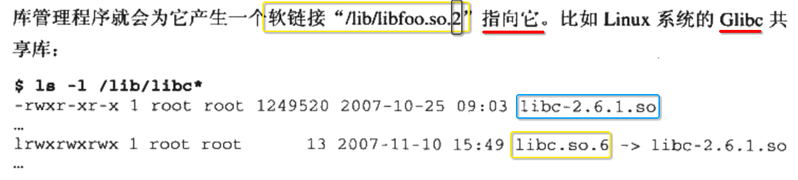
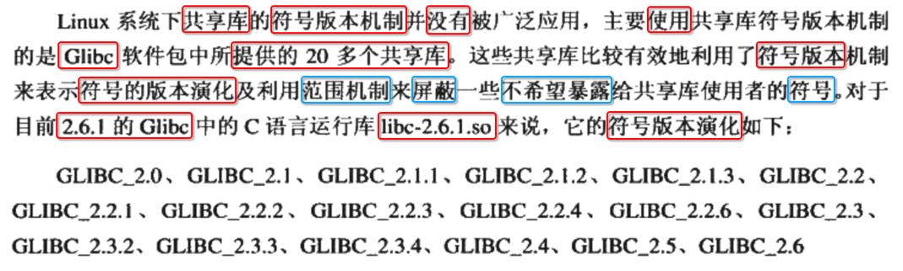
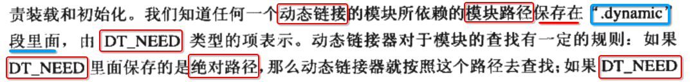

[TOC]


## List


## 1. 共享库 (shared library) 与 共享对象 (shared object) 可看做同一个东西


## 2. 共享库的 ==更新== 分类2类


## 3. 常见的 ==共享库修改== 方式，以及对应的 ==abi 兼容性==


----


## 4. 导致 ==C 语言== 编写的 ==共享库 abi 变化== 的主要原因


## 5. 对于 ==C++== 编写的 ==共享库 abi 兼容== 问题比较严重


## 6. 共享库 ==版本命名规范==


-----

```
lib<库的名字>.so.<主版本><次版本><发布版本>
```


## 7. Linux so 共享库 ==命名规范 (SO-NAME)==

### 1. 需要记录 ==主程序== 依赖共享库的 ==主版本== 


### 2. so name 




----

- 1) **真正的** 共享库 文件名: **libfoo.so.2**.6.1
- 2) 对应的 **so name** 软链接: **libfoo.so.2**

### 3. 历史原因


-----

历史原因导致 **glibc** 和 **动态链接器 ld.so** 并 **没有** 按照 Linux so 命名规范.

### 4. 建立 ==SO-NAME 软链接== 的 好处


---

- 1) **SO-NAME 软链接** 指向 **真正使用** 的 **具体版本** 共享库文件

- 2) 而 **主程序代码** 中只会引用 **SO-NAME 软链接**

- 3) 那么当本地 **更新** 一个新的具体版本的共享库时
  - 1) **主程序代码** 中 **无需** 修改
  - 2) 只需要 **重建** **SO-NAME 软链接** 指向新的共享库文件即可

### 5. 建立 ==SO-NAME 软链接== 的 目的


### 6. 由 ==SO-NAME 软链接== 指向真正 ==具体版本== 共享库文件


### 6. ==更新== 共享库


----

- 1) **增量** 更新 (**主版本** 不变): abi **兼容**

- 2) **全量** 更新 (**主版本** 变化): abi **不兼容**

### 7. ==SO-NAME== 就是一个 共享库的 ==入口==


对于执行 **链接** 时，都只需要关心 被链接的共享库 对应的 **SO-NAME 软链接** 即可.

### 8. ldconfig ==重建== SO-NAME 软链接


----

- 1) **增量** 更新 (**主版本** 不变): **修改** SO-NAME 软链接 指向 **最新版本** 共享库文件

- 2) **全量** 更新 (**主版本** 变化): **增加** SO-NAME 软链接 指向 **最新版本** 共享库文件


## 8. 主程序代码 ==链接== 共享库时，只传入 ==SO-NAME 软链接==


----

- 1) 使用 **ld** 进行 **链接** 时，只传入 **SO-NAME 软链接**

- 2) **ld -static** 强制使用链接 **静态** 链接库 (**libXxx.a**)

- 3) **ld -Bdynamic** 强制使用链接 **动态共享** 库 (**libXxx.so.2.1.6**)

- 4) gcc **默认** 链接 **动态共享** 库


##  9. ==静态链接器== 记录 ==共享库== 的依赖，提供给 ==动态链接器== 运行时读取


## 10. ==找到的== 共享库版本 vs ==程序二进制记录(依赖列表)的== 共享库版本

### 1. 两种策略


### 2. 因为 ==共享库== 的 ==次版本== 导致 应用程序无法正常运行: 次版本号 交会


## 10. SO-NAME 并没有解决 ==次版本号交会== 问题、符号的版本机制


-----

- 1) SO-NAME 并没有解决 ==次版本号交会== 问题
- 2) 解决方法为 **符号的版本** 机制


## 11. 符号 版本控制 (symbol versioning)

### 1. 正常情况 共享库 ==添加符号== 时，会 ==升级== 次版本，但是这样 ==不够灵活==


### 2. 通过 ==符号的版本控制(symbol versioning)== 解决 共享库的 ==次版本号交会== 问题


----

- 1) 共享库 **次**版本 **更新** 时
- 2) 给每一个添加的 **全局符号** 打上一个 **标签** 
- 3) 通过 **标签** 来识别这个 **符号** 属于哪一个 **次版本** 添加的


## 12. solaris 符号 版本控制 (symbol versioning)

### 1. 分为 ==版本== 和 ==范围== 两种控制


### 2. ==版本== 控制 : 符号 集合


-----

- 1) 每一个 **集合** 都有唯一的 **名字** (VERS_1.2、VERS_1.3 ...)
- 2) 一个 **集合** 可以包含 **n个** **符号**
- 3) 一个 **集合** 也可以包含 **n个** **集合**

### 3. 通过 ==符号版本脚本== 控制 ==一个集合== 包含哪一些 ==符号、集合==


### 4. 上述存在问题: ==local== 会将 共享库内其他的 ==全局==符号 变为 ==局部== ，那么 ==外部无法访问==


-----

- 1) 通过 **范围(scoping)机制** 解决上述问题
- 2) 以及弥补 **C 语言** 没有很好的 **符号可见范围** 控制

### 5. 共享库 ==新增== 一个 ==全局函数== ，修改 符号版本脚本 ==继承== 低版本 符号集合


### 6. 可执行文件 ==正确== 记录 动态库中的 ===符号版本==


-------

- 1) 假设 **系统** 存在一个 **SO-NAME 软链接** libmysdk.so.1

- 2) libmysdk.so.1 **指向** 本地的 **一个具体版本** 的 **libmysdk.so.1.1.0** 动态库文件

- 3) 通过 **符号控制脚本文件** ==生成== libmysdk.so.1.1.0 动态库文件，使得 **libmysdk.so.1.1.0 动态库文件** 可同时存在 **6个** 版本的 **符号集合** 
  - SUNW_1.1
  - SUNW_1.2
  - SUNW_1.3 (**默认** 链接 版本)
  - SUNW_1.4
  - SUNW_1.5
  - SUNW_1.6

- 4) 编译 main.c 链接 **libmysdk.so.1** 指向的 **libmysdk.so.1.1.0** 动态库文件，实际上使用的是 **SUNW_1.3** 版本的 **符号集合**

- 5) 所以即使 当前系统本地 存在 **SUNW_1.4、SUNW_1.5、SUNW_1.6** 高版本的 **符号集合**，也 **不会** 去选择链接

### 7. 动态链接器 检查 ==主程序== 依赖的 ==共享库符号的版本== 是否合法


------

- 1) main.c **编译、链接** 时，如果使用 **共享库A** 内的 **1.3** 版本的 **符号集合**

- 2) 那么在 **运行时** 时，**动态链接器** 会 **对比** 当前本地 **共享库A** 内部 **所有** 的 **符号集合** 版本

| ==系统本地== 共享库A 内部的 ==符号集合== 版本 | ==可执行文件== 内记录的 ==依赖== 共享库A 内部的 ==符号集合== 版本 | 是否合法 | 动态链接器是否加载执行 |
| ----------------------- | ----------------------- | -------- | ---------------------- |
| 1.3、1.4、1.5、1.6       | 1.3    | y        | y    |
| 1.1、1.2                | 1.3   | n        | n    |


## 13. Linux 符号的版本控制 (symbol versioning)

### 1. Linux 共享库 ==符号版本机制== 并 ==没有== 广泛使用



### 2. 存在像 libcrypt-2.6.1.so 共享库，内部的 ==符号版本集合== 仍然是 ==GLIBC_2.0== 低版本


-----

- 1) 因为 crypt 这个共享库的 **接口** 在 **2.0** 版本之后，就 **没有改动** 过了，十分的稳定
- 2) 另外 **`GCC_` 前缀** 和 **GLIBC_PRIVATE** 这两种类型的 **符号版本集合** 不要去使用

### 3. ==GCC== 对 Solaris 符号版本机制 ==扩展==

#### 扩展1. `.symver` 指令可以在 ==汇编==、==C/C++  源文件== 内嵌汇编中 指定 ==符号的版本== 


#### 扩展2. 允许 ==一个符号== 同时存在 ==多个版本== (符号重载)


------------

- 1) old_print() 是 **printf 符号** 的 1.1 版本
- 2) new_print() 是 **printf 符号** 的 1.2 版本

### 4. GCC 为什么提供这两种扩展？


-----

- 1) 共享库源码 中的 **某个接口** 仅仅只是 **一点点修改** 在 **完全向后兼容** 情况下，不希望去 **升级主版本**
- 2) 因为一旦 **升级主版本** , 同时就得 **修改本地的 SO-NAME 软链接** 指向 **新的** 共享库文件
- 3) Solaris 对于 **同一个符号** ，只能同时存在 **一个版本** 实现
- 4) GCC 则允许 **同一个符号** ，同时存在 **n个版本** 不同的实现
  - 1) **print 符号** 1.1 版本实现 old_print()
  - 2) **print 符号** 1.2 版本实现 new_print()
- 5) **ld 链接器** 在链接时，可以让 **主程序** 自由选择 **共享库** 中符号的 **某一个版本**
- 6) **不同版本** 的 **主程序** 之间，都可以正常使用 共享库

### 5. GCC 符号版本 具体使用

#### 1. lib.c 制作共享库的 源文件

```c
void foo(){}
```

#### 2. lib.ver 管理 符号版本 脚本文件


#### 3. lib.c 使用 lib.ver 生成带有 ==符号版本== 的共享库


#### 4. 编译 main.c 链接 lib.so 生成 a.out


#### 5. 如果将 a.out 放到 ==只包含 < VERS_1.2== 版本的 lib.so 环境运行, 动态链接器 ==运行时报错、让程序退出==


## 14. 共享库 ==系统路径== (HFS 规定)


## 15. 共享库 ==查找过程==

### 1. 可执行文件、动态链接器


### 2. 读取 可执行文件 `.dynamic` 段，获取 ==共享库文件的路径==




### 3. `/etc/ld.so.conf` 配置指向的 共享库文件 搜索目录


### 4. ldconfig ==加快== 共享库文件的 ==查找==


### 5. 总结 ldconfig 2大作用

- 1) 重建 **SO-NAME 软链接** 正确的 **指向** 具体版本的 **共享库文件**
- 2) 同时会 **收集** 所有共享库的 **SO-NAME 软链接** ，使用 `/etc/ld.so.cache` 缓存结构存储，大大加快共享库文件的查找

### 6. 当在 ==系统共享库搜索路径== 中 ==更新== 共享库后，应该执行 ==ldconfig 重建缓存==


### 7. 不同系统的 ==SO-NAME 软链接的 缓存文件名、路径== 可能不同


## 16. 通过 ==环境变量== 修改 共享库 搜索路径

### 0. ==临时改变== 方便调试 共享库 搜索路径, 但是 ==不影响其他进程==


### 1. LD_LIBRARY_PATH

#### 1. 使用


#### 2. 动态链接器 搜索 共享库路径的 ==顺序==


### 2. 直接运行 动态链接器 ==指定== 共享库 搜索路径


### 3. LD_PRELOAD (优先级 ==高于== LD_LIBRARY_PATH)

#### 1. LD_PRELOAD 环境变量


#### 2. ld so preload 配置文件


### 4. LD_DEBUG : 输出 动态链接器 运行时的各种信息

#### 1. LD_DEBUG=files


#### 2. LD_DEBUG=其他可选值


## 17. 共享库 ==创建(生成)==、==调试==

### 1. GCC 生成 共享库


### 2. 如果 ==不指定== SO-NAME 


### 3. 生成 ==依赖其他共享库== 的 共享库 (ld 链接的产物)


### 4. 不要随意 ==去除== 共享库 ==符号表== 和 ==调试信息==


### 5. ==调试== 共享库文件


-----

- 1) LD_LIBRARY_PATH 环境变量
- 2) **动态链接器 ld** `-rpath` 选项，设置 **查找** 共享库的路径
- 3) **GCC** `-Wl,-rpath` 选项，设置 **查找** 共享库的路径

### 6. 默认只有 ==链接== 时, 才会将 ==被共享库引用的符号== 导出到 ==动态符号表== 


### 7.==发布== 阶段 ==清除(strip)== 共享库 ==符号信息==


## 18. 共享库 ==安装==

### 1. 直接扔到  `/lib`、`/usr/lib` 目录下


但缺点是需要 **root 权限** .

### 2. 在指定目录下执行 ldconfig 建立 SO-NAME 软链接、刷新 so 路径缓存


## 19. 在 ==链接== 和 ==程序运行== 指定 共享库文件的 ==位置==


-----

- 1) 编译链接: 
  - 1) `gcc -L.. -l..`
  - 2) `gcc -rpath…`
- 2） 程序运行:
  - LD_LIBRARY_PATH 环境变量


## 20. 共享库 ==构造== 与 ==析构==

### 1. 构造


### 2. 析构


### 3. ==其他编译器== 不通用


### 4. 一旦使用 共享库 ==构造== 与 ==析构== , 就必须 ==链接 C 标准运行库==


### 5. 如果同时存在 ==多个== 构造, 执行顺序 ==不固定== 


## 21. 共享库 ==脚本==


