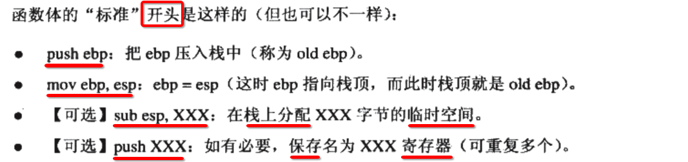

[TOC]


## List


## 1. 考虑如下问题


## 2. 程序的 ==运行环境==


## 3. 程序 与 内存


## 4. 用户空间内的 ==默认区域==


## 5. Linux 进程的 ==内存布局==


## 6. 经常会出现的 段错误 (segment fault)


## 7. 栈 (stack)


----

- 1) 栈 **向下** 生长
  - 1) push 压栈 => esp 减小
  - 2) pop 弹栈 => esp 增大

- 2) 直接 **减小** esp 值 => 栈上 **开辟** 局部存储

- 3) 直接 **增大** esp 值 => 栈上 **回收** 局部存储


## 8. 栈帧 (stack frame)、活动记录 (active record)

### 1. 包含如下几方面


### 2. 结构图示


## 9. 函数 ==调用约定== (abi 内容)


-----

- 1) ebp (底) 寄存器: 位置 **固定不变** , 指向 **当前调用** 函数栈帧的 **底部**
  - 1) ebp - **4** : **返回地址**
  - 2) ebp - **8** , ebp - **12** : 当前函数 被调用时的 **形参数组**

- 2) esp (顶) 寄存器: 位置 **不断变化** , 指向 **当前调用** 函数栈帧的 **顶部**
  - 1) esp - N : 局部栈帧 **分配** 存储单元
  - 2) esp + N : 局部栈帧 **回收** 存储单元


## 10. i386 函数调用约定


---

- 1) 函数调用的 **形参** 传递
  - 1) 压栈
  - 2) 寄存器

- 2) **call** 调用 函数
  - 1) **压栈** 当前执行指令的 **下一条** 指令的 **内存地址** , 为了后续 **恢复** 执行
  - 2) **跳转** 函数体开始执行


## 11. i386 函数调用约定: ==函数体== 模板

### 1. 函数体 -- 开始




### 2. 函数体 -- 结束 (与上相反)


## 12. GCC `-fomit-frame-poiner` 可取消 ==bp 栈底== 寄存器


## 13. i386 架构 debug 模式 foo() 汇编实现

### 1. foo() 

```c
int foo()
{
  return 123;
}
```

### 2. foo() 汇编代码


## 14. 可能有的 ==编译器== 对于 ==未初始化的 char 数组== 输出 ==烫烫== 乱码

### 1. main.c

```c
#include <stdio.h>

int main() {
  char ch[10];
  printf("%s\n", ch);
}
```

### 2. 输出 ==烫烫== 乱码的原因


## 15. i386 架构下, 编译器 展开一个 C函数 ==进入== 和 ==退出== 指令序列


## 16. 编译器 ==不会生成== 如上标准的指令序列的情况


----

当 **C函数** 满足如下2个条件时，编译器 **不会生成** 如上标准的指令序列的情况:

- 1) 函数 被声明为 **static** 
- 2) 函数 仅只在 **编译单元内** 使用, 并且 **没有** 使用 **函数指针** 来指向这个函数

那么说明 **这个C函数** 仅仅只在 **编译单元内** 使用，**编译器** 可以放心的对齐进行 **优化**.


## 17. ==插桩 (占位)== 指令


## 18. ==插桩(占位)== 指令, 可以在 ==运行时替换== 成其他的指令, 称为 ==钩子(Hook)== 技术

### 1. ==运行时替换== 作为 ==插桩(占位)== 指令


----


### 2. 这种 ==替换指令== 技术, 称为 ==钩子(Hook)== 技术


## 19. 函数的 ==调用约定(调用惯例)==

### 1. 函数的 ==调用方== 和 ==被调用方== 必须使用 ==相同== 规则


### 2. 如果 ==调用方== 和 ==被调用方== 不遵守调用约定, 那么 ==函数无法正常执行==

#### 1. 参数的 ==压栈顺序== 不一致


----


**调用方** 和 **被调用方** 对于 **参数顺序** 理解不一样

#### 2. 参数的 ==传递方式== 不一致


----

- 1) **调用者** 使用 **寄存器** 写入 参数
- 2) **被调用者** 使用 **弹栈** 读取 参数

显然 **双方** 是不正确的.


## 20. ==函数调用约定== 包含如下方面


----

- 1) 函数 **参数** 传递 **方式** 与 **顺序**
  - 1) 传递 **方式**
    - 1) 栈
    - 2) 寄存器
  - 2) 传递 **顺序**
    - 1) 左 => 右
    - 2) 右 => 左

- 2) **栈** 的 **维护(平衡)** 方式
  - 1) **调用者** 负责 **回收** 栈帧的局部存储
  - 2) **函数本身** 负责 **回收** 栈帧的局部存储


- 3) **符号** 的 **修饰** 算法 (name-nameing)
  - C **函数名**: run()
  - ASM(汇编) **符号名**: `_run`


## 21. C 语言 默认的 调用规范 cdecl

### 1. 在不同的 编译器 可能 ==写法不一样==, 但 ==约定相同==


### 2. 默认 调用约定 包含的内容


----

- 1) 函数参数的 **传递** : 从 **右** 到 **左** 挨个 **压栈**
- 2) **栈平衡** 方 : 函数的 **调用者** 完成
- 3) 函数名 **修饰** 规则 : 在函数名

### 3. 一个简单的 foo() ==被调用== 时的 ==栈结构==


### 4. ==多级== 函数调用

#### 1. C 代码

```c
void f(int y) {
  printf("y = %d\n", y);
  return 0;
}

int main() {
  int x = 1;
  f(x);
  return 0;
}
```

#### 2. main() => f() 中的 printf() 栈结构变化


----

如上图查看顺序:

```
1 2 3
4 5
```

-----

- 1) main()
- 2) f() 开始
- 3) f() 继续调用 printf()
- 4) printf() 结束、返回
- 5) f() 结束、返回
- 6) main() 结束、返回


## 22. 对比其他几种 函数调用约定


## 23. C++ 调用约定 ==thiscall==


- GCC、thiscall、cdecl 安全一致
- 将 **this(指向当前的指针变量)** 当做函数的 **第一个** 参数


## 24. 如果 ==函数调用方== 和 ==函数== 使用不同 ==调用约定==

### 1. 2个 C 文件，各自使用 不同的 ==调用约定==


### 2. 会在 ==链接== 或 ==读取参数== 出现错误


----

- 1) 通常会在 **链接** 时报错
- 2) 即使能 链接通过，在最终运行时调用函数时 **读取参数** 也会出现 **错误**


## 25. 函数的 ==返回值== 如果 ==过大== 

### 1. 返回值 ==小于等于4字节==

- 直接采用 eax **一个寄存器** 传递即可
- 其他的 cpu 架构只是 寄存器 **名字不一样**

### 2. 返回值 ==大于4、小于等于8字节==


---

- 1) **低位** 1 - 4 字节: 使用 **eax 寄存器** 传递
- 2) **高位** 5 - 8 字节: 使用 **edx 寄存器** 传递

### 3. 返回值 ==大于8字节==

#### 1. C 文件

```c
typedef struct animal
{
	char buf[128];
} animal;

animal func()
{
	animal ani;
	ani.buf[0] = 0;
	return ani;
}

int main() {
	animal ani = func();
}
```

书上的例子


#### 2. 汇编代码

```asm
	.file	"main.c"
	.text
	.globl	func
	.type	func, @function
func:
.LFB0:
	.cfi_startproc
	pushq	%rbp
	.cfi_def_cfa_offset 16
	.cfi_offset 6, -16
	movq	%rsp, %rbp
	.cfi_def_cfa_register 6
	subq	$160, %rsp
	movq	%rdi, -152(%rbp)
	movq	%fs:40, %rax
	movq	%rax, -8(%rbp)
	xorl	%eax, %eax
	movb	$0, -144(%rbp)
	movq	-152(%rbp), %rax
	movq	-144(%rbp), %rdx
	movq	-136(%rbp), %rcx
	movq	%rdx, (%rax)
	movq	%rcx, 8(%rax)
	movq	-128(%rbp), %rdx
	movq	-120(%rbp), %rcx
	movq	%rdx, 16(%rax)
	movq	%rcx, 24(%rax)
	movq	-112(%rbp), %rdx
	movq	-104(%rbp), %rcx
	movq	%rdx, 32(%rax)
	movq	%rcx, 40(%rax)
	movq	-96(%rbp), %rdx
	movq	-88(%rbp), %rcx
	movq	%rdx, 48(%rax)
	movq	%rcx, 56(%rax)
	movq	-80(%rbp), %rdx
	movq	-72(%rbp), %rcx
	movq	%rdx, 64(%rax)
	movq	%rcx, 72(%rax)
	movq	-64(%rbp), %rdx
	movq	-56(%rbp), %rcx
	movq	%rdx, 80(%rax)
	movq	%rcx, 88(%rax)
	movq	-48(%rbp), %rdx
	movq	-40(%rbp), %rcx
	movq	%rdx, 96(%rax)
	movq	%rcx, 104(%rax)
	movq	-32(%rbp), %rdx
	movq	-24(%rbp), %rcx
	movq	%rdx, 112(%rax)
	movq	%rcx, 120(%rax)
	movq	-152(%rbp), %rax
	movq	-8(%rbp), %rcx
	xorq	%fs:40, %rcx
	je	.L3
	call	__stack_chk_fail@PLT
.L3:
	leave
	.cfi_def_cfa 7, 8
	ret
	.cfi_endproc
.LFE0:
	.size	func, .-func
	.globl	main
	.type	main, @function
main:
.LFB1:
	.cfi_startproc
	pushq	%rbp
	.cfi_def_cfa_offset 16
	.cfi_offset 6, -16
	movq	%rsp, %rbp
	.cfi_def_cfa_register 6
	subq	$144, %rsp
	movq	%fs:40, %rax
	movq	%rax, -8(%rbp)
	xorl	%eax, %eax
	leaq	-144(%rbp), %rax
	movq	%rax, %rdi
	movl	$0, %eax
	call	func
	movl	$0, %eax
	movq	-8(%rbp), %rdx
	xorq	%fs:40, %rdx
	je	.L6
	call	__stack_chk_fail@PLT
.L6:
	leave
	.cfi_def_cfa 7, 8
	ret
	.cfi_endproc
.LFE1:
	.size	main, .-main
	.ident	"GCC: (Ubuntu 7.3.0-27ubuntu1~18.04) 7.3.0"
	.section	.note.GNU-stack,"",@progbits
```

#### 4. main() 中的 `animal ani = func();` Linux gcc 汇编代码 

```asm
main:
  ........

  leaq	-144(%rbp), %rax
	movq	%rax, %rdi
	movl	$0, %eax
	call	func

  ........
```

#### 5. 书上 MSVC9 反汇编 ==main()== 代码


#### 6. ==被调== 函数 虽然 ==没有参数==，但是编译器会添加一个 ==隐含参数== 用来传递 ==内存地址值(4/8字节)==


----

- 1) 会在 **局部栈帧** 分配一个 **特别大** 局部存储区域，作为局部栈帧上的 **临时变量(struct 实例)** 进行读写
- 2) 然后将 局部存储区域的 **内存地址** 作为 **函数的参数** 传递
- 3) 而函数虽然 **没有参数**，但会由 **编译器** 自动加上，称为 **隐含参数**

#### 7. 从分配的局部存储, 拷贝到 ==主调== 函数栈帧 中的 局部存储


----


#### 8. 如上汇编 等价的 ==C 代码==


#### 9. 函数返回值 仍然由 ==eax 寄存器== 保存，但是保存的是 ==内存地址== (main 函数内临时对象的地址)


#### 10. memcpy(`[ebp + 8]`, &b, 128)


#### 11. main() 一开始就会 ==分配局部存储==


#### 12. 总结整个过程


------


#### 13. 涉及到 ==2次拷贝==

- 1) 被调用的 **return_text()** 内部的 **局部 struct 实例 b** 拷贝到 => **main**() 内部的 **临时空间 temp**
- 2) **main()** 内部的 **临时空间 temp** 拷贝到 => **main()** 内部的 **局部 struct 实例 n** 

#### 14. 整个过程的 ==伪代码==


#### 15. 整个过程的 ==栈结构==


-----

- 1) main() 将自己的 **临时空间** 的 **内存地址** 传递给 被调函数 return_test()
- 2) 被调用的 **return_text()** 内部的 **局部 struct 实例 b** 拷贝到 => **main**() 内部的 **临时空间 temp**
- 3) **main()** 内部的 **临时空间 temp** 拷贝到 => **main()** 内部的 **局部 struct 实例 n** 

#### 16. ==C 语言== 不要返回 ==大数据类型== 的 ==数据(对象)==


#### 17. ==C++== 中的 ==返回对象== 、C++ 返回值优化 ==减少1次拷贝==


## 26. 堆、内存管理

### 1. 有了 ==栈== 还需要 ==堆== 的原因


### 2. 由 ==用户程序== 自己控制 ==堆区== 内存管理


### 3. ==C标准库(运行库)== 作为 用户程序 ==申请和释放== 入口


### 4. Linux ==进程管理== 提供 ==2种== 堆空间 ==分配== 方法


### 5. 堆空间 ==分配== 方式1: blk() ==系统调用 (内核态)==


### 6. 堆空间 ==分配== 方式2: mmap() ==Standard C Library (用户态)== 标准库函数


----

- 1) mmap() 向操作系统申请 一块 **虚拟** 内存地址空间

- 2) 可将将 **某个文件** **映射到** 申请到的这块 **虚拟** 内存地址空间

- 3) 如果这块 **虚拟** 内存地址空间 **不用来** 映射 **文件**，那么这块空间称作 **匿名空间(Anonymous)** 

- 4) 而 **匿名空间(Anonymous)** 可用来作为 **进程** 的 **堆(heap)空间** 使用

### 7. mmap() ==参数== 含义


### 8. glibc 实现的 ==malloc()== 处理 应用程序 申请堆区内存


### 9. mmap() 按照 ==页(4096字节)== 单位 申请虚拟内存

- 调用 mmap() 申请内存时 **前2个参数** 都必须是 **页(4096字节)** 的 **整数倍** 
	- 1) start
	- 2) length

- 否则会造成 **页内碎片** 浪费内存

### 10. 一些问答题 (Q&A)


------

- 1) **不可以重复** 对一块 **堆区内存地址** 释放

- 2) **堆** 的 **生长方向** 与 **编译器** 和 **操作系统** 有关

- 3) 调用 **malloc()** 是否进入 **系统调用** 阶段，得看 **当前堆区可用** 空间，是否 **大于** 应用程序 **申请大小**


- 4) 调用 **malloc()** 申请的 堆区内存，会在 **进程结束** 跟着被系统 **关闭、回收**
- 5) 调用 **malloc()** 申请的 堆区内存，是否是 **连续** 需要取决于 **查看角度**

  - 1) **虚拟** 地址(空间) => 连续
  - 2) **物理** 地址(空间) => 可能**连续**、也可能**不连续**


## 27. 堆区内存 ==分配算法== 

### 堆空间分配策略 1: 空闲 链表 (double free list)

#### 1. 定义


#### 2. 结构图示


#### 3. 分配堆区内存 => 空闲链表 ==删除节点==


#### 4. 存在的问题


### 堆空间分配策略 2: 位图 (bitmap)

#### 1. 定义


---

- 1) 首先将 **整个堆** 划分为 **大小相等** 的若干个 **小块**

- 2) 而每一个 **小块** 有 **3种** 状态
	- 1) 头部 (head) : 记录分配空间的一些基础信息
	- 2) **已**分配区域 (body) : 真正分配给 **应用程序使用** 的空间
	- 3) **未**分配区域 : **空闲** 状态

#### 2. 分配算法示例


#### 3. 分配后的 位图 指向对应的块


-----

- 1) 总共划分为 **16** 个内存块

- 2) **一个** 内存块有 **3种** 状态
	- 1) 11 => 3 => H(Head)
	- 2) 10 => 2 => B(Body)
	- 3) 00 => 0 => F(Free)

- 3) **一个** 状态，需要用 **2个** 二进制位 表示

- 4) **16** 个内存块，总共需要 **16x2=32个** 二进制位

#### 4. 优点: 1) 速度快 2) 稳定


#### 5. 缺点: 1) 内存碎片 2) 位图本身也占用内存


### 堆空间分配策略 3: 对象池


