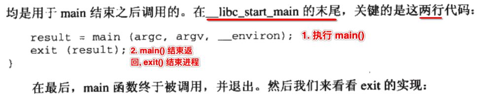
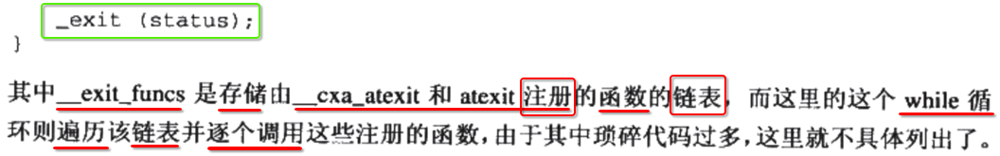
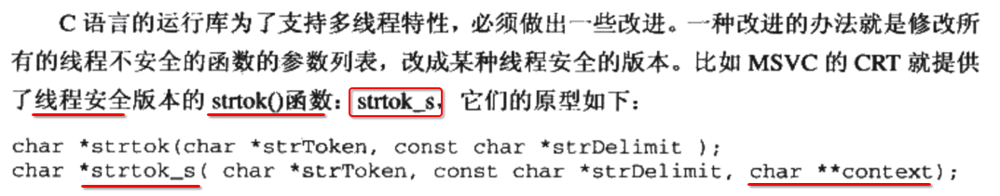
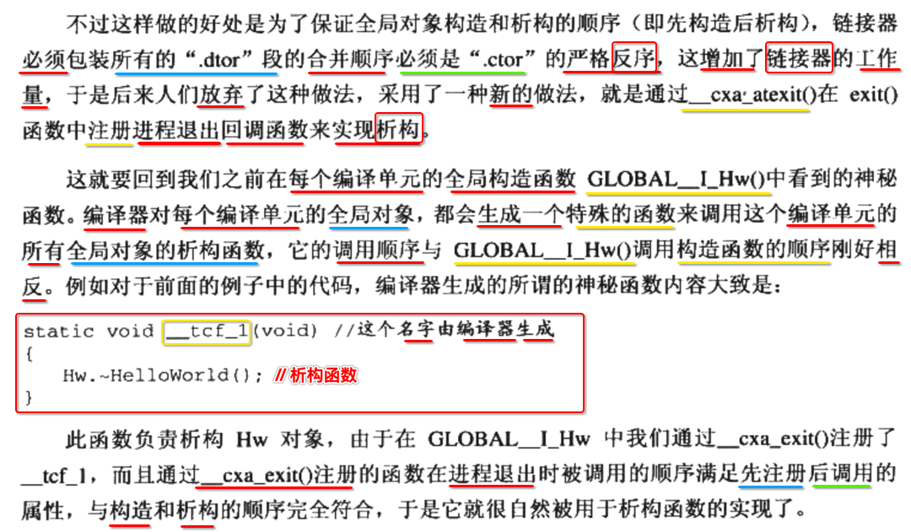

[TOC]


## List


## 1. 程序 第一个 执行入口是 main() ？ 不是!

### 1. C 代码


### 2. C++ 代码


### 3. atexit()


## 2. main() 之前执行 ==入口符号(entry point)== 


## 3.1 ==ANSI C== Standard Library

- http://www.csse.uwa.edu.au/programming/ansic-library.html
- https://en.wikipedia.org/wiki/C_standard_library


----

- 1) **目前** C 标准 函数库 共有 **29个** 头文件
  - 15个 (ANSI C)
  - 3个 (NA1)
  - 6个 (C99)
  - 5个 (C11)

- 2) [ANSI C](https://en.wikipedia.org/wiki/ANSI_C) 有 **15个** 头文件

- 3) 1995年 **Normative Addendum 1 (NA1)** 批准了 **3个** 头文件 **增加** 到 C标准函数库中
  - iso646.h
  - wchar.h
  - wctype.h

- 4) **C99 标准** 增加了 **6个** 头文件
  - complex.h
  - fenv.h
  - inttypes.h
  - stdbool.h
  - stdint.h
  - tgmath.h

- 5) **C11 标准** 又新增了 **5个** 头文件
  - stdalign.h
  - stdatomic.h
  - stdnoreturn.h
  - threads.h
  - uchar.h


## 3.2 ==C POSIX== library

### 1. C POSIX library 是 ansi c library ==超集==

- 1) **C POSIX library** is a **specification** of a **C standard library** for **POSIX systems**
  ```
  C POSIX library 是在 遵循 POSIX 标准实现的 操作系统 下的 C语言标准库
  ```

- 2) It was **developed** at the **same time as** the **ANSI C standard**.

- 3) Some effort was made to make POSIX compatible with standard C
  ```
  为了兼容 <posix 标准> 与 <ANS C 标准> 我们做了一些努力
  ```

- 4) POSIX includes additional functions to those introduced in standard C.
  ```
  <POSIX 标准> 包含了 <C 标准> 中 `没有` 声明的函数
  ```

### 2. POSIX 标准 = <ANSI C 标准> + 新增的声明

https://en.wikipedia.org/wiki/C_POSIX_library

### 3. 列举出 POSIX 标准 ==新增== 的头文件

https://zh.wikipedia.org/wiki/C_POSIX_library

|        头文件        |                             描述                             | 首次发布 |
| :------------------: | :----------------------------------------------------------: | :------: |
|     **<aio.h>**      |       [异步I/O](https://zh.wikipedia.org/wiki/异步I/O)       | Issue 5  |
|  **<arpa/inet.h>**   | 操纵数值[IP地址](https://zh.wikipedia.org/wiki/IP地址)的函数胡 (部分[Berkeley套接字](https://zh.wikipedia.org/wiki/Berkeley套接字)) | Issue 6  |
|     **<cpio.h>**     | 用于[cpio](https://zh.wikipedia.org/wiki/Cpio)的[文件格式#Magic number](https://zh.wikipedia.org/wiki/文件格式#Magic_number) | Issue 3  |
|    **<dirent.h>**    | 打开与列出[目录](https://zh.wikipedia.org/wiki/目录_(文件系统)). | Issue 2  |
|    **<dlfcn.h>**     | [动态链接](https://zh.wikipedia.org/w/index.php?title=动态链接&action=edit&redlink=1) | Issue 5  |
|    **<fcntl.h>**     | 文件打开、[加锁](https://zh.wikipedia.org/wiki/文件加锁)等操作 | Issue 1  |
|    **<fmtmsg.h>**    |                       Message显示结构                        | Issue 4  |
|   **<fnmatch.h>**    |                          文件名匹配                          | Issue 4  |
|     **<ftw.h>**      |                          文件树遍历                          | Issue 1  |
|     **<glob.h>**     | 路径名模式匹配[Glob](https://zh.wikipedia.org/w/index.php?title=Glob&action=edit&redlink=1) | Issue 4  |
|     **<grp.h>**      | 用户[Group identifier (Unix)](https://zh.wikipedia.org/w/index.php?title=Group_identifier_(Unix)&action=edit&redlink=1)信息与控制。 | Issue 1  |
|    **<iconv.h>**     |    [字符编码](https://zh.wikipedia.org/wiki/字符编码)转换    | Issue 4  |
|   **<langinfo.h>**   | 语言信息常量。建于[Locale.h](https://zh.wikipedia.org/wiki/Locale.h)之上。 | Issue 2  |
|    **<libgen.h>**    |                          路径名操作                          | Issue 4  |
|   **<monetary.h>**   |                    货币单位的字符串格式化                    | Issue 4  |
|    **<mqueue.h>**    |      [消息队列](https://zh.wikipedia.org/wiki/消息队列)      | Issue 5  |
|     **<ndbm.h>**     | [NDBM](https://zh.wikipedia.org/w/index.php?title=NDBM&action=edit&redlink=1)数据库操作 | Issue 4  |
|    **<net/if.h>**    |  本地[网络接口](https://zh.wikipedia.org/wiki/网络接口)列表  | Issue 6  |
|    **<netdb.h>**     | 把本地协议与主机名翻译为数值地址。是[Berkeley套接字](https://zh.wikipedia.org/wiki/Berkeley套接字)的一部分 | Issue 6  |
|  **<netinet/in.h>**  | 定义互联网协议与地址族。是[Berkeley套接字](https://zh.wikipedia.org/wiki/Berkeley套接字)的一部分 | Issue 6  |
| **<netinet/tcp.h>**  | 额外的[TCP](https://zh.wikipedia.org/wiki/Transmission_Control_Protocol)的控制选项。是[Berkeley套接字](https://zh.wikipedia.org/wiki/Berkeley套接字)的一部分 | Issue 6  |
|   **<nl_types.h>**   |                      本体化消息分类函数                      | Issue 2  |
|     **<poll.h>**     | [异步多任务文件描述符](https://zh.wikipedia.org/w/index.php?title=异步多工文件描述符&action=edit&redlink=1) | Issue 4  |
|   **<pthread.h>**    |    [POSIX线程](https://zh.wikipedia.org/wiki/POSIX线程).     | Issue 5  |
|     **<pwd.h>**      | [passwd](https://zh.wikipedia.org/wiki/Passwd)文件访问与控制 | Issue 1  |
|    **<regex.h>**     |    [正则表达式](https://zh.wikipedia.org/wiki/正则表达式)    | Issue 4  |
|    **<sched.h>**     |                           执行调度                           | Issue 5  |
|    **<search.h>**    |                            搜索表                            | Issue 1  |
|  **<semaphore.h>**   |     POSIX [信号量](https://zh.wikipedia.org/wiki/信号量)     | Issue 5  |
|    **<spawn.h>**     | [spawning](https://zh.wikipedia.org/w/index.php?title=Spawn_(计算)&action=edit&redlink=1)子进程 | Issue 6  |
|   **<strings.h>**    |                    大小写不敏感字符串比较                    | Issue 4  |
|   **<stropts.h>**    |   流操作，包括[ioctl](https://zh.wikipedia.org/wiki/Ioctl)   | Issue 4  |
|   **<sys/ipc.h>**    | [进程间通信](https://zh.wikipedia.org/wiki/进程间通信) (IPC). | Issue 2  |
|   **<sys/mman.h>**   | 内存管理，包括POSIX [共享内存 (进程间通信)](https://zh.wikipedia.org/wiki/共享内存_(进程间通信))与[内存映射文件](https://zh.wikipedia.org/wiki/内存映射文件) | Issue 4  |
|   **<sys/msg.h>**    |  POSIX [消息队列](https://zh.wikipedia.org/wiki/消息队列)。  | Issue 2  |
| **<sys/resource.h>** |                   资源使用，优先级与限制。                   | Issue 4  |
|  **<sys/select.h>**  | [Select (Unix)](https://zh.wikipedia.org/wiki/Select_(Unix)) | Issue 6  |
|   **<sys/sem.h>**    | XSI ([SysV](https://zh.wikipedia.org/w/index.php?title=Unix_System_V&action=edit&redlink=1)风格的) [信号量](https://zh.wikipedia.org/wiki/信号量) | Issue 2  |
|   **<sys/shm.h>**    | XSI ([SysV](https://zh.wikipedia.org/w/index.php?title=Unix_System_V&action=edit&redlink=1)风格的)[共享内存 (进程间通信)](https://zh.wikipedia.org/wiki/共享内存_(进程间通信)) | Issue 2  |
|  **<sys/socket.h>**  | [Berkley套接字](https://zh.wikipedia.org/w/index.php?title=Berkley套接字&action=edit&redlink=1)主要头文件 | Issue 6  |
|   **<sys/stat.h>**   | 文件信息([stat (Unix)](https://zh.wikipedia.org/w/index.php?title=Stat_(Unix)&action=edit&redlink=1)等) | Issue 1  |
| **<sys/statvfs.h>**  |                         文件系统信息                         | Issue 4  |
|   **<sys/time.h>**   |                     时间与日期函数与结构                     | Issue 4  |
|  **<sys/times.h>**   |                      文件访问与修改时间                      | Issue 1  |
|  **<sys/types.h>**   |                        不同的数据类型                        | Issue 1  |
|   **<sys/uio.h>**    | [向量I/O](https://zh.wikipedia.org/w/index.php?title=向量I/O&action=edit&redlink=1)操作 | Issue 4  |
|    **<sys/un.h>**    |  [Unix域套接字](https://zh.wikipedia.org/wiki/Unix域套接字)  | Issue 6  |
| **<sys/utsname.h>**  | 操作系统信息，包括[uname](https://zh.wikipedia.org/wiki/Uname) | Issue 1  |
|   **<sys/wait.h>**   | 终止子进程的状态(见[wait (Unix)](https://zh.wikipedia.org/wiki/Wait_(Unix))) | Issue 3  |
|    **<syslog.h>**    |    [syslog](https://zh.wikipedia.org/wiki/Syslog)系统日志    | Issue 4  |
|     **<tar.h>**      | [tar](https://zh.wikipedia.org/wiki/Tar)文件格式的Magic number | Issue 3  |
|   **<termios.h>**    |      允许[串口](https://zh.wikipedia.org/wiki/串口)界面      | Issue 3  |
|    **<trace.h>**     |                    运行时行为追踪（过时）                    | Issue 6  |
|    **<ulimit.h>**    |              资源限制（被<sys/resource.h>代替）              | Issue 1  |
|    **<unistd.h>**    |                  多种必要的POSIX函数与常量                   | Issue 1  |
|    **<utime.h>**     |  [inode](https://zh.wikipedia.org/wiki/Inode)访问与修改时间  | Issue 3  |
|    **<utmpx.h>**     |                      用户账号数据库函数                      | Issue 4  |
|   **<wordexp.h>**    | 子扩展，类似于[shell](https://zh.wikipedia.org/wiki/Unix_shell)被执行 | Issue 4  |


## 4. ==Implementations== ANSI C Standard Library


## 5. glibc

> 14. glibc


## 6. glibc 入口符号 `_start`

### 1. `glibc-2.29/sysdeps` 存在各种 ==cpu架构== 对应的 `_start` 实现


### 2. ==i386 架构== 对应的目录

```
 ~/collect_record/glibc-2.29/sysdeps/i386  pwd
/Users/xiongzenghui/collect_record/glibc-2.29/sysdeps/i386
```

```
 ~/collect_record/glibc-2.29/sysdeps/i386  ll | awk {'print $9'}

Implies
Makefile
Versions
____longjmp_chk.S
__longjmp.S
abort-instr.h
add_n.S
addmul_1.S
asm-syntax.h
backtrace.c
bcopy.S
bsd-_setjmp.S
bsd-setjmp.S
bzero.S
cacheinfo.c
configure
configure.ac
crti.S
crtn.S
dl-irel.h
dl-lookupcfg.h
dl-machine.h
dl-procinfo.c
dl-tls.h
dl-tlsdesc.S
dl-tlsdesc.h
dl-trampoline.S
ffs.c
fpu
gccframe.h
gmp-mparam.h
htl
htonl.S
htons.S
i386-mcount.S
i586
i686
i786
isa.h
jmpbuf-offsets.h
jmpbuf-unwind.h
ldbl2mpn.c
link-defines.sym
lshift.S
machine-gmon.h
malloc-alignment.h
memchr.S
memcmp.S
memcopy.h
memcpy.S
memcpy_chk.S
memmove.S
memmove_chk.S
mempcpy.S
mempcpy_chk.S
memset.S
memset_chk.S
memusage.h
mp_clz_tab.c
mul_1.S
nptl
preconfigure
pthread_spin_trylock.S
rawmemchr.S
rshift.S
setfpucw.c
setjmp.S
stackguard-macros.h
stackinfo.h
start.S
stpcpy.S
stpncpy.S
strcat.S
strchr.S
strchrnul.S
strcspn.S
string-inlines.c
strlen.S
strlen.c
strpbrk.S
strrchr.S
strspn.S
sub_n.S
submul_1.S
symbol-hacks.h
sys
sysdep.h
tls-macros.h
tlsdesc.c
tlsdesc.sym
tst-audit.h
tst-audit3.c
tst-audit3.h
tst-auditmod3a.c
tst-auditmod3b.c
tst-ld-sse-use.sh
tst-stack-align.h
```

### 3. 大致分为 三大类

#### 1. C 程序 ==启动代码== (入口)

- 1) start.S

#### 2. C 程序 ==运行环境(crt)== 初始化

- 1) crti.S
- 2) crtn.S

#### 3. GNU C Standard Library 向下调用的 xx.s

- 1) stpcpy.S
- 2) setjmp.S
- .....


## 7. ==glibc== 实现 入口符号(entry point) `_start`

### 1. glibc 4种情况 ==启动过程==


- 1) **main.c static 链接 glibc => a.out**
- 1) main.c dynamic 链接 glibc => a.out

- 3) libXxx.c static 链接 => libXxx.so
- 4) libXxx.c dynamic 链接 => libXxx.so

### 2. 入口符号 `_start` 是由 Linux glibc(库) 提供 


----

- 1) 入口符号 的实现由 `_start` 符号提供

- 2) 入口符号 在 **不同的 cpu 架构** 都对应 **不同的实现** (不同的 cpu 有不同的 **指令集**)
  - 1) arm
  - 2) intel

### 3. `_start` 中最开始的 三条指令


-----

- 1) 第一条指令: **清零** ebp(寄存器)
- 2) 第二条指令: esi(寄存器) = **argc**
- 3) 第三条指令: ecx(寄存器) = **argv[n]** 数组的 **起始地址** ， 紧接着往下又可以找到 **env[n]** 数组\

### 4. `_start` 总体分为 ==4大步== , 最后调用 glibc 中的 `__libc_start_main()`


- 1) ebp(寄存器) = 0

- 2) int argc = **pop(弹栈)** from stack

- 3) `char**` argv = **top(顶部)** stack

- 4) 调用 `__libc_start_main()` glibc 库中函数

  ```c
  __libc_start_main(
    main, 
    argc,
    argv,
    __lib_csu_init,
    __lib_csu_fini,
    edx(寄存器),
    top(顶部) stack 内存地址
  )
  ```


## 8. 环境变量 (env)


## 9. glibc-2.29/csu/libc-start.c

### 1. 宏定义 LIBC_START_MAIN = `__libc_start_main`

```c
#ifdef LIBC_START_MAIN
# ifdef LIBC_START_DISABLE_INLINE
#  define STATIC static
# else
#  define STATIC static inline __attribute__ ((always_inline))
# endif
#else
# define STATIC
# define LIBC_START_MAIN __libc_start_main
#endif
```

### 2. `__libc_start_main()` 声明

```c
#include <libc-start.h>

STATIC int 
LIBC_START_MAIN (
  int (*main) (int, char **, char **MAIN_AUXVEC_DECL),
  int argc,
  char **argv,
#ifdef LIBC_START_MAIN_AUXVEC_ARG
  ElfW(auxv_t) *auxvec,
#endif
  __typeof (main) init,
  void (*fini) (void),
  void (*rtld_fini) (void),
  void *stack_end)
__attribute__ ((noreturn)
);
```

### 3. `__libc_start_main()` 实现

太长了，不贴了


## 10. `__libc_start_main()` 实现

### 1. `__libc_start_main()` 声明 简化

```c
STATIC int
LIBC_START_MAIN (
  int (*main) (int, char **, char ** MAIN_AUXVEC_DECL),   // 参数 1
  int argc,                                               // 参数 2
  char *__unbounded *__unbounded ubp_av,                  // 参数 3
#ifdef LIBC_START_MAIN_AUXVEC_ARG
  ElfW(auxv_t) *__unbounded auxvec,                       // 参数 4 (条件编译)  
#endif
  __typeof (main) init,                                   // 参数 4
  void (*fini) (void),                                    // 参数 6
  void (*rtld_fini) (void),                               // 参数 6
  void *__unbounded stack_end                             // 参数 7
);
```

### 2. `__libc_start_main()` 参数


### 3. GCC bunded pointer (已经废弃, 空的 宏定义)


### 4. `__libc_start_main()` 通过传入的 ==命令行参数数组(参数3)== 定位到 ==环境变量数组==


-----

- 1) ubp_av **指向的** 连续内存中，同时包含 **2部分**
  - 1) argv 数组
  - 2) env 数组

- 2) `ubp_av[argc + 1]` => **ubp_ev** 起始 地址

### 5. 使用 `__environ 指针` 指向 ==环境变量数组== 起始位置


---


### 6. 调用 main() 之前的代码


### 7. 调用 main() 和 main() 返回后调用 ==exit()==



### 8. exit() 内部调用 `_exit()`




----

- 1) 遍历 **链表** 中记录的所有 通过 `__cxa_atext()` 和 `atexit()` **注册** 的函数

- 2) 再调用 `_exit(int)` 系统调用，结束掉整个 **进程**

### 9. `_exit(int)` 实现

#### 1. 调用流程

```
_start -> __libc_start_main() -> main() -> exit() -> _exit()
```

#### 2. ==i386== 架构


----

- 1) `_exit()` 使用 **汇编** 实现
- 2) 最终调用 **系统调用 exit** 结束进程

### 10. exit 调用流程

```
glibc # C函数 # exit() -> glibc # 汇编函数 # _exit() -> 系统调用 mov $__NR_exit, %eax
```

### 11. `_start` 和 `_exit` 末尾的 ==hlt== 指令


## 11. I/O (Input/Outpt) 输入与输出

### 1. ==操作系统== I/O 对象 => 硬件


### 2. ==程序== I/O 对象 => 文件

#### 1. Linux (==操作系统==) 将所有的 ==I/O 对象(硬件/磁盘文件)== 统一看做 ==文件==


#### 2. 通过 ==C 标准库== 中的函数 ==读写文件(I/O)== => `FILE*` 指针


#### 3. 通过 ==Linux 系统函数== 中的函数 ==读写文件(I/O)== => `int fd` 整数值


#### 4. 操作系统 通过 ==fd/句柄== 控制用户对文件的 ==读写权限==


### 3. `FILE*`、 fd、文件打开==表==、文件打开==对象(内核空间)==


----


----

- 1) `FILE*`
- 2) fd
- 3) 文件打开 **表**
- 4) 文件打开 **对象 (内核空间)**

### 4. MSVC I/O 初始化


## 12. C 运行库

### 1. 程序能运行的前提: 运行库 (Runtime Library)


### 2. C 语言的 运行库 (C Runtime Library => ==CRT)


### 3. 一个 ==C 运行库(CRT)== 应具备的功能


### 4. ==C 标准== 的 ==具体实现== 占据 ==C 运行库(CRT)== 大半部分


### 5. C 语言 ==标准化== 发展史


----

- 1) C 语言出现后，各大公司、组织，都开发自己的 **C 基础函数库、C 变种语法**

- 2) 多种的 **C 基础函数库、C 变种语法** 造成 **不同组织** 写的 C 代码 **无法兼容**

- 3) 1989 年，出现了 **C 语言标准** ，简称为 **C89**

- 4)  **C89** 标准制定了 2个 标准
  - 1) C **语法** 标准 => **ANSI** C
  - 2) C **基础函数库** 中的 **xx.h 头文件** 标准 => **ANSI** C **Standard Library**

- 5) 后续 **C 语言标准** 不断的升级
  - 1999 年，出现了 **C 语言标准** ，简称为 **C99**
  - 2011 年，出现了 **C 语言标准** ，简称为 **C11**


## 13. C 语言 ==标准库== (ANSI C Standard Library)

### 1. C 语言 标准库 ==组成==


----

总共 **24** 个 C **头文件**.

### 2. 不同 ==操作系统== 实现 ==C语言标准库==


----

- 1) **Linux 操作系统** 实现的 **C 标准库** => glibc
- 2) **Windows 操作系统** 实现的 **C 标准库** => MSVCRT


## 14. glibc (C 标准的 GNU 实现版本)

### 1. glibc ==发展史==


----

- 1) **GNU 操作系统** 最开始计划的 **内核** 是 **Hurd**

- 2) 然而因为 **Hurd** 内核，发展速度太慢，被 **Linux** 内核 **取代**

- 3) 最早的 **Linux 标准库(运行库)** => **libc**
  - 1) 由 **Linux 开发者** 从 **Linux 内核** 代码中 **剥离** 出一部分代码形成的
  - 2) 但是是 **Linux 专有** 的，无法再 **其他平台** 下使用
  - 3) 版本发展: libc.so.**2** => libc.so.**5**

- 4) 1996年由 **自由软件基金会 FSF** 开发出的 **glibc 2.0** 替代 **Linux libc** 成为 **Linux 标准库(运行库)**

- 5) Linux 将 **glibc 2.X** 作为 **libc.so.5** 的 **后继** 版本
  - 1) 即 **libc.so.6**
  - 2) 各个 Linux 发行版本中，将 **glibc** 称为 **libc6**

- 6) **glibc** 移植到更多的 **操作系统** 和 **硬件平台**
  - 1) FreeBSD、NetBSD 操作系统
  - 2) 数十种 CPU、嵌入式平台

### 2. glibc 发布版本 ==组成==


#### 1. ==文件== 组成

- 1) xx.h **头文件**

- 2) **二进制** 文件
  - 1) 静态库: `/usr/lib/libc.a`
  - 2) 动态库: `/lib/libc.so.6`

#### 2. ==功能== 组成

- 1) **启动库** : 负责一个 **应用程序** 能够正常的 **启动、运行、退出**

- 2) **标准库** : 提供一些 **基础功能** 的 **函数实现** (malloc()、strcpy() ...)

#### 3. 运行库 : 负责完成 程序运行 环境初始化

- 1) /usr/lib/crt1.o
- 2) /usr/lib/crti.o
- 3) /usr/lib/crtn.o

#### 4. 标准库 : 对 ==C 标准== 规范中 xx.h 声明的函数在 ==Linux 系统下的实现==


### 3. glibc ==启动文件==

#### 1. crt0.o


#### 2. crti.o 和 crtn.o


----

- 1) C++ **全局/静态** 对象
  - 1) 构造
  - 2) 析构

- 2) 构造 => elf 增加一个段 `.init` 

- 3) 析构 => elf 增加一个段 `.finish` 

#### 3. crt0.o 升级为 crt1.o 支持 `.init` 和 `.finit` 连个段


### 4. crti.o 和 crtn.o ==都包含== `.init` 和 `.finit`

#### 1. objdump 反汇编 crti.o


#### 2. objdump 反汇编 crtn.o


#### 3. 结论: crti.o 和 crtn.o 都包含 `.init` 和 `.finit`


### 5. a.out 中的 `_init()` 和 `_finit()` 两个函数的 ==起始== 和 ==结束== 代码


- 1) a.out 中的 `_init()` 
  - 1) **开始** 代码来自 **crti.o** 中的 `.init`
  - 2) **结束** 代码来自 **crtn.o** 中的 `.init`
  - 结论: 都是来自于 `.init` 段

- 2) a.out 中的 `_finit()` 
  - 1) **开始** 代码来自 **crti.o** 中的 `.fini`
  - 2) **结束** 代码来自 **crtn.o** 中的 `.fini`
  - 结论: 都是来自于 `.finit` 段

### 6. 必须保证 ==链接== 顺序


----

因为不管是 `_init()` 还是 `_finit()` ，这2个 **函数** 的

- 1) **起始** 代码，都是来自 **crti.o**
- 2) **结束** 代码，都是来自 **crtn.o**

### 7. 链接生成的 a.out 中的 `.init` 段的结构


### 8. gcc 提供 ==禁止== 链接 `crt*.o` 和 ==标准库== 编译选项


### 9. `.init` 和 `.finit` 其他作用


### 10. gcc (编译器) 相关的 目标文件

#### 1. 如下几个 目标文件


#### 2. ==gcc (编译器)== 实现的 ==C++ 语言特性==


----

- 1) **glibc** 中的 **crti.o 和 crtn.o** 
  - 1) 只是提供 `.init` 和 `.finit` 段
  - 2) 提供在 main() **执行前** 和 **执行后** 额外执行一点代码
  - 3) 但是 **没有** 实现 **C++ 语言特性** 

- 2) **gcc 编译器** 才是最终 **C++ 语言特性** 实现者
  - 1) 利用了 **glibc** 中的 **crti.o 和 crtn.o** 机制
  - 2) 增加 **crtbeginT.o** =》 实现 C++ 全局/静态对象 **构造**
  - 3) 增加 **crtend.o** =》实现 C++ 全局/静态对象 **析构**


- 总结) **C++ 语言特性** 
  - **不是** 操作系统 **实现** 的
  - 而是 **编译器** (GCC/MSVC/LLVM) **借助** 操作系统的能力 **实现** 的

#### 3. gcc (编译器) 完成 ==C++ 语法特性== 在不同平台下的 ==差异性兼容== 


### 11. git clone 获取 glibc 源码 (太大了)

> https://www.gnu.org/software/libc/sources.html

#### 1. Checkout the ==latest== glibc in ==development==

```
git clone git://sourceware.org/git/glibc.git
cd glibc
git checkout master
```

#### 2. Checkout the latest ==glibc 2.29 stable release==

```
git clone git://sourceware.org/git/glibc.git
cd glibc
git checkout release/2.29/master
```

#### 3. 下载 tar 包

```
http://ftp.gnu.org/gnu/glibc/
```


## 15. ==C/C++ 运行库== 与 ==多线程==

### 1. 线程 ==访问权限==


### 2. 主流 C/C++ 标准 (C89/C99/C++03) 都没有 ==多线程== 支持


### 3. 对 ==多线程== 支持，主要是 ==两方面==


----

- 1) 提供操作 **线程** 的 **函数 api**
- 2) **运行库** 本身要能够在 **多线程环境** 正确运行

### 4. 提供 操作线程 ==函数 api==


### 5. ==运行库== 设计时，没考虑过 ==多线程==


### 6. ==C++ 标准库== 支持 ==多线程环境== 做了很多的改造


### 7. ==C 标准库== 大部分都是 ==线程安全==


### 8. CRT 支持 ==多线程== 的改进

#### 1. TLS (Thread Local Storage) 线程 局部 存储


#### 2. 加锁


---

- 1) C++ **异常处理** 已经是 **线程安全** 的
- 2) **C malloc()/C++ new** 也是 **线程安全** 的

#### 3. 函数的 调用方式




---

- 1) 不应该 **增加** 或 **修改** **标准库** 中已经存在的 **函数原型(声明)**
- 2) 而应该是只是 **修改** 标准库函数 **内部实现**

### 9.  TLS : ==gcc (编译器)== 

#### 1. ==gcc== 编译器, 定义 TLS 关键字


#### 2. ==MSVC== 编译器, 定义 TLS 关键字


#### 3. TLS 变量, 对于不同的线程, 都是 ==相互独立== 互不影响


#### 4. glibc TLS `__thread` 关键字修饰 ==全局变量==

##### 1. code

```c
#include <stdio.h>
#include <pthread.h>
#include <unistd.h>

__thread int num = 99;

void *thread1(void *arg);
void *thread2(void *arg);

int main()
{
  pthread_t pid1, pid2;

  printf("[main] 1. &num = %p, num = %d\n", &num, num);

  pthread_create(&pid1, NULL, thread1, NULL);
  pthread_create(&pid2, NULL, thread2, NULL);

  pthread_join(pid1, NULL);
  pthread_join(pid2, NULL);

  printf("[main] 2. &num = %p, num = %d\n", &num, num);
}

void *thread1(void *arg)
{
  printf("[thread1] 1. &num = %p, num = %d\n", &num, num);

  sleep(1);
  num = 100;

  printf("[thread1] 2. &num = %p, num = %d\n", &num, num);

  return NULL;
}
void *thread2(void *arg)
{
  printf("[thread2] 1. &num = %p, num = %d\n", &num, num);
  
  sleep(1);
  num = 101;

  printf("[thread2] 2. &num = %p, num = %d\n", &num, num);

  return NULL;
}
```

##### 2. 运行输出

```
xzh@xzh-VirtualBox:~/src$ gcc main.c -lpthread
xzh@xzh-VirtualBox:~/src$ ./a.out
[main] 1. &num = 0x7fa4321c073c, num = 99
[thread2] 1. &num = 0x7fa4311a16fc, num = 99
[thread1] 1. &num = 0x7fa4319a26fc, num = 99
[thread2] 2. &num = 0x7fa4311a16fc, num = 101
[thread1] 2. &num = 0x7fa4319a26fc, num = 100
[main] 2. &num = 0x7fa4321c073c, num = 99
```

- 1) main()
  - 1) 1. &num = 0x7fa4321c073c, num = 99
  - 2) 2. &num = 0x7fa4321c073c, num = 99

- 2) thread1()
  - 1) 1. &num = 0x7fa4319a26fc, num = 99
  - 2) 2. &num = 0x7fa4319a26fc, num = 100

- 3) thread2()
  - 1) 1. &num = 0x7fa4311a16fc, num = 99
  - 2) 2. &num = 0x7fa4311a16fc, num = 101

##### 3. 结论

- 1) 全局变量 **num** 的 **内存** 对于 **三个线程** 都是 **不同** 的
  - 1) main thread  : 0x7fa4321c073c
  - 2) thread1      : 0x7fa4319a26fc
  - 3) thread2      : 0x7fa4311a16fc

- 2) thread1 和 thread2 各自的 **num 变量值** **拷贝自** main 
  - 1) 1. &num = 0x7fa4321c073c, num = **99**
  - 2) 1. &num = 0x7fa4319a26fc, num = **99**
  - 3) 1. &num = 0x7fa4311a16fc, num = **99**

- 3) 最终 man、thread1、thread2 各自 **修改 num** 不会影响 其他线程的 num 值
  - 1) [main] 2. &num = 0x7fa4321c073c, num = **99**
  - 2) [thread1] 2. &num = 0x7fa4319a26fc, num = **100**
  - 3) [thread2] 2. &num = 0x7fa4311a16fc, num = **101**

#### 5. `__thread` 关键字修饰 ==局部 static 变量==

```c

```

### 10. TLS : ==C标准库 (pthread)== 

#### 1. 主要的 4个 函数

```c
#include <pthread.h>  
  
int   pthread_key_create  (
    pthread_key_t * key, 
    void (*destructor)(void *)
);

int   pthread_setspecific (
  pthread_key_t key, 
  const void * value
);

void* pthread_getspecific (pthread_key_t key);

int   pthread_key_delete  (pthread_key_t key);
```

#### 2. 创建 key

```c
// 1. 
pthread_key_t key;

// 2. 
static void key_destrutor(void * value)  
{  
  printf("dest called\n");

  /**
   * 这个例子中，关联 key 并没有 malloc() 等操作，因此不用做 释放 动作
   */
  return (void)0;
} 

main() {
  /**
   * 3. 创建一个key
   */
  pthread_key_create(
    &key, 
    key_destrutor
  );
}
```

#### 3. 创建 value , 并设置 key 与 value 关联

```c
int main ()  
{  
  pthread_t pid1;  
  pthread_t pid2;  
  int ret;  
  int index1 = 1, index2 = 2;  

  /**
   * 创建 value
   */
  struct thr1_st m_thr_v;
  memset(&m_thr_v, 0, sizeof(struct thr1_st));  

  /**
   * 设置 key 与 value 关联
   */
  pthread_setspecific(key, (void *)&m_thr_v);
}
```

#### 4. 获取(get) key 关联的 value

```c
int get_pspec_value_int()
{
  int * pvalue;
  pvalue = (int *)pthread_getspecific( key );
  return *pvalue;
}
```

#### 5. 修改(update) key 关联的 value

```c
void * thread_handler(void * args)
{
  int index = *((int *)args);
  int pspec = get_pspec_value_int();
  
  /**
   * 修改 value 的值
   * 不同线程的 value 不会互相影响
   */  
  pspec += index;  
  pthread_setspecific(key, (void *)&pspec);  
  
  return (void *)0;  
} 
```

#### 6. 注销(delete) key

```c
// 1. 删除 TLS key
pthread_key_delete(key);

// 2. 等待线程执行完毕，释放占用的资源
pthread_join(pid1, 0);
pthread_join(pid2, 0);
```


## 16. glibc 全局 ==构造== 与 ==析构==

### 1. 考虑的几个问题


----

- 1) **什么时候** 调用 a.out 中的 `_init()` 和 `_finit()` ？
- 2) **谁** 来调用 a.out 中的 `_init()` 和 `_finit()` ？
- 3) 如何对 **全局对象** 完成 **构造** 和 **析构** ？

### 2. C++ 全局对象 测试代码


### 3. `_start` -> `__libc_start_main` -> `__libc_csu_init`


### 4. `__libc_csu_init` 函数中 调用了 `_init()`


### 5. 反汇编 a.out `.init` 段


----

- 1) `_init` 符号中 调用 `__do_global_ctors_aux` 函数符号

- 2) `__do_global_ctors_aux` 函数符号
  - 1) **不属于** glibc 库中
  - 2) 而是 **定义** 在 **gcc** 自带的一个 目标文件 **crtbegin.o** 内

### 6. 对 ==C++语法特性== 支持，都来自于 ==编译器== 而不是 ==操作系统==


----

- 1) 最终由 **编译器** 具体实现 **C++ 全局对象 构造** 功能
  - 1) gcc
  - 2) MSVC
  - 3) LLVM

- 2) 而且  **编译器** 还需要为 **不同平台** 存在 **多份不同** 实现

### 7. gcc/Crtstuff.c


----


----


从 **末尾** 往前，逐个调用。

### 8. gcc(编译器) 为每一个 ==xx.cpp(编译单元)== 内的 ==所有全局对象== 生成 ==1个== 特殊的函数


### 9. 测试在 ==一个 xx.cpp== 内定义 ==多个全局对象== 

#### 1. main.cpp

```c++
class Man {
public:
	Man(){}
	~Man(){}
};
class Women {
public:
	Women(){}
	~Women(){}
};

Man man;
Women woman;

int main() {
	return 0;
}
```

#### 2. 编译 main.cpp

```
g++ -c main.cpp
```

#### 3. ==`objdump -j .text -I -C -S main.o`== 反汇编 main.o `.text` 代码段

```
xzh@xzh-VirtualBox:~/src$ objdump -j .text -I -C -S main.o

main.o:     file format elf64-x86-64


Disassembly of section .text:

0000000000000000 <main>:
   0:	55                   	push   %rbp
   1:	48 89 e5             	mov    %rsp,%rbp
   4:	b8 00 00 00 00       	mov    $0x0,%eax
   9:	5d                   	pop    %rbp
   a:	c3                   	retq

000000000000000b <_Z41__static_initialization_and_destruction_0ii>:
   b:	55                   	push   %rbp
   c:	48 89 e5             	mov    %rsp,%rbp
   f:	48 83 ec 10          	sub    $0x10,%rsp
  13:	89 7d fc             	mov    %edi,-0x4(%rbp)
  16:	89 75 f8             	mov    %esi,-0x8(%rbp)
  19:	83 7d fc 01          	cmpl   $0x1,-0x4(%rbp)
  1d:	75 55                	jne    74 <_Z41__static_initialization_and_destruction_0ii+0x69>
  1f:	81 7d f8 ff ff 00 00 	cmpl   $0xffff,-0x8(%rbp)
  26:	75 4c                	jne    74 <_Z41__static_initialization_and_destruction_0ii+0x69>
  28:	48 8d 3d 00 00 00 00 	lea    0x0(%rip),%rdi        # 2f <_Z41__static_initialization_and_destruction_0ii+0x24>
  2f:	e8 00 00 00 00       	callq  34 <_Z41__static_initialization_and_destruction_0ii+0x29>
  34:	48 8d 15 00 00 00 00 	lea    0x0(%rip),%rdx        # 3b <_Z41__static_initialization_and_destruction_0ii+0x30>
  3b:	48 8d 35 00 00 00 00 	lea    0x0(%rip),%rsi        # 42 <_Z41__static_initialization_and_destruction_0ii+0x37>
  42:	48 8d 3d 00 00 00 00 	lea    0x0(%rip),%rdi        # 49 <_Z41__static_initialization_and_destruction_0ii+0x3e>
  49:	e8 00 00 00 00       	callq  4e <_Z41__static_initialization_and_destruction_0ii+0x43>
  4e:	48 8d 3d 00 00 00 00 	lea    0x0(%rip),%rdi        # 55 <_Z41__static_initialization_and_destruction_0ii+0x4a>
  55:	e8 00 00 00 00       	callq  5a <_Z41__static_initialization_and_destruction_0ii+0x4f>
  5a:	48 8d 15 00 00 00 00 	lea    0x0(%rip),%rdx        # 61 <_Z41__static_initialization_and_destruction_0ii+0x56>
  61:	48 8d 35 00 00 00 00 	lea    0x0(%rip),%rsi        # 68 <_Z41__static_initialization_and_destruction_0ii+0x5d>
  68:	48 8d 3d 00 00 00 00 	lea    0x0(%rip),%rdi        # 6f <_Z41__static_initialization_and_destruction_0ii+0x64>
  6f:	e8 00 00 00 00       	callq  74 <_Z41__static_initialization_and_destruction_0ii+0x69>
  74:	90                   	nop
  75:	c9                   	leaveq
  76:	c3                   	retq

0000000000000077 <_GLOBAL__sub_I_man>:
  77:	55                   	push   %rbp
  78:	48 89 e5             	mov    %rsp,%rbp
  7b:	be ff ff 00 00       	mov    $0xffff,%esi
  80:	bf 01 00 00 00       	mov    $0x1,%edi
  85:	e8 81 ff ff ff       	callq  b <_Z41__static_initialization_and_destruction_0ii>
  8a:	5d                   	pop    %rbp
  8b:	c3                   	retq
```

#### 4. 只存在 一个 GLOBAL 初始化 全局对象 的函数符号

```asm
0000000000000077 <_GLOBAL__sub_I_man>:
  77:	55                   	push   %rbp
  78:	48 89 e5             	mov    %rsp,%rbp
  7b:	be ff ff 00 00       	mov    $0xffff,%esi
  80:	bf 01 00 00 00       	mov    $0x1,%edi
  85:	e8 81 ff ff ff       	callq  b <_Z41__static_initialization_and_destruction_0ii>
  8a:	5d                   	pop    %rbp
  8b:	c3                   	retq
```

### 10. 目标文件(xx.o) 增加 `.ctors` 段, 记录指向 生成的特殊函数


----

- 1) 在 **包含 C++ 全局对象** 的 **目标文件** 中会增加一个 `.ctors` 段
- 2）在 `.ctors` 段中，又生成 **指针** 指向 上面生成的函数
- 3) 最终 **每一个目标文件** 中的 `.ctors 段` 会被 **合并** 成 **一个** 存在于 a.out 文件中
- 4) a.out 中的 `.ctors 段` 起始就是一个 **函数指针** 的 **数组**
- 5) 其中 `函数指针数组[i]` 都指向 **对应** 目标表文件中的 由编译器生成的 **全局对象初始化函数**

### 11. gcc(编译器) 提供的 crtbegin.o 和 crtend.o 文件中也存在 `.ctors` 段


### 12. crtbegin.o 和 crtend.o 在执行 ld(链接) 时候的 ==顺序==


### 13. 最终 ld(链接) crtbegin.o + 用户目标文件.o + crtend.o 生成 a.out 中的 `.ctros` 段

#### 1. 链接(拼接) 过程


#### 2. 链接 顺序


-----

- 1) 整体: crtbegin.o -> 用户目标文件 -> crtend.o
- 2) 用户目标文件: a.o -> b.o

#### 3. 起始指针 `__CTOR_LIST__` 和 结束指针 `__CTOR_END__`


#### 4. 最终 a.out 中的 `.ctors` 段 (指针数组) 指向


### 14. 手动将 自己的函数 添加到 `.ctors` 段中

```c
#include <stdio.h>

void my_init(void)
{
	printf("my init\n");
}

typedef void (*ctor_t)(void);

ctor_t __attribute__((section (".ctors"))) my_init_ptr = &my_init;

int main()
{
	printf("main()\n");
	return 0;
}
```

```
xzh@xzh-VirtualBox:~/src$ gcc main.c
xzh@xzh-VirtualBox:~/src$ ./a.out
my init
main()
```

### 15. 使用 gcc `__attribute__((constructor))` 更简单

```c
#include <stdio.h>

void my_init(void) __attribute__((constructor));
void my_init(void)
{
	printf("my init\n");
}

int main()
{
	printf("main()\n");
	return 0;
}
```

```
xzh@xzh-VirtualBox:~/src$ gcc main.c
xzh@xzh-VirtualBox:~/src$ ./a.out
my init
main()
```

### 16. 早期 ==析构== 通过 `.dtor` 段 ==链接顺序== 记录

- 1) 此种方式 **必须保证** 所有包含 `.dtor` 目标文件 与 所有包含 `.ctor` 目标文件的 **连续顺序** **相反**
- 2) 新的方式通过 调用 `__cxa_atexit()` **注册** 在执行 **exit()** 时 集中遍历回调的 **函数指针**

### 17. gcc 为每一个 cpp(编译单元) 文件内 ==全局对象== 生成的 ==特殊函数== 内部的 ==atexit()== 调用

#### 1. gcc 为每一个 cpp(编译单元) 生成的 构造方法入口


----

- 1) 调用 **C++ class** 自己的 **构造方法**
- 2) 调用 **atextit()** 注册一个 回调函数 `__tcf_1` 

#### 2. 回调函数 `__tcf_1()` 内部调用 C++ class 的 ==析构方法==



-----

- 1) **先** 调用 **atexit()** 注册的函数，**后** 执行
- 2) **先构造** 的对象， **后析构**

### 18. 一旦存在 ==C++ 全局对象(使用 C++ 全局构造与析构)==, 则 ==必须链接运行库==


## 17. fread() 实现

### 1. 标准C库: fread()

```c
size_t
fread(
  void *restrict ptr, // buf
  size_t size, 
  size_t nitems, 
  FILE *restrict stream
);
```


### 2. Linux系统函数: read()

```c
ssize_t
read(
  int fildes,   // 等价于 fread() 中的 `FILE *restrict stream` 参数
  void *buf,    // 等价于 fread() 中的 `void *restrict ptr` 参数
  size_t nbyte  // 读取的 长度
);
```

### 3. C标准库 提供操作 ==I/O 缓存区== 相关函数


### 4. 两种 缓冲 方式


----

- 1) **行** 缓冲
- 2) **全** 缓冲

### 5. 不同操作系统 ==换车字符== 表示不同


### 6. 不同操作系统 ==文本方式读取文件== 时需要对 ==自己的换行字符== 替换


### 7. MSVC 下的 fread() 实现


