[TOC]


## List

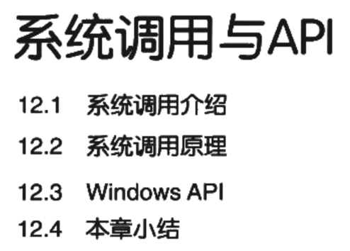


## 1. 系统调用 (system call) => 操作系统 提供的 函数API

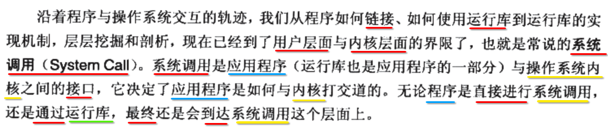


## 2. 系统调用(接口) 稳定性

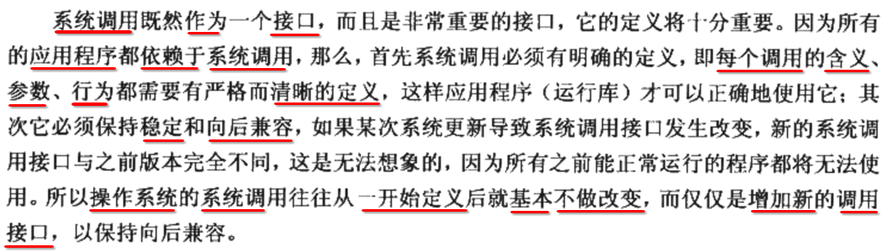


## 3. Linux 系统调用

### 1. intel x86 ==触发== 系统调用

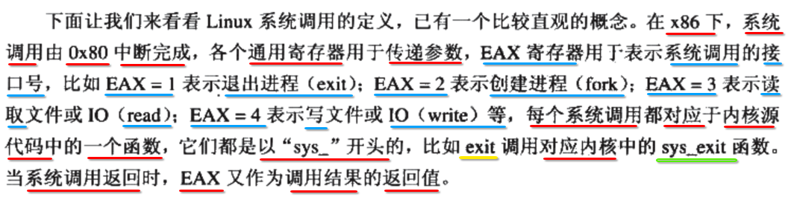

### 2. Linux 内核 2.6.19 总共 319个 系统调用

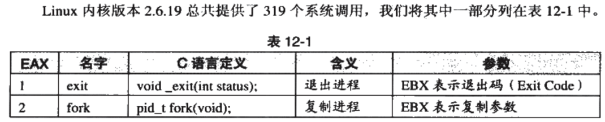

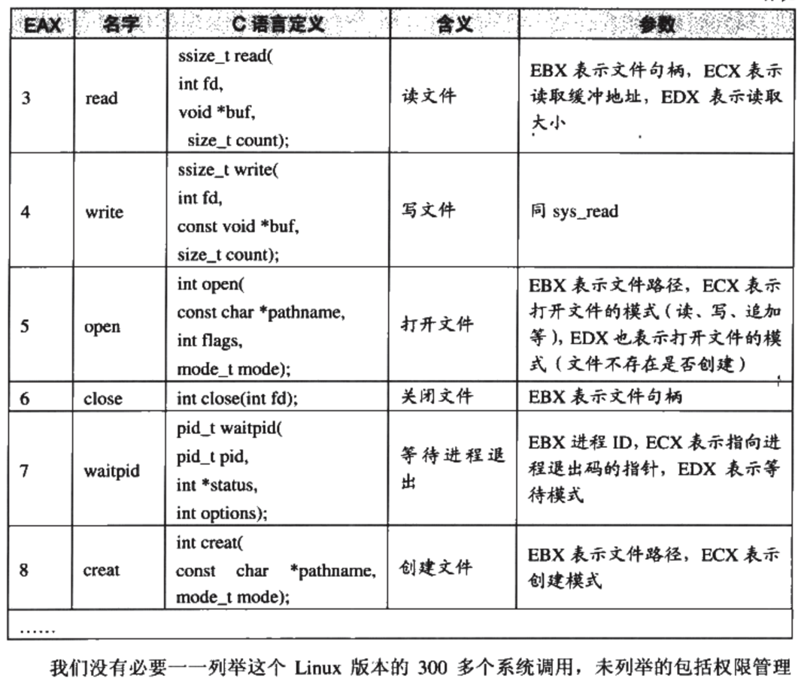

### 3. ==系统调用(ASM 函数)== 对应的 ==C函数声明== 位于 `/usr/include/unistd.h`

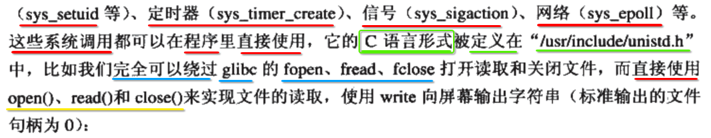

- 可以 **绕过** glibc 中实现的 C标准库函数
- 直接通过 **系统调用(系统函数)** 完成 **文件读写** 等

### 4. 绕过 glibc 的 ==文件读取==, 无法再使用 glibc 提供的 ==I/O缓冲==

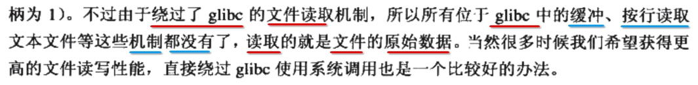

### 5. 系统调用(系统函数) 缺点

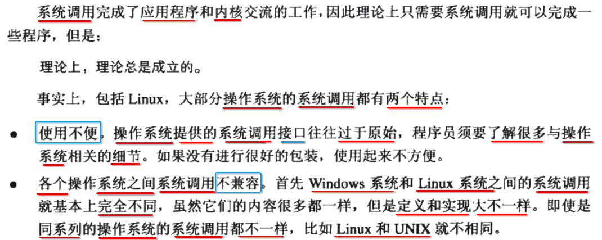

---

- 1) 操作系统提供的函数接口，都是比较 **偏底层(原始)** , 使用起来比较麻烦, 需要了解过多的 **操作系统实现细节**

- 2) **各个不同、同系列不同厂商** 之间的 **操作系统** 提供的 **系统函数** 也是 **不同** 的

### 6. 各个不同的 操作系统 按照 ==C 标准== 进行各自的 具体实现

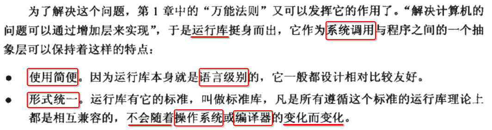

----

- 1) 各个不同的 **平台(操作系统、编译器)** 都遵守 **一个标准(C标准库声明)**

- 2) 各个 **平台** 按照 **规定** 自己 **实现** 自己的

- 3) 平台的 **使用者** 统一找到 **C标准** 进行调用

### 7. 由 ==C 标准== 屏蔽 不同系统提供的 系统函数

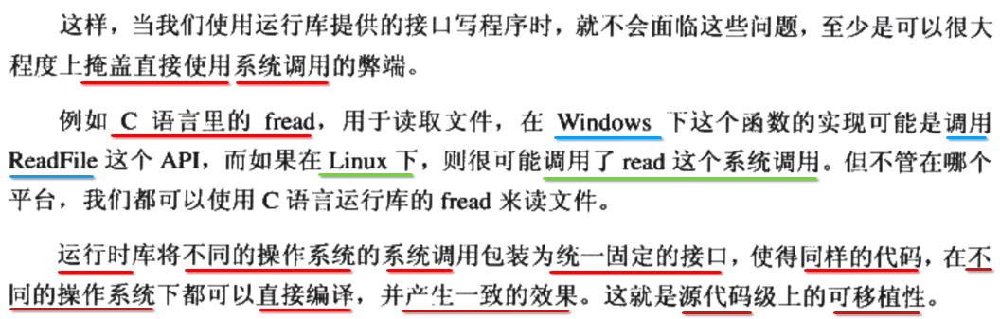

- 1) fread() 在 **windows 系统** 调用 **ReadFile()** 系统函数
- 2) fread() 在 **linux 系统** 调用 **read()** 系统函数


## 4. CPU 存在 ==多种特权级别==, 操作系统 则存在 ==2种运行模式==

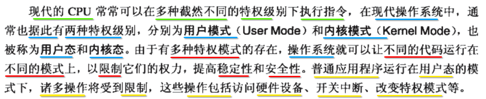

----

- 1) 首先是 **CPU 硬件** 本身存在 多种 **权限级别** , 控制 **指令** 的 **执行级别**

- 2) **操作系统** 在 **CPU 权限级别** 基础上进行 **封装** , 提供 **2种** 主要的 **代码运行模式**
  - 1) 用户 模式(态)
  - 2) 内核 模式(态)


## 5. CPU 高权级 与 低权级 互相切换原则

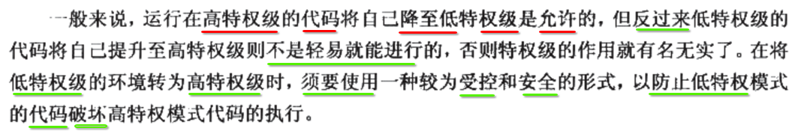


## 6. ==用户态== 代码, 通过 ==中断== 访问到 ==内核态== 代码

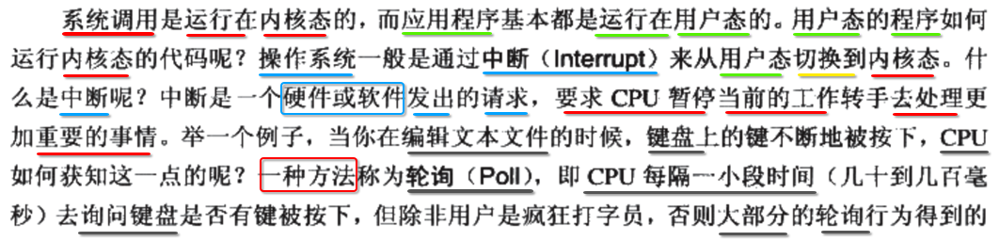

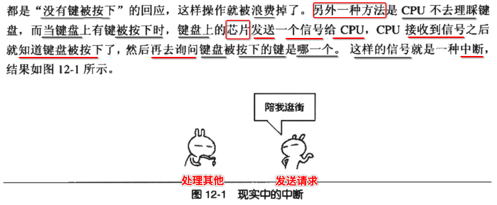

----

- 1) **系统调用(系统函数)** 运行在 **内核** 模式(态)
- 2) **用户应用程序** 运行在 **用户** 模式(态
- 3) CPU **不去轮训** 是否有事情处理
- 4) 如果 **谁(硬件或软件)** 此时突然想让 CPU 执行一段代码，则 **发出一个请求** 给 CPU
- 5) CPU **接收** 到请求
  - 1) 判断如果符合要求
  - 2) 则 **停止** 当前的一切操作 => **中断** 当前操作
  - 3) **转去** 对这个 **请求** 进行处理


## 7. CPU 中断处理过程

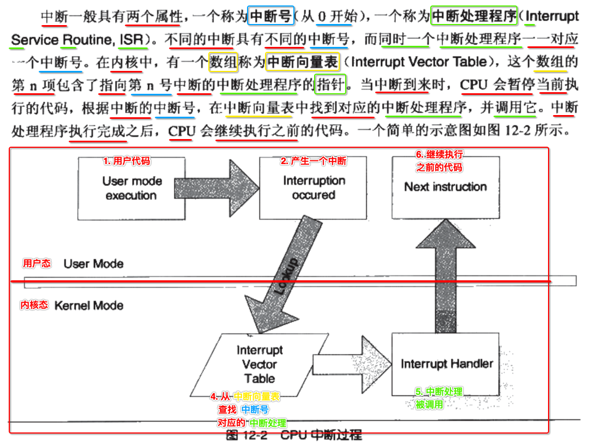

------

- 1) 中断 = 中断**号** + 中断**处理程序**

- 2) 所以产生一个 **中断** 包含2部分:
  - 1) **CPU** 中断 **号**
  - 2) 中断 **处理**

- 3) 中断 **向量表(数组)**

  | 中断号 | **指向** 中断处理的 **指针** |
  | ------ | ---------------------------- |
  | 0      | 函数指针 1                   |
  | 1      | 函数指针 2                   |
  | 2      | 函数指针 3                   |

- 4) **中断处理** 最终调用 **系统调用(操作系统提供的函数)** 具体干事情

- 5) **中断处理**  执行 **结束** 时，**继续** 执行 **之前被中断** 的代码

- 6) 一个 **中断流程** 包含:

  - 1) **系统调用**号(告诉调用哪一个 系统函数)
  - 2) **中断**号
  - 3) 中断**处理**


## 8. ==硬件==中断 vs ==软件==中断

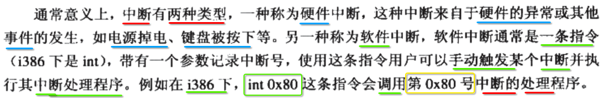


## 9. ==Linux内核==中断号 vs ==CPU硬件==中断号


## 10. ==操作系统== 能提供的 ==中断号== 很有限

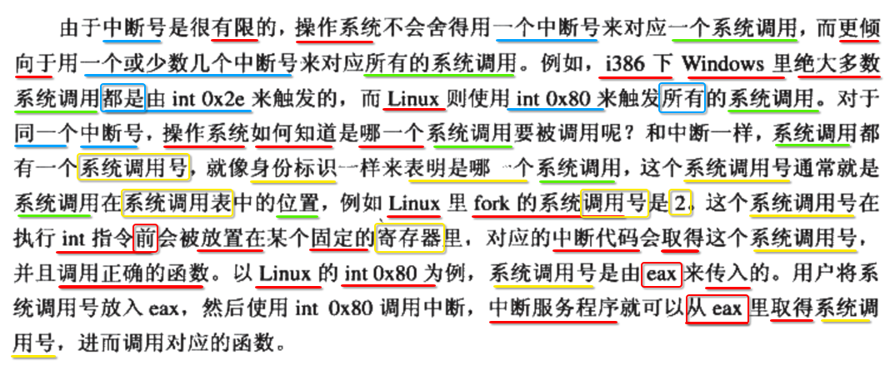

-----

- 1) **中断号** 个数是很 **有限** 的
- 2) 如果 **1个中断号** 对应 **1个系统调用(系统函数)** , 会造成 **中断号** 不够用
- 3) 更好的是 **1个中断号** 或者 **几个中断号** 对应 **所有** 的 **系统调用(系统函数)**
- 4) 但是这样情况下，对于 **同一个中断号** ，操作系统需要区分对应 **哪一个系统调用(系统函数)**
- 5) Linux i386 **int 0x80** 
  - 发出一个 **中断号 = 0x80** 的 **中断**
  - 而具体对应 **哪一个系统调用(系统函数)** 由 **eax 寄存器** 告知


## 11. Linux i386 基于 ==int== 的 ==系统调用流程== 

### 0. 整体流程图示

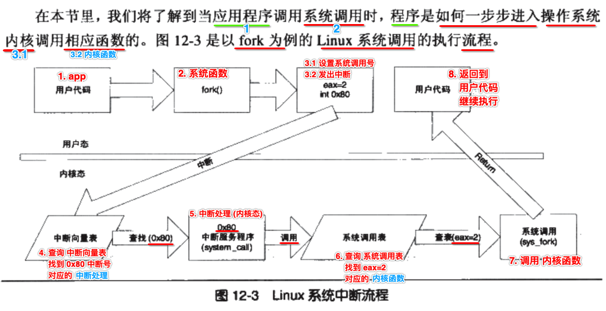

### 1. ==应用代码== 中调用 ==Linux 系统函数== fork()

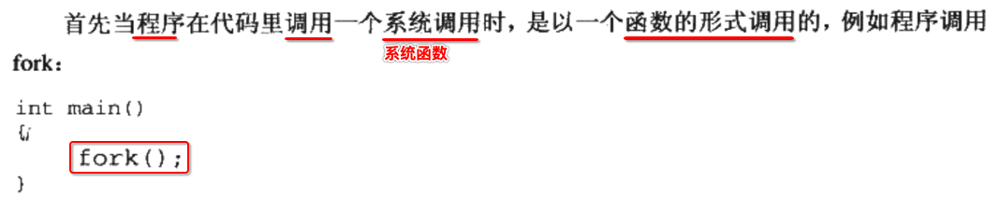

### 2. ==Linux 系统函数== fork() 是对 ==系统调用== fork 的封装

#### 1. Linux 系统函数 fork() 内部是一段 ==宏代码==

```c
pid_t
fork(void)
{
  ........
  
  _syscall0(pid_t, fork);
}
```

#### 2. `_syscall0` 宏函数 ==定义==

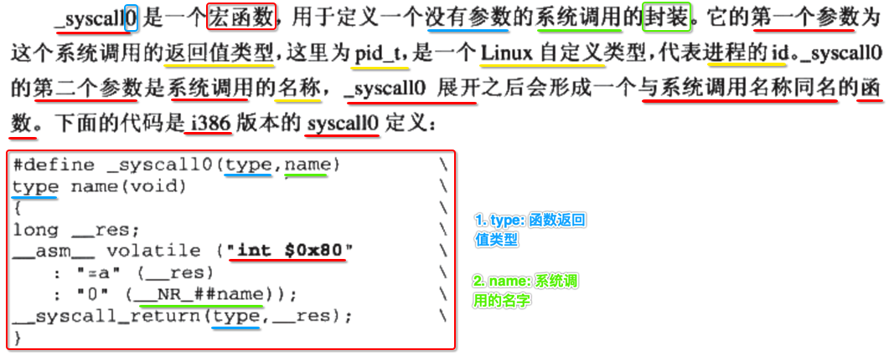

#### 3. `_syscall0(pid_t, fork)` 宏函数调用 ==展开== 结果

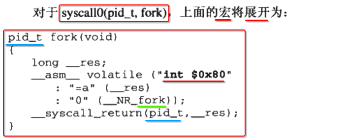

###3.  最终 ==宏展开== 后的 ==系统调用== fork 中的 ==内嵌汇编== 代码

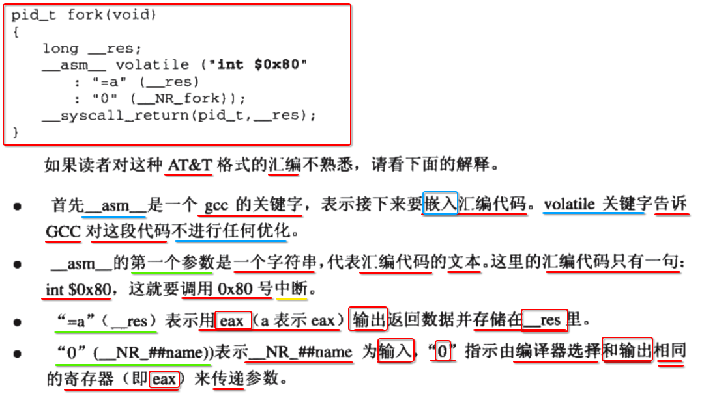

### 4. ==C 代码== 描述如上 ==内嵌汇编== 代码

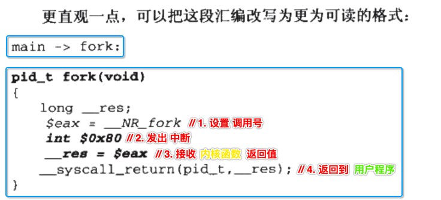

-----

- 1) 设置 **系统调用** 对应的 **号(序号)**
- 2) 发送 中断
- 3) 接收 **中断处理 -> 内核函数 -> 返回值**
- 4) 返回到 **用户程序**

### 5. `__NR_fork` 是一个 ==宏== , 表示 ==系统调用(内核函数)== 对应的 ==编号==

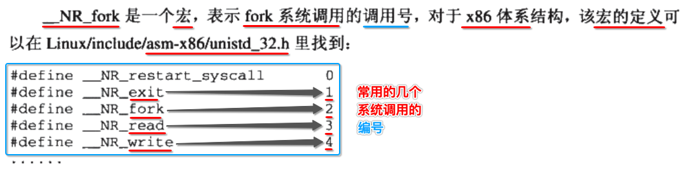

### 6. `__syscall_return` 也是一个 ==宏== , 用于 ==检查== 系统调用的 ==返回值== 是否出错

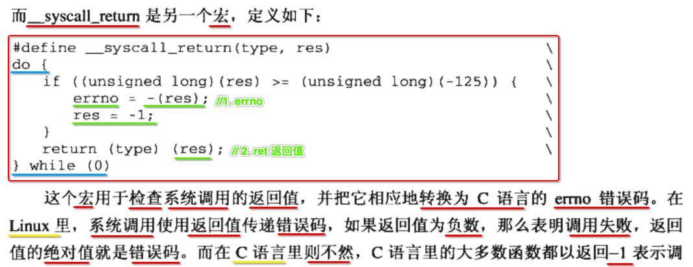

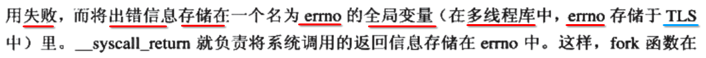

### 7. 最终 `_syscall0(pid_t, fork)` 宏函数调用 ==展开== 后的 ==系统调用== fork 在 ==汇编(gcc -S)== 后的 汇编代码

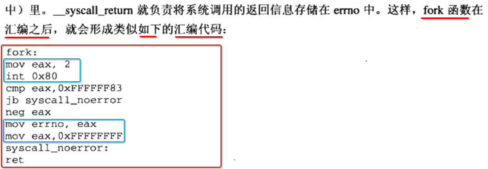

### 8. 如果 ==系统调用== 需要传递 ==1个参数== 

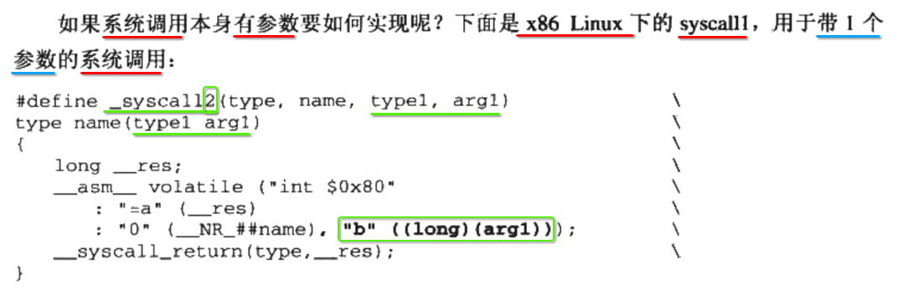

### 9. 如上 内嵌汇编 在 ==汇编(gcc -S)== 后的 汇编代码

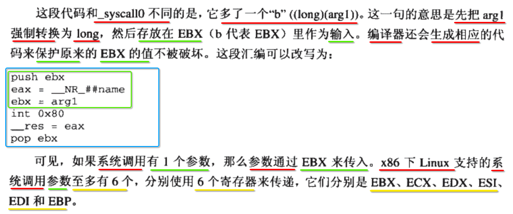

----

- 1) 对于 **系统调用** 的 **参数传递** 是通过将 **寄存器** 传递
- 2) **x86 Linux** 系统环境下，系统调用 **最多只能** 传递 **6个参数**
- 3) **6个参数** 分别通过 **EBX、ECX、EDX、ESI、EDI、EBP** 这 **6个寄存器** 传递

### 10. 一个 ==系统调用== 实际上是 ==一段汇编代码== 

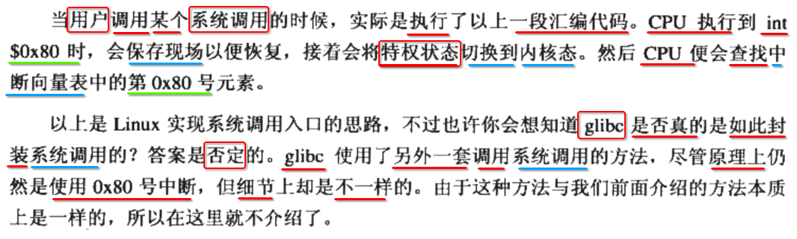

----

注意：glibc 对 **系统调用** 的封装，大体上思路相同，但是细节有些不一样。

### 11. CPU 在执行 ==int 0x80== 发送中断之前, 首先会 ==切换栈==

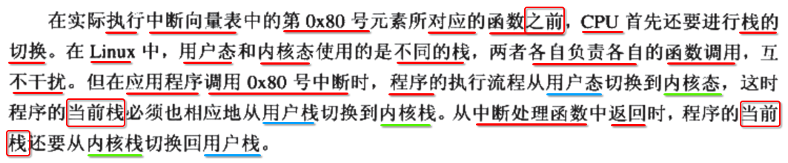

### 12. ==当前栈== => ESP 寄存器 ==指向== 的栈空间

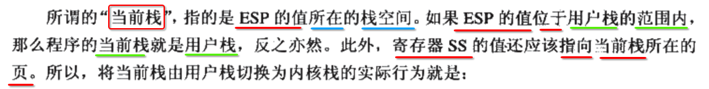

### 13. 用户栈 <=切换=> 内核栈

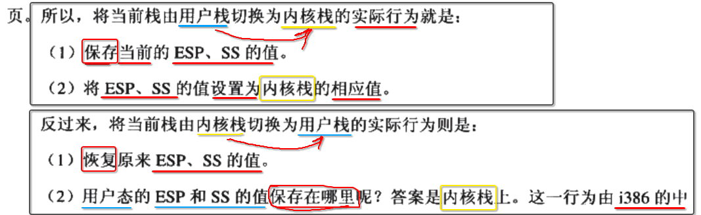


### 14. 发生 ==0x80 中断== 时, CPU 除了切换 ==内核态== 之外, 还会做的事情

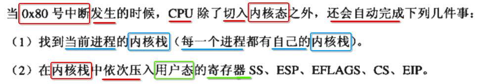

----

- 1) 找到 **当前进程** 自己的 **内核栈**
- 2) 然后将  **当前进程** 位于 **用户态** 的各种 **寄存器值** 依次 **压入** 到  **自己的 — 内核栈** 中保存
- 3) 当 中断处理完毕返回到 **用户态** 时，再取出来 **还原寄存器**

### 15. ==内核态== 处理完毕, 返回到 ==用户态== 时, 必须使用 ==ret== 指令

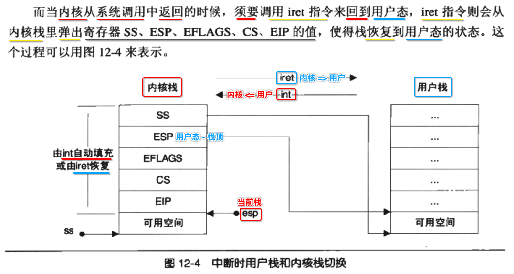

-----

- 1) 用户 => 内核
  - 1) 找到 **用户进程** 自己的 **内核栈**
  - 2) 将 **用户进程** 当前自己的 **寄存器值** 进行 **备份** (ip、cs、flags、sp、ss)
  - 3) 修改 **sp** 寄存器值 = **内核栈 — 栈顶**
  - 4) CPU **特权** 模式，切换到 **内核态** 执行 **内核函数**
- 2) 内核 => 用户
  - 1) 从 **用户进程** 自己的 **内核栈** 依次 **出栈** 还原 **用户进程** 当前自己的 **寄存器值** (ip、cs、flags、sp、ss)
  - 2) CPU **普通** 模式，切换到 **用户态** 执行之前的没执行完的代码

### 16. ==0x80 号== 对应的 ==中断处理== 被调用

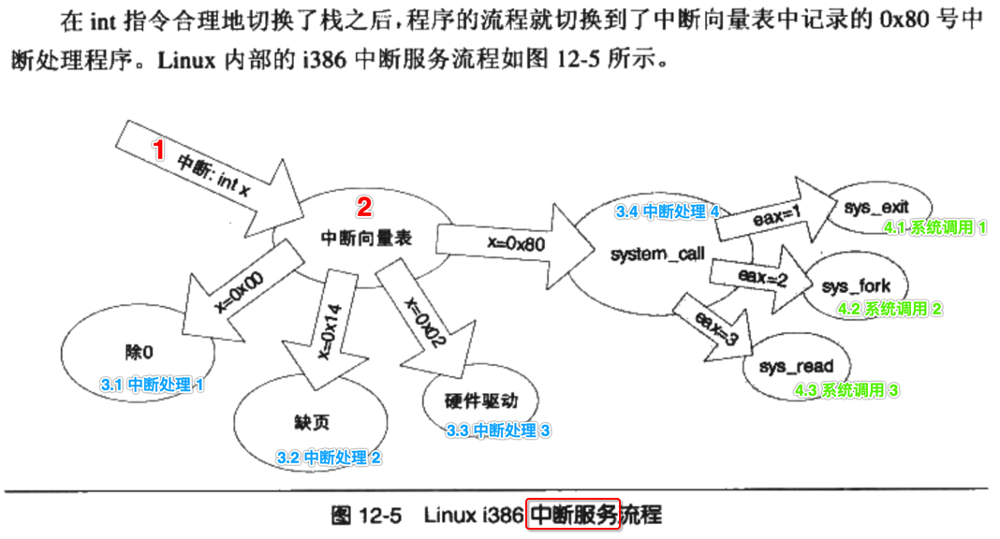

### 17. `tarp_init(void)` ==初始化== 中断向量表

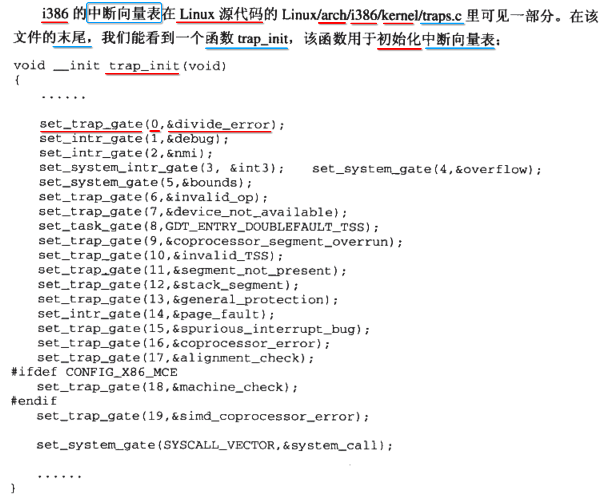

### 18. `tarp_init(void)` 中调用的各种 `set_xxx_gate(int, func_ptr)`

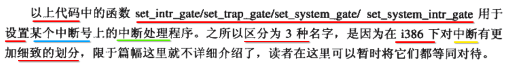

### 19. `set_system_gate(int, func_ptr)` 中设置 ==系统调用== 对应的 ==中断处理==

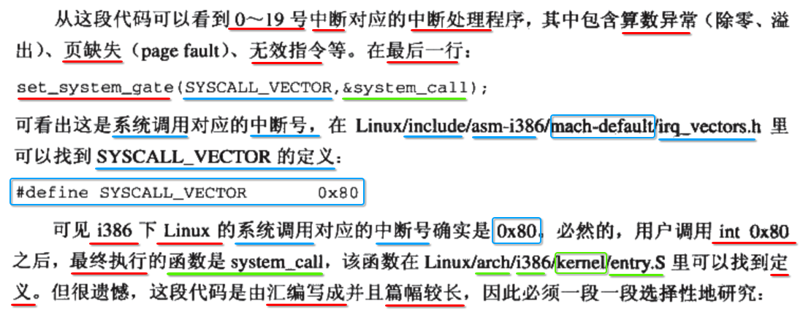

### 20. 0x80 注册的 ==`system_call` 中断处理== (汇编实现)

#### 1. system_call 开头部分代码

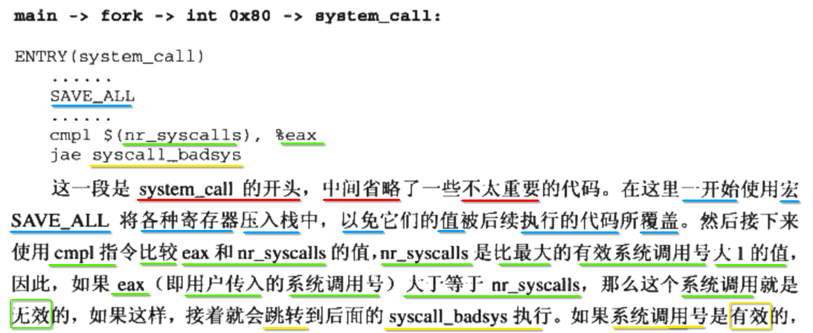

-----

- 1) 将当前 **各种寄存器值** 压栈保护
- 2) 判 **用户** 传入的 **系统调用号** 是否合法
- 3) 如果 **合法** 则跳转到 **下面代码**

#### 2. 查找 ==中断号== 对应的 ==中断处理== 并完成调用

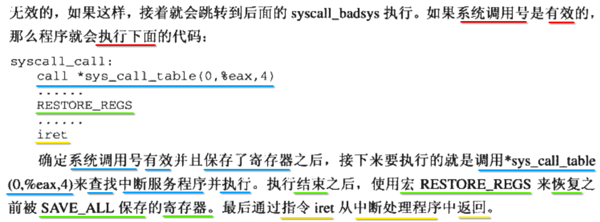

----

```asm
system_call:
  call *sys_call_table(0, %eax, 4)
  ........
```

- 1) `*sys_call_table(0, %eax, 4)` 查找 **中断号** 对应的 **中断处理**
- 2) **call** 调用 找到的 **中断处理**

#### 3. `*sys_call_table(0, %eax, 4)` 查找 ==内核函数==

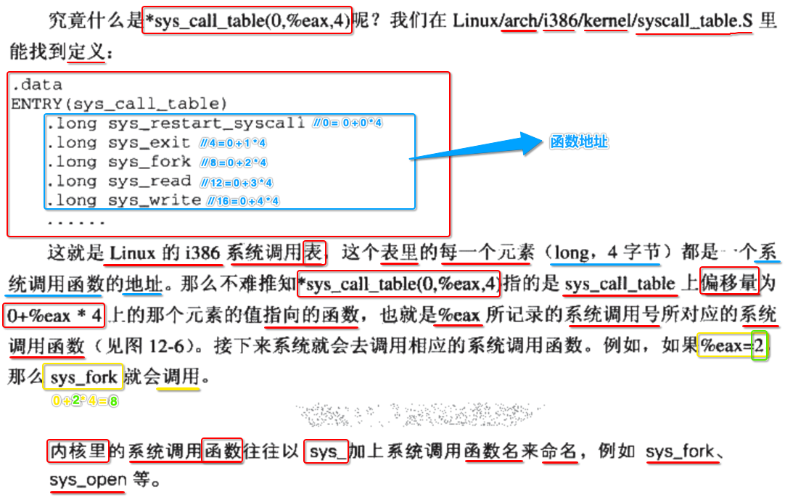

### 21. 整个调用流程

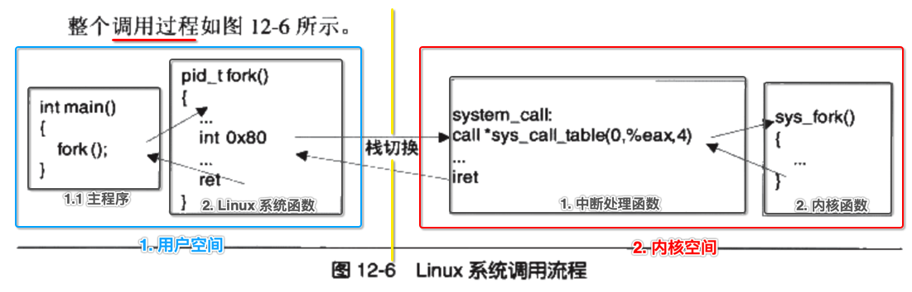

### 22. ==内核函数== 获取 ==用户传入的参数==

#### 1. 问题

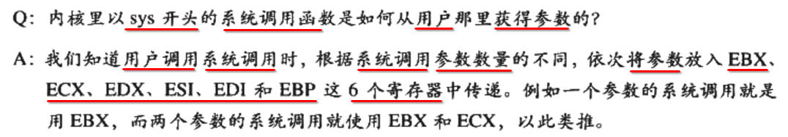

#### 2. 中断处理 system_call 中的 ==SAVE_ALL 宏==

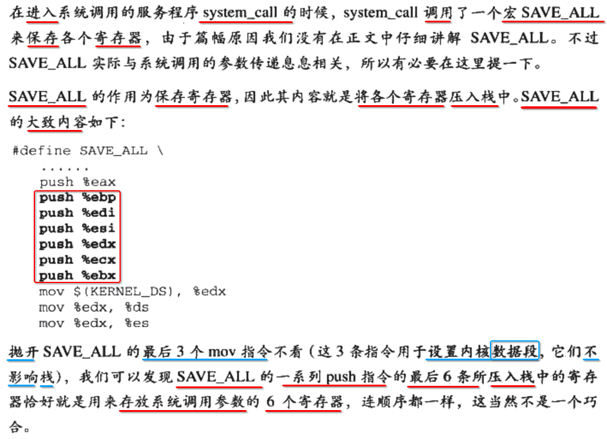

#### 3. 最终进入 ==内核函数== 是的 ==栈结构==

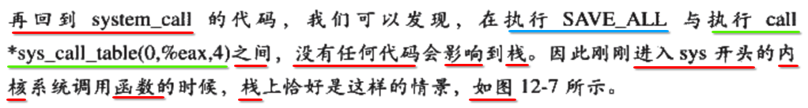


#### 4. ==SAVE_ALL 宏== 刚好将 ==参数== 依次压栈, 并提供给 ==内核函数== 使用

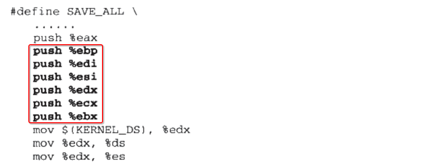

-------

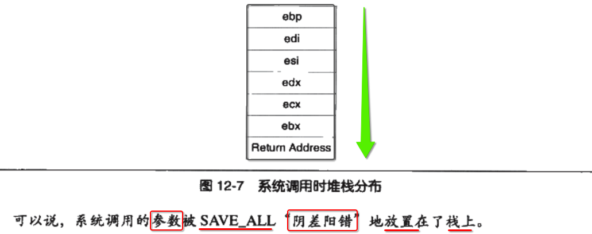

#### 5. 所有 `sys_` 开头的 ==内核函数== 都有 ==asmlinkage== 标识

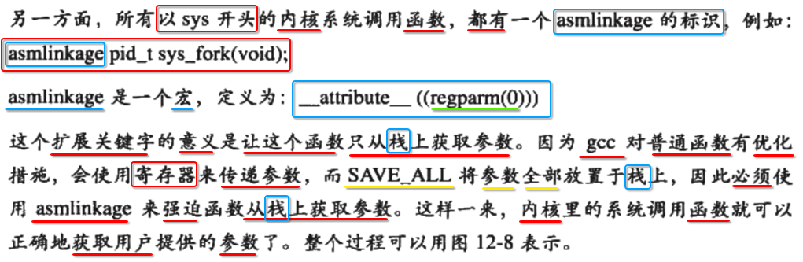

#### 6. 内核函数 获取参数 整个过程


## 12. Linux 新型 系统调用

### 1. Linux 对于 低端设备 特制的 系统调用指令


### 2. ldd a.out 共享库依赖中, 存在一个特殊的库: ==linux-gate.so.1==


### 3. ==linux-gate.so.1== 是一个 ==虚拟== 共享库 (vdso)


----

- 1) **linux-gate.so.1** 是一个 **虚拟** 共享库, **不存在** 对应的 **实际文件**
- 2) 并且 **linux-gate.so.1** 总是被加载到 **固定** 虚拟地址上
- 3) 可以通过 Linux **proc** 查看 **可执行程序** 的 **内存映像(内存布局)** 

### 4. dd 将 linux-gate.so.1 (==虚拟== 共享库) 到一个 ==实体文件==


### 5. `objdump -T` 查看 导出文件 ==Symbol Tables==


### 6. `objdump -d` 反汇编 `__kernel_vsyscall` 位置向后的 8个 字节 ==text段==


----

### 7. `__kernel_vsyscall` 函数的 汇编代码


### 8. ==新型== 系统调用 对于 ==参数传递== 与 ==int== 系统调用 ==一样==


### 9. dd 获取 内存镜像 写入到 实体文件 的原理


## 13. Linux 与 Windows 系统调用 ==差异性==


