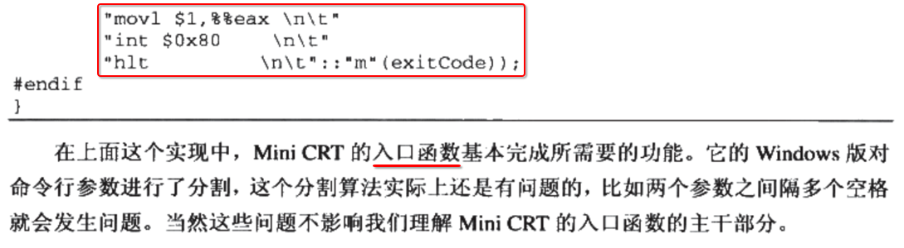
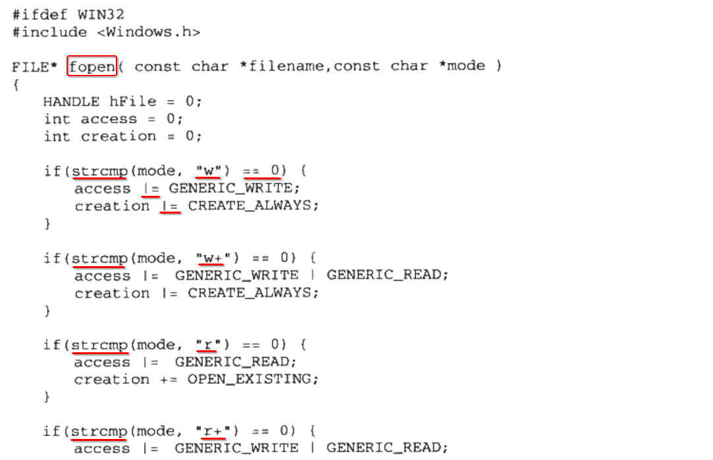
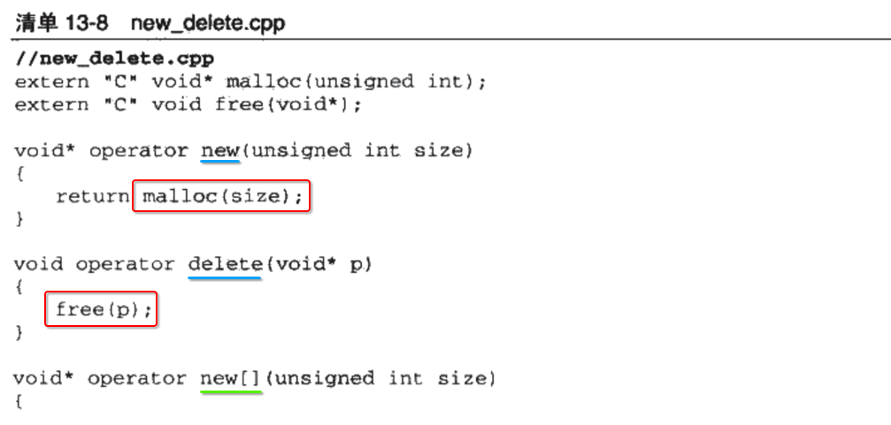
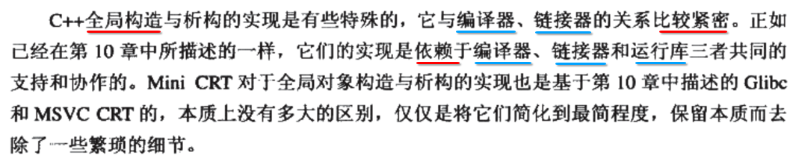

[TOC]


## List


## 1. 前言


## 2. 实现一个 mini CRT

### 1. mini CRT 基本功能


### 2. CRT 实现 ==跨平台==


### 3. CRT 不同功能的 ==头文件== 


## 3. ==入口函数== 是实现 CRT 切入点


## 4. 确定 ==入口函数== 的 ==函数原型==

### 1. 决定 函数原型的 ==原则==


### 2. 函数原型 ==设计== 如下


### 3. 入口函数 主要做 ==3件事情==


## 5. main 参数

### 1. 应用程序 ==用户入口== main() 需要 2个 参数


### 2. 进入 ==CRT== 入口函数 ==之前== 的 ==栈结构==


### 3. windows 通过专门的 ==API== 获取 ==进程== 的 ==命令行参数==


## 6. CRT 初始化 和 结束

### 1. 初始化


### 2. 结束


## 7. CRT ==入口函数== 实现





## 8. CRT ==堆== 实现

### 1. 实现原则


### 2. 堆内存分配


### 3. 具体实现

#### 1. 空闲链表


#### 2. free()


#### 3. malloc()


#### 3. 封装 系统调用 brk, 设置 ==数据段== 边界, 分配 32M 虚拟内存


#### 4. crt ==heap== init 函数


#### 5. 总结


## 9. CRT ==IO与文件== 实现

### 1. 实现原则


### 2. crt ==io== init 函数


### 3. Windows 文件操作

#### 1. fopen()




#### 2. fread()


#### 3. fwrite()


#### 4. fclose()


#### 5. fseek()


### 4. Linux 文件操作

#### 1. 系统函数: 使用 ==内嵌汇编== 封装 ==系统调用== 并 ==发送中断==

##### 1. open()


##### 2. read()


##### 3. write()


##### 4. close()


##### 5. seek()


#### 2. 标准 C 库函数

##### 1. fopen()


##### 2. fread()


##### 3. fwrite()


##### 4. fclose()


##### 5. fseek()


### 3. FILE、EOF


### 4. 三个标准输入与输出: 默认给每一个进程打开3个文件


### 5. 小结


## 10. CRT ==字符串== 实现

### 1. 前言


### 2. 只涉及 ==计算== 的部分函数

- 1) itoa
- 2) strcmp
- 3) strcpy
- 4) strlen

不涉及任何 **内核** 交互，只是 **计算** 性质的代码，就不贴了。

### 3. 与 ==输出== 相关的函数

#### 1. fputc(), fputs()


## 11. ==使用== C 语言 CRT

### 1. CRT 两部分 组成


### 2. CRT ==头文件==


### 3. ==编译== CRT 所有源文件, 生成 ==静态库== 文件

#### 1. GCC 编译命令


----

- 1) **entry.o** 只是 **编译**
- 2) 并 **不参与** ar 归档生成 **crt.a** 静态库
- 3) **entry.o** 单独提供给 **用户程序** 链接

#### 2. 参数 解释


#### 3. Windows 下编译


### 4. 编写 main.c ==静态链接== CRT 静态库 文件


## 12. ==C++== 语言 CRT

### 1. ==C++ 运行库== 通常是 ==独立== 于 ==C 运行库==


### 2. 简单起见, 直接将 ==C++ 运行库== 实现部分与 ==C 运行库== 合并到一起


### 3. 简单实现支持运行如下 C++ 代码


### 4. 如上 C++ 代码用到的 C++ 特性

- 1) C++ **String** 类的实现
- 2) C++ **Stream** 类的实现
- 3) C++ **全局对象** 的 **构造** 和 **析构**
- 4) C++ 堆区内存管理 **new/delete**

### 5. 必须由 ==编译器== 实现的 C++ 特性

- 1) C++ **全局对象** 的 **构造** 和 **析构**
- 2) C++ **template 模板** 编程技术

### 6. main.cpp

```c++
#include <iostream>

class Person
{};

int main()
{
	Person* p = new Person;
	return 0;
}
```

### 7. main.o

```
g++ -c main.cpp -o main.o
```

### 8. objdump -dr main.o


```
xzh@xzh-VirtualBox:~/src$ objdump -dr main.o

main.o:     file format elf64-x86-64


Disassembly of section .text:

0000000000000000 <main>:
   0:	55                   	push   %rbp
   1:	48 89 e5             	mov    %rsp,%rbp
   4:	48 83 ec 10          	sub    $0x10,%rsp
   8:	bf 01 00 00 00       	mov    $0x1,%edi
   d:	e8 00 00 00 00       	callq  12 <main+0x12>
   e:                       R_X86_64_PLT32	_Znwm-0x4
  12:	48 89 45 f8          	mov    %rax,-0x8(%rbp)
  16:	b8 00 00 00 00       	mov    $0x0,%eax
  1b:	c9                   	leaveq
  1c:	c3                   	retq

000000000000001d <_Z41__static_initialization_and_destruction_0ii>:
  1d:	55                   	push   %rbp
  1e:	48 89 e5             	mov    %rsp,%rbp
  21:	48 83 ec 10          	sub    $0x10,%rsp
  25:	89 7d fc             	mov    %edi,-0x4(%rbp)
  28:	89 75 f8             	mov    %esi,-0x8(%rbp)
  2b:	83 7d fc 01          	cmpl   $0x1,-0x4(%rbp)
  2f:	75 32                	jne    63 <_Z41__static_initialization_and_destruction_0ii+0x46>
  31:	81 7d f8 ff ff 00 00 	cmpl   $0xffff,-0x8(%rbp)
  38:	75 29                	jne    63 <_Z41__static_initialization_and_destruction_0ii+0x46>
  3a:	48 8d 3d 00 00 00 00 	lea    0x0(%rip),%rdi        # 41 <_Z41__static_initialization_and_destruction_0ii+0x24>
			3d: R_X86_64_PC32	.bss-0x4
  41:	e8 00 00 00 00       	callq  46 <_Z41__static_initialization_and_destruction_0ii+0x29>
			42: R_X86_64_PLT32	_ZNSt8ios_base4InitC1Ev-0x4
  46:	48 8d 15 00 00 00 00 	lea    0x0(%rip),%rdx        # 4d <_Z41__static_initialization_and_destruction_0ii+0x30>
			49: R_X86_64_PC32	__dso_handle-0x4
  4d:	48 8d 35 00 00 00 00 	lea    0x0(%rip),%rsi        # 54 <_Z41__static_initialization_and_destruction_0ii+0x37>
			50: R_X86_64_PC32	.bss-0x4
  54:	48 8b 05 00 00 00 00 	mov    0x0(%rip),%rax        # 5b <_Z41__static_initialization_and_destruction_0ii+0x3e>
			57: R_X86_64_REX_GOTPCRELX	_ZNSt8ios_base4InitD1Ev-0x4
  5b:	48 89 c7             	mov    %rax,%rdi
  5e:	e8 00 00 00 00       	callq  63 <_Z41__static_initialization_and_destruction_0ii+0x46>
			5f: R_X86_64_PLT32	__cxa_atexit-0x4
  63:	90                   	nop
  64:	c9                   	leaveq
  65:	c3                   	retq

0000000000000066 <_GLOBAL__sub_I_main>:
  66:	55                   	push   %rbp
  67:	48 89 e5             	mov    %rsp,%rbp
  6a:	be ff ff 00 00       	mov    $0xffff,%esi
  6f:	bf 01 00 00 00       	mov    $0x1,%edi
  74:	e8 a4 ff ff ff       	callq  1d <_Z41__static_initialization_and_destruction_0ii>
  79:	5d                   	pop    %rbp
  7a:	c3                   	retq
```

### 9. 反汇编 main 符号中的关键的一句指令

```
R_X86_64_PLT32	_Znwm-0x4
```

其中的 `_Znwm`

### 10. 使用 gcc 提供的 c++filt 反修饰(demangle) `_Znwm` 函数符号

```
xzh@xzh-VirtualBox:~/src$ c++filt _Znwm
operator new(unsigned long)
```

`_Znwm` 函数符号, 实际上是一个叫做 **operator new(unsigned long)** 的函数.


### 11. 实现 C++ ==operator new/delete 运算符函数== 




------

- 1) 都是 **全局** 的 **C 函数**

- 2) **单个** C++ 对象

  ```c++
  void* operator new(unsigned int size);
  void operator delete(void* p);
  ```

- 3) **数组** C++ 对象

  ```c++
  void* operator new[](unsigned int size);
  void operator delete[](void* p);
  ```

- 4) 实际上最终都是调用 **C 运行库** 中的 **malloc()/free()** 库函数

### 12. new/delete 不负责 ==构造== 和 ==析构==


### 13. C++ 全局对象 ==构造== 实现

#### 1. 依赖于 编译器、链接器、运行库 三者的合作



#### 2. Windows、Linux 各自 ==编译器== 生成的 ==section==


#### 3. Windows、Linux 各自 ==运行库== 提供的 ==目标文件==


#### 4. ctors.cpp 具体实现


----

- 1) Windows : 在 ctors.cpp 内实现, **调用** Windows 运行库 中的函数
- 2) Linux : 直接调用 **glibc** 提供的 **crtbegin.o 和 crtend.o** 两个目标文件中的函数

#### 5. Linux 下的 ctors.cpp 实现, 必须依赖 glibc 提供的 crtbegin.o 和 crtend.o

> 下面是模拟实现 glibc 中的 crtbegin.o 和 crtend.o

##### 1. crtbegin.o (crtbegin.cpp)


##### 2. crtend.o (crtend.cpp)


#### 6. 小结

- 1) 借助 Linux/Windows **编译器** 生成的 **文件格式** 中的 **section(段)** 特性
- 2) 将负责完成 C++ 全局对象 **构造** 的 **函数指针** 写入到 **section(段)** 特性
- 3) 然后在运行时 **逐个遍历** 然后进行 **调用** 完成构造

### 14. C++ 全局对象 ==析构== 实现

#### 1. 存储调用 atexit() 注册的析构函数指针的 ==链表==


#### 2. register_atexit()


#### 3. Windows: atexit()


#### 4. Linux: `__cxa_atexit()`


-----


#### 5. 负责 ==调用 register_atexit()== 注册的回调函数


#### 6. 修改 ==CRT 入口函数== 添加对 ==构造== 和 ==析构== 的调用


### 15. 编译生成 C++ CRT 静态库


### 16. main.c 链接 C++ CRT 静态库


