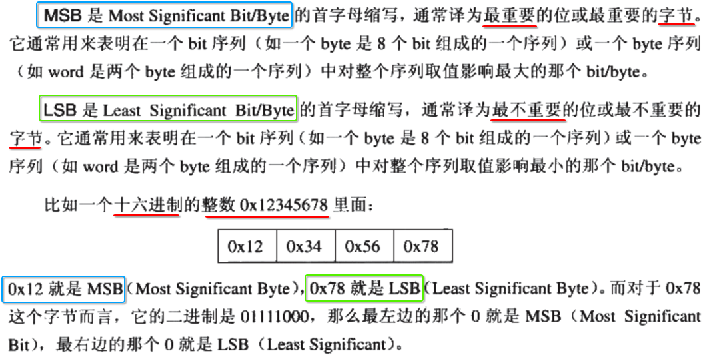
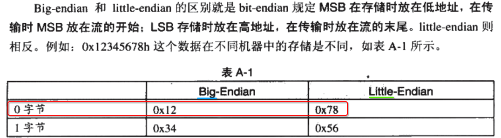
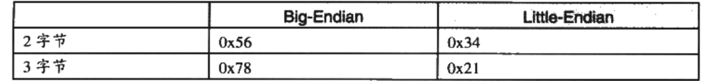
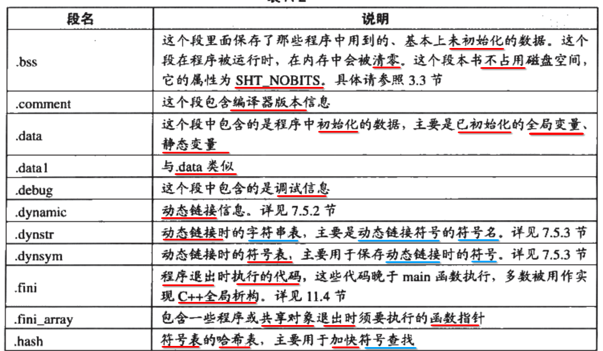
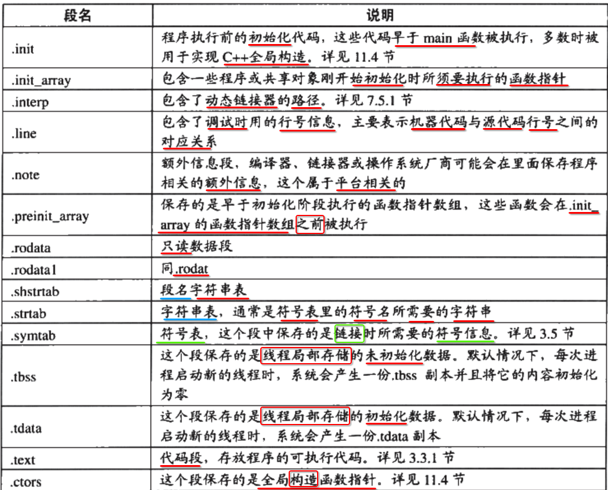
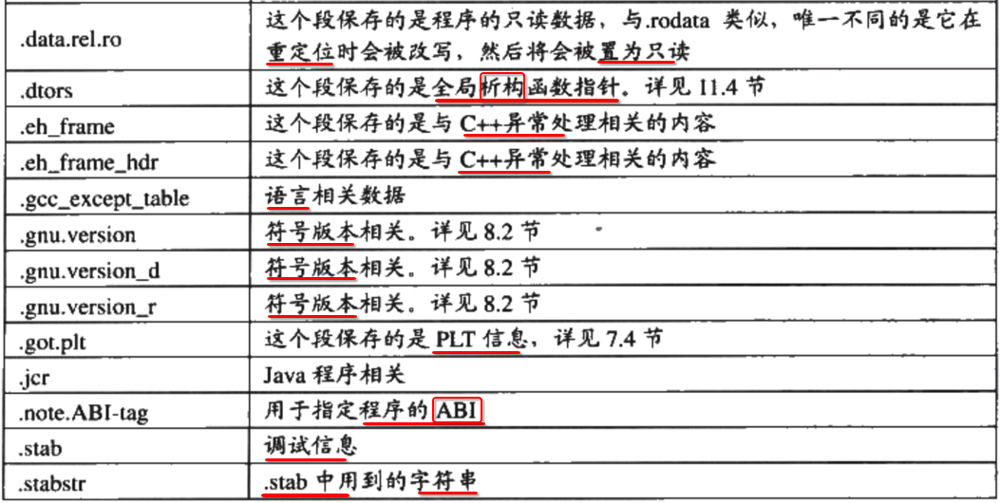
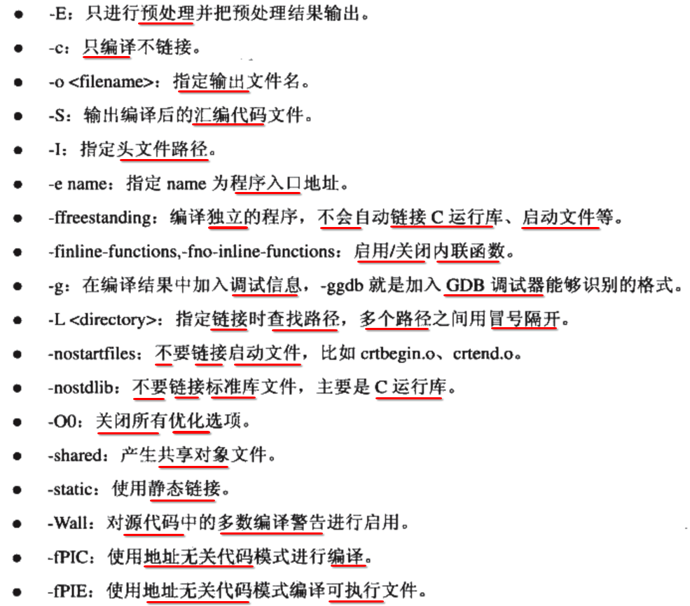
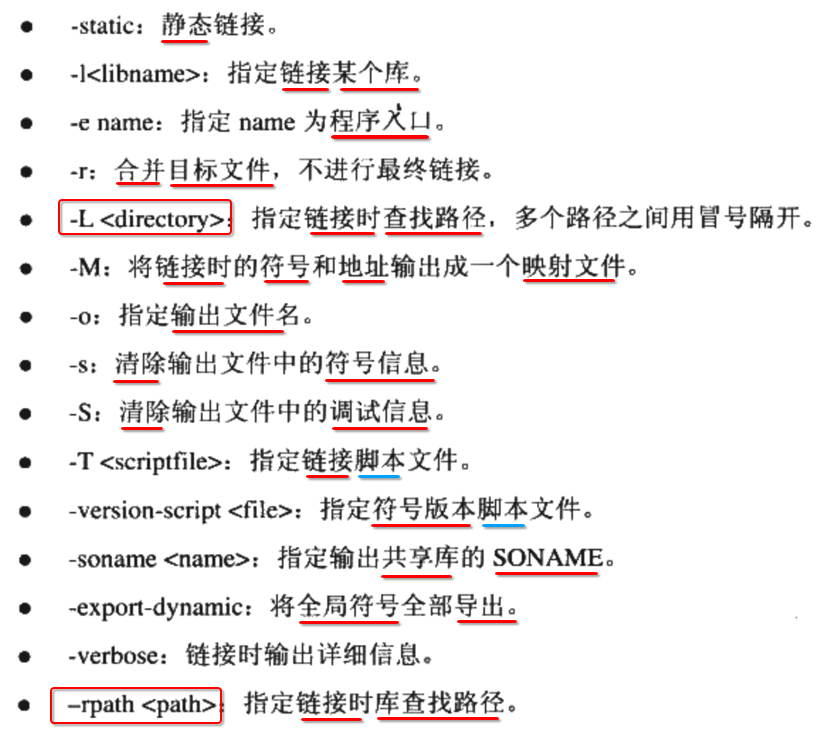
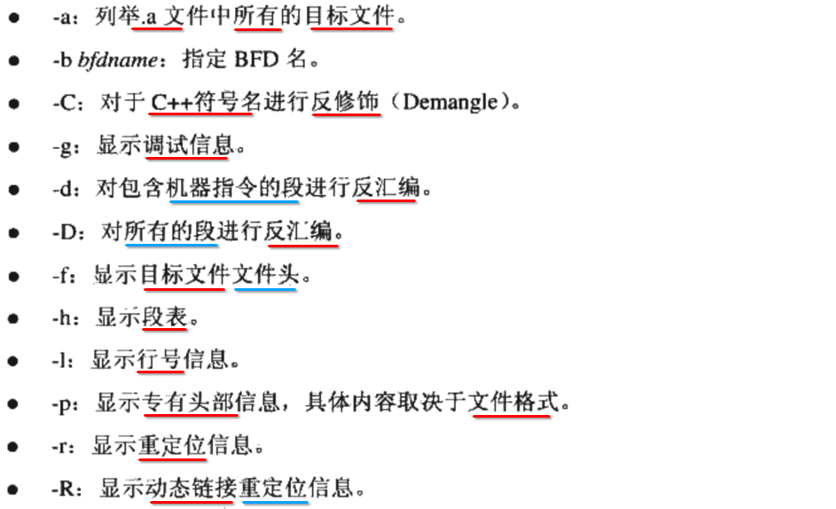
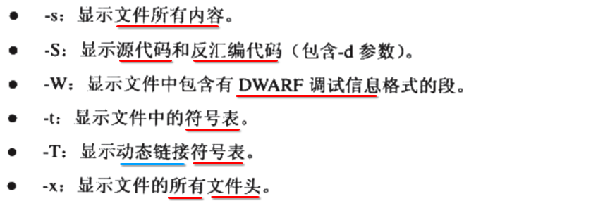

[TOC]

## 1. 字节序

### 1. MSB 与 LSB

### 2. 大端 与 小端 存储的区别

---

**小端**存储: **低位(LSB)** 存储在 **低位**

## 2. elf 常见 section 作用

## 3. GCC ==编译== 选项

## 4. GCC ==链接== 选项

## 5. objdump : GNU 目标文件 查看器

