[TOC]


## List

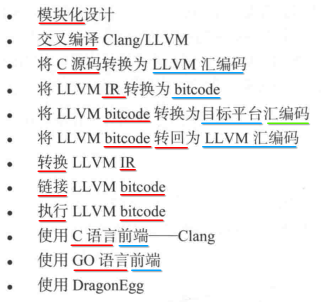


## 1. LLVM 模块化设计目标: 成为一系列的 ==库==

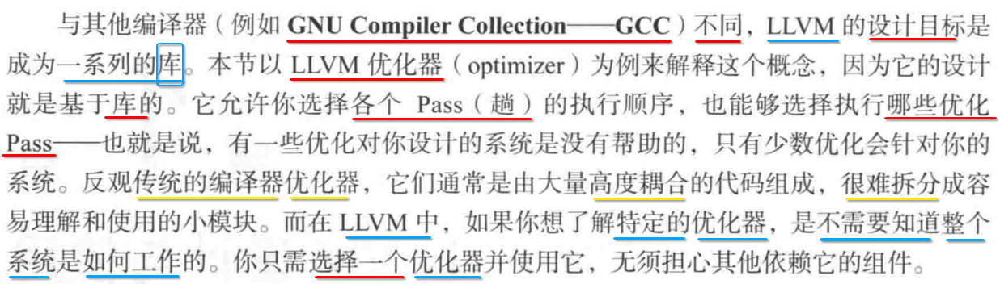


## 2. LLVM 代码的 ==三种== 表现形式

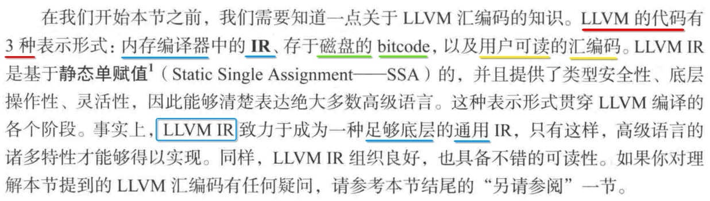

---

| 代码存储的位置 | 代码名称   |
| ------------ | --------- |
| 内存编译器 | LLVM **IR** |
| 磁盘文件  | LLVM **bitcode** |
| 磁盘文件  | 用户可读 **汇编** |


## 3. LLVM ==优化器== 体验

### 1. main.ll

```c
define i32 @test1(i32 %A)
{
  %B = add i32 %A, 0
  ret i32 %B
}

define internal i32 @test2(i32 %X, i32 %dead)
{
  ret i32 %X
}

define i32 @caller()
{
  %A = call i32 @test2(i32 123, i32 456)
  ret i32 %A
}
```

### 2. 优化1: ==合并== 指令

#### 1. opt 命令

```
opt -S -instcombine main.ll -o output1.ll
```

#### 2. 优化后的 output1.ll

```c
; ModuleID = 'main.ll'
source_filename = "main.ll"

define i32 @test1(i32 %A) {
  ret i32 %A
}

define internal i32 @test2(i32 %X, i32 %dead) {
  ret i32 %X
}

define i32 @caller() {
  %A = call i32 @test2(i32 123, i32 456)
  ret i32 %A
}
```

#### 3. 对比合并前后的 @test1()

合并前

```c
define i32 @test1(i32 %A)
{
  %B = add i32 %A, 0
  ret i32 %B
}
```

合并后

```c
define i32 @test1(i32 %A) {
  ret i32 %A
}
```

优化比较大.

#### 4. 对比合并前后的 @test2()

合并前

```c
define internal i32 @test2(i32 %X, i32 %dead)
{
  ret i32 %X
}
```

合并后

```c
define internal i32 @test2(i32 %X, i32 %dead) {
  ret i32 %X
}
```

没变化.

#### 5. 对比合并前后的 @caller()

合并前

```c
define i32 @caller()
{
  %A = call i32 @test2(i32 123, i32 456)
  ret i32 %A
}
```

合并后

```c
define i32 @caller() {
  %A = call i32 @test2(i32 123, i32 456)
  ret i32 %A
}
```

### 3. 优化2: ==消除无用== 参数

#### 1. opt 命令

```
opt -S -deadargelim main.ll -o output2.ll
```

#### 2. 优化后的 output2.ll

```c
; ModuleID = 'main.ll'
source_filename = "main.ll"

define i32 @test1(i32 %A) {
  %B = add i32 %A, 0
  ret i32 %B
}

define internal i32 @test2(i32 %X) {
  ret i32 %X
}

define i32 @caller() {
  %A = call i32 @test2(i32 123)
  ret i32 %A
}
```

#### 3. 对比合并前后的 @test1()

优化前

```c
define i32 @test1(i32 %A)
{
  %B = add i32 %A, 0
  ret i32 %B
}
```

优化后

```c
define i32 @test1(i32 %A) {
  %B = add i32 %A, 0
  ret i32 %B
}
```

没变化.

#### 4. 对比合并前后的 @test2()

优化前

```c
define internal i32 @test2(i32 %X, i32 %dead)
{
  ret i32 %X
}
```

优化后

```c
define internal i32 @test2(i32 %X) {
  ret i32 %X
}
```

其中的 **i32 %dead** 未使用参数，已经被优化掉了.

#### 5. 对比合并前后的 @caller()

优化前

```c
define i32 @caller()
{
  %A = call i32 @test2(i32 123, i32 456)
  ret i32 %A
}
```

优化后

```c
define i32 @caller() {
  %A = call i32 @test2(i32 123)
  ret i32 %A
}
```

直接在 **调用** 函数时，就已经优化掉 **无用的参数** 了.

### 4. 如上的两个优化, 分别对应两个 LLVM Pass

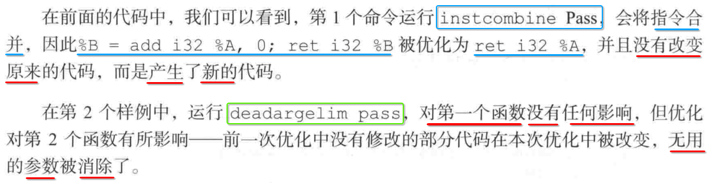

### 5. LLVM 提供很多这样的 Pass 优化项

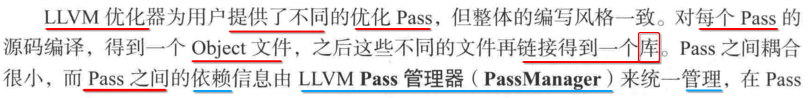

### 6. PassManager 统一管理所有的 Pass

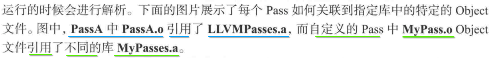

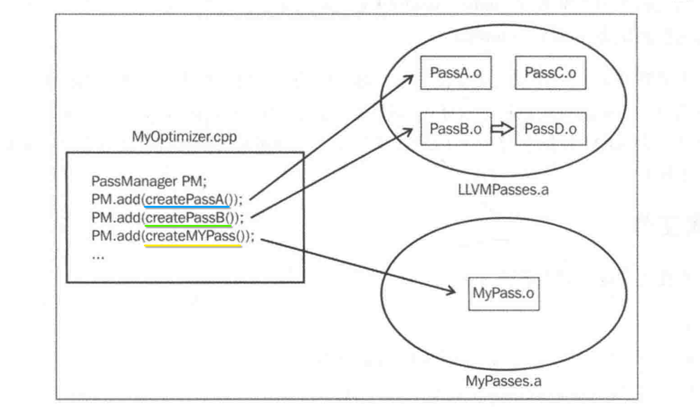


## 7. 交叉编译 clang/LLVM

### 1. 何为 ==交叉编译==

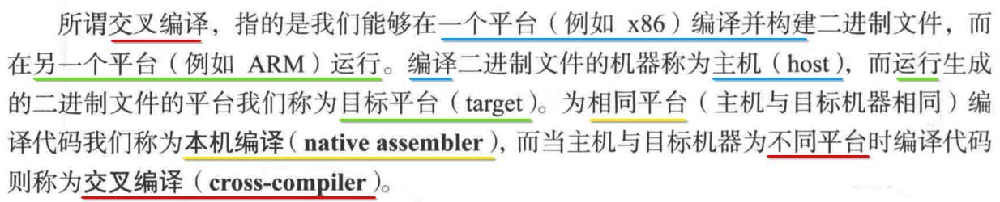

----

- 1) **交叉** 编译: A平台构建, **B** 平台运行
  - 1) **编译** 方: 主机 (host)
  - 2) **运行** 方: 目标级 (target)

- 2) **本机** 编译: A平台构建, **A** 平台运行

### 2. 在本地(x86_64 平台) 下, 构建能够在 ==ARM 平台== 运行的二进制文件

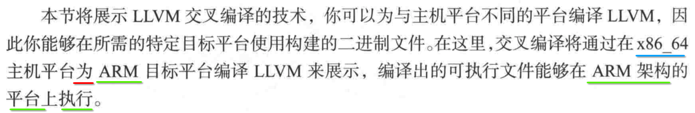

### 3. 准备工作

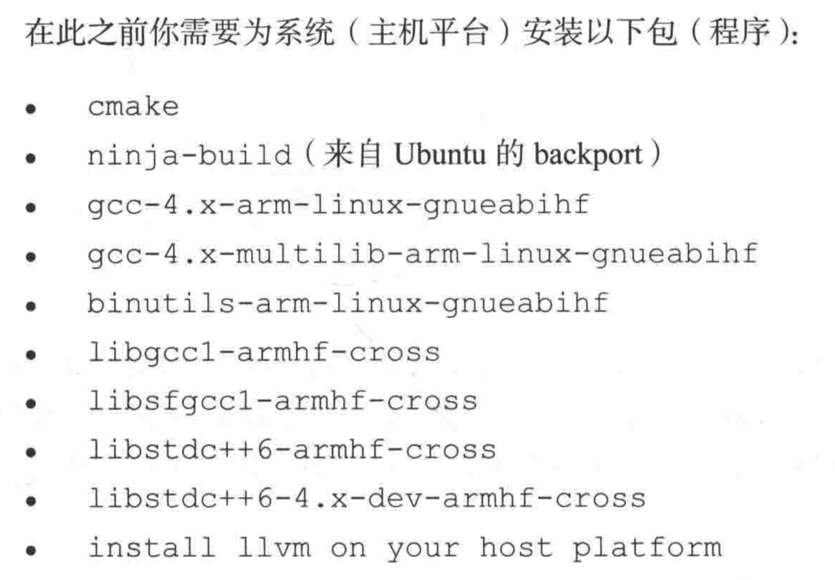

### 4. 指定构建 LLVM 源码的 ==方式==

#### 1. cmake

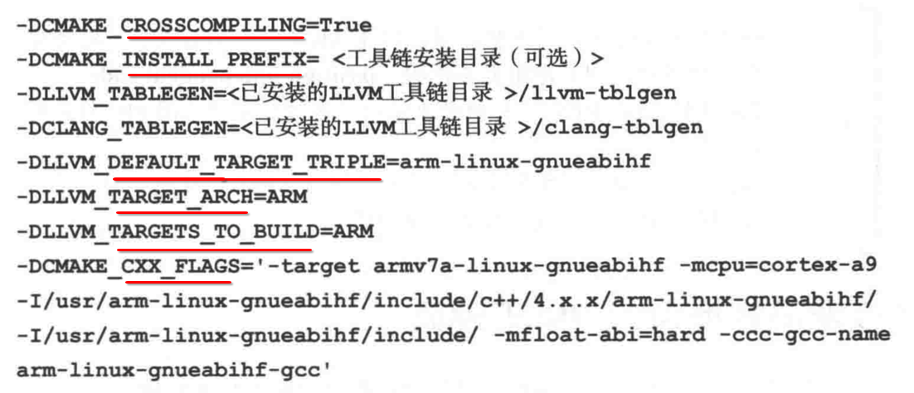

#### 2. 本地安装的编译器

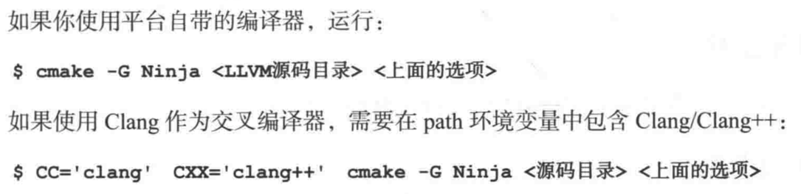

### 5. 编译

```
ninja
```

### 6. 安装编译后的产物

```
ninja install
```

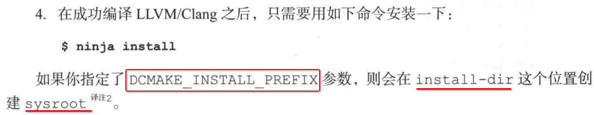


## 8. C 代码 => clang 前端 => LLVM IR (中间 汇编码)

### 1.

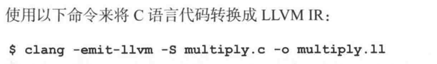

### 2.

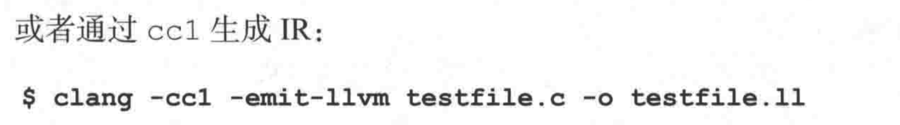

### 3. 转换后的 LLVM IR 

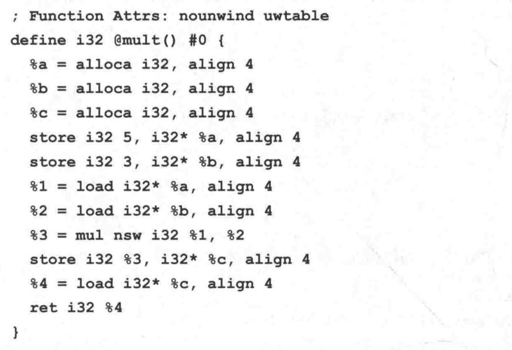

### 4. 经历的过程

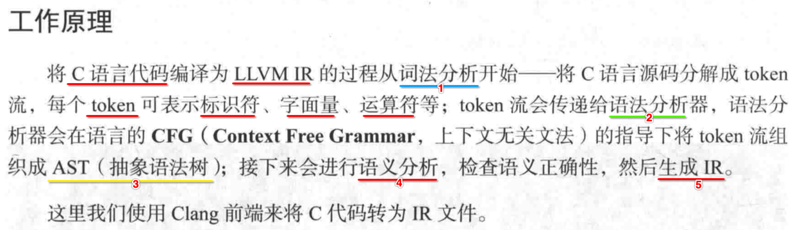

---

- 1) 词法分析
- 2) 语法分析
- 3) AST 
- 4) 语义分析
- 5) IR


## 9. LLVM IR => llvm-as (汇编器) => LLVM bitcode (中间 二进制码)

### 1. bitcode (字节码 -- byte code) 两部分组成

- 1) 位流 (bitstream 类似 **字节流**)
- 2) 编码格式

### 2. 通过 llvm-as 将 IR 转换为 bitcode

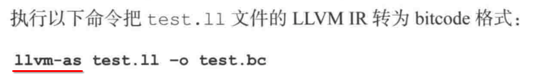

----

```
llvm-as main.ll -o output.bc
```

### 3. 因为 bitcode 是二进制, 通过 ==文本== 模式查看是 ==乱码==

```
 ~/Desktop/main  cat output.bc
BC��5b
      0$IY����~-D2!
                   �
                    !�#�A�I29��
                               �b�EB�
                                     B�2K
2"�H� CF d�"��"ㄡ�L����!F�

............................................................
```


### 4. 使用 hexdump 查看 bitcode 文件

```
 ~/Desktop/main  hexdump -C output.bc
00000000  42 43 c0 de 35 14 00 00  05 00 00 00 62 0c 30 24  |BC..5.......b.0$|
00000010  49 59 be e6 ee d3 7e 2d  44 01 32 05 00 00 00 00  |IY....~-D.2.....|
00000020  21 0c 00 00 ea 00 00 00  0b 02 21 00 02 00 00 00  |!.........!.....|
00000030  13 00 00 00 07 81 23 91  41 c8 04 49 06 10 32 39  |......#.A..I..29|
00000040  92 01 84 0c 25 05 08 19  1e 04 8b 62 80 10 45 02  |....%......b..E.|
00000050  42 92 0b 42 84 10 32 14  38 08 18 4b 0a 32 42 88  |B..B..2.8..K.2B.|
00000060  48 90 14 20 43 46 88 a5  00 19 32 42 04 49 0e 90  |H.. CF....2B.I..|
00000070  11 22 c4 50 41 51 81 8c  e1 83 e5 8a 04 21 46 06  |.".PAQ.......!F.|
00000080  89 20 00 00 0d 00 00 00  32 22 08 09 20 64 85 04  |. ......2".. d..|
00000090  13 22 a4 84 04 13 22 e3  84 a1 90 14 12 4c 88 8c  |."...."......L..|
000000a0  0b 84 84 4c 10 24 73 04  60 50 04 00 8a 32 00 00  |...L.$s.`P...2..|
000000b0  4d 09 80 6a 20 60 04 00  00 00 00 00 1a 21 0c 79  |M..j `.......!.y|
000000c0  30 00 d2 f8 cb 32 44 02  8a 00 00 00 00 00 00 00  |0....2D.........|
000000d0  00 00 00 00 80 21 52 51  0c 00 30 00 00 00 00 00  |.....!RQ..0.....|
000000e0  00 00 00 10 0c 91 14 a3  00 00 00 00 00 00 00 00  |................|
000000f0  00 00 00 40 62 83 40 d1  76 00 00 80 58 0c 00 00  |...@b.@.v...X...|
00000100  74 00 00 00 33 08 80 1c  c4 e1 1c 66 14 01 3d 88  |t...3......f..=.|
00000110  43 38 84 c3 8c 42 80 07  79 78 07 73 98 71 0c e6  |C8...B..yx.s.q..|
00000120  00 0f ed 10 0e f4 80 0e  33 0c 42 1e c2 c1 1d ce  |........3.B.....|
00000130  a1 1c 66 30 05 3d 88 43  38 84 83 1b cc 03 3d c8  |..f0.=.C8.....=.|
00000140  43 3d 8c 03 3d cc 78 8c  74 70 07 7b 08 07 79 48  |C=..=.x.tp.{..yH|
00000150  87 70 70 07 7a 70 03 76  78 87 70 20 87 19 cc 11  |.pp.zp.vx.p ....|
00000160  0e ec 90 0e e1 30 0f 6e  30 0f e3 f0 0e f0 50 0e  |.....0.n0.....P.|
00000170  33 10 c4 1d de 21 1c d8  21 1d c2 61 1e 66 30 89  |3....!..!..a.f0.|
00000180  3b bc 83 3b d0 43 39 b4  03 3c bc 83 3c 84 03 3b  |;..;.C9..<..<..;|
00000190  cc f0 14 76 60 07 7b 68  07 37 68 87 72 68 07 37  |...v`.{h.7h.rh.7|
000001a0  80 87 70 90 87 70 60 07  76 28 07 76 f8 05 76 78  |..p..p`.v(.v..vx|
000001b0  87 77 80 87 5f 08 87 71  18 87 72 98 87 79 98 81  |.w.._..q..r..y..|
000001c0  2c ee f0 0e ee e0 0e f5  c0 0e ec 30 03 62 c8 a1  |,..........0.b..|
000001d0  1c e4 a1 1c cc a1 1c e4  a1 1c dc 61 1c ca 21 1c  |...........a..!.|
000001e0  c4 81 1d ca 61 06 d6 90  43 39 c8 43 39 98 43 39  |....a...C9.C9.C9|
000001f0  c8 43 39 b8 c3 38 94 43  38 88 03 3b 94 c3 2f bc  |.C9..8.C8..;../.|
00000200  83 3c fc 82 3b d4 03 3b  b0 c3 0c c7 69 87 70 58  |.<..;..;....i.pX|
00000210  87 72 70 83 74 68 07 78  60 87 74 18 87 74 a0 87  |.rp.th.x`.t..t..|
00000220  19 ce 53 0f ee 00 0f f2  50 0e e4 90 0e e3 40 0f  |..S.....P.....@.|
00000230  e1 20 0e ec 50 0e 33 20  28 1d dc c1 1e c2 41 1e  |. ..P.3 (.....A.|
00000240  d2 21 1c dc 81 1e dc e0  1c e4 e1 1d ea 01 1e 66  |.!.............f|
00000250  18 51 38 b0 43 3a 9c 83  3b cc 50 24 76 60 07 7b  |.Q8.C:..;.P$v`.{|
00000260  68 07 37 60 87 77 78 07  78 98 51 4c f4 90 0f f0  |h.7`.wx.x.QL....|
00000270  50 0e 33 1e 6a 1e ca 61  1c e8 21 1d de c1 1d 7e  |P.3.j..a..!....~|
00000280  01 1e e4 a1 1c cc 21 1d  f0 61 06 54 85 83 38 cc  |......!..a.T..8.|
00000290  c3 3b b0 43 3d d0 43 39  fc c2 3c e4 43 3b 88 c3  |.;.C=.C9..<.C;..|
000002a0  3b b0 c3 8c c5 0a 87 79  98 87 77 18 87 74 08 07  |;......y..w..t..|
000002b0  7a 28 07 72 98 81 5c e3  10 0e ec c0 0e e5 50 0e  |z(.r..\.......P.|
000002c0  f3 30 23 c1 d2 41 1e e4  e1 17 d8 e1 1d de 01 1e  |.0#..A..........|
000002d0  00 00 00 00 a9 18 00 00  0b 00 00 00 0b 0a 72 28  |..............r(|
000002e0  87 77 80 07 7a 58 70 98  43 3d b8 c3 38 b0 43 39  |.w..zXp.C=..8.C9|
000002f0  d0 c3 82 e6 1c c6 a1 0d  e8 41 1e c2 c1 1d e6 21  |.........A.....!|
00000300  1d e8 21 1d de c1 1d 00  d1 10 00 00 06 00 00 00  |..!.............|
00000310  07 cc 3c a4 83 3b 9c 03  3b 94 03 3d a0 83 3c 94  |..<..;..;..=..<.|
00000320  43 38 90 c3 01 00 00 00  61 20 00 00 0a 00 00 00  |C8......a ......|
00000330  13 04 41 2c 10 00 00 00  01 00 00 00 04 23 00 00  |..A,.........#..|
00000340  25 04 90 41 38 10 00 00  02 00 00 00 36 10 68 56  |%..A8.......6.hV|
00000350  10 6c 00 00 00 00 00 00  61 20 00 00 07 00 00 00  |.l......a ......|
00000360  13 04 41 0a e1 40 00 00  03 00 00 00 36 10 c4 46  |..A..@......6..F|
00000370  40 0c 04 30 00 00 00 00  00 00 00 00 61 20 00 00  |@..0........a ..|
00000380  0c 00 00 00 13 04 41 2c  10 00 00 00 02 00 00 00  |......A,........|
00000390  04 65 1f 50 90 07 00 00  23 06 06 00 82 60 30 10  |.e.P....#....`0.|
000003a0  42 90 41 38 10 00 00 00  01 00 00 00 56 10 68 00  |B.A8........V.h.|
000003b0  00 00 00 00 71 20 00 00  04 00 00 00 32 0e 10 22  |....q ......2.."|
000003c0  84 00 ca 01 18 60 1d 80  02 df 01 00 00 00 00 00  |.....`..........|
000003d0  5d 0c 00 00 0e 00 00 00  12 03 94 6c 00 00 00 00  |]..........l....|
000003e0  74 65 73 74 31 74 65 73  74 32 63 61 6c 6c 65 72  |test1test2caller|
000003f0  37 2e 30 2e 31 20 67 69  74 2d 63 64 39 38 66 34  |7.0.1 git-cd98f4|
00000400  32 64 30 37 34 6d 61 69  6e 2e 6c 6c 00 00 00 00  |2d074main.ll....|
```

### 5. 工作原理

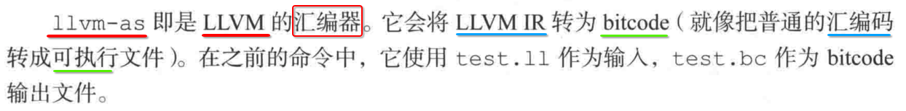


## 10. LLVM bitcode => 目标平台 汇编代码

### 1. llc (静态编译器)

```
llc output.bc -o output.s
```

### 2. clang

```
clang -S output.bc -o output.s -fomit-frame-pointer
```

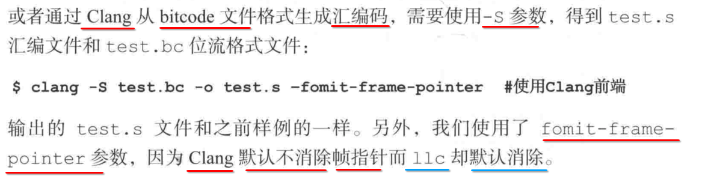

### 3. 工作原理

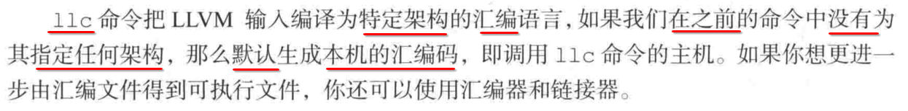

### 4. llc 更多选项

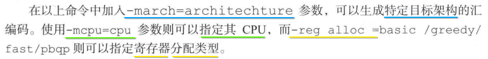


## 11. LLVM IR <= llvm-dis (反汇编器) <= LLVM bitcode

### 1. llvm-dis 反汇编

```
llvm-dis output.bc -o output.ll
```

### 2. 工作原理

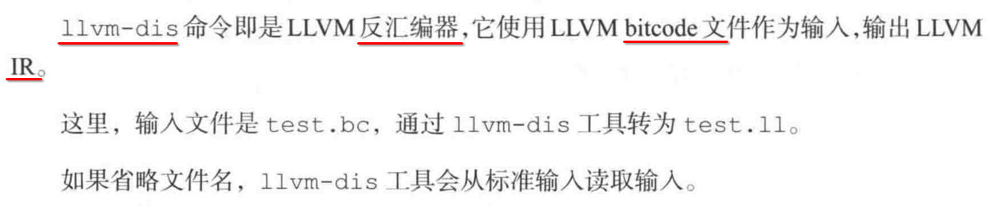


## 12. opt(优化器) 加载 ==Pass== 优化 IR

### 1. 格式

```
opt -S -<pass_name> <input>.ll -o output.ll
```

### 2. 对 IR 进行 内存访问优化

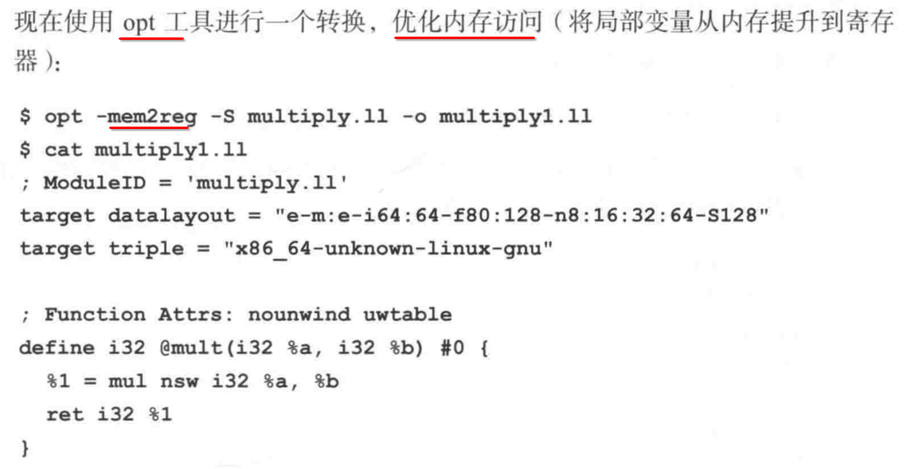

### 3. `-analyze` 参数

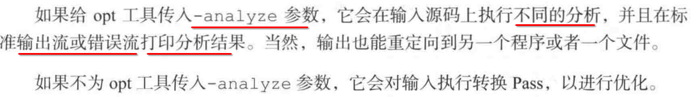

### 4. LLVM 提供的常用 Pass

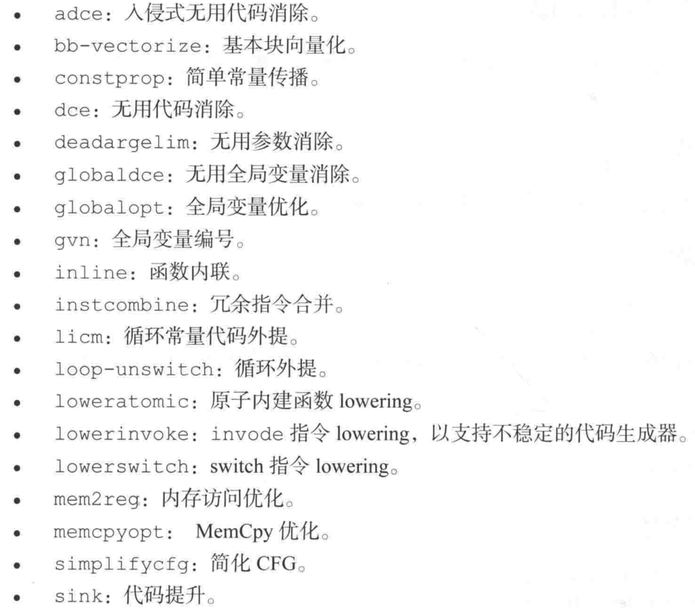

### 5. `llvm/test/Transforms` 源码目录下, 可查看上述所有 Pass 源码

```
 ~/llvm/llvm/test/Transforms   release_70 ●  ll
total 0
drwxr-xr-x   32 xiongzenghui  staff   1.0K  1 10 18:57 ADCE
drwxr-xr-x   13 xiongzenghui  staff   416B  1 10 18:57 AddDiscriminators
drwxr-xr-x    6 xiongzenghui  staff   192B  1 10 18:57 AggressiveInstCombine
drwxr-xr-x    5 xiongzenghui  staff   160B  1 10 18:57 AlignmentFromAssumptions
drwxr-xr-x   29 xiongzenghui  staff   928B  1 10 18:57 ArgumentPromotion
drwxr-xr-x    5 xiongzenghui  staff   160B  1 10 18:57 AtomicExpand
............
drwxr-xr-x  787 xiongzenghui  staff    25K  1 10 18:57 InstCombine
............
```


## 13. 链接 bitcode (中间 二进制码)

### 1. C 文件

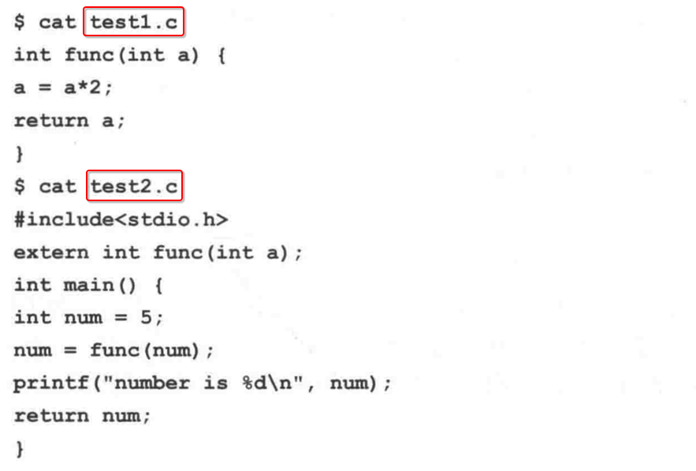

### 2. IR 文件

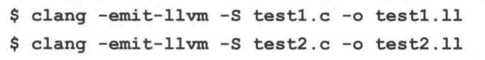

### 3. bitcode 文件


### 4. 使用 llvm-link 链接 多个 bitcode 文件

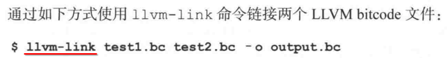


## 14. 执行 bitcode (中间 二进制码)

### 1. main.c

```
#include <stdio.h>

int main(){
  printf("HelloWorld!\n");
}
```

### 2. main.c => main.ll => main.bc => exec

```c
 ~/Desktop/main  clang -S -emit-llvm main.c -o main.ll
 ~/Desktop/main  llvm-as main.ll -o main.bc
 ~/Desktop/main  lli main.bc
HelloWorld!
 ~/Desktop/main  cat main.c
```

### 3. 工作原理

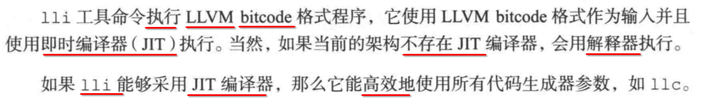


## 15. C 语言 前端 => clang

### 1. 预处理

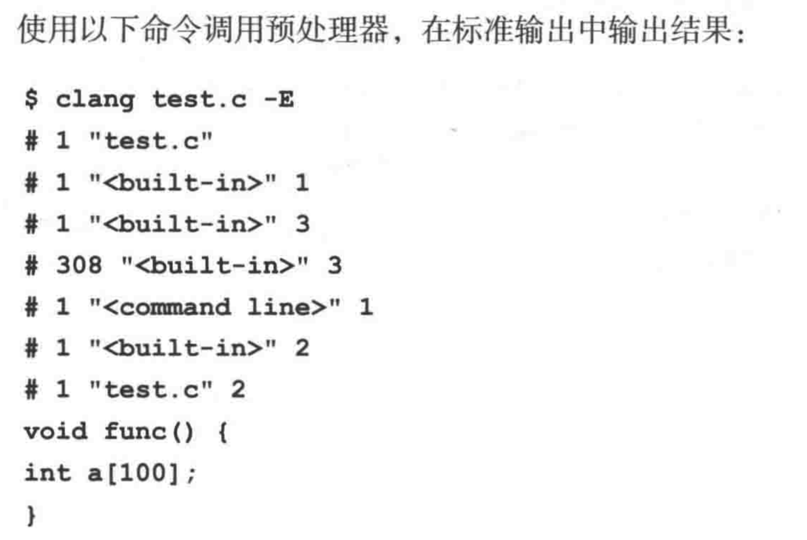

### 2. 打印 AST (语法树)

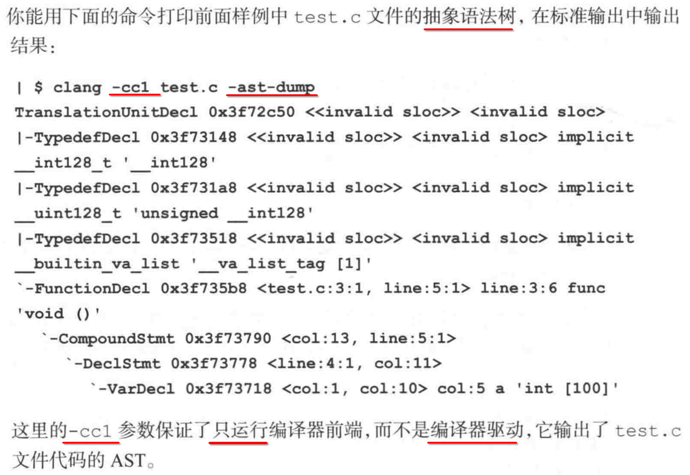

### 3. 生成 LLVM IR (中间 汇编码)

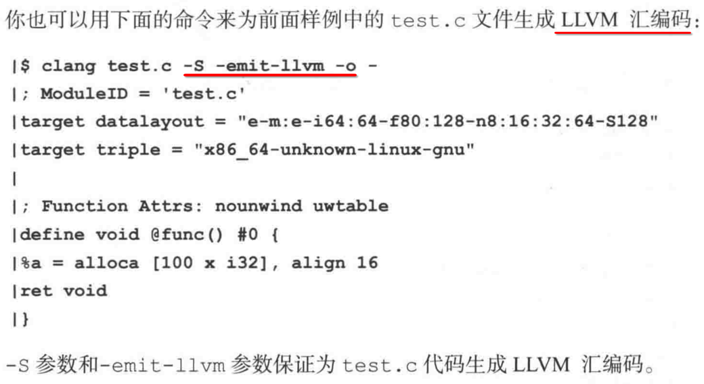

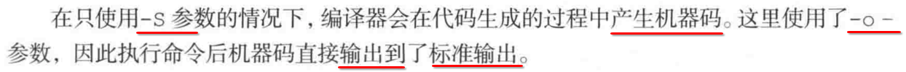


## 16. go 语言 前端 => llgo

### 1. 需要先安装 llgo 前端

If you built a newer GCC following the linked instructions above, you will need to set the following environment variables before proceeding:

```
export PATH=/path/to/gcc-inst/bin:$PATH
export LD_LIBRARY_PATH=/path/to/gcc-inst/lib64:$LD_LIBRARY_PATH
export CC=`which gcc`
export CXX=`which g++`
export LIBGO_CFLAGS=--gcc-toolchain=/path/to/gcc-inst
```

To build and install llgo:

```
# Ensure $GOPATH is set.
go get -d github.com/go-llvm/llgo/cmd/gllgo
$GOPATH/src/llvm.org/llvm/bindings/go/build.sh -DCMAKE_BUILD_TYPE=Release -DLLVM_TARGETS_TO_BUILD=host
cd $GOPATH/src/github.com/go-llvm/llgo
make install prefix=/path/to/prefix j=N  # where N is the number of cores on your machine.
```

### 2. xx.go => llgo => LLVM IR (中间 汇编码)

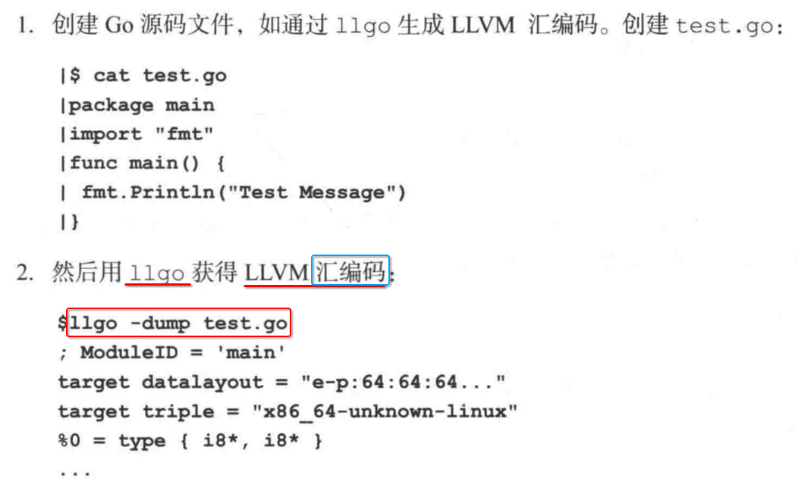


## 17. DragonEgg

### 1. DragonEgg 作用

- 1) DragonEgg 是一个 **GCC 插件**
- 2) 让 GCC 能够使用 **LLVM** 提供的 **优化器** 和 **代码生成器**

### 2. 安装 DragonEgg

....

### 3. GCC 调用 LLVM 提供的 **优化器** 和 **代码生成器**

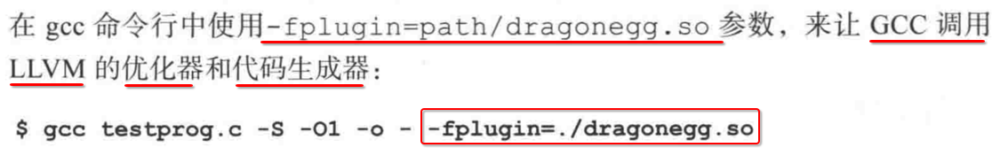

