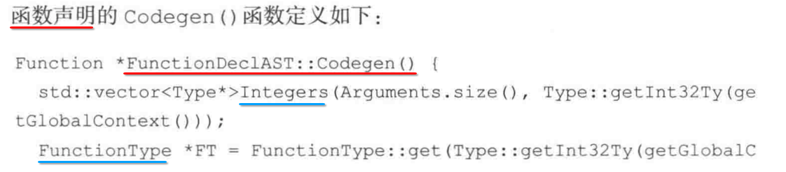

[TOC]


## List


## 1. 定义一门叫做 toy 语言


## 2. 实现编译器前端 1 : 词法分析 (Lexical Analysis) => token

### 1. 定义 词法解析后的 token 类型枚举


### 2. 全局变量: 保存当前解析的 数值、标识名字


### 3. 工具函数

- 1) 切割 字符串
- 2) 判断 空格字符
- 3) 解析 字符串 生成对应的 枚举值

### 4. 工作原理


## 3. 实现编译器前端 2 : 语法分析 (Semantic Analysis) => 抽象语法树(AST)

### 1. 抽象语法树 (AST) 存储上面解析后的 token


### 2. 所有类型的 表达式 ==抽象父类==


```c++
/// ExprAST - Base class for all expression nodes.
class ExprAST {
public:
  virtual ~ExprAST() {}
};
```

### 3. 表达式1: ==数值== 表达式

#### 1. 书上的 结构定义


#### 2. llvm-tutorial 结构定义

```c
/// NumberExprAST - Expression class for numeric literals like "1.0".
class NumberExprAST : public ExprAST {
  double Val;
public:
  NumberExprAST(double val) : Val(val) {}
};
```

### 4. 表达式2: ==二元运算== 表达式

#### 1. 书上的 结构定义


#### 2. llvm-tutorial 结构定义

```c
/// BinaryExprAST - Expression class for a binary operator.
class BinaryExprAST : public ExprAST {
  char Op;            // 1) 运算符: +、-、*、/、+=、-= ....
  ExprAST *LHS, *RHS; // 2)、3) 左边 和 右边 又是一个独立的 表达式
public:
  BinaryExprAST(char op, ExprAST *lhs, ExprAST *rhs)
    : Op(op), LHS(lhs), RHS(rhs) {}
};
```

### 5. 表达式3: ==变量== 表达式

#### 1. 书上的 结构定义


#### 2. llvm-tutorial 结构定义

```c
/// VariableExprAST - Expression class for referencing a variable, like "a".
class VariableExprAST : public ExprAST {
  std::string Name;
public:
  VariableExprAST(const std::string &name) : Name(name) {}
};
```

### 6. 表达式4: ==函数 - 声明== 表达式

#### 1. 书上的 结构定义


#### 2. llvm-tutorial 结构定义

```c
/// PrototypeAST
/// - 1) This class represents the "prototype" for a function,
/// - 2) which captures its 
///        - name
///        - argument names
/// thus implicitly the number of arguments the function takes).
class PrototypeAST {
  std::string Name; // 函数名
  std::vector<std::string> Args; // 函数参数列表
public:
  PrototypeAST(const std::string &name, const std::vector<std::string> &args)
    : Name(name), Args(args) {}
};
```

### 7. 表达式5: ==函数 - 定义== 表达式

#### 1. 书上的 结构定义


#### 2. llvm-tutorial 结构定义

```c
/// FunctionAST - This class represents a function definition itself.
class FunctionAST {
  PrototypeAST *Proto; // 函数 - 描述
  ExprAST *Body;  // 函数 - 体(实现))
public:
  FunctionAST(PrototypeAST *proto, ExprAST *body)
    : Proto(proto), Body(body) {}
};
```

### 8. 表达式6: ==函数 - 调用== 表达式

#### 1. 书上的 结构定义


#### 2. llvm-tutorial 结构定义

```c
/// CallExprAST - Expression class for function calls.
class CallExprAST : public ExprAST {
  std::string Callee;         // 函数 - 名
  std::vector<ExprAST*> Args; // 函数 - 参数列表
public:
  CallExprAST(const std::string &callee, std::vector<ExprAST*> &args)
    : Callee(callee), Args(args) {}
};
```

### 9. 语法分析

#### 1. 全局变量, 保存 当前解析的 token


#### 2. 从输入流中, 获取 下一个 要处理的 token


#### 3. 解析 token 的入口函数


#### 4. 解析 ==数值== 表达式


#### 5. 解析 ==函数调用== 表达式


#### 6. 解析 ==函数声明== 表达式


#### 7. 解析 ==函数定义== 表达式


#### 8. 解析 ==二元== 表达式

...

### 10. 编写 Driver 函数


### 11. main()


## 4. 实现编译器前端 3 : 中间代码生成 (CodeGen) => IR

### 1. 通过 LLVM API 给每一个 AST 生成对应的 LLVM IR 代码


### 2. 需要给 每一个 AST 类, 都定义一个 CodeGen() 虚函数

#### 1. CodeGen() 生成 LLVM IR (内存数据)


#### 2. 每一个 AST 类, 都定义一个 CodeGen() 虚函数


### 3. 全局作用域 声明如下 全局变量


----


### 4. ==数值== 表达式: 实现 CodeGen() 虚函数


### 5. ==变量== 表达式: 实现 CodeGen() 虚函数


### 6. ==二元操作== 表达式: 实现 CodeGen() 虚函数


### 7. ==函数调用== 表达式: 实现 CodeGen() 虚函数


### 8. ==函数声明== 表达式: 实现 CodeGen() 虚函数




### 9. ==函数定义== 表达式: 实现 CodeGen() 虚函数

...

### 10. 顶层表达式解析函数中, 调用如上这些 AST 中的 CodeGen() 实现


-------


### 11. 重新生成 解析器 可执行文件

> 必须链接 LLVM 库


### 12. 运行 解析器, 将 ==源码== 生成对应 ==LLVM IR==


## 5. 实现编译器前端 4 : 优化器 (Pass) => IR

### 1. 增加 IR 优化


### 2. 接入各种 LLVM Pass 优化项, 并使用 PassManager 统一管理


### 3. 在所有 AST 类中 CodeGen() 返回生成的 IR 之前, 调用 PassManager 触发 LLVM Pass 优化


## 6. 剩下的步骤

- 1) 生成目标文件 (Assemble)
- 2) 链接 (Link)