[TOC]

## List

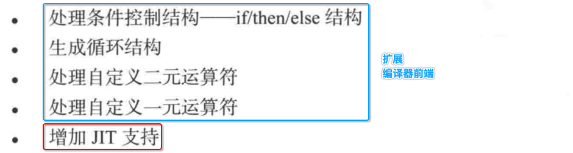

## 1. 条件控制: if/then/else

### 1. toy 语言 条件控制语法

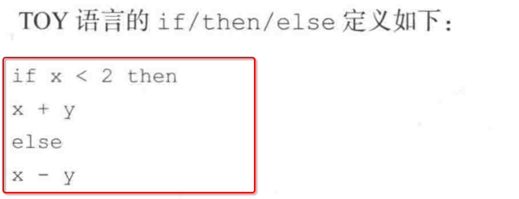

---

- 涉及到一个 `<` 小于运算符
- 需要定义 **运算符** 对应的 **优先级**

### 2. 扩展1: ==抽象语法树 (AST)== 

#### 1. 增加对 if/then/else 对应的 AST 类型

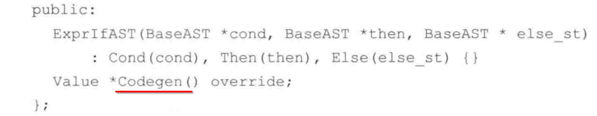

#### 2. 增加 `<` 运算符、对应的优先级规则

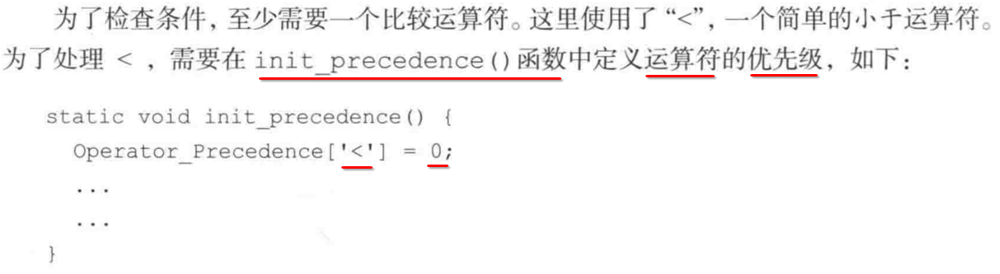

#### 3. 修改 ==二元操作表达式== AST 中的 Codegen() , 增加处理 `<` 运算

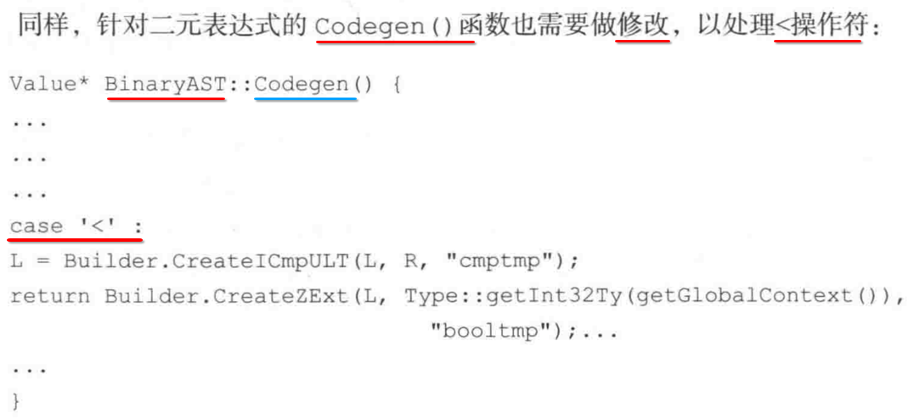

### 3. 扩展2: ==词法分析 (token)== 

#### 1. 新增 if/then/else 表达式对应的 ==token 枚举类型==

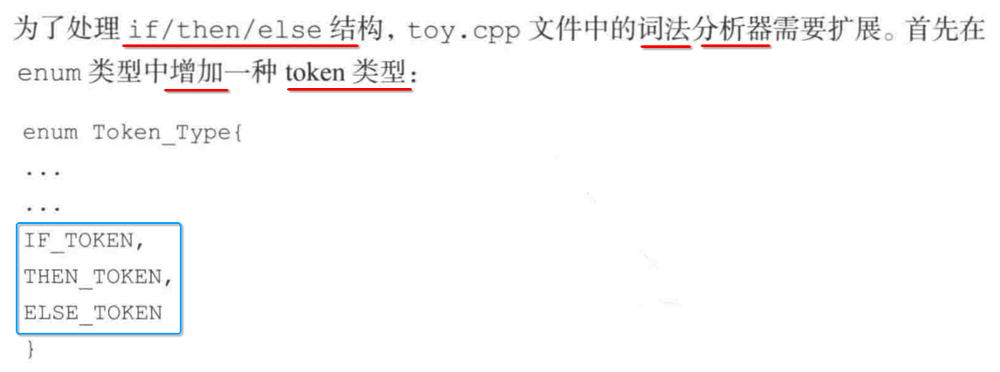

#### 2. 增加对 if/then/else token 类型的解析

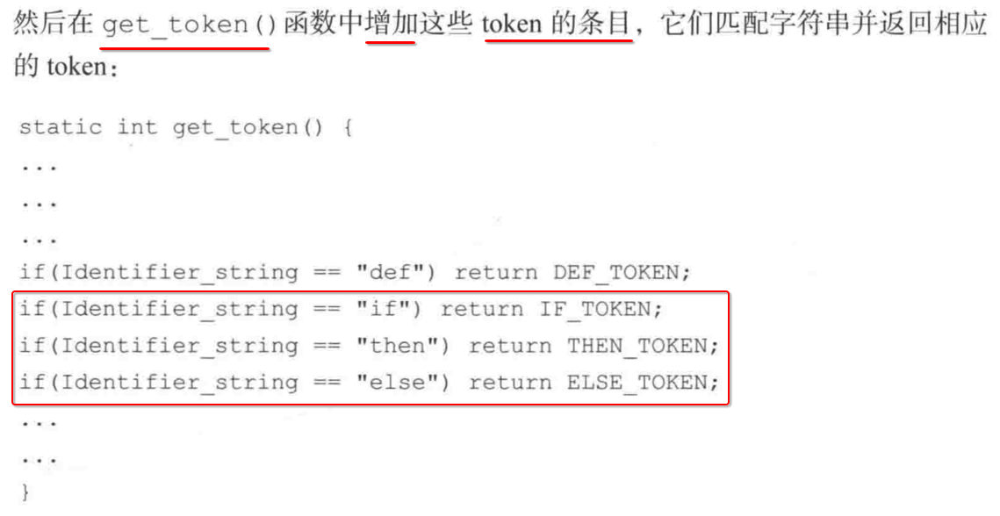

#### 3. 在之前解析 token 流时, 增加对 if/then/else 解析

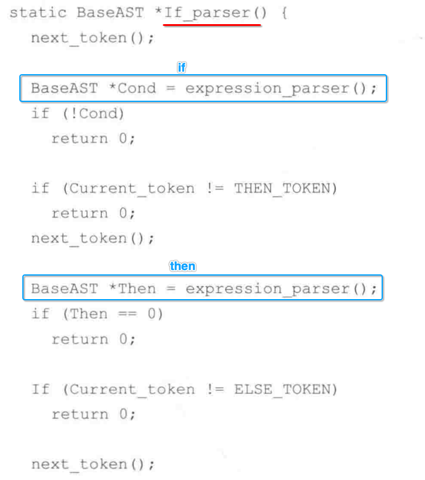

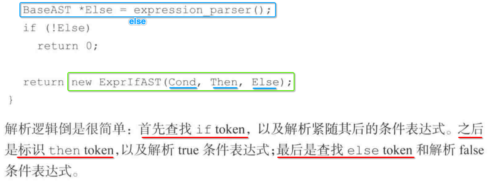

#### 4. 将如上 解析 token 生成 AST 的函数, 注册到 顶层入口方法

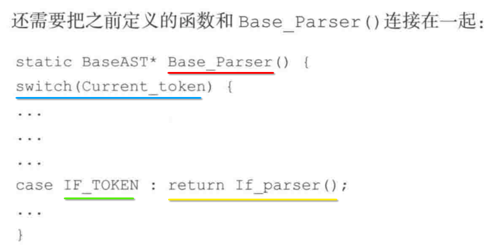

### 4. 扩展3: ==代码生成 (CodeGen)== 

- 1) 实现 if/then/else 对应的 **AST 类** 中的 **Codegen()** 方法
- 2) 让 **Codegen()** 方法正确 **生成** 对应的 **LLVM IR**

### 5. 重新编译 解析器源码, 并连接 LLVM 库

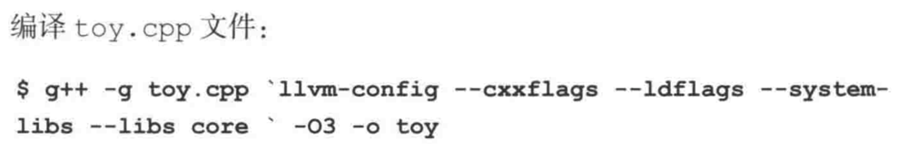

### 6. 使用生成的 解析器 解析 toy 语言编写的 源文件

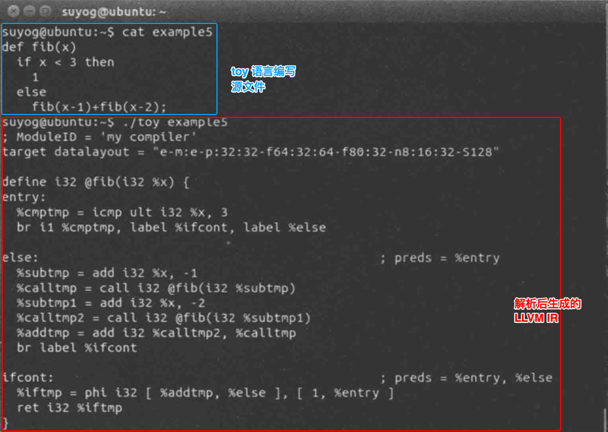

## 2. 其他 token 类型

- 1) 循环结构: for/while
- 2) 一元运算
- 3) 二元运算

大体上与上例相似.

## 3. 增加 JIT 

### 1. 实例化 JIT 容器

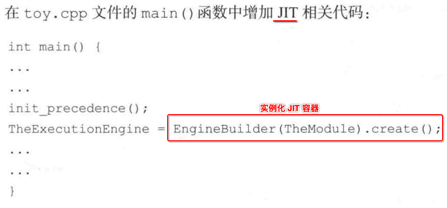

### 2. 通过 JIT 容器解释执行 函数调用 (函数指针)

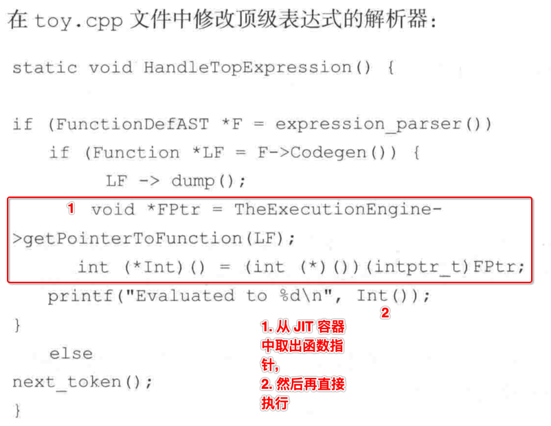

### 3. 编译链接生成 编译器

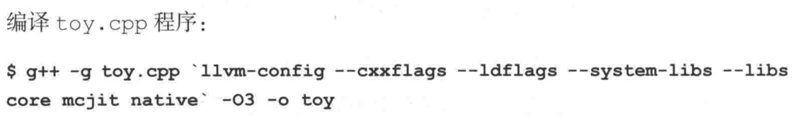

### 4. 使用 JIT 解析类似脚本代码

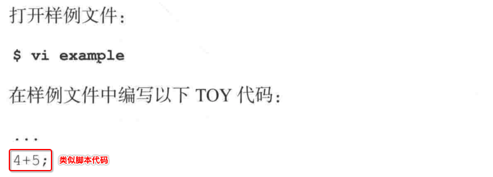

### 5. 注意

- 1) **LLVM JIT** 匹配 **当前本机** 上的 **ABI**
- 2) 首先查找到对应数据类型的 **函数指针** , 然后 **调用**
- 3) **JIT 编译** 得到的机器码, 与本地 **静态编译链接** 得到的机器码 **没有区别**