[TOC]


## List

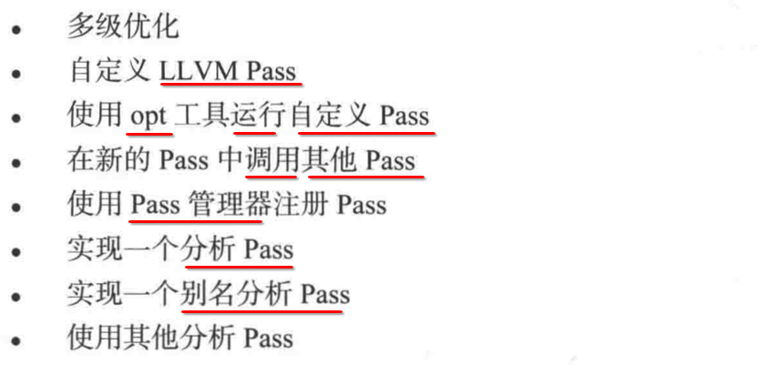


## 1. LLVM ==Pass== 优化 LLVM ==IR== 的过程

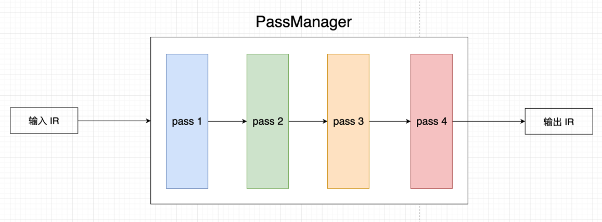


## 2. opt `-O[n] -S` : 优化 ==级别==

### 1. O0 ~ O3

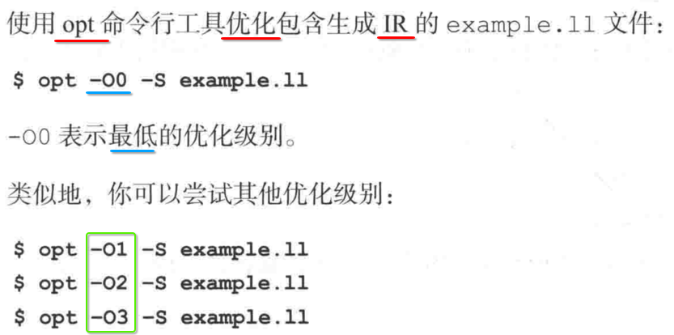

### 2. 工作原理

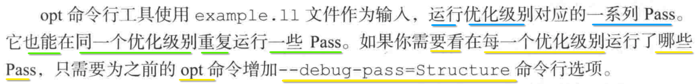

----

- 1) 如上优化其实就是运行了 **一系列自带的 LLVM Pass**
- 2) **同一个优化级别** 也可以 **重复** 执行某一些 pass
- 3) 可以 通过 opt 参数, 查看所有优化级别下, 执行了哪一些 pass


## 3. 自定义 Pass

不记录了，网上很多现成可操作的教程.


## 4. opt 加载自己实现的 Pass 优化 IR 文件

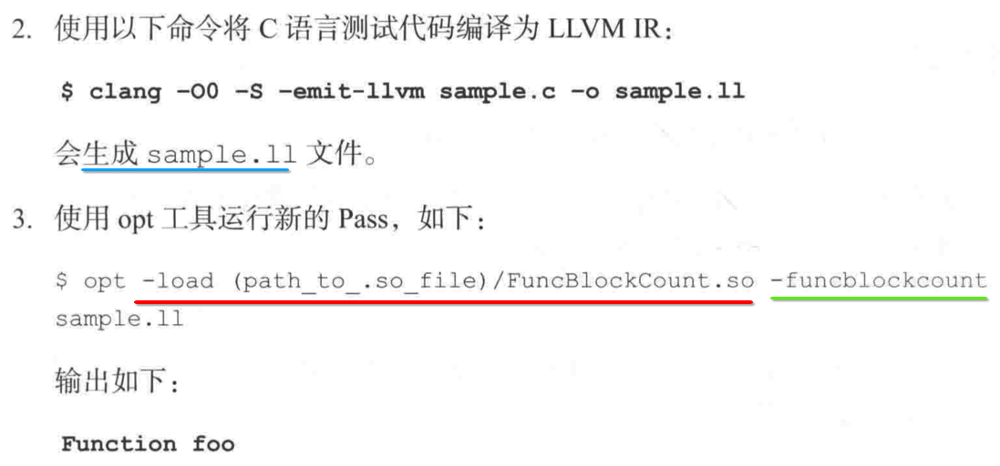


## 5. A pass 调用 B pass

### 1. 直接 new DominatorTree pass 对象, 调用其 runOnFunction() 方法

```c++
virtual bool runOnFunction(Function &F) {
  DominatorTree* T = new DominatorTree(); // new pass instance
  T->runOnFunction(*F); // call other pass's runOnFunction()
  T->print(errs());
  return false;
}
```

### 2. 通过 PassManager 调用 其他的 pass

include/llvm/PassManager.h

```c++
Module* M;

...

PassManager pm;
pm.add(new ModulePass1);
pm.run(*M)
```

### 3. 重写 getAnalysisUsage() 注册 依赖的 pass class

```c++
namespace {
  struct Mypass : public FunctionPass { 
    static char ID;
 
    Mypass() : FunctionPass(ID) {} 
 	
    /**
     * 重写 getAnalysisUsage()，添加 依赖的 pass
     */
    virtual void getAnalysisUsage(AnalysisUsage &AU) const {
      AU.addRequired<DominatorTree>(); // 【注册】添加依赖的 pass【类型】
    }
    
    virtual bool runOnFunction(Function &F) {
      DominatorTree& DT = getAnalysis<DominatorTree>(F); // 【获取】添加依赖的 pass【类型】对应的【对象】
      DT->runOnFunction(*F);
		  DT->print(errs());
      return false;
    }
  };
}
 
char Mypass::ID = 0;
static RegisterPass<Mypass> X(
  "mypass", 
  "My test analysis", 
  true, 
  true);
```


## 6. PassManager: Pass 管理器

### 1. PassManager 管理 所有的 Pass 的优点

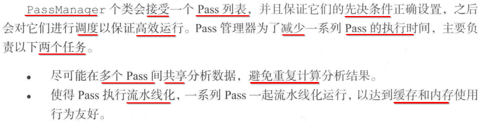

### 2. 在 Pass 实现文件 xx.cpp 内, 注册 debug type


### 3. 重写 getAnalysisUsage() 注册 依赖的 pass class

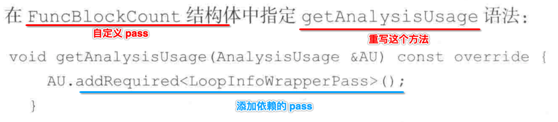

### 4. 初始化 pass, 以及给 pass 添加 create 工厂方法

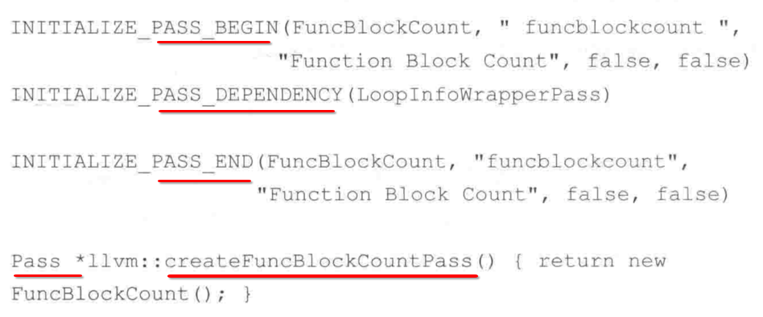

### 5. LinkAllPasses.h 注册自定义 pass create 的函数 ==调用==

#### 1. llvm/include/llvm/LinkAllPasses.h 代码结构

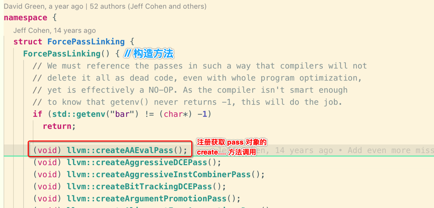

#### 2. 本例添加

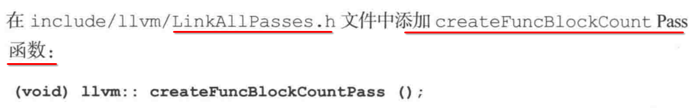

### 6. Scalar.h 注册自定义 pass create 的函数 ==声明==

#### 1. llvm/include/llvm/Transforms/Scalar.h 代码结构

```c
#ifndef LLVM_TRANSFORMS_SCALAR_H
#define LLVM_TRANSFORMS_SCALAR_H

#include <functional>

namespace llvm {
  // 1. 类的【向前声明】
  class BasicBlockPass;
  //.........


  /**
   * 2. 所有 pass 获取实例的 createXxx....() 方法的【声明】
   */

  FunctionPass *createConstantPropagationPass();

  // 其他各种类型的 pass
  // .........
} // End llvm namespace

#endif
```

#### 2. 本例添加

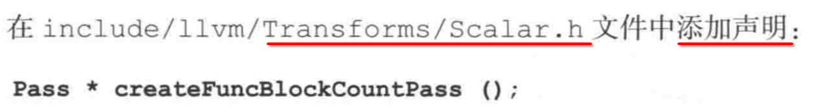

### 7. 修改 pass 构造方法


### 8. InitializePasses.h 注册 pass init 函数 ==声明== 

#### 1. llvm/include/llvm/InitializePasses.h

```c
#ifndef LLVM_INITIALIZEPASSES_H
#define LLVM_INITIALIZEPASSES_H

namespace llvm {
  /// 只是类的【向前声明】
  class PassRegistry;

  /// Initialize all passes linked into the TransformUtils library.
  void initializeCore(PassRegistry&);

  /// Initialize all passes linked into the TransformUtils library.
  void initializeTransformUtils(PassRegistry&);

  /// Initialize all passes linked into the ScalarOpts library.
  void initializeScalarOpts(PassRegistry&);

  ...........
}

#endif // LLVM_INITIALIZEPASSES_H
```

#### 2. InitializePasses.h 添加我们自己 pass init 函数的 ==声明==

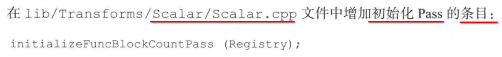

### 9. Scalar/CMakeLists.txt 注册 pass 实现 cpp 文件

#### 1. llvm/lib/Transforms/Scalar/CMakeLists.txt

```cmake
add_llvm_library(LLVMScalarOpts
  ADCE.cpp
  .......
```

#### 2. 本例添加

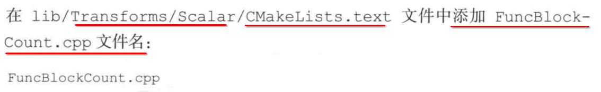

