[TOC]


## List

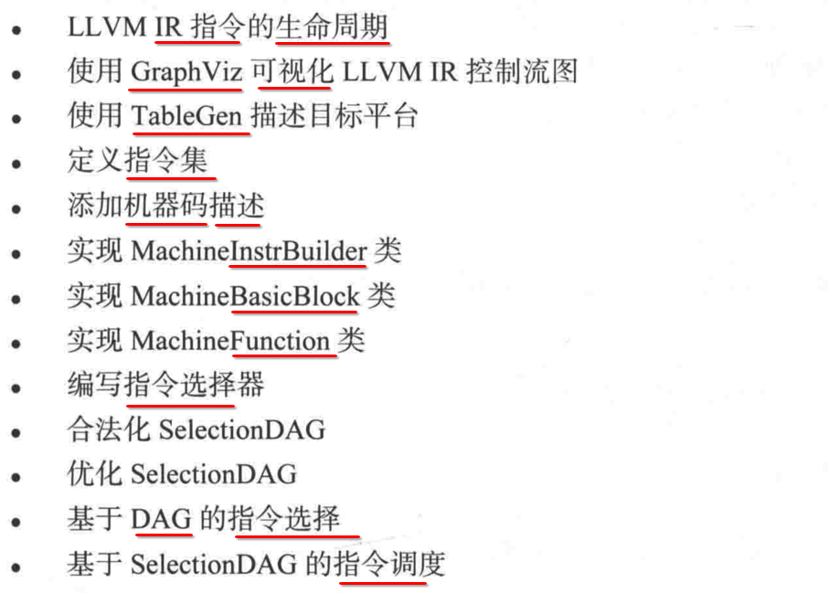


## 1. IR => 平台无关的代码生成器 => 机器指令

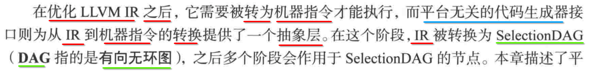

---

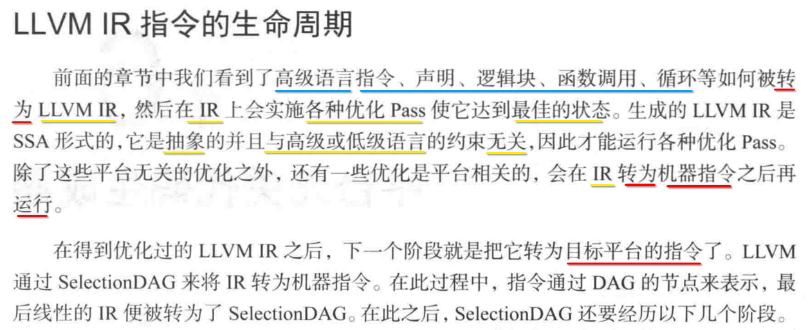

转换的过程中，会经历 **有向无环图** 的数据结构.


## 2. SelectionDAG (有向无环图) 会经历以下几个阶段

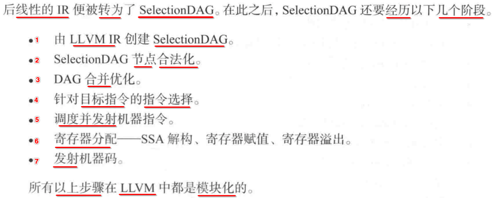

### 阶段1: IR => SelectionDAG

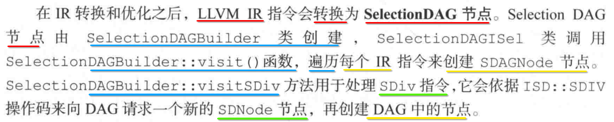

--------

有 **两种** 类型的 node 节点.

### 阶段2: 合法化(legalization) SelectionDAG

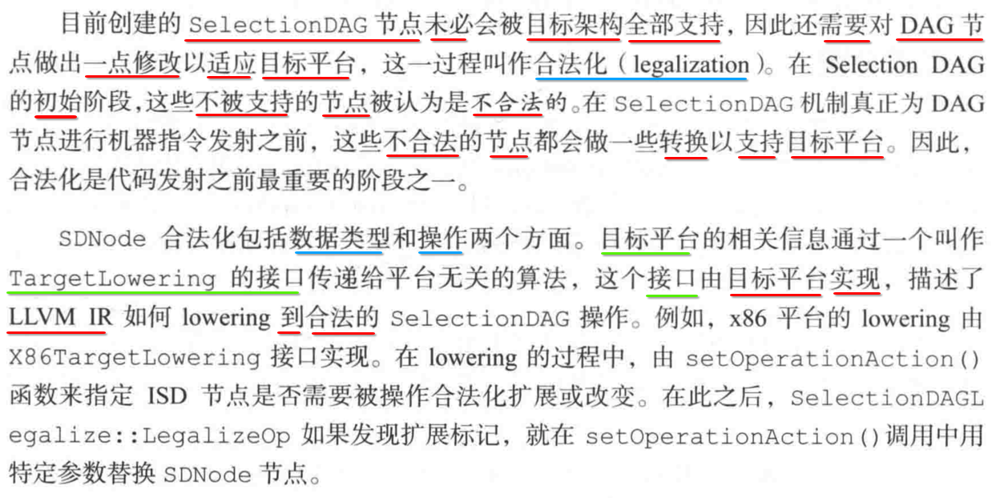

### 阶段3: 平台无关 DAG => 机器 DAG

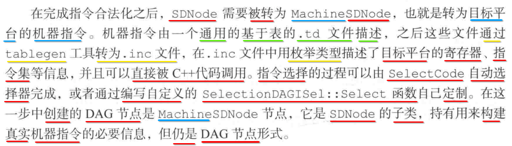

### 阶段4: 寄存器分配

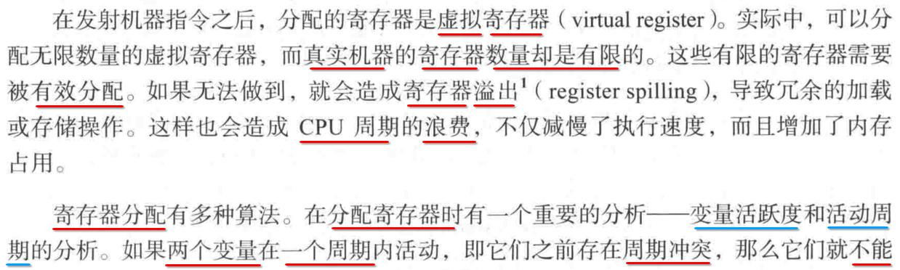

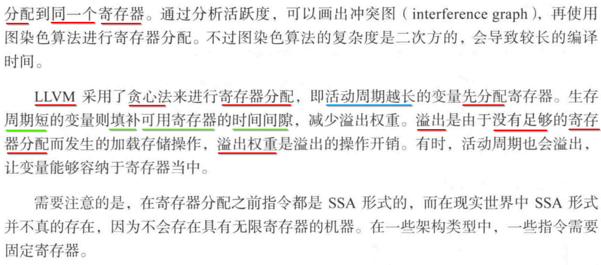

### 阶段5: 代码发布 (Code Emission)

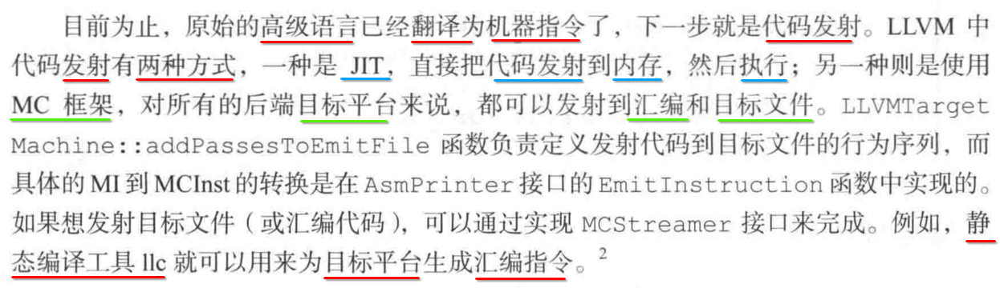


## 3. 代码 发射到 内存

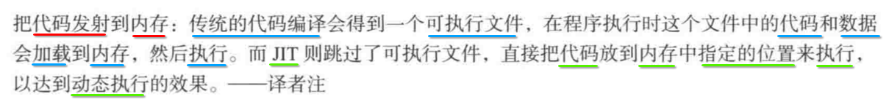


## 4. graphviz 可视化 LLVM IR 控制流图

### 1. 下载地址

http://www.graphviz.org/download/

### 2. mac 通过 brew 安装 graphviz

```
brew install graphviz
```

### 3. 测试 test.dot

```
digraph G {
  rankdir=LR;
  a -> b;
  b -> c;
  subgraph x{
    rank=same;
    b->d;
  }
  subgraph y{
    //rank = same;
    d->e;
  }
  subgraph z{
  rank=same;
  c->e;
  }
}
```

### 4. 解析 test.dot 得到 ==流程图== , 并记录到 ==png 图片== 文件中

```
dot test.dot -Tpng -o output.png
```

### 5. 查看 output.png 

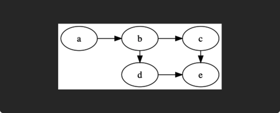

这个图就是对上述 test.dot 的流程图 **可视化** 展示效果.


## 5. 实践

### 1. test.c => test.ll

```c
define i32 @test(i32 %a, i32 %b, i32 %c)
{
  %add = add nsw i32 %a, %b
  %div = sdiv i32 %add, %c
  ret i32 %div
}
```

### 2. test.ll 执行 ==第1个 pass 之前== 时的流程图

#### 1. llc 生成 digraph 流程图文件 test.dot

> llc2 -view-dag-combine1-dags test.ll -o test.dot

```
 ~/Desktop/main/llvm  llc2 -view-dag-combine1-dags test.ll -o test.dot
Writing '/var/folders/kt/z8c9rz0s5nj68j_d_1bj0y7h0000gn/T/dag.test-d0fea5.dot'...  done.
Trying 'open' program... Remember to erase graph file: /var/folders/kt/z8c9rz0s5nj68j_d_1bj0y7h0000gn/T/dag.test-d0fea5.dot
```

提示最终生成的 dot 文件的路径: `/var/folders/kt/z8c9rz0s5nj68j_d_1bj0y7h0000gn/T/dag.test-d0fea5.dot`

- 上面使用的 **llc2** 是我编译 LLVM 源码之后得到的构建产物 llc
- 是我 alias 别名了下
- 下面出现同理

#### 2. 解析 test.dot 得到 ==流程图== , 并记录到 ==png 图片== 文件中

```
dot /var/folders/kt/z8c9rz0s5nj68j_d_1bj0y7h0000gn/T/dag.test-d0fea5.dot -Tpng -o output.png
```

#### 3. output.png 

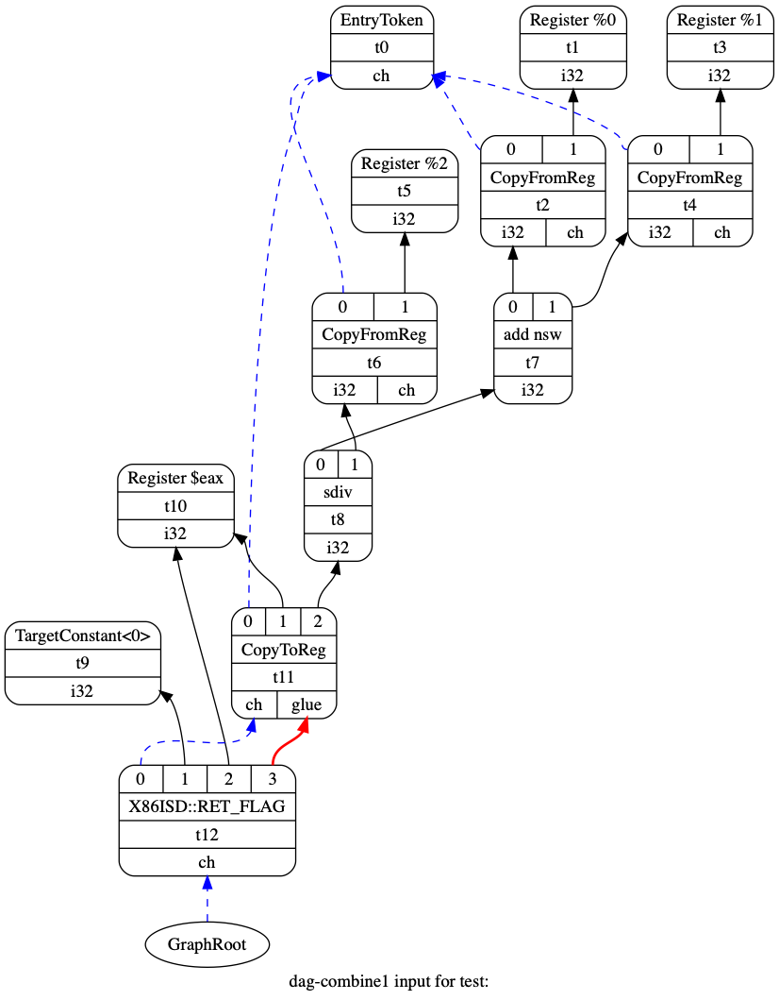

这个图就是对上述 test.dot 的流程图 **可视化** 展示效果.

### 3. test.ll ==合法化前== 的流程图

#### 1. llc 生成 digraph 流程图文件 test.dot

> llc2 -view-legalize-dags test.ll -o test.dot

```
 ~/Desktop/main/llvm  llc2 -view-legalize-dags test.ll -o test.dot
Writing '/var/folders/kt/z8c9rz0s5nj68j_d_1bj0y7h0000gn/T/dag.test-d84d73.dot'...  done.
Trying 'open' program... Remember to erase graph file: /var/folders/kt/z8c9rz0s5nj68j_d_1bj0y7h0000gn/T/dag.test-d84d73.dot
```

提示最终生成的 dot 文件的路径: `/var/folders/kt/z8c9rz0s5nj68j_d_1bj0y7h0000gn/T/dag.test-d84d73.dot`

#### 2. 解析 test.dot 得到 ==流程图== , 并记录到 ==png 图片== 文件中

```
dot /var/folders/kt/z8c9rz0s5nj68j_d_1bj0y7h0000gn/T/dag.test-d84d73.dot -Tpng -o output.png
```

#### 3. output.png 


### 4. test.ll 执行 ==第2个 pass 之前== 时的流程图

#### 1. llc 生成 digraph 流程图文件 test.dot

> llc2 -view-dag-combine2-dags test.ll -o test.dot

```
 ~/Desktop/main/llvm  dot /var/folders/kt/z8c9rz0s5nj68j_d_1bj0y7h0000gn/T/dag.test-d84d73.dot -Tpng -o output.png
 ~/Desktop/main/llvm  llc2 -view-dag-combine2-dags test.ll -o test.dot
Writing '/var/folders/kt/z8c9rz0s5nj68j_d_1bj0y7h0000gn/T/dag.test-c4b523.dot'...  done.
Trying 'open' program... Remember to erase graph file: /var/folders/kt/z8c9rz0s5nj68j_d_1bj0y7h0000gn/T/dag.test-c4b523.dot
```

提示最终生成的 dot 文件的路径: `/var/folders/kt/z8c9rz0s5nj68j_d_1bj0y7h0000gn/T/dag.test-c4b523.dot`

#### 2. 解析 test.dot 得到 ==流程图== , 并记录到 ==png 图片== 文件中

```
dot /var/folders/kt/z8c9rz0s5nj68j_d_1bj0y7h0000gn/T/dag.test-c4b523.dot -Tpng -o output.png
```

#### 3. output.png 

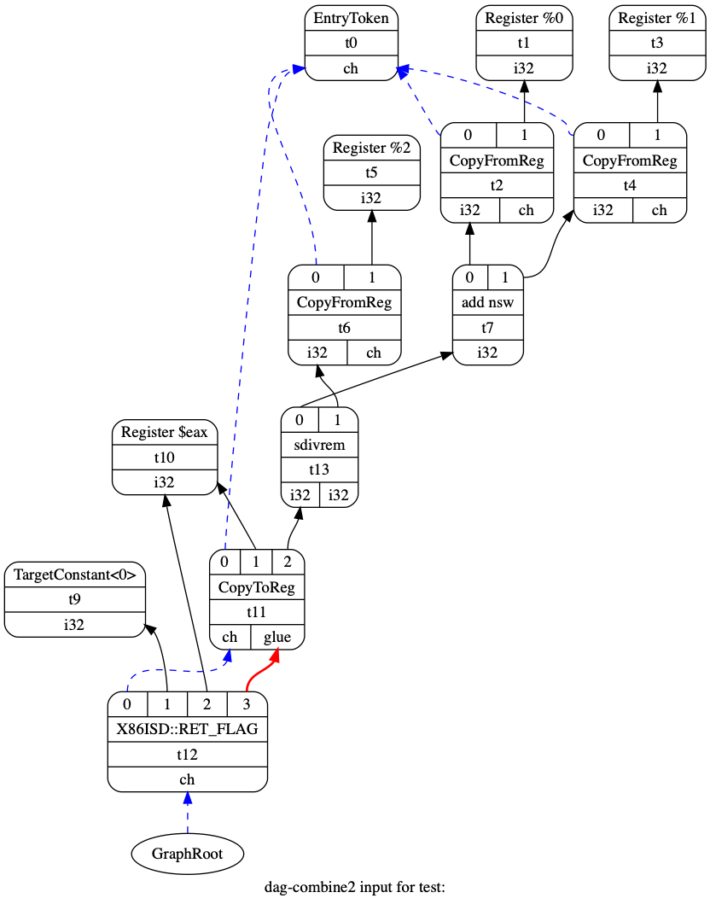

### 5. test.ll 执行 ==指令选择== 之前的流程图

#### 1. llc 生成 digraph 流程图文件 test.dot

> llc2 -view-isel-dags test.ll

```
 ~/Desktop/main/llvm  llc2 -view-isel-dags test.ll
Writing '/var/folders/kt/z8c9rz0s5nj68j_d_1bj0y7h0000gn/T/dag.test-4d4f22.dot'...  done.
Trying 'open' program... Remember to erase graph file: /var/folders/kt/z8c9rz0s5nj68j_d_1bj0y7h0000gn/T/dag.test-4d4f22.dot
```

提示最终生成的 dot 文件的路径: `/var/folders/kt/z8c9rz0s5nj68j_d_1bj0y7h0000gn/T/dag.test-4d4f22.dot`

#### 2. 解析 test.dot 得到 ==流程图== , 并记录到 ==png 图片== 文件中

```
dot /var/folders/kt/z8c9rz0s5nj68j_d_1bj0y7h0000gn/T/dag.test-4d4f22.dot -Tpng -o output.png
```

#### 3. output.png 

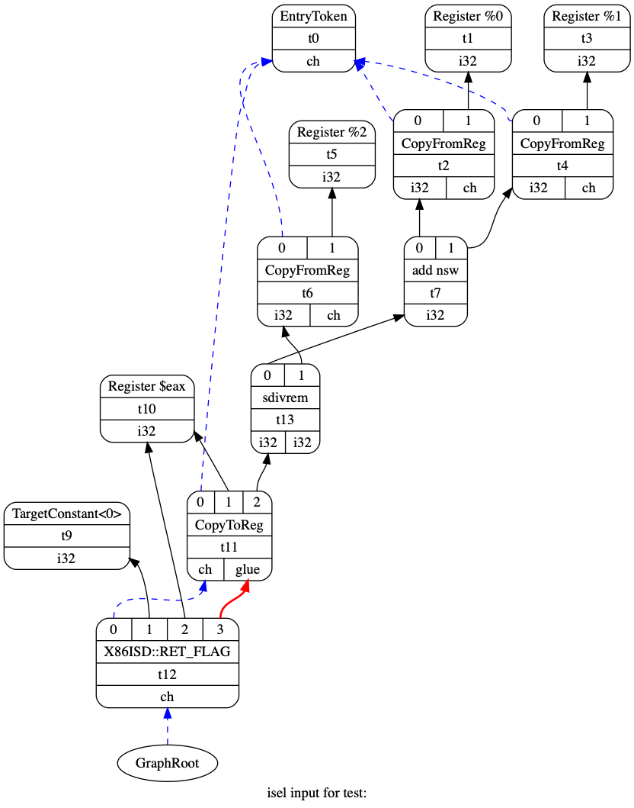

### 6. test.ll 执行 ==指令调度== 之前的流程图

#### 1. llc 生成 digraph 流程图文件 test.dot

> llc2 -view-sched-dags test.ll

```
 ~/Desktop/main/llvm  llc2 -view-sched-dags test.ll
Writing '/var/folders/kt/z8c9rz0s5nj68j_d_1bj0y7h0000gn/T/dag.test-99c7d3.dot'...  done.
Trying 'open' program... Remember to erase graph file: /var/folders/kt/z8c9rz0s5nj68j_d_1bj0y7h0000gn/T/dag.test-99c7d3.dot
```

提示最终生成的 dot 文件的路径: `/var/folders/kt/z8c9rz0s5nj68j_d_1bj0y7h0000gn/T/dag.test-99c7d3.dot`

#### 2. 解析 test.dot 得到 ==流程图== , 并记录到 ==png 图片== 文件中

```
dot /var/folders/kt/z8c9rz0s5nj68j_d_1bj0y7h0000gn/T/dag.test-99c7d3.dot -Tpng -o output.png
```

#### 3. output.png 

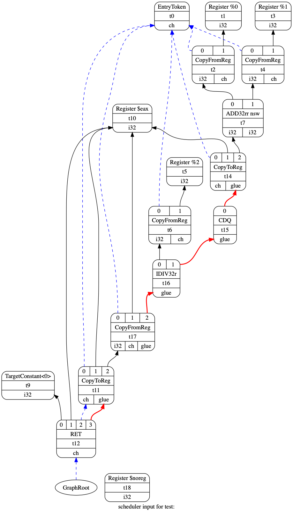

### 7. 查看 ==指令调度器== 依赖图

#### 1. llc 生成 digraph 流程图文件 test.dot

> llc2 -view-sunit-dags test.ll

```
 ~/Desktop/main/llvm  llc2 -view-sunit-dags test.ll
Writing '/var/folders/kt/z8c9rz0s5nj68j_d_1bj0y7h0000gn/T/sunit-dag.test:-c559ff.dot'...  done.
Trying 'open' program... Remember to erase graph file: /var/folders/kt/z8c9rz0s5nj68j_d_1bj0y7h0000gn/T/sunit-dag.test:-c559ff.dot
```

#### 2. 解析 test.dot 得到 ==流程图== , 并记录到 ==png 图片== 文件中

```
dot /var/folders/kt/z8c9rz0s5nj68j_d_1bj0y7h0000gn/T/sunit-dag.test:-c559ff.dot -Tpng -o output.png
```

#### 3. output.png 

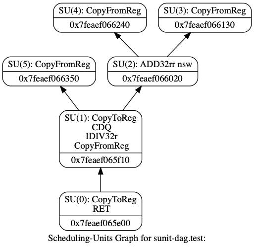

### 8. 小结

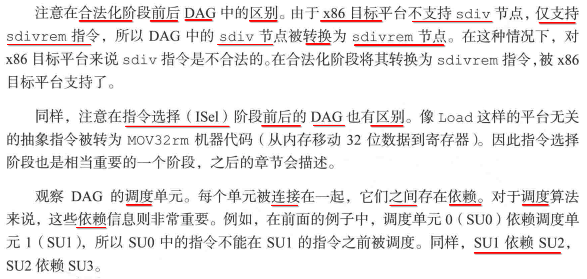


## 6. TableGen

### 1. TableGen 描述 ==目标平台==

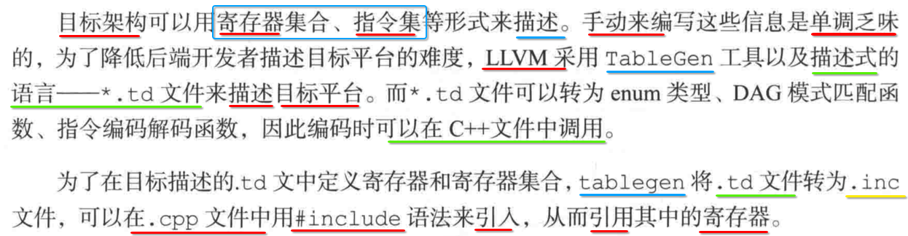

----

- 1) LLVM 使用 **TableGen** 和 **描述性语言 xx.td 文件** 描述一个 **目标平台**
- 2)  **xx.td 文件** => TableGen => **xx.inc** 文件
- 3) xx.cpp 文件中，可以通过 `#include xx.inc` 来引入，从而调用其中的 **寄存器**

### 2. 准备工作

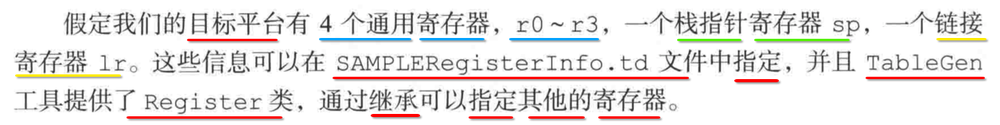

### 3. ==llvm/lib/Target== 目录: 存放每一种 ==CPU 架构== 对应的信息

```
 ~/llvm/lib/Target   release_70  ll
total 256
drwxr-xr-x   88 xiongzenghui  staff   2.8K  6 27 00:48 AArch64
drwxr-xr-x  181 xiongzenghui  staff   5.7K  6 27 00:48 AMDGPU
drwxr-xr-x   36 xiongzenghui  staff   1.1K  6 27 00:48 ARC
drwxr-xr-x  100 xiongzenghui  staff   3.1K  6 27 00:48 ARM
drwxr-xr-x   40 xiongzenghui  staff   1.3K  6 27 00:48 AVR
drwxr-xr-x   34 xiongzenghui  staff   1.1K  6 27 00:48 BPF
-rw-r--r--    1 xiongzenghui  staff   755B  6 27 00:48 CMakeLists.txt
drwxr-xr-x  125 xiongzenghui  staff   3.9K  6 27 00:48 Hexagon
-rw-r--r--    1 xiongzenghui  staff   1.9K  6 27 00:48 LLVMBuild.txt
drwxr-xr-x   43 xiongzenghui  staff   1.3K  6 27 00:48 Lanai
drwxr-xr-x   33 xiongzenghui  staff   1.0K  6 27 00:48 MSP430
drwxr-xr-x  111 xiongzenghui  staff   3.5K  6 27 00:48 Mips
drwxr-xr-x   53 xiongzenghui  staff   1.7K  6 27 00:48 NVPTX
drwxr-xr-x   34 xiongzenghui  staff   1.1K  6 27 00:48 Nios2
drwxr-xr-x   84 xiongzenghui  staff   2.6K  6 27 00:48 PowerPC
-rw-r--r--    1 xiongzenghui  staff    70K  6 27 00:48 README.txt
drwxr-xr-x   40 xiongzenghui  staff   1.3K  6 27 00:48 RISCV
drwxr-xr-x   44 xiongzenghui  staff   1.4K  6 27 00:48 Sparc
drwxr-xr-x   69 xiongzenghui  staff   2.2K  6 27 00:48 SystemZ
-rw-r--r--    1 xiongzenghui  staff   4.7K  6 27 00:48 Target.cpp
-rw-r--r--    1 xiongzenghui  staff   932B  6 27 00:48 TargetIntrinsicInfo.cpp
-rw-r--r--    1 xiongzenghui  staff    13K  6 27 00:48 TargetLoweringObjectFile.cpp
-rw-r--r--    1 xiongzenghui  staff    10K  6 27 00:48 TargetMachine.cpp
-rw-r--r--    1 xiongzenghui  staff   7.4K  6 27 00:48 TargetMachineC.cpp
drwxr-xr-x   80 xiongzenghui  staff   2.5K  6 27 00:48 WebAssembly
drwxr-xr-x  120 xiongzenghui  staff   3.8K  6 27 00:48 X86
drwxr-xr-x   41 xiongzenghui  staff   1.3K  6 27 00:48 XCore
```

### 4. 在 ==llvm/lib/Target== 创建新的 ==架构== 目录

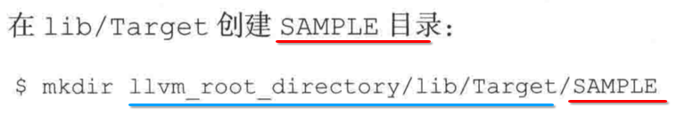

### 5. 在新的 ==架构== 目录下，继续创建 ==xx.td 文件==

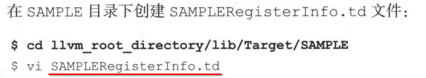

### 6. 定义 ==目标平台== 需要的信息

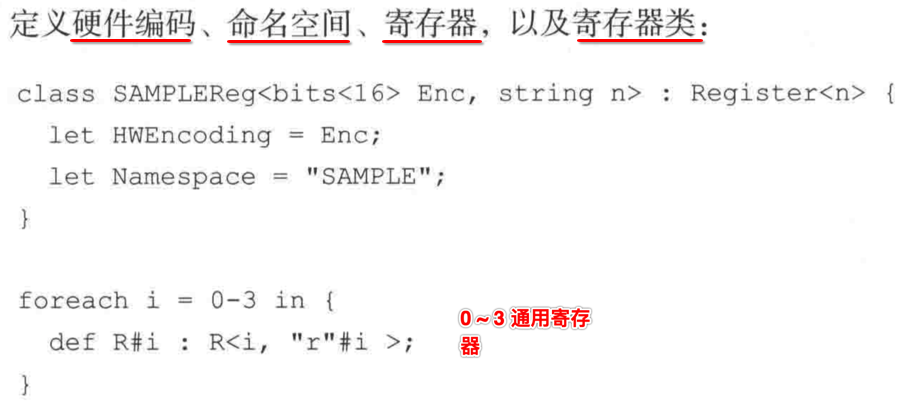

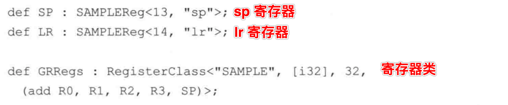

---

- 1) 硬件编码
- 2) 命名空间
- 3) 寄存器
- 4) 寄存器类