[TOC]


## 1. LLVM Pass: helloworld

### 1. llvm/lib/Transforms/ 有一个 Hello 目录

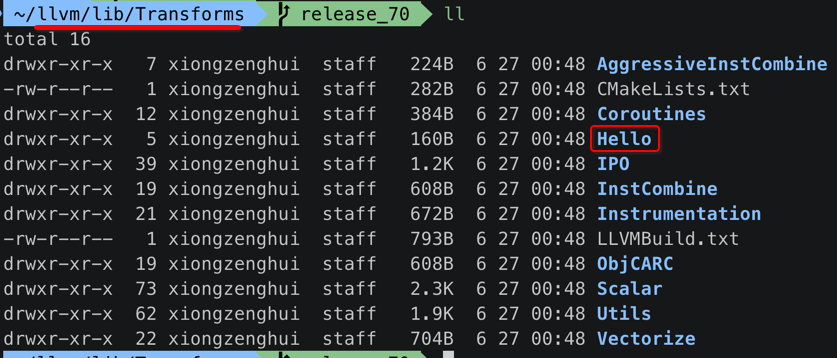

### 2. Hello 目录的结构

```
 ~/llvm/lib/Transforms/Hello   release_70  tree
.
├── CMakeLists.txt
├── Hello.cpp
└── Hello.exports

0 directories, 3 files
```

就很简单的 3个 文件.

### 3. Hello/Hello.cpp

```c++
#include "llvm/ADT/Statistic.h"
#include "llvm/IR/Function.h"
#include "llvm/Pass.h"
#include "llvm/Support/raw_ostream.h"

using namespace llvm;

#define DEBUG_TYPE "hello"

STATISTIC(HelloCounter, "Counts number of functions greeted");

/**
 * 1、第一个 Pass : `opt -load /..path../LLVMHello.so -hello main.bc`
 */
namespace { // 匿名 namespace 中的符号，只能在【当前 cpp 文件内】使用，等价于C语言中的【static】限定符
  struct Hello : public FunctionPass { // 继承自 FunctionPass 类
    // Pass identification, replacement for typeid
    static char ID;

    // 构造方法
    Hello() : FunctionPass(ID) // 调用【父类】构造方法，初始化【父类成员】
    {}

    /**
     * 重写 FunctionPass::runOnFunction() 方法，
     * 完成 pass 要做的事情
     */
    bool runOnFunction(Function &F) override {
      ++HelloCounter;
      errs() << "[XZH] hello pass: ";
      errs().write_escaped(F.getName()) << '\n';
      return false;
    }
  };
}

/**
 * 2、注册 Pass 1
 */
char Hello::ID = 0;
static RegisterPass<Hello> X(
  "hello", // opt -load ../......./LLVMHello.so -hello main.bc
  "Hello World Pass"
);

/**
 * 3、第二个 Pass : `opt -load /..path../LLVMHello.so -hello2 main.bc`
 */
namespace {
  // Hello2 - The second implementation with getAnalysisUsage implemented.
  struct Hello2 : public FunctionPass {
    static char ID; // Pass identification, replacement for typeid
    Hello2() : FunctionPass(ID) {}

    bool runOnFunction(Function &F) override {
      ++HelloCounter;
      errs() << "[XZH] hello2 pass: ";
      errs().write_escaped(F.getName()) << '\n';
      return false;
    }

    // We don't modify the program, so we preserve all analyses.
    void getAnalysisUsage(AnalysisUsage &AU) const override {
      AU.setPreservesAll();
    }
  };
}

/**
 * 4、注册 Pass 2
 */
char Hello2::ID = 0;
static RegisterPass<Hello2>
Y(
  "hello2", // opt -load ../......./LLVMHello.so -hello2 main.bc
  "Hello World Pass (with getAnalysisUsage implemented)"
);
```

### 4. Hello/CMakeLists.txt

```cmake
# If we don't need RTTI or EH, there's no reason to export anything
# from the hello plugin.
if( NOT LLVM_REQUIRES_RTTI )
  if( NOT LLVM_REQUIRES_EH )
    set(LLVM_EXPORTED_SYMBOL_FILE ${CMAKE_CURRENT_SOURCE_DIR}/Hello.exports)
  endif()
endif()

if(WIN32 OR CYGWIN)
  set(LLVM_LINK_COMPONENTS Core Support)
endif()

add_llvm_loadable_module( LLVMHello
  Hello.cpp

  DEPENDS
  intrinsics_gen
  PLUGIN_TOOL
  opt
)
```

### 5. Hello/Hello.exports

空的。

### 6. 注册 pass 源码目录

#### 1. llvm/lib/Transforms/ 每一项目录, 都是 pass 源码目录

```
 ~/llvm/llvm/lib/Transforms   release_70 ●  ls -l
total 16
drwxr-xr-x   7 xiongzenghui  staff   224  1 10 18:57 AggressiveInstCombine
-rw-r--r--   1 xiongzenghui  staff   282  1 10 18:57 CMakeLists.txt
drwxr-xr-x  12 xiongzenghui  staff   384  1 10 18:57 Coroutines
drwxr-xr-x   5 xiongzenghui  staff   160  1 10 18:57 Hello
drwxr-xr-x  39 xiongzenghui  staff  1248  1 10 18:57 IPO
drwxr-xr-x  19 xiongzenghui  staff   608  1 10 18:57 InstCombine
drwxr-xr-x  21 xiongzenghui  staff   672  1 10 18:57 Instrumentation
-rw-r--r--   1 xiongzenghui  staff   793  1 10 18:57 LLVMBuild.txt
drwxr-xr-x  19 xiongzenghui  staff   608  1 10 18:57 ObjCARC
drwxr-xr-x  73 xiongzenghui  staff  2336  1 10 18:57 Scalar
drwxr-xr-x  62 xiongzenghui  staff  1984  1 10 18:57 Utils
drwxr-xr-x  22 xiongzenghui  staff   704  1 10 18:57 Vectorize
```

#### 2. llvm/lib/Transforms/CMakeLists.txt

```cmake
add_subdirectory(Utils)
add_subdirectory(Instrumentation)
add_subdirectory(AggressiveInstCombine)
add_subdirectory(InstCombine)
add_subdirectory(Scalar)
add_subdirectory(IPO)
add_subdirectory(Vectorize)
add_subdirectory(Hello) #=> 将【Hello】Pass 的源码目录，添加到【编译路径】
add_subdirectory(ObjCARC)
add_subdirectory(Coroutines)
```

### 7. cd llvm_build 目录, 重新构建 LLVM 源码

#### 1. ninja 构建

```
 ~/llvm/llvm_build  make -j `sysctl -n hw.logicalcpu`
 ...............

 [  0%] Built target LLVMHello_exports
 [  0%] Built target llvm_vcsrevision_h
 [  0%] Built target LLVMDemangle
 [  0%] Built target LLVMBinaryFormat
 [  0%] Built target LLVMOption
 ...............
 [ 63%] Built target LLVMAggressiveInstCombine
 Scanning dependencies of target LLVMHello
 ...............
 [ 98%] Linking CXX shared module ../../LLVMHello.dylib
 ...............
 [100%] Built target c-index-test
```

#### 2. xocdeproj 构建

```
/Users/xiongzenghui/llvm_build/Debug/lib/LLVMHello.dylib
```

#### 3. 构建生成 pass 动态库 文件

- 1) linux 系统: **xx.so** 动态库文件
- 2) macosx 系统: **xx.dylib** 动态库文件

### 8. 执行 opt 加载 ==自定义 pass== 优化 ==xx.ll (LLVM IR)==

#### 1. opt -load 加载 pass dylib

```
/usr/xiong/llvm/bin/opt -load /Users/xiongzenghui/llvm/llvm_build/lib/LLVMHello.dylib -hello main.ll
```

#### 2. opt -load pass1 `-hello`

```
 ~/Desktop/main  /usr/xiong/llvm/bin/opt -load /Users/xiongzenghui/llvm/llvm_build/lib/LLVMHello.dylib -hello main.ll
WARNING: You're attempting to print out a bitcode file.
This is inadvisable as it may cause display problems. If
you REALLY want to taste LLVM bitcode first-hand, you
can force output with the `-f' option.

[XZH] hello pass: main
```

#### 3. opt -load pass2 `-hello2`

```
 ~/Desktop/main  /usr/xiong/llvm/bin/opt -load /Users/xiongzenghui/llvm/llvm_build/lib/LLVMHello.dylib -hello2 main.ll
WARNING: You're attempting to print out a bitcode file.
This is inadvisable as it may cause display problems. If
you REALLY want to taste LLVM bitcode first-hand, you
can force output with the `-f' option.

[XZH] hello2 pass: main
```


## 2. LLVM Pass eg1: a+b 替换为 a-(-b)

### 1. 创建 pass 工作目录

```
cd $LLVM_SOURCE_ROOT/lib/Transforms
mkdir Obfuscation
cd Obfuscation
```

### 2. 创建 pass 所需的源文件

```
 ~/llvm/lib/Transforms/Obfuscation   release_70 ●  tree
.
├── CMakeLists.txt
├── LLVMBuild.txt
└── SimplePass.cpp

0 directories, 3 files
```

### 3. Obfuscation/SimplePass.cpp : 实现 自定义的 LLVM Pass

```
touch SimplePass.cpp
```

```c++
#include "llvm/ADT/Statistic.h"
#include "llvm/Support/raw_ostream.h"

#include "llvm/Pass.h"

#include "llvm/IR/Function.h"
#include "llvm/IR/Instructions.h"

#define DEBUG_TYPE "simplepass"

// 不太喜欢这样导入 namespace 中的 符号声明
// 会将 namespace 中的【所有】符号声明【全部】导入进来
// 比较倾向于【按需】导入 => llvm::符号
//using namespace llvm;

// 暂时没用到
//STATISTIC(HelloCounter, "Counts number of functions greeted");

namespace // 【匿名】名字空间，相当于 C语言中的 static 限制【符号】只能在【当前文件内】使用
{
  /**
   * 实现一个针对【Function】类型进行【优化】的 pass
   */
  struct SimplePass : public llvm::FunctionPass
  {
    static char ID;
    bool flag;

    SimplePass() : llvm::FunctionPass(ID) {}

    bool runOnFunction(llvm::Function &F) override
    {
      llvm::errs() << "------- runOnFunction() -------\n";
      
      llvm::Function *tmp = &F;

      for (llvm::Function::iterator bb = tmp->begin(); bb != tmp->end(); ++bb) // 遍历【函数】中的每一条【基本块】
      {
        for (llvm::BasicBlock::iterator inst = bb->begin(); inst != bb->end(); ++inst) // 遍历【每一个块】中的每一条【指令】
        {
          // 【指令】的【类型】
          if (!inst->isBinaryOp()) // 只对 a+b 这种【左操作数、中间操作符、右操作数】指令进行处理
            continue;
          
          // 【指令】的【操作码】
          if (inst->getOpcode() != llvm::Instruction::Add) // 继续过滤 只针对 add 指令
            continue;
          
          // 【修改】【指令】(llvm::BasicBlock::iterator => llvm::BinaryOperator)
          _ob_add(llvm::cast<llvm::BinaryOperator>(inst));
        }
      }

      return true;
    }

		// 将代码中 `a+b` 全部替换为 `a-(-b)`
    void _ob_add(llvm::BinaryOperator *bo)
    {
      llvm::BinaryOperator *new_bo = NULL;
      
      // 1、将【指令】中的【第1个】操作数【修改】为【负数】: [a,+,b] => [a,+,-b]
      new_bo = llvm::BinaryOperator::CreateNeg(
        bo->getOperand(1), // arr = [a,+,b], arr[1] = '+'
        "", 
        bo // 传入【原始指令】为了获取到原来的 arr[0], arr[2]
      );

      // 2、创建一个【新的】【指令】: [a,+,-b] => [a,-,-b]
      new_bo = llvm::BinaryOperator::Create(
        llvm::Instruction::Sub, // 修改为【减法】操作码
        bo->getOperand(0), // arr = [a,+,-b], arr[0] = a
        new_bo,
        "", 
        bo // 传入【原始指令】为了获取到原来的 arr[1], arr[2]
      );

      // 3、复制 signed/unsigned 计算属性
      new_bo->setHasNoSignedWrap(bo->hasNoSignedWrap());
      new_bo->setHasNoUnsignedWrap(bo->hasNoUnsignedWrap());

      // 4、替换所有出现该指令的地方
      bo->replaceAllUsesWith(new_bo);
    }
	};
}

// 类成员变量初始化
char SimplePass::ID = 0;

// 注册 pass 命令行选项显示为 simplepass
static llvm::RegisterPass<SimplePass> X(
  "simplepass", 
  "this is a Simple Pass"
);
```

### 4. Obfuscation/CMakeLists.txt : 注册 pass 源文件

```cmake
add_llvm_loadable_module( LLVMObfuscation
  SimplePass.cpp

  DEPENDS
  intrinsics_gen
  PLUGIN_TOOL
  opt
)
```

### 5. Obfuscation/LLVMBuild.txt

```cmake
[component_0]
type = Library
name = Obfuscation
parent = Transforms
library_name = Obfuscation
```

### 6. 修改 $LLVM_SOURCE_ROOT/lib/Transforms 下的构建规则文件

#### 1. $LLVM_SOURCE_ROOT/lib/Transforms/CMakeLists.txt

```cmake
add_subdirectory(Utils)
add_subdirectory(Instrumentation)
add_subdirectory(AggressiveInstCombine)
add_subdirectory(InstCombine)
add_subdirectory(Scalar)
add_subdirectory(IPO)
add_subdirectory(Vectorize)
add_subdirectory(Hello)
add_subdirectory(ObjCARC)
add_subdirectory(Coroutines)
add_subdirectory(Obfuscation) #=> $LLVM_SOURCE_ROOT/lib/Transforms/Obfuscation
```

#### 2. $LLVM_SOURCE_ROOT/lib/Transforms/LLVMBuild.txt

在 **ObjCARC 末尾追加** 上自己的 pass 工作目录 **Obfuscation** 

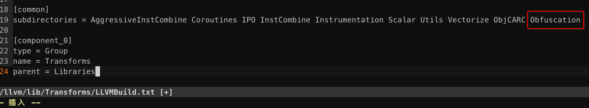

### 7. ==重新== 构建生成 LLVMSimplePass.dylib 动态库文件

#### 1. 重新生成 xcodeproj 工程配置文件

```
cd $LLVM_BUILD_ROOT
cmake ../llvm -G Xcode -DCMAKE_BUILD_TYPE=Debug
```

#### 2. 选择 Obfuscation target 构建

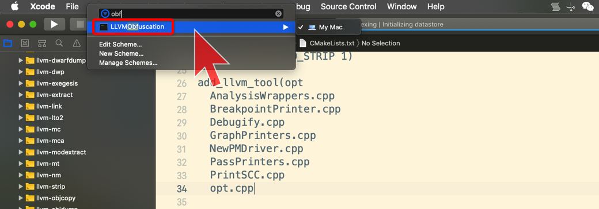

#### 3. 生成 pass dylib 动态库文件

```
cd $LLVM_BUILD_ROOT/Debug/lib
```

查看生成的 **LLVMObfuscation.dylib** 动态库文件

```
 ~/llvm_build/Debug/lib  ll | grep LLVMObfuscation
-rwxr-xr-x  1 xiongzenghui  staff    41K  6 28 16:02 LLVMObfuscation.dylib
```

### 8. test.c

```c
int add(int a, int b) {
  return a + b;
}
```


### 9. 生成 IR 中间文件

```
clang -S -emit-llvm test.c -o test.ll
```

add() 函数对应的 IR 代码如下:

```c
define i32 @add(i32, i32) #0 {
  %3 = alloca i32, align 4
  %4 = alloca i32, align 4
  store i32 %0, i32* %3, align 4
  store i32 %1, i32* %4, align 4
  %5 = load i32, i32* %3, align 4
  %6 = load i32, i32* %4, align 4
  %7 = add nsw i32 %5, %6 #=> 使用 add 指令
  ret i32 %7
}
```


### 10. xcode 编译运行 ==opt target== 来调试 SimplePass.cpp

#### 1. 选中 opt scheme

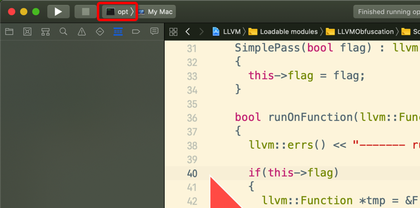

#### 2. edit opt scheme 设置 ==运行参数==

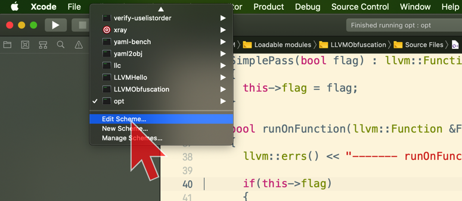

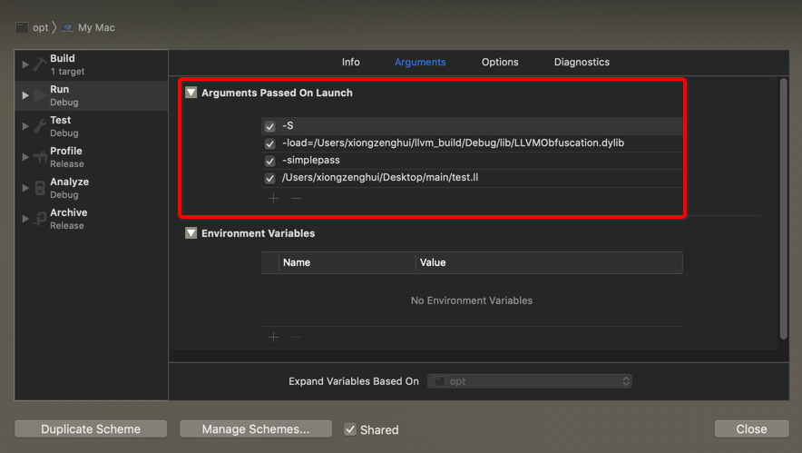

#### 3. SimplePass.cpp 可添加断点

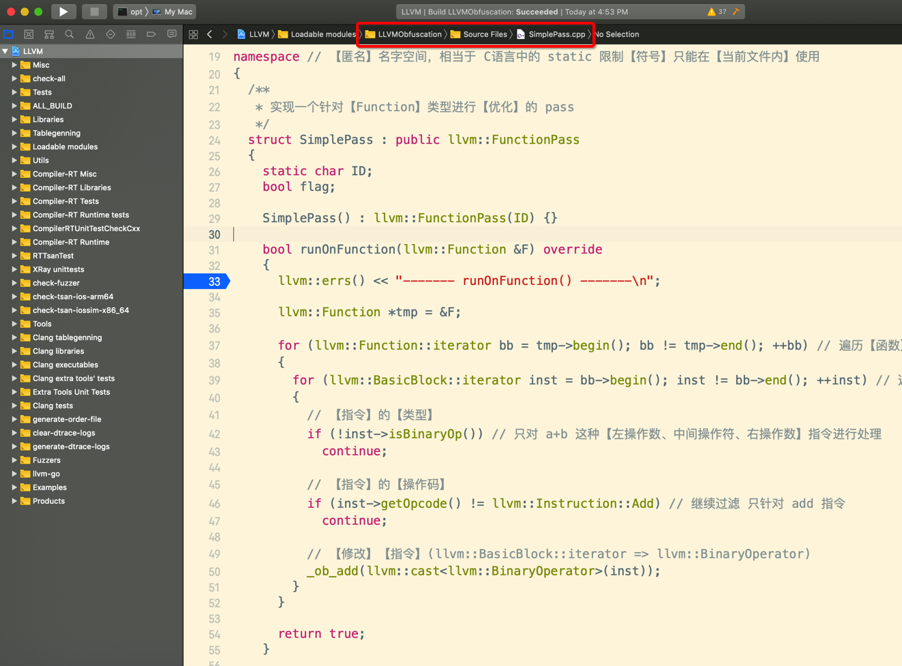

#### 4. run opt scheme 会停在 SimplePass.cpp 添加的 断点处

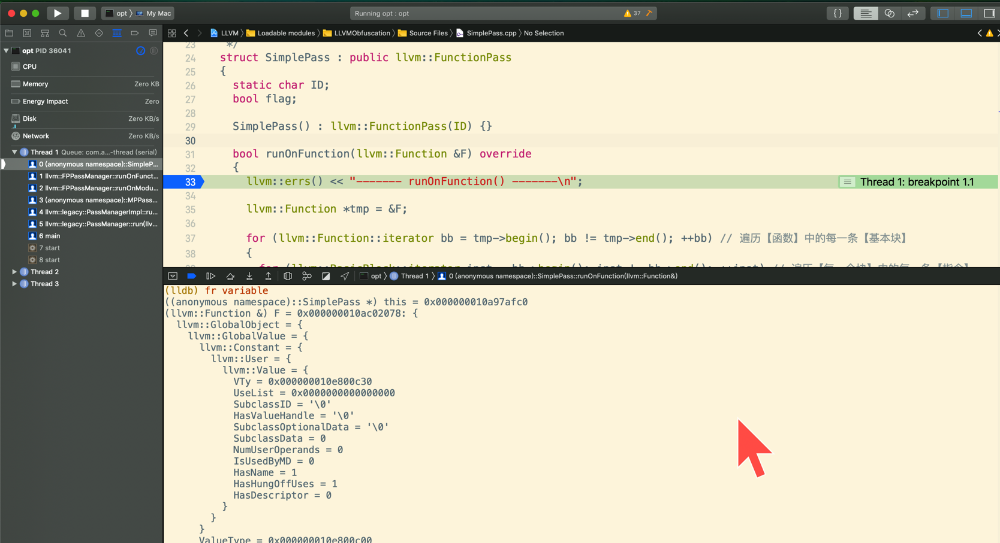

可以愉快的调试 SimplePass.cpp 开发自己的 LLVM Pass 了...

#### 5. opt 运行完毕后的 console 输出

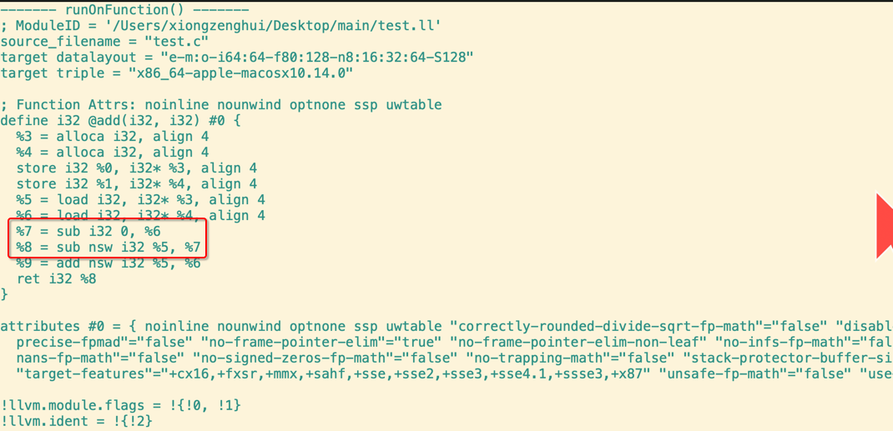

可以看到 IR 已经被修改了.


## 3. 运行 opt 时, 自动检测 pass 代码 ==是否修改== 联动编译

### 1. 默认情况当 pass 代码修改之后，必须手动重新构建 pass 生成新的 dylib 库文件

- 发现我修改 pass 代码之后
- 再次运行 opt 时
- 发现在之前 pass cpp 文件中打的 **断点** 都不起作用，而且代码也不执行

### 2. 修改 pass 源文件

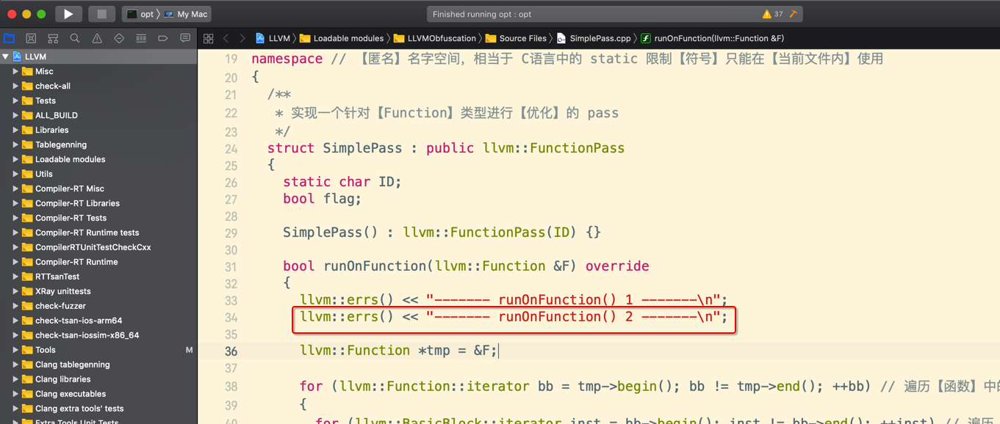

### 3. 设置 opt 发现代码修改后, 重新编译 pass 代码

#### 1. $LLVM_SOURCE_ROOT/lib/Transforms/Obfuscation/CMakeLists.txt

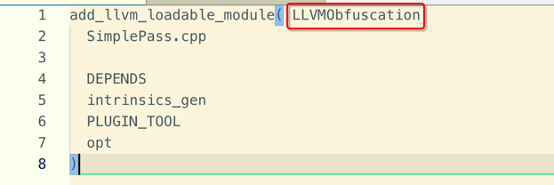

#### 2. $LLVM_SOURCE_ROOT/tools/opt/CMakeLists.txt

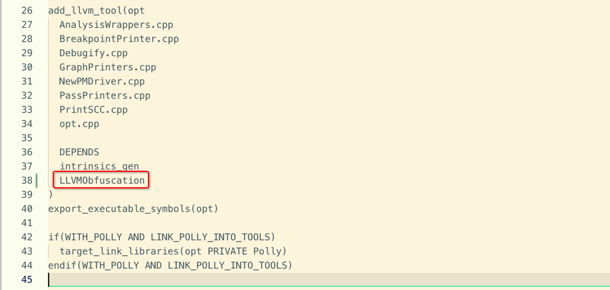

#### 3. 重新生成 LLVM.xcodeproj 工程配置文件

```
cd $LLVM_BUILD_ROOT
cmake ../llvm -G Xcode -DCMAKE_BUILD_TYPE=Debug
```

#### 4. 直接构建 opt scheme 即可调试 pass 文件的修改 

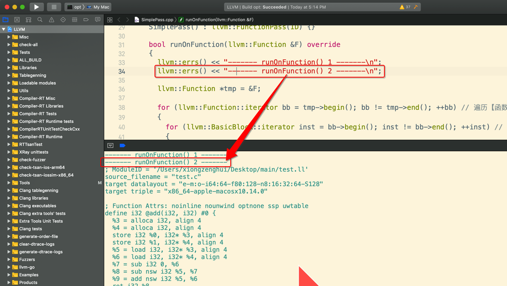