[TOC]


## 1. clang plugin

### 1. clang plugin 作用

- 针对 **语法树(AST)** 有完全的控制权
- 可作为 **插件** 注入到 **编译流程** 中, 可以影响 build 过程
- 针对 **语法树(AST)** 定义一些: 编码规范检查, 代码风格检查，命名检查 ...

### 2. 主要涉及的 llvm::clang AST 类

| AST 类                     | 作用                                                         |
| -------------------------- | ------------------------------------------------------------ |
| clang::PluginASTAction     | 基于 consumer 的 AST 前端 Action 抽象基类                    |
| clang::ASTConsumer         | 用于客户 **读取 AST** 的 抽象基类                            |
| clang::RecursiveASTVisitor | 前序或后续地深度优先 **搜索 整个 AST**, 并访问 **每一个节点** 的基类 |
| clang::MatchFinder         | 是一个 AST 节点的查找 **过滤匹配器**, 可以使用 addMatcher 函数 去匹配自己关注的 AST 节点 |

### 3. 编译时 插入自己开发的 clang plugin

#### 1. 直接使用 自己的 clang

```
$LLVM_BUILD_ROOT/Debug/bin/clang *** \
  -Xclang -load -Xclang <plugin.dylib路径> \
  -Xclang -add-plugin \
	-Xclang <插件名> \
  -Xclang <插件参数>
```

其中的 `$LLVM_BUILD_ROOT/Debug/bin/clang` 是我自己通过编译 LLVM/clang 源码生成的.

#### 2. 从 xcodebuild 日志中获得完整的 编译命令行, 再替换成 自己的 clang

```
clang -std=c++11 -stdlib=libc++ -L/opt/local/lib -
L/opt/llvm/llvm_build/lib  
-I/opt/llvm/llvm_build/tools/clang/include -
I/opt/llvm/llvm_build/include -
I/opt/llvm/llvm/tools/clang/include -I/opt/llvm/llvm/include -
dynamiclib -Wl,-headerpad_max_install_names -lclang -
lclangFrontend -lclangAST -lclangAnalysis -lclangBasic -
lclangCodeGen -lclangDriver -lclangFrontendTool -lclangLex -
lclangParse -lclangSema -lclangEdit -lclangSerialization -
lclangStaticAnalyzerCheckers -lclangStaticAnalyzerCore -
lclangStaticAnalyzerFrontend -lLLVMX86CodeGen -
lLLVMX86AsmParser -lLLVMX86Disassembler -lLLVMExecutionEngine 
-lLLVMAsmPrinter -lLLVMSelectionDAG -lLLVMX86AsmPrinter -
lLLVMX86Info -lLLVMMCParser -lLLVMCodeGen -lLLVMX86Utils -
lLLVMScalarOpts -lLLVMInstCombine -lLLVMTransformUtils -
lLLVMAnalysis -lLLVMTarget -lLLVMCore -lLLVMMC -lLLVMSupport -
lLLVMBitReader -lLLVMOption -lLLVMProfileData -lpthread -
lcurses -lz -lstdc++ -fPIC -fno-common -Woverloaded-virtual -
Wcast-qual -fno-strict-aliasing -pedantic -Wno-long-long -Wall 
-Wno-unused-parameter -Wwrite-strings -fno-rtti -fPIC 	
./printClsPlugin.cpp -o ClangPlugin.dylib
```


## 2. 使用 自己的 clang plugin

### 1. ==命令行== 直接使用 plugin

#### 1. test.m

```objective-c
// ocClsDemo.m
#import<UIKit/UIKit.h>
@interface MyViewController : UIViewController
@end

@implementation MyViewController
- (instancetype)init{
  if(self = [super init]){
  }
  return self;
}
@end
```

#### 2. clang 加载 plugin dylib

```
$LLVM_BUILD_ROOT/Debug/bin/clang \
  -isysroot /Applications/Xcode.app/Contents/Developer/Platforms/iPhoneSimulator.platform/Developer/SDKs/iPhoneSimulator12.1.sdk \
  -Xclang -load \
  -Xclang $LLVM_BUILD_ROOT/Debug/lib/MyPlugin.dylib \
  -Xclang -add-plugin \
  -Xclang MyPlugin \
  -c test.m
```

- 1、使用自己通过 **llvm 源码** 构建出来的 clang 可执行文件进行构建
  - 我编译出来的 clang 在 /opt/llvm/llvm_build/Debug/bin/clang 目录中
  - 所以使用 `/opt/llvm/llvm_build/Debug/bin/clang` 进行构建

- 2、指定 **iphone sdk** 路径
  - - 1) 当前使用的 Xcode 版本是 9.2
    - 2) 对应的是 iPhoneSimulator11.2.sdk
    - 3) 你需要进入该目录查看你的 sdk 版本

- 3、 `-Xclang -load -Xclang ./MyPlugin.dylib -Xclang -add-plugin -Xclang MyPlugin` 加载自己开发的 clang 插件
  - 1) `-Xclang -load -Xclang ./MyPlugin.dylib` 加载【clang 插件】的 **dylib**
  - 2) `-Xclang -add-plugin -Xclang MyPlugin` 加载【clang 插件】的 **可执行文件 MyPlugin**

#### 3. 输出如下

```
-------- ClassName:NSArray superClassName:NSObject
-------- ClassName:NSAttributedString superClassName:NSObject
-------- ClassName:NSString superClassName:NSObject
-------- ClassName:NSNull superClassName:NSObject
-------- ClassName:NSCharacterSet superClassName:NSObject
-------- ClassName:NSData superClassName:NSObject
-------- ClassName:NSDate superClassName:NSObject
-------- ClassName:NSTimeZone superClassName:NSObject
-------- ClassName:NSDictionary superClassName:NSObject
-------- ClassName:NSError superClassName:NSObject
-------- ClassName:NSLocale superClassName:NSObject
-------- ClassName:NSNumber superClassName:NSValue
-------- ClassName:NSSet superClassName:NSObject
-------- ClassName:NSURL superClassName:NSObject
-------- ClassName:NSString superClassName:NSObject
-------- ClassName:NSMethodSignature superClassName:NSObject
-------- ClassName:NSInvocation superClassName:NSObject
-------- ClassName:NSString superClassName:NSObject
-------- ClassName:NSString superClassName:NSObject
-------- ClassName:NSInvocation superClassName:NSObject
-------- ClassName:NSMethodSignature superClassName:NSObject
...........................................................................
...........................................................................
...........................................................................
-------- ClassName:UIImage superClassName:NSObject
-------- ClassName:UIDocumentBrowserAction superClassName:NSObject
-------- ClassName:ViewController superClassName:UIViewController
```

#### 4. 或者将 xcodebuild 输出命令行中的 clang 路径替换掉即可

直接替换 **红框的 clang** 为自己编译的 clang 即可.

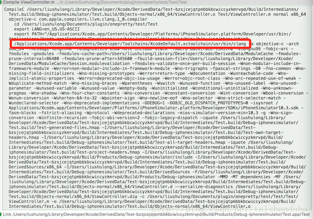

### 2. ==xcode== 集成 plugin

#### 1. 


### 1. 下载 XcodeHacking

解压后的目录结构

```
XcodeHacking  tree
.
├── HackedBuildSystem.xcspec
└── HackedClang.xcplugin
    └── Contents
        ├── Info.plist
        ├── Resources
        │   ├── Default\ Compiler.xcspec
        │   ├── English.lproj
        │   │   ├── Apple\ LLVM\ 5.0.strings
        │   │   └── Default\ Compiler.strings
        │   └── HackedClang.xcspec
        └── version.plist

4 directories, 7 files
```

- 1) HackedBuildSystem.xcspec **文件**
- 2) HackedClang.xcplugin **目录**

### 2. 修改 HackedClang.xcspec

HackedClang.xcplugin/Contents/Resources/HackedClang.xcspec 中默认的 clang 路径:

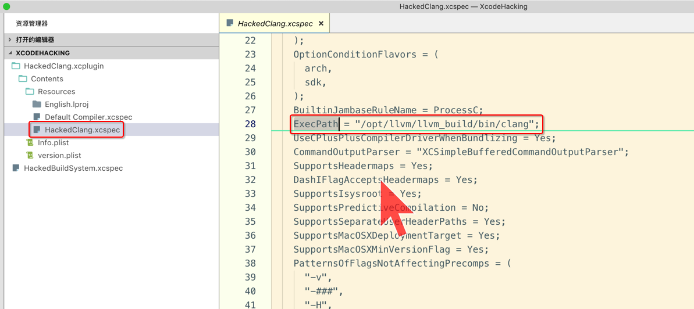

需要将 **ExecPath** 修改为自己 构建出来的【Clang 可执行文件】所在的目录路径


### 3. 将 HackedClang.xcplugin 拷贝到 xcode ==plugin== 目录

```
sudo mv HackedClang.xcplugin `xcode-select -print-path`/../PlugIns/Xcode3Core.ideplugin/Contents/SharedSupport/Developer/Library/Xcode/Plug-ins
```

### 4. 将 HackedBuildSystem.xcspec 拷贝到 xcode ==specifications== 目录

```
sudo mv HackedBuildSystem.xcspec `xcode-select -print-path`/Platforms/iPhoneSimulator.platform/Developer/Library/Xcode/Specifications
```

如果没有 **Specifications** 目录，则手动创建.

### 5. 重启 Xcode 进行设置

#### 1. 选择自己的 clang 可执行文件

- 1) 点击 Target 的 Build Settings

- 2)修改 **Compiler for C/C++/Objective-C** 项为 **Clang LLVM Trunk**

- **注意**: 如果不进行上面的 **hack Xcode** 操作的话是 **不会有** 这个选项的

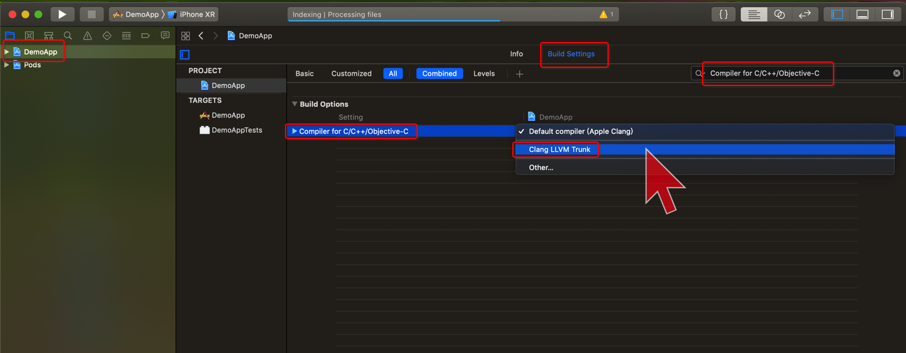

#### 2. 修改 OTHER_CFLAGS 选项 


```
-Xclang -load -Xclang /Users/xiongzenghui/llvm_build/Debug/lib/SameTypePlugin.dylib -Xclang -add-plugin -Xclang SameTypePlugin
```

注意

- 1) 将 /Users/Vernon/Desktop/MyPlugin.dylib 修改为你生成的 **clang插件** 所在的路径
- 2) 如果编译中出现一大堆系统库的 **symbol not found** 错误的话，可以在上述命令的最后手动指定你的 **iphone SDK 目录**

  ```
  - -isysroot /Applications/Xcode.app/Contents/Developer/Platforms/iPhoneSimulator.platform/Developer/SDKs/iPhoneSimulator11.2.sdk
  ```

### 6. xcode 构建时查看自定义插件的输出 

- 1、快捷键 Command+9 跳到 Show the Report navigator
- 2、选中刚刚的编译报告
- 3、注意下图中每个文件右上角都有可以点击展开的按钮
- 4、展开后就能看到自定义clang插件的输出


## 4. 实现一个简单的 clang plugin

### 1. cd $LLVM_SOURCE_ROOT/tools/clang/tools

```
 ~/llvm/tools/clang/tools   release_70  ll
total 8
-rw-r--r--   1 xiongzenghui  staff   1.2K  6 27 00:51 CMakeLists.txt
drwxr-xr-x   4 xiongzenghui  staff   128B  6 27 00:51 arcmt-test
drwxr-xr-x   4 xiongzenghui  staff   128B  6 27 00:51 c-arcmt-test
drwxr-xr-x   5 xiongzenghui  staff   160B  6 27 00:51 c-index-test
drwxr-xr-x   4 xiongzenghui  staff   128B  6 27 00:51 clang-check
drwxr-xr-x   4 xiongzenghui  staff   128B  6 27 00:51 clang-diff
drwxr-xr-x  12 xiongzenghui  staff   384B  6 27 00:51 clang-format
drwxr-xr-x   8 xiongzenghui  staff   256B  6 27 00:51 clang-format-vs
drwxr-xr-x   4 xiongzenghui  staff   128B  6 27 00:51 clang-func-mapping
drwxr-xr-x  17 xiongzenghui  staff   544B  6 27 00:51 clang-fuzzer
drwxr-xr-x   4 xiongzenghui  staff   128B  6 27 00:51 clang-import-test
drwxr-xr-x   4 xiongzenghui  staff   128B  6 27 00:51 clang-offload-bundler
drwxr-xr-x   7 xiongzenghui  staff   224B  6 27 00:51 clang-refactor
drwxr-xr-x   6 xiongzenghui  staff   192B  6 27 00:51 clang-rename
drwxr-xr-x   3 xiongzenghui  staff    96B  6 27 00:51 diag-build
drwxr-xr-x  12 xiongzenghui  staff   384B  6 27 00:51 diagtool
drwxr-xr-x   8 xiongzenghui  staff   256B  6 27 00:51 driver
drwxr-xr-x  25 xiongzenghui  staff   800B  6 27 00:51 extra
drwxr-xr-x  37 xiongzenghui  staff   1.2K  6 27 00:51 libclang
drwxr-xr-x   7 xiongzenghui  staff   224B  6 27 00:51 scan-build
drwxr-xr-x   7 xiongzenghui  staff   224B  6 27 00:51 scan-build-py
drwxr-xr-x   5 xiongzenghui  staff   160B  6 27 00:51 scan-view
```

- 这下面都是一个个的 **目录**
- 每一个 **目录** 都是一个 **clang plugin** 的 **源码目录**

### 2. 创建 myplugin 开发目录

```
 ~/llvm/tools/clang/tools/myplugin   release_70 ●  tree
.
├── CMakeLists.txt
└── MyPlugin.cpp
```

### 3. myplugin/CMakeLists.txt

```cmake
add_llvm_loadable_module(MyPlugin
MyPlugin.cpp
PLUGIN_TOOL clang
)

if(LLVM_ENABLE_PLUGINS AND (WIN32 OR CYGWIN))
  target_link_libraries(MyPlugin PRIVATE
    clangAST
    clangBasic
    clangFrontend
    clangLex
    LLVMSupport
    )
endif()
```

### 4. myplugin/MyPlugin.cpp

```c++
#include "clang/AST/AST.h"
#include "clang/AST/ASTConsumer.h"
#include "clang/AST/RecursiveASTVisitor.h"
#include "clang/Frontend/CompilerInstance.h"
#include "clang/Frontend/FrontendPluginRegistry.h"

#include <iostream>

using namespace clang;
using namespace std;
using namespace llvm;

namespace MyPlugin {
  class MyASTVisitor : public RecursiveASTVisitor<MyASTVisitor> {
  private:
    ASTContext *context;

  public:
    void setContext(ASTContext &context) { this->context = &context; }

    bool VisitDecl(Decl *decl) {
      if (isa<ObjCInterfaceDecl>(decl)) {
        ObjCInterfaceDecl *interDecl = (ObjCInterfaceDecl *)decl;
        if (interDecl->getSuperClass()) {
          string interName = interDecl->getNameAsString();
          string superClassName = interDecl->getSuperClass()->getNameAsString();

          cout << "-------- ClassName:" << interName
              << " superClassName:" << superClassName << endl;
        }
      }

      return true;
    }
  };

  class MyASTConsumer : public ASTConsumer {
  private:
    MyASTVisitor visitor;
    void HandleTranslationUnit(ASTContext &context) {
      visitor.setContext(context);
      visitor.TraverseDecl(context.getTranslationUnitDecl());
    }
  };
  
  class MyASTAction : public PluginASTAction {
  public:
    unique_ptr<ASTConsumer> CreateASTConsumer(CompilerInstance &Compiler,
                                              StringRef InFile) {
      return unique_ptr<MyASTConsumer>(new MyASTConsumer);
    }
    bool ParseArgs(const CompilerInstance &CI,
                  const std::vector<std::string> &args) {
      return true;
    }
  };
} // namespace MyPlugin

static clang::FrontendPluginRegistry::Add<MyPlugin::MyASTAction> X("MyPlugin", "MyPlugin desc");
```

先不管代码实现，先跑起来再说.

### 5. 修改 $LLVM_SOURCE_ROOT/tools/clang/tools/CMakeLists.txt 注册 plugin 源码目录的路径

```makefile
................

add_clang_subdirectory(myplugin) # 末尾注册自己的【clang plugin 源码】目录名
```

### 6. 重新生成 LLVM.xcodeproj

#### 1. cmake generate xcodeproj

```
cd $LLVM_BUILD_ROOT
cmake ../llvm -G Xcode -DCMAKE_BUILD_TYPE=Debug
```

#### 2. 如果报错如下

```
...............

-- Linker detection: ld64
LLVM STATUS:
  Definitions -D_DEBUG -D__STDC_CONSTANT_MACROS -D__STDC_FORMAT_MACROS -D__STDC_LIMIT_MACROS
  Includes    /Users/xiongzenghui/llvm/include;/Users/xiongzenghui/llvm_build/include
              /Users/xiongzenghui/llvm/tools/clang/include;/Users/xiongzenghui/llvm_build/tools/clang/include
  Libraries   /Users/xiongzenghui/llvm_build/$(CONFIGURATION)$(EFFECTIVE_PLATFORM_NAME)/lib
CMake Warning (dev) at cmake/modules/AddLLVM.cmake:882 (if):
  Policy CMP0057 is not set: Support new IN_LIST if() operator.  Run "cmake
  --help-policy CMP0057" for policy details.  Use the cmake_policy command to
  set the policy and suppress this warning.

  IN_LIST will be interpreted as an operator when the policy is set to NEW.
  Since the policy is not set the OLD behavior will be used.
Call Stack (most recent call first):
  tools/bugpoint/CMakeLists.txt:24 (add_llvm_tool)
This warning is for project developers.  Use -Wno-dev to suppress it.

CMake Error at cmake/modules/AddLLVM.cmake:882 (if):
  if given arguments:

    "bugpoint" "IN_LIST" "LLVM_TOOLCHAIN_TOOLS" "OR" "NOT" "LLVM_INSTALL_TOOLCHAIN_ONLY"

  Unknown arguments specified
Call Stack (most recent call first):
  tools/bugpoint/CMakeLists.txt:24 (add_llvm_tool)


-- Configuring incomplete, errors occurred!
See also "/Users/xiongzenghui/llvm_build/CMakeFiles/CMakeOutput.log".
See also "/Users/xiongzenghui/llvm_build/CMakeFiles/CMakeError.log".
```

看样子好像是 **cmake 语法** 有问题.

#### 3. 发现 clang-plugins-demo/CMakeLists.txt 中使用 ==2.8== 版本的 cmake

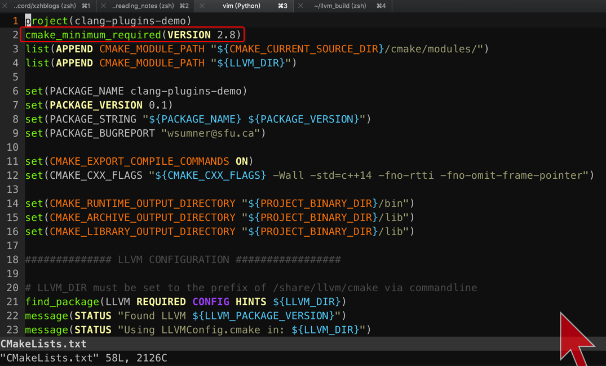

#### 4. 但是我本机中装的是 ==3.13.3== 版本的 cmake

```
 ~/Desktop  cmake --version
cmake version 3.13.3

CMake suite maintained and supported by Kitware (kitware.com/cmake).
```

所以可能是 cmake 版本不对的问题.

#### 5. 修改 clang-plugins-demo/CMakeLists.txt 使用本机的 ==3.13.3== 版本

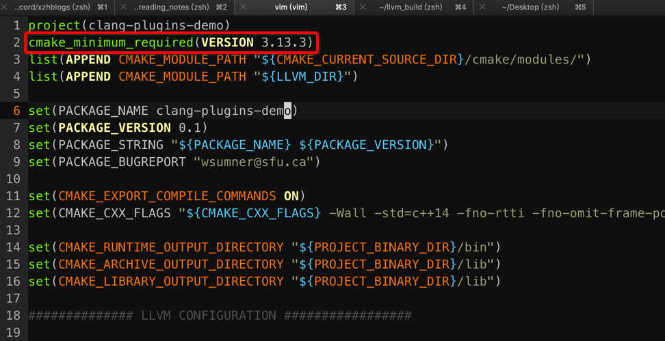

#### 6. 再次重新 generate xcodeproj

```
cmake ../llvm -G Xcode -DCMAKE_BUILD_TYPE=Debug
```

ok.

### 7. 重新构建 clang

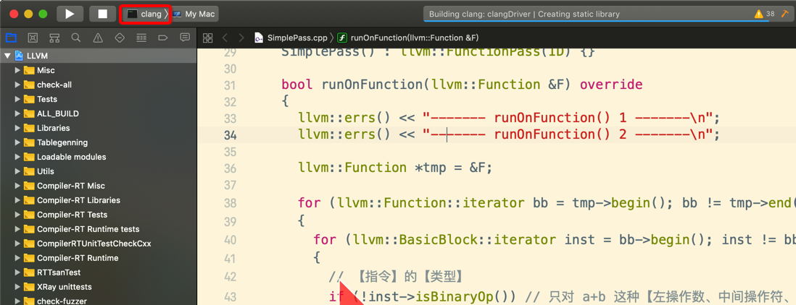

### 8. 构建 自己的 clang plugin

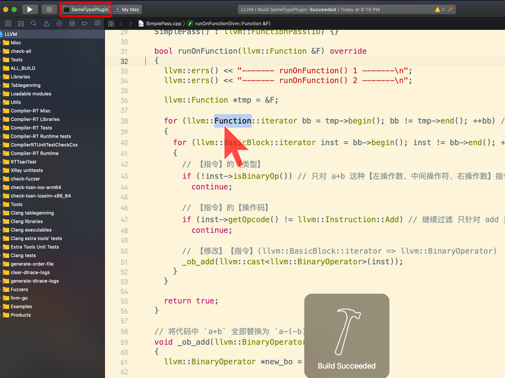

```
 ~/llvm_build/Debug/lib  ll | grep -i same
-rwxr-xr-x  1 xiongzenghui  staff   1.2M  6 28 20:16 SameTypePlugin.dylib
```

#### 1. ~~clang-plugins-demo、及其子目录下, 并没有发现 `add_llvm_loadable_module()` cmake 函数使用~~

通常是这样的


比如之前的 demo llvm pass 下的 CMakeLists.txt 指定在 xcode 中的 target

```cmake
add_llvm_loadable_module( LLVMObfuscation
  SimplePass.cpp

  DEPENDS
  intrinsics_gen
  PLUGIN_TOOL
  opt
)
```


#### 2. ~~但是发现却有 `add_executable()` cmake 函数使用~~

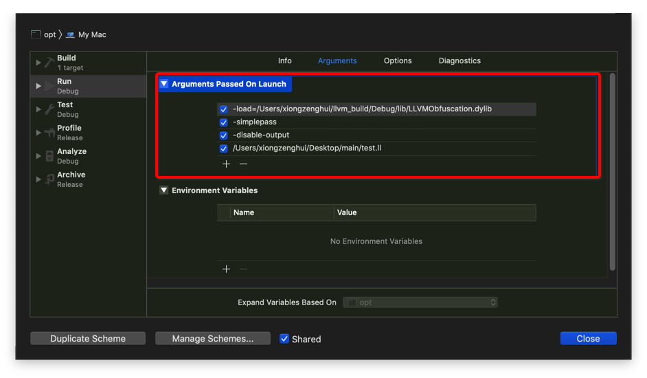

----------

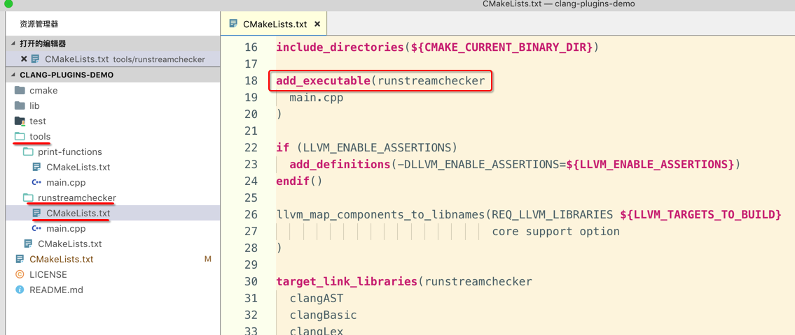

#### 3. ~~xcode 存在对应的 target~~

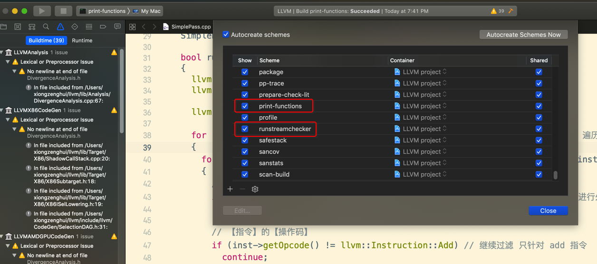

依次选择 scheme 进行构建

### 9. libclang.dylib

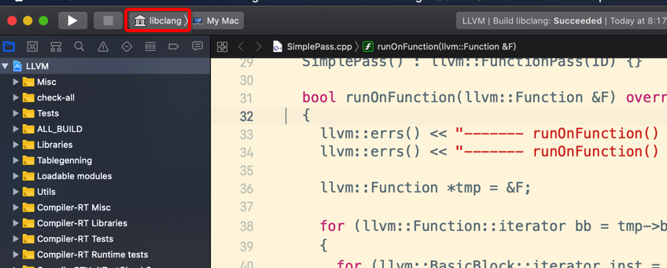


