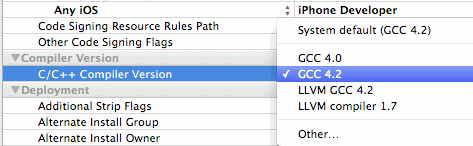
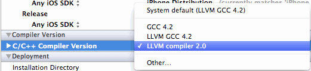
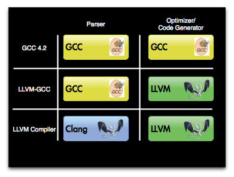

[TOC]


## 1. mac os 中自带的 gcc g++ 并不是 GNU gcc g++

```
 ~  gcc --version
Configured with: --prefix=/Applications/Xcode.app/Contents/Developer/usr --with-gxx-include-dir=/Applications/Xcode.app/Contents/Developer/Platforms/MacOSX.platform/Developer/SDKs/MacOSX10.14.sdk/usr/include/c++/4.2.1
Apple LLVM version 10.0.0 (clang-1000.11.45.5)
Target: x86_64-apple-darwin18.0.0
Thread model: posix
InstalledDir: /Applications/Xcode.app/Contents/Developer/Toolchains/XcodeDefault.xctoolchain/usr/bin
```

最终分别指向 clang 和 clang++


## 2. 苹果 clang/LLVM 发展历程

### 1. Xcode 3 Compiler Verisons



----

- 1) GCC 4.0
- 2) GCC 4.2
- 3) **LLVM** GCC 4.2
- 4) **LLVM compiler** 1.7

### 2. Xcode 4 Compiler Versions



---------

- 1) GCC 4.2
- 2) **LLVM** GCC 4.2
- 3) **LLVM compiler** 2.0

### 3. apple 编译器 经历了3个阶段



| apple 编译器版本             | 前端  | 优化器、代码生成器 |
| ---------------------------- | ----- | ------------------ |
| GCC 4.2                      | GCC   | GCC                |
| LLVM-GCC                     | GCC   | LLVM               |
| LLVM Compiler (彻底抛弃 GCC) | Clang | LLVM               |

所以现在的 xcode 已经完全抛弃 GCC


## 3. main.c => LLVM => a.out

### 1. C/C++ 源文件

```c
#include <stdio.h>

struct Dog
{
  char name[64];
  int age;
};

int main()
{
  int age = 99;
  struct Dog dog = {
    "hashiqi",
    age
  };
}
```

### 2. main.c => main.ll (LLVM IR)

```
clang -emit-llvm -S main.c
```

生成的 main.ll 

```c
; ModuleID = 'main.c'
source_filename = "main.c"
target datalayout = "e-m:o-i64:64-f80:128-n8:16:32:64-S128"
target triple = "x86_64-apple-macosx10.13.0"

%struct.Dog = type { [64 x i8], i32 }

@.str = private unnamed_addr constant [64 x i8] c"hashiqi\00\00\00\00\00\00\00\00\00\00\00\00\00\00\00\00\00\00\00\00\00\00\00\00\00\00\00\00\00\00\00\00\00\00\00\00\00\00\00\00\00\00\00\00\00\00\00\00\00\00\00\00\00\00\00\00\00", align 1

; Function Attrs: noinline nounwind optnone ssp uwtable
define i32 @main() #0 {
  %1 = alloca i32, align 4
  %2 = alloca %struct.Dog, align 4
  store i32 99, i32* %1, align 4
  %3 = getelementptr inbounds %struct.Dog, %struct.Dog* %2, i32 0, i32 0
  %4 = bitcast [64 x i8]* %3 to i8*
  call void @llvm.memcpy.p0i8.p0i8.i64(i8* %4, i8* getelementptr inbounds ([64 x i8], [64 x i8]* @.str, i32 0, i32 0), i64 64, i32 1, i1 false)
  %5 = getelementptr inbounds %struct.Dog, %struct.Dog* %2, i32 0, i32 1
  %6 = load i32, i32* %1, align 4
  store i32 %6, i32* %5, align 4
  ret i32 0
}

; Function Attrs: argmemonly nounwind
declare void @llvm.memcpy.p0i8.p0i8.i64(i8* nocapture writeonly, i8* nocapture readonly, i64, i32, i1) #1

attributes #0 = { noinline nounwind optnone ssp uwtable "correctly-rounded-divide-sqrt-fp-math"="false" "disable-tail-calls"="false" "less-precise-fpmad"="false" "no-frame-pointer-elim"="true" "no-frame-pointer-elim-non-leaf" "no-infs-fp-math"="false" "no-jump-tables"="false" "no-nans-fp-math"="false" "no-signed-zeros-fp-math"="false" "no-trapping-math"="false" "stack-protector-buffer-size"="8" "target-cpu"="penryn" "target-features"="+cx16,+fxsr,+mmx,+sse,+sse2,+sse3,+sse4.1,+ssse3,+x87" "unsafe-fp-math"="false" "use-soft-float"="false" }
attributes #1 = { argmemonly nounwind }

!llvm.module.flags = !{!0, !1}
!llvm.ident = !{!2}

!0 = !{i32 1, !"wchar_size", i32 4}
!1 = !{i32 7, !"PIC Level", i32 2}
!2 = !{!"Apple LLVM version 9.1.0 (clang-902.0.39.2)"}
```

### 3. opt 执行优化等级对应的 pass 优化 LLVM IR (xx.ll)

```
/usr/xiong/llvm/bin/opt -O1 -S main.ll -o main_O1.ll
/usr/xiong/llvm/bin/opt -O2 -S main.ll -o main_O2.ll
/usr/xiong/llvm/bin/opt -O3 -S main.ll -o main_O3.ll
```

### 4. LLVM IR (main.ll) => bitcode (main.bc)

```
llvm-as main.ll -o main.bc
```

得到的 main.bc

- 1) **二进制** 的文件格式
- 2) 直接 **文本** 编辑器打开是 **乱码**

### 5. link xx.bc (bitcode)

```
llvm-link main.bc sum.bc -o output.bc
```

### 6. xx.bc => xx.o

#### 1. 一步到位

```
llc -filetype=obj main.bc -o main.o
```

#### 2. main.bc (bitcode) => main.s (具体 CPU 架构」下的「汇编代码」)

```
llc main.bc -o main.s
```

#### 3. main.s => main.o

```
clang main.s -o main.o
```

### 7. xx.o => a.out

- 1) 应该是使用 **llvm-ld** 完成 **链接** 步骤
- 2) 但是与 linux **gcc-ld** 类似，需要加很多的预定义链接文件、二进制库

```
clang main.o
./a.out
```

可以加上 `-v` 参数查看链接的过程:

```
 ~/Desktop/main  clang main.o -v
Apple LLVM version 10.0.0 (clang-1000.11.45.5)
Target: x86_64-apple-darwin18.0.0
Thread model: posix
InstalledDir: /Applications/Xcode.app/Contents/Developer/Toolchains/XcodeDefault.xctoolchain/usr/bin
 "/Applications/Xcode.app/Contents/Developer/Toolchains/XcodeDefault.xctoolchain/usr/bin/ld" -demangle -lto_library /Applications/Xcode.app/Contents/Developer/Toolchains/XcodeDefault.xctoolchain/usr/lib/libLTO.dylib -dynamic -arch x86_64 -macosx_version_min 10.14.0 -syslibroot /Applications/Xcode.app/Contents/Developer/Platforms/MacOSX.platform/Developer/SDKs/MacOSX10.14.sdk -o a.out main.o -L/usr/local/lib -lSystem /Applications/Xcode.app/Contents/Developer/Toolchains/XcodeDefault.xctoolchain/usr/lib/clang/10.0.0/lib/darwin/libclang_rt.osx.a
```

### 8.  clang -ccc-print-phases 查看具体步骤

```
$ clang -ccc-print-phases main.c
0: input, "main.c", c
1: preprocessor, {0}, cpp-output
2: compiler, {1}, ir
3: backend, {2}, assembler
4: assembler, {3}, object
5: linker, {4}, image
6: bind-arch, "x86_64", {5}, image
```


## 4. xcrun 内部调用 clang

### 1. xcrun 可执行文件

```
 ~/Desktop  which xcrun
/usr/bin/xcrun
```

### 2. objc 代码

```objective-c
#import <Foundation/Foundation.h>

int main(){
  @autoreleasepool {
    NSLog(@"Hello");
  }
  return 0;
}
```

### 3. compile 编译

```
xcrun -sdk iphoneos clang -arch armv7 -F Foundation -fobjc-arc -c main.m -o main.o
```

### 4. link 链接

```
xcrun -sdk iphoneos clang main.o -arch armv7 -fobjc-arc -framework Foundation -o main
```

### 5. exec 运行

```
➜  Book file main
main: Mach-O executable arm
➜  Book
```

- 生成的是 **arm** 格式的可执行程序
- 只能在 **arm** 架构 cpu 执行

### 6. 反汇编 main.c

```
xcrun -sdk iphoneos clang -arch arm64 -S main.c
```


## 5. clang 三大组件

- 1) libclang
- 2) plugins
- 3) libtooling