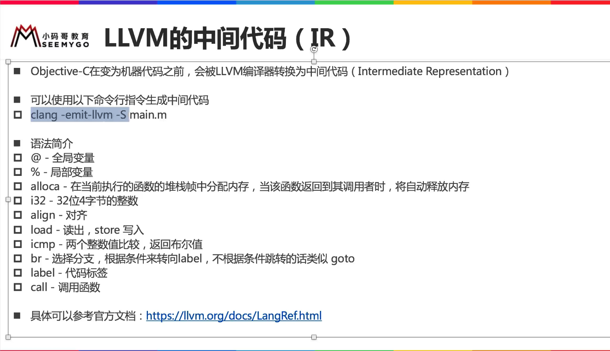

[TOC]


## 1. 生成 xx.ll (IR) 中间文件

sum.c

```c
int sum(int x, int y) {
  return x+y;
}
```

生成 **sum.ll** IR 中间文件

```
clang -emit-llvm -S sum.c
```


## 2. IR 语法规则




## 3. 标识符 (符号)

### 1. ==全局== 符号: 以 ==@== 开头

#### 1. 定义语法

```c
[@<GlobalVarName> =] [Linkage] [Visibility] [DLLStorageClass] [ThreadLocal]
                     [unnamed_addr] [AddrSpace] [ExternallyInitialized]
                     <global | constant> <Type> [<InitializerConstant>]
                     [, section "name"] [, comdat [($name)]]
                     [, align <Alignment>]
```

#### 2. C 代码

```c
char* name = "12341232";

int main() {
  printf("%s\n", name);
}
```

#### 3. IR 代码

```c
@.str = private unnamed_addr constant [9 x i8] c"12341232\00", align 1
@name = global i8* getelementptr inbounds ([9 x i8], [9 x i8]* @.str, i32 0, i32 0), align 8
@.str.1 = private unnamed_addr constant [4 x i8] c"%s\0A\00", align 1

; Function Attrs: noinline nounwind optnone ssp uwtable
define i32 @main() #0 {
  %1 = load i8*, i8** @name, align 8
  %2 = call i32 (i8*, ...) @printf(i8* getelementptr inbounds ([4 x i8], [4 x i8]* @.str.1, i32 0, i32 0), i8* %1)
  ret i32 0
}

declare i32 @printf(i8*, ...) #1
```

#### 4. 其中的

```c
@.str = private unnamed_addr constant [9 x i8] c"12341232\00", align 1
```

```c
@.str.1 = private unnamed_addr constant [4 x i8] c"%s\0A\00", align 1
```

#### 5. 其他例子

```c
@G = addrspace(5) constant float 1.0, section "foo", align 4
```

### 2. ==局部== 符号: 以 ==%== 开头

```c
%foo
@DivisionByZero
%a.really.long.identifier
```

### 3. tmp.c

```c
int val1 = 99;
static char* val2 = "haha";

int main(){
  int val3 = 0;
}
```

### 4. 生成 tmp.ll

```
clang -emit-llvm -S tmp.c
```

### 5. tmp.ll

```c
; ModuleID = 'tmp.c'
source_filename = "tmp.c"
target datalayout = "e-m:o-i64:64-f80:128-n8:16:32:64-S128"
target triple = "x86_64-apple-macosx10.14.0"

@val1 = global i32 99, align 4

; Function Attrs: noinline nounwind optnone ssp uwtable
define i32 @main() #0 {
  %1 = alloca i32, align 4
  store i32 0, i32* %1, align 4
  ret i32 0
}

attributes #0 = { noinline nounwind optnone ssp uwtable "correctly-rounded-divide-sqrt-fp-math"="false" "disable-tail-calls"="false" "less-precise-fpmad"="false" "no-frame-pointer-elim"="true" "no-frame-pointer-elim-non-leaf" "no-infs-fp-math"="false" "no-jump-tables"="false" "no-nans-fp-math"="false" "no-signed-zeros-fp-math"="false" "no-trapping-math"="false" "stack-protector-buffer-size"="8" "target-cpu"="penryn" "target-features"="+cx16,+fxsr,+mmx,+sahf,+sse,+sse2,+sse3,+sse4.1,+ssse3,+x87" "unsafe-fp-math"="false" "use-soft-float"="false" }

!llvm.module.flags = !{!0, !1}
!llvm.ident = !{!2}

!0 = !{i32 1, !"wchar_size", i32 4}
!1 = !{i32 7, !"PIC Level", i32 2}
!2 = !{!"Apple LLVM version 10.0.0 (clang-1000.11.45.5)"}
```

### 6. 核心部分

```c
@val1 = global i32 99, align 4

; Function Attrs: noinline nounwind optnone ssp uwtable
define i32 @main() #0 {
  %1 = alloca i32, align 4
  store i32 0, i32* %1, align 4
  ret i32 0
}
```

### 7.全局 ==变量== 符号

```
@val1 = global i32 99, align 4
```

### 8. 全局 ==函数== 符号 (函数默认就是全局的)

```
define i32 @main() #0 {
  ...
}
```

### 9. 局部 ==变量== 符号

函数内的 `%1` 表示 **局部** 变量

```c
define i32 @main() #0 {
  %1 = alloca i32, align 4
  ...
}
```


## 4. struct

### 1. C 文件

```c
struct person {
  int age;
  char name[64];
  char* favor;
};

int main() {
  struct person p = {99, "1111111", "2222222"};
}
```

### 2. 生成 IR 文件

```
clang -emit-llvm -S tmp.c
```

### 3. IR 文件

```c
// 1. 定义 struct 结构体
%struct.person = type { i32, [64 x i8], i8* }

// 2.【全局】常量字符串 "2222222222"
@.str = private unnamed_addr constant [8 x i8] c"2222222\00", align 1

// 3. main() 函数内 struct person 的【第一个】实例符号
@main.p = private unnamed_addr constant %struct.person { i32 99, [64 x i8] c"1111111\00\00\00\00\00\00\00\00\00\00\00\00\00\00\00\00\00\00\00\00\00\00\00\00\00\00\00\00\00\00\00\00\00\00\00\00\00\00\00\00\00\00\00\00\00\00\00\00\00\00\00\00\00\00\00\00\00", i8* getelementptr inbounds ([8 x i8], [8 x i8]* @.str, i32 0, i32 0) }, align 8

// 4. main()
; Function Attrs: noinline nounwind optnone ssp uwtable
define i32 @main() #0 {
  // 1. 分配局部存储空间
  %1 = alloca %struct.person, align 8
  %2 = bitcast %struct.person* %1 to i8*

  // 2. memcpy() 拷贝数据到【局部存储】
  call void @llvm.memcpy.p0i8.p0i8.i64(i8* %2, i8* bitcast (%struct.person* @main.p to i8*), i64 80, i32 8, i1 false)

  // 3. return 0
  ret i32 0
}
```

### 4. 同一个 struct 化多个实例

```c
struct person {
  int age;
  char name[64];
  char* favor;
};

int main() {
  struct person p1 = {99, "1111111", "2222222"};
  struct person p2 = {99, "1111111", "2222222"};
}
```

```c
// 1. 定义 struct 结构体
%struct.person = type { i32, [64 x i8], i8* }

// 2.【全局】常量字符串 "2222222222"
@.str = private unnamed_addr constant [8 x i8] c"2222222\00", align 1

// 3. main() 函数内 struct person 的【第一个】实例符号
@main.p1 = private unnamed_addr constant %struct.person { i32 99, [64 x i8] c"1111111\00\00\00\00\00\00\00\00\00\00\00\00\00\00\00\00\00\00\00\00\00\00\00\00\00\00\00\00\00\00\00\00\00\00\00\00\00\00\00\00\00\00\00\00\00\00\00\00\00\00\00\00\00\00\00\00\00", i8* getelementptr inbounds ([8 x i8], [8 x i8]* @.str, i32 0, i32 0) }, align 8

// 4. main() 函数内 struct person 的【第二个】实例符号
@main.p2 = private unnamed_addr constant %struct.person { i32 99, [64 x i8] c"1111111\00\00\00\00\00\00\00\00\00\00\00\00\00\00\00\00\00\00\00\00\00\00\00\00\00\00\00\00\00\00\00\00\00\00\00\00\00\00\00\00\00\00\00\00\00\00\00\00\00\00\00\00\00\00\00\00\00", i8* getelementptr inbounds ([8 x i8], [8 x i8]* @.str, i32 0, i32 0) }, align 8

// 5. main()
; Function Attrs: noinline nounwind optnone ssp uwtable
define i32 @main() #0 {
  // 1.
  %1 = alloca %struct.person, align 8
  %2 = alloca %struct.person, align 8

  // 2.
  %3 = bitcast %struct.person* %1 to i8*

  // 3. memcpy() 第一个 struct 实例的内存
  call void @llvm.memcpy.p0i8.p0i8.i64(i8* %3, i8* bitcast (%struct.person* @main.p1 to i8*), i64 80, i32 8, i1 false)

  // 4. memcpy() 第二个 struct 实例的内存
  %4 = bitcast %struct.person* %2 to i8*
  call void @llvm.memcpy.p0i8.p0i8.i64(i8* %4, i8* bitcast (%struct.person* @main.p2 to i8*), i64 80, i32 8, i1 false)

  // 5. return 0
  ret i32 0
}
```


## 5. enum

```c
enum date {
  mon = 1,
  two,
  three
};

int main() {
  enum date d = two;
}
```

```c
; Function Attrs: noinline nounwind optnone ssp uwtable
define i32 @main() #0 {
  // 1. 函数内分配4字节大小的内存块
  %1 = alloca i32, align 4

  // 2. 将【数值2】写入到【局部内存】中，写入长度为【4字节】
  store i32 2, i32* %1, align 4
  ret i32 0
}
```


## 6. 函数

### 1. 定义语法

```c
define [linkage] [visibility] [DLLStorageClass]
       [cconv] [ret attrs]
       <ResultType> @<FunctionName> ([argument list])
       [unnamed_addr] [fn Attrs] [section "name"] [comdat [($name)]]
       [align N] [gc] [prefix Constant] [prologue Constant]
       [personality Constant] (!name !N)* { ... }
```

### 2. main()

```c
int main(int argc, char* argr[]) {
  return 99;
}
```

```c
; Function Attrs: noinline nounwind optnone ssp uwtable
define i32 @main(i32, i8**) #0 {
  %3 = alloca i32, align 4
  %4 = alloca i32, align 4
  %5 = alloca i8**, align 8
  store i32 0, i32* %3, align 4
  store i32 %0, i32* %4, align 4
  store i8** %1, i8*** %5, align 8
  ret i32 99
}
```

### 3. add()

```c
int add(int x, int y) {
  return x+y;
}
```

```c
; Function Attrs: noinline nounwind optnone ssp uwtable
define i32 @add(i32, i32) #0 {
  // 1. 局部存储 int x
  %3 = alloca i32, align 4
  
  // 2. 局部存储 int y
  %4 = alloca i32, align 4
  
  // 3.【函数参数1】写入【局部 x】
  store i32 %0, i32* %3, align 4

  // 4.【函数参数2】写入【局部 y】
  store i32 %1, i32* %4, align 4

  // 5. 将【局部 x】和【局部 y】加载到【CPU 寄存器】
  %5 = load i32, i32* %3, align 4
  %6 = load i32, i32* %4, align 4

  // 6. 让【CPU】执行【add 加法运算】，并将【返回值】写入到【局部 %7】中
  %7 = add nsw i32 %5, %6

  // 7. 返回 【局部 %7】中的【值】
  ret i32 %7
}
```


