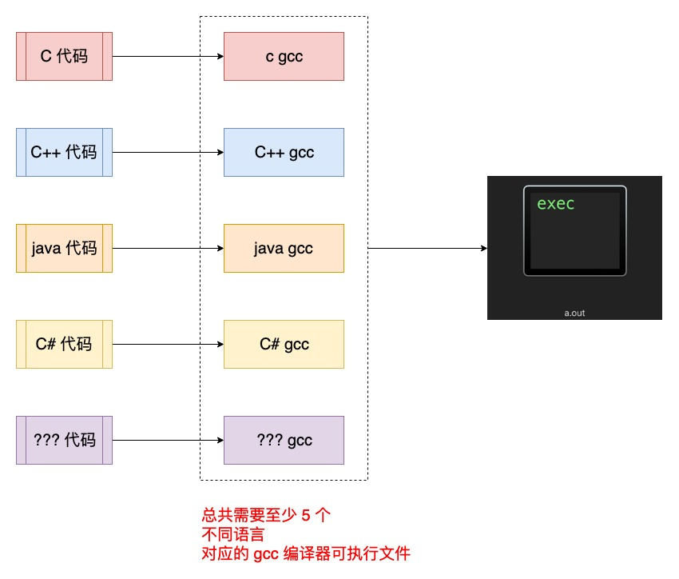

[TOC]

## 1. LLVM 由如下 ==sub-projects== 组成 (http://llvm.org)

### 1. LLVM Core

The **LLVM Core** libraries provide a modern source- and target-independent optimizer, along with code generation support for many popular CPUs (as well as some less common ones!) These libraries are built around a well specified code representation known as the LLVM intermediate representation ("LLVM IR"). The LLVM Core libraries are well documented, and it is particularly easy to invent your own language (or port an existing compiler) to use LLVM as an optimizer and code generator.

-----------

- 包含一个现在的 源代码/目标设备 **无关** 的 **优化器**
- 针对很多主流 (甚至于一些非主流) 的 CPU 汇编代码 **生成** 支持

### 2. clang

**Clang** is an "LLVM native" C/C++/Objective-C compiler, which aims to deliver amazingly fast compiles (e.g. about 3x faster than GCC when compiling Objective-C code in a debug configuration), extremely useful error and warning messages and to provide a platform for building great source level tools. The Clang Static Analyzer is a tool that automatically finds bugs in your code, and is a great example of the sort of tool that can be built using the Clang frontend as a library to parse C/C++ code.

-----------

- 一个 C/C++/Objective-C **编译器**
- 致力于提供令人惊讶的 **快速** 编译
- 提供 有用的 **错误** 和 **警告** 信息

### 3. LLDB

The **LLDB** project builds on libraries provided by LLVM and Clang to provide a great native debugger. It uses the Clang ASTs and expression parser, LLVM JIT, LLVM disassembler, etc so that it provides an experience that "just works". It is also blazing fast and much more memory efficient than GDB at loading symbols.

-----------

- 基于 LLVM 
- 程序 **库**
- Clang 构建的程序的 **本地调试器**

### 4. libc++ and libc++ ABI

The **libc++** and **libc++ ABI** projects provide a standard conformant and high-performance implementation of the C++ Standard Library, including full support for C++11 and C++14.

-----------

- 符合标准的，高性能的 **C++ 标准库** 实现
- 以及对 **C++11** 的完整支持

### 5. compiler-rt

The **compiler-rt** project provides highly tuned implementations of the low-level code generator support routines like "__fixunsdfdi" and other calls generated when a target doesn't have a short sequence of native instructions to implement a core IR operation. It also provides implementations of run-time libraries for dynamic testing tools such as AddressSanitizer, ThreadSanitizer, MemorySanitizer, and DataFlowSanitizer.

-----------

- 提供高度调优过的底层代码生成支持

### 6. OpenMP

The **OpenMP** subproject provides an OpenMP runtime for use with the OpenMP implementation in Clang.

-----------

- Clang 中对多平台 **并行编程** 的 **runtime** 支持

### 7. polly

The **polly** project implements a suite of cache-locality optimizations as well as auto-parallelism and vectorization using a polyhedral model.

-----------

- 支持高级别的 **循环** 和 **数据本地化** 优化支持的 LLVM 框架

### 8. libclc

The **libclc** project aims to implement the OpenCL standard library.

-----------

- **OpenCL 标准库** 的实现

### 9. klee

The **klee** project implements a "symbolic virtual machine" which uses a theorem prover to try to evaluate all dynamic paths through a program in an effort to find bugs and to prove properties of functions. A major feature of klee is that it can produce a testcase in the event that it detects a bug.

-----------

- 基于 LLVM 编译基础设施的 **符号化虚拟机**

### 10. SAFECode

The **SAFECode** project is a memory safety compiler for C/C++ programs. It instruments code with run-time checks to detect memory safety errors (e.g., buffer overflows) at run-time. It can be used to protect software from security attacks and can also be used as a memory safety error debugging tool like Valgrind.

-----------

- **内存安全** 的 C/C++ 编译器

### 11. LLD

The **LLD** project is a new linker. That is a drop-in replacement for system linkers and runs much faster.

-----------

- clang/llvm 内置的 **链接器**

## 2. three-phase (三段式)「编译器」模型

### 1. three-phase (三段式) 编译器模型

- 1) Frontend  前端
- 2) Optimizer 优化器
- 3) Backend 后端

### 2. 三段式模型的「作用」

| 阶段名           | 阶段的作用                                                   |
| ---------------- | ------------------------------------------------------------ |
| Frontend  前端   | 解析源代码、检查语法错误、翻译为抽象语法树（Abstract Syntax Tree）、生成 IR 中间代码 |
| Optimizer 优化器 | 对 IR 中间代码进行优化，试图让代码更加的高效                 |
| Backend 后端     | 按照【CPU 架构】和【操作系统】转换【机器码】，这一过程后端会最大化的利用目标机器的特殊指令，以提高代码的性能 |

将一个【编译器整体】划分成不同的【子模块】方便【代码复用】.

### 3. ==没有== 三段式

- 如果【新增】一门【编程语言】
- 就需要【单独】的针对【每一种编程语言】单独重新【实现】一个【gcc 可执行文件】

### 4. 三段式

- 只需要为【每一种编程语言】编写对应的【frontend 前端处理】逻辑
- 而【frontend 前端处理】后面的处理逻辑，不需要我们来关心
- 我们只需要实现【frontend 前端处理】将【源代码】转换输出【中间代码】交给【Optimizer 优化器】即可

- 开发【frontend 前端】的人，并不需要知道【优化器】的工作原理，也不需要了解【翻译目标机器】的知识，大大降低了编译器的开发难度

### 5. ==GCC== 三段式模型

- GCC 也遵循三段式模型，也实现了很多【前端】来支持很多【编程语言】
- 但是【gcc 源码】**很难** 扩展
- 因为【gcc 源码】混为一个整体, 没有考虑到【模块化】的问题，很难进行【模块化】的扩展
- 不像 LLVM 提供各种【插件式】加载开发者编写的【模块】进行功能扩展

### 6. LLVM 为了解决 ==模块化== 诞生

- LLVM (Low Level Virtual Machine) 最开始定位是一个【虚拟机】，但是是比较底层的虚拟机
- 为了解决【编译器代码重用(模块化)】的问题而诞生
- LLVM一上来就站在比较高的角度，制定了【LLVM IR】这一【中间代码】语言
- LLVM IR 充分考虑了各种应用场景，例如在IDE中调用LLVM进行实时的代码语法检查，对静态语言、动态语言的编译、优化等

### 7. LLVM 对比 GCC

- 1) 从【三段式模型】的【编译器】角度，LLVM 与 GCC 在上并 **没有** 本质区别

- 2) 但是 LLVM 更多的是一个【可扩展】的编译器【架构】
  - 灵活扩展 clang plugin
  - 灵活扩展 IR pass
  - 调用 LLVM 提供的各种 Libraries (libClang.a ...)

- 3) LLVM 不仅仅是 **编译器**, 更是一个 **SDK** , 提供 **API** 扩展编译

## 3. LLVM = 前端 + 优化器 + 后端

--------

- 1) 前端
  - 1) 给出统一的可执行文件 **clang/clang++** 作为入口
  - 2) 词法分析 => 分词
  - 3) 语法分析、语义分析 => AST 语法树
  - 4) 生成 **中间代码** (与【CPU架构】和【操作系统】不相关的一种中间代码) => IR

- 2) 优化器

- 3) 后端

  - 1) 生成目标文件 (与CPU架构相关的机器码 - 待链接)
  - 2) 最终链接生成可执行文件 (与CPU架构相关的机器码 - 可执行)

## 4. 不同的 ==编程语言== , 只需要扩展 ==Frontend(前端)==

--------------

| 编程语言 | LLVM Frontend 前端 | IR 中间代码       |
| -------- | ------------------ | ----------------- |
| c/c++    | c/c++ Frontend     | IR                |
| Objc     | objc Frontend      | IR                |
| swift    | swift Frontend     | S(swift)IR ==> IR |

- LLVM Optimizer (优化器) : 优化【前端】产生的【中间代码】

- 调用【不同】的【Backend 后端】生成最终与【CPU架构】和【操作系统】相关的【01 二进制】【机器码】

## 5. LLVM 提供很多的 ==函数库== 调用

- 可根据提供的库函数，编写各种 LLVM 编译过程中的 **插件** 

- 在 LLVM Xcode 项目 -> products 下可以看到很多可编译生成的 library

## 6. 总结 LLVM 处理源文件的过程

预处理 -> 词法分析 -> Token -> 语法分析 -> AST -> 代码生成 -> LLVM IR -> 优化 -> 生成汇编代码 -> Link -> 目标文件

## 7. 围绕 LLVM 可以扩展的方向

| LLVM 扩展的对象 | 应用                                                    |
| --------------- | ------------------------------------------------------- |
| 语法树 (AST)    | 实现不同语言的代码转换 (objc 转 Swift、JS or 其它语言） |
| Clang Plugin    | 针对 **clang** : 命名规范、代码规范                     |
| LLVM Pass       | 针对 **IR** : 代码优化、代码二次处理（混淆）            |

