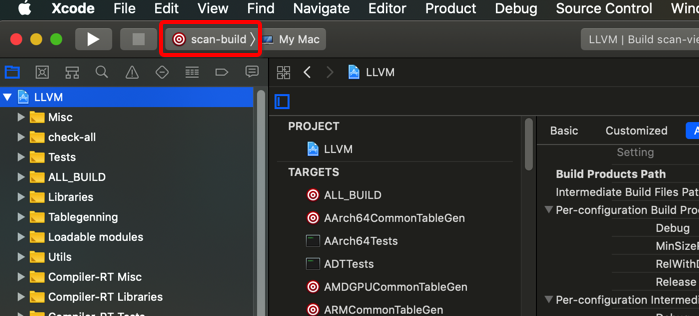
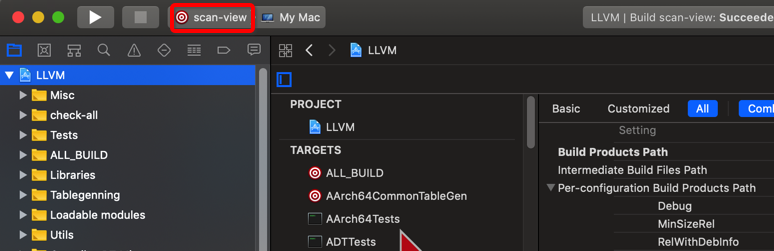
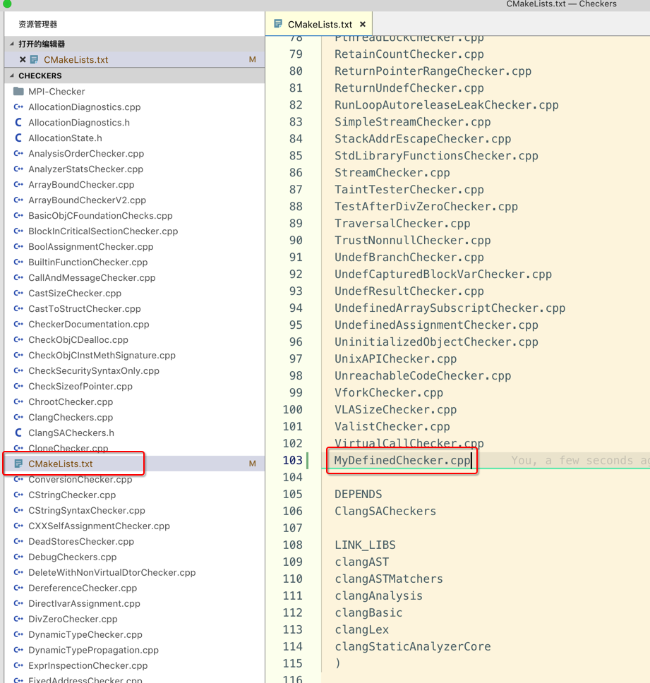
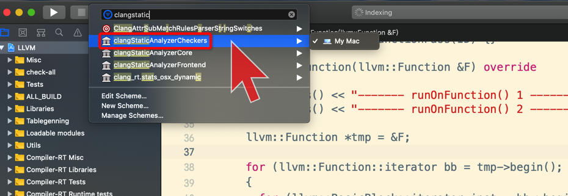

[TOC]


## 1. Clang Static Analyzer

- 开源编译器 LLVM 中的 **前端 clang** 中 **内置** 针对 **C/C++/Objective-C** 源代码的 **静态** 分析工具

- 能提供 普通 **warning 之外** 的检查: **内存操作，安全** 等方面


## 2. Clang Static Analyzer = analyzer core (引擎) + checkers

- 整体来看 clang static analyzer 分为 **两部分**
  - 1) **analyzer core** (分析引擎)
  - 2) 各种各种样的 **checkers** (代码检测)

- 所有 checker 都运行在 **底层分析引擎** 的基础之上

- 增加一个 **新的 checker** 时, 大多使用 **分析引擎** 提供的功能编写新的 checker 即可


## 3. 列举所有可用的 checkers

```
$LLVM_BUILD_ROOT/Debug/bin/clang -cc1 -analyzer-checker-help
```

运行输出

```
OVERVIEW: Clang Static Analyzer Checkers List

USAGE: -analyzer-checker <CHECKER or PACKAGE,...>

CHECKERS:
  alpha.clone.CloneChecker        Reports similar pieces of code.
  alpha.core.BoolAssignment       Warn about assigning non-{0,1} values to Boolean variables
  alpha.core.CallAndMessageUnInitRefArg
                                  Check for logical errors for function calls and Objective-C message expressions (e.g., uninitialized arguments, null function pointers, and pointer to undefined variables)
  alpha.core.CastSize             Check when casting a malloc'ed type T, whether the size is a multiple of the size of T
  alpha.core.CastToStruct         Check for cast from non-struct pointer to struct pointer
  alpha.core.Conversion           Loss of sign/precision in implicit conversions
  alpha.core.DynamicTypeChecker   Check for cases where the dynamic and the static type of an object are unrelated.
  alpha.core.FixedAddr            Check for assignment of a fixed address to a pointer
  alpha.core.IdenticalExpr        Warn about unintended use of identical expressions in operators
  alpha.core.PointerArithm        Check for pointer arithmetic on locations other than array elements
  alpha.core.PointerSub           Check for pointer subtractions on two pointers pointing to different memory chunks
  alpha.core.SizeofPtr            Warn about unintended use of sizeof() on pointer expressions
  alpha.core.StackAddressAsyncEscape
                                  Check that addresses to stack memory do not escape the function
  ................. (大概几百个) .................
```


## 4. 构建生成 scan-build

### 1. scan-build



### 2. scan-build




## 5. clang chckers 扫描源文件

### 1. test.c

```c
char * test_fixed_address_checker()
{
  char *p;
  p = 0x1000;
  return p;
}
```

### 2. clang 加载 chckers 扫描 test.c

```
$LLVM_BUILD_ROOT/Debug/bin/clang --analyze -Xclang -analyzer-checker=alpha.core.FixedAddr test.c
```

输出

```
 ~/Desktop  $LLVM_BUILD_ROOT/Debug/bin/clang --analyze -Xclang -analyzer-checker=alpha.core.FixedAddr test.c

test.c:4:5: warning: Using a fixed address is not portable because that address will probably not be valid in all environments or platforms
  p = 0x1000;
    ^ ~~~~~~
1 warning generated.
```

### 3. scan-build 调用我们自己编译的 clang 扫描源文件

```
$LLVM_BUILD_ROOT/bin/scan-build \
  --use-analyzer=$LLVM_BUILD_ROOT/Debug/bin/clang  \
  clang -cc1 test.c
```

- `--use-analyzer=/path/to/clang` 告诉系统使用的 clang 的路径

输出如下

```shell
# $LLVM_BUILD_ROOT/bin/scan-build --use-analyzer=$LLVM_BUILD_ROOT/Debug/bin/clang  clang -cc1 test.c
scan-build: Using '/Users/xiongzenghui/llvm_build/Debug/bin/clang' for static analysis
test.c:4:5: warning: incompatible integer to pointer conversion assigning to 'char *' from 'int'
  p = 0x1000;
    ^ ~~~~~~
1 warning generated.
scan-build: Removing directory '/var/folders/kt/z8c9rz0s5nj68j_d_1bj0y7h0000gn/T/scan-build-2019-07-02-125314-6280-1' because it contains no reports.
scan-build: No bugs found.
```


## 6. 编写自己的 clang checker

### 1. cd $LLVM_SOURCE_ROOT/tools/clang/lib/StaticAnalyzer/Checkers 

存放所有的 checker cpp 实现文件:

```
 ~/llvm/tools/clang/lib/StaticAnalyzer/Checkers   release_70 ●  ll
total 3184
-rw-r--r--  1 xiongzenghui  staff   722B  6 27 00:51 AllocationDiagnostics.cpp
-rw-r--r--  1 xiongzenghui  staff   965B  6 27 00:51 AllocationDiagnostics.h
-rw-r--r--  1 xiongzenghui  staff   1.1K  6 27 00:51 AllocationState.h
-rw-r--r--  1 xiongzenghui  staff   5.8K  6 27 00:51 AnalysisOrderChecker.cpp
-rw-r--r--  1 xiongzenghui  staff   4.9K  6 27 00:51 AnalyzerStatsChecker.cpp
-rw-r--r--  1 xiongzenghui  staff   3.0K  6 27 00:51 ArrayBoundChecker.cpp
-rw-r--r--  1 xiongzenghui  staff    13K  6 27 00:51 ArrayBoundCheckerV2.cpp
-rw-r--r--  1 xiongzenghui  staff    44K  6 27 00:51 BasicObjCFoundationChecks.cpp
-rw-r--r--  1 xiongzenghui  staff   6.5K  6 27 00:51 BlockInCriticalSectionChecker.cpp
-rw-r--r--  1 xiongzenghui  staff   5.4K  6 27 00:51 BoolAssignmentChecker.cpp
-rw-r--r--  1 xiongzenghui  staff   4.1K  6 27 00:51 BuiltinFunctionChecker.cpp

...............................
```

### 2. 添加 checker

#### 1. 创建 checker cpp 实现文件

```
touch MyDefinedChecker.cpp
```

#### 2. MyDefinedChecker.cpp 代码

```c++
#include "ClangSACheckers.h"
#include "clang/StaticAnalyzer/Core/BugReporter/BugType.h"
#include "clang/StaticAnalyzer/Core/Checker.h"
#include "clang/StaticAnalyzer/Core/CheckerManager.h"
#include "clang/StaticAnalyzer/Core/PathSensitive/CheckerContext.h"

using namespace clang;
using namespace ento;

namespace {
  class MyDefinedChecker : public Checker< check::PreStmt<BinaryOperator> > 
  {
    mutable std::unique_ptr<BuiltinBug> BT;

  public:
    void checkPreStmt(const BinaryOperator *B, CheckerContext &C) const;
  };
}

void MyDefinedChecker::checkPreStmt(const BinaryOperator *B, CheckerContext &C) const
{
}

// 注：是按照【宏定义】生成的 函数声明，不是乱写的
void ento::registerMyDefinedChecker(CheckerManager &mgr) {
  mgr.registerChecker<MyDefinedChecker>();
}
```

#### 3. IteratorChecker.cpp 有类似实现 ==注册 checker== 宏函数

```c
...............

#define REGISTER_CHECKER(name)                                                 \
  void ento::register##name(CheckerManager &Mgr) {                             \
    auto *checker = Mgr.registerChecker<IteratorChecker>();                    \
    checker->ChecksEnabled[IteratorChecker::CK_##name] = true;                 \
    checker->CheckNames[IteratorChecker::CK_##name] =                          \
        Mgr.getCurrentCheckName();                                             \
  }

REGISTER_CHECKER(IteratorRangeChecker)
```

### 3. cd $LLVM_SOURCE_ROOT/tools/clang/include/clang/StaticAnalyzer/Checkers 注册 checker 

#### 1. 目录下的 Checkers.td 文件

```
# ll
total 136
-rw-r--r--  1 xiongzenghui  staff    98B  6 27 00:51 CMakeLists.txt
-rw-r--r--  1 xiongzenghui  staff   1.2K  6 27 00:51 CheckerBase.td
-rw-r--r--  1 xiongzenghui  staff    32K  6 27 00:51 Checkers.td
-rw-r--r--  1 xiongzenghui  staff   635B  6 27 00:51 ClangCheckers.h
-rw-r--r--  1 xiongzenghui  staff   847B  6 27 00:51 LocalCheckers.h
-rw-r--r--  1 xiongzenghui  staff   4.0K  6 27 00:51 MPIFunctionClassifier.h
-rw-r--r--  1 xiongzenghui  staff   7.6K  6 27 00:51 ObjCRetainCount.h
-rw-r--r--  1 xiongzenghui  staff   7.9K  6 27 00:51 SValExplainer.h
```

#### 2. Checkers.td 文件结构

```c
// 1. 定义 package（组）
def Alpha : Package<"alpha">;
def Core : Package<"core">;
def CoreBuiltin : Package<"builtin">, InPackage<Core>;
...........
def CoreAlpha : Package<"core">, InPackage<Alpha>, Hidden; // 我们自己的注册到这个 package 中

// 2. core package
let ParentPackage = Core in {
  // 组内 第一个 chcker
  def DereferenceChecker : Checker<"NullDereference">,
    HelpText<"Check for dereferences of null pointers">,
    DescFile<"DereferenceChecker.cpp">;

  ........
}

// 3. alpha.core package
let ParentPackage = CoreAlpha in {
  // 组内 第一个 chcker
  def BoolAssignmentChecker : Checker<"BoolAssignment">,
    HelpText<"Warn about assigning non-{0,1} values to Boolean variables">,
    DescFile<"BoolAssignmentChecker.cpp">;

  ........
}
```

#### 3. 把我们自己的 checker cpp 文件, 注册到 alpha.core package

```c
let ParentPackage = CoreAlpha in {
  // 组内 第一个 chcker
  def BoolAssignmentChecker : Checker<"BoolAssignment">,
    HelpText<"Warn about assigning non-{0,1} values to Boolean variables">,
    DescFile<"BoolAssignmentChecker.cpp">;

  ........

  def MyDefinedChecker : Checker<"MyDefined">,
    HelpText<"Check for a self-defined error">,
    DescFile<"MyDefinedChecker.cpp">;
}
```

### 4. $LLVM_SOURCE_ROOT/tools/clang/lib/StaticAnalyzer/Checkers/CMakeLists.txt 注册 checker cpp 文件



### 5. 重新 构建 clang

```
cd $LLVM_BUILD_ROOT
cmake ../llvm -G Xcode -DCMAKE_BUILD_TYPE=Debug
```

打开 LLVM.xcodeproj 选择 **clang** target 进行构建.

### 6. 再次 列举 所有可用的 checkers 中，应该存在自己的 checker => MyDefined

```shell
# $LLVM_BUILD_ROOT/Debug/bin/clang -cc1 -analyzer-checker-help | grep -i 'alpha.core.'
  alpha.core.BoolAssignment       Warn about assigning non-{0,1} values to Boolean variables
  alpha.core.CallAndMessageUnInitRefArg
  alpha.core.CastSize             Check when casting a malloc'ed type T, whether the size is a multiple of the size of T
  alpha.core.CastToStruct         Check for cast from non-struct pointer to struct pointer
  alpha.core.Conversion           Loss of sign/precision in implicit conversions
  alpha.core.DynamicTypeChecker   Check for cases where the dynamic and the static type of an object are unrelated.
  alpha.core.FixedAddr            Check for assignment of a fixed address to a pointer
  alpha.core.IdenticalExpr        Warn about unintended use of identical expressions in operators
  alpha.core.MyDefined            Check for a self-defined error
  alpha.core.PointerArithm        Check for pointer arithmetic on locations other than array elements
  alpha.core.PointerSub           Check for pointer subtractions on two pointers pointing to different memory chunks
  alpha.core.SizeofPtr            Warn about unintended use of sizeof() on pointer expressions
  alpha.core.StackAddressAsyncEscape
  alpha.core.TestAfterDivZero     Check for division by variable that is later compared against 0. Either the comparison is useless or there is division by zero.
```

其中: **alpha.core.MyDefined            Check for a self-defined error** 就是我们自己的 checker


## 99. 构建 clang Analyzer 相关库

### 1. clangStaticAnalyzerCore


### 2. clangStaticAnalyzerCheckers



生成的 静态库

```
 ~/llvm_build/Debug/lib  ls | grep -i 'AnalyzerCheckers'
libclangStaticAnalyzerCheckers.a
```

