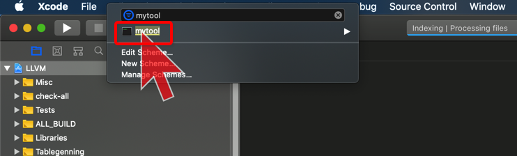

[TOC]


## 1. 参考文档

http://clang.llvm.org/docs/HowToSetupToolingForLLVM.html

http://clang.llvm.org/docs/LibTooling.html 有几个示例


## 2. 简单的创建一个 ClangTool

### 1. cd $LLVM_SOURCE_ROOT/tools/clang/tools/extra

```
 ~/llvm/tools/clang/tools/extra   release_70  ll
total 32
-rw-r--r--   1 xiongzenghui  staff   775B  6 27 00:51 CMakeLists.txt
-rw-r--r--   1 xiongzenghui  staff   709B  6 27 00:51 CODE_OWNERS.TXT
-rw-r--r--   1 xiongzenghui  staff   2.7K  6 27 00:51 LICENSE.TXT
-rw-r--r--   1 xiongzenghui  staff   1.0K  6 27 00:51 README.txt
drwxr-xr-x   6 xiongzenghui  staff   192B  6 27 00:51 change-namespace
drwxr-xr-x   6 xiongzenghui  staff   192B  6 27 00:51 clang-apply-replacements
drwxr-xr-x  20 xiongzenghui  staff   640B  6 27 00:51 clang-doc
drwxr-xr-x   8 xiongzenghui  staff   256B  6 27 00:51 clang-move
drwxr-xr-x   9 xiongzenghui  staff   288B  6 27 00:51 clang-query
drwxr-xr-x   6 xiongzenghui  staff   192B  6 27 00:51 clang-reorder-fields
drwxr-xr-x  37 xiongzenghui  staff   1.2K  6 27 00:51 clang-tidy
drwxr-xr-x   8 xiongzenghui  staff   256B  6 27 00:51 clang-tidy-vs
drwxr-xr-x  63 xiongzenghui  staff   2.0K  6 27 00:51 clangd
drwxr-xr-x  21 xiongzenghui  staff   672B  6 27 00:51 docs
drwxr-xr-x  19 xiongzenghui  staff   608B  6 27 00:51 include-fixer
drwxr-xr-x  12 xiongzenghui  staff   384B  6 27 00:51 modularize
drwxr-xr-x   6 xiongzenghui  staff   192B  6 27 00:51 pp-trace
drwxr-xr-x  18 xiongzenghui  staff   576B  6 27 00:51 test
drwxr-xr-x   4 xiongzenghui  staff   128B  6 27 00:51 tool-template
drwxr-xr-x  11 xiongzenghui  staff   352B  6 27 00:51 unittests
```

### 2. 创建 tool 工程目录

```
mkdir mytool
cd mytool
touch mytool.cpp
touch CMakeLists.txt
```

```
 ~/llvm/tools/clang/tools/extra/mytool   release_70  tree
.
├── CMakeLists.txt
└── mytool.cpp
```

### 3. mytool/mytool.cpp

```c++
// Declares clang::SyntaxOnlyAction.
#include "clang/Frontend/FrontendActions.h"
#include "clang/Tooling/CommonOptionsParser.h"
#include "clang/Tooling/Tooling.h"
// Declares llvm::cl::extrahelp.
#include "llvm/Support/CommandLine.h"

using namespace clang::tooling;
using namespace llvm;

// Apply a custom category to all command-line options so that they are the
// only ones displayed.
static llvm::cl::OptionCategory MyToolCategory("my-tool options");

// CommonOptionsParser declares HelpMessage with a description of the common
// command-line options related to the compilation database and input files.
// It's nice to have this help message in all tools.
static cl::extrahelp CommonHelp(CommonOptionsParser::HelpMessage);

// A help message for this specific tool can be added afterwards.
static cl::extrahelp MoreHelp("\nMore help text...\n");

// 让 tool 可执行
int main(int argc, const char **argv) {
  // OptionsParser
  CommonOptionsParser OptionsParser(argc, argv, MyToolCategory);

  // 实例化 clang tool
  ClangTool Tool(
    OptionsParser.getCompilations(),
    OptionsParser.getSourcePathList()
  );

  // rool run
  return Tool.run(newFrontendActionFactory<clang::SyntaxOnlyAction>().get());
}
```

### 4. mytool/CMakeLists.txt

```cmake
set(LLVM_LINK_COMPONENTS support)

add_clang_executable(mytool
  mytool.cpp
)

target_link_libraries(mytool
  PRIVATE
  clangTooling
  clangBasic
  clangASTMatchers
)
```

### 5. 修改 $LLVM_SOURCE_ROOT/tools/clang/tools/extra/CMakeLists.txt 添加 mytool 目录编译

```cmake
.........

add_subdirectory(mytool) #=> 末尾追加
```

### 6. 重新生成 LLVM.xcodeproj

```
cd $LLVM_BUILD_ROOT
cmake ../llvm -G Xcode -DCMAKE_BUILD_TYPE=Debug
```

### 7. 打开 LLVM.xcodeproj 选择 mytool target 进行构建



### 8. 找到生成的 mytool 可执行文件


路径为: `$LLVM_BUILD_ROOT/Debug/bin`

### 9. ==命令行== 运行 mytool

#### 1. help

```shell
# $LLVM_BUILD_ROOT/Debug/bin/mytool --help

..............
More help text...
```

#### 2. 传递参数

```
echo "int main() { return 0; }" > test.cpp
$LLVM_BUILD_ROOT/Debug/bin/mytool test.cpp --
```

### 10. ==xcode== 运行 mytool

#### 1. edit ==mytool== target ==scheme==


#### 2. xcode run

运行结束.

#### 3. 可以 ==断点== 调试


## 3. `--` 分割 ==tool== 和 ==clang== 二者的参数


- 1) `--` **之前** 的所有参数: 都是传递给 **tool** 
- 2) `--` **之后** 的所有参数: 都是传递给 **calng** 


## 4. AST matcher

### 1. BinaryOperator

- 假设您只想 检查 **二元运算符**
- 有一个 **匹配器** 可以精确地执行该操作，很方便地命名为 **BinaryOperator**

### 2. AST matchers to match all the different nodes in the AST

```c
binaryOperator(
  hasOperatorName("+"), 
  hasLHS(
    integerLiteral(
      equals(0)
    )
  )
)
```

- 当 + 运算表达式 **左侧** 是 **数值 0** 那么就会被 **匹配**

- 而如果是 '\0' 或 NULL , 则 **不会** 被匹配

- **不会** 对 **overloaded** operator '+' 匹配, 但是有一个单独的 operatorcallexpr matcher 来处理这种

### 3. capture all ==for statements==

```c
ForStmt()
```

得到一个表示 **for 循环** 的操作.

### 4. a single variable is declared in the first portion of the loop

```c
forStmt(              // for
  hasLoopInit(        // first portion of the loop
    declStmt(         // declared statement
      hasSingleDecl(  // a single variable
        varDecl()     // var deaclare
      )
    )
  )
)
```

### 5. add condition variable is initialized to zero

```c
forStmt(              // for
  hasLoopInit(        // first portion of the loop
    declStmt(         // declared statement
      hasSingleDecl(  // a single variable
        varDecl()     // var deaclare
      )
    )
  )
)

forStmt(
  hasLoopInit(declStmt(hasSingleDecl(varDecl(
  hasInitializer(integerLiteral(equals(0))))))))
```