[TOC]


## 1. 参考: 市面上各种大厂的包体积优化方式

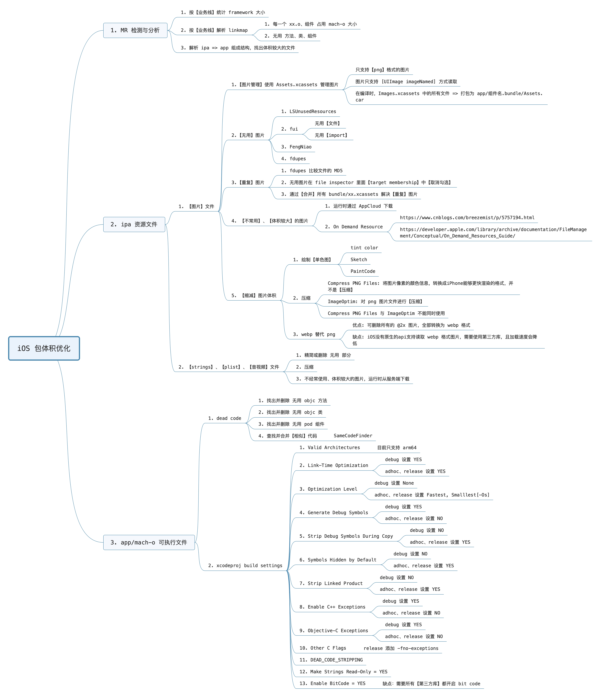

-----

- 1) 一两波非持续性优化，一般围绕 2、3 进行 突击性 优化一波
- 2) 持续性的优化，就需要把 2、3 输出成一份 **工具链** 定期完成 代码的质量检测，守住每一次的优化成果


## 2. 分析: 通过脚本 分析目前影响包体积的因素

### 1. 延续 最开始第一个做包体积优化的人留下的方案: 统计每一个组件编译后的 ==framework==

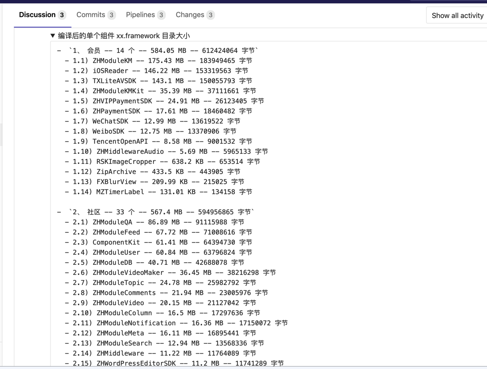

- 我们大概有 **5个事业部**，总共有接近 **200个组件**，太多了就不贴出来了
- 对于每一个 MR 都会有这样的自动检测脚本代码在跑，并得到这样一份分析数据 (下面各种分析项都是这样)
- 这样虽然是可以很直观的看出每一个组件的 **framework** 大小
- 但是并无法反映出最终 **占比 app** 的大小，因为一个 **framework** 中包含很多的 **编译** 阶段的东西，并不是最终 **链接** 阶段的
- 所以这个值后来，我只用来做一个 **象征性** 的参考
- 并且发现在最新 10.2 xcode 更新后，每一个组件的 framwork 都会 **减小** 很多 

### 2. 增加 解析 最终构建出的 ipa/app 包内的文件

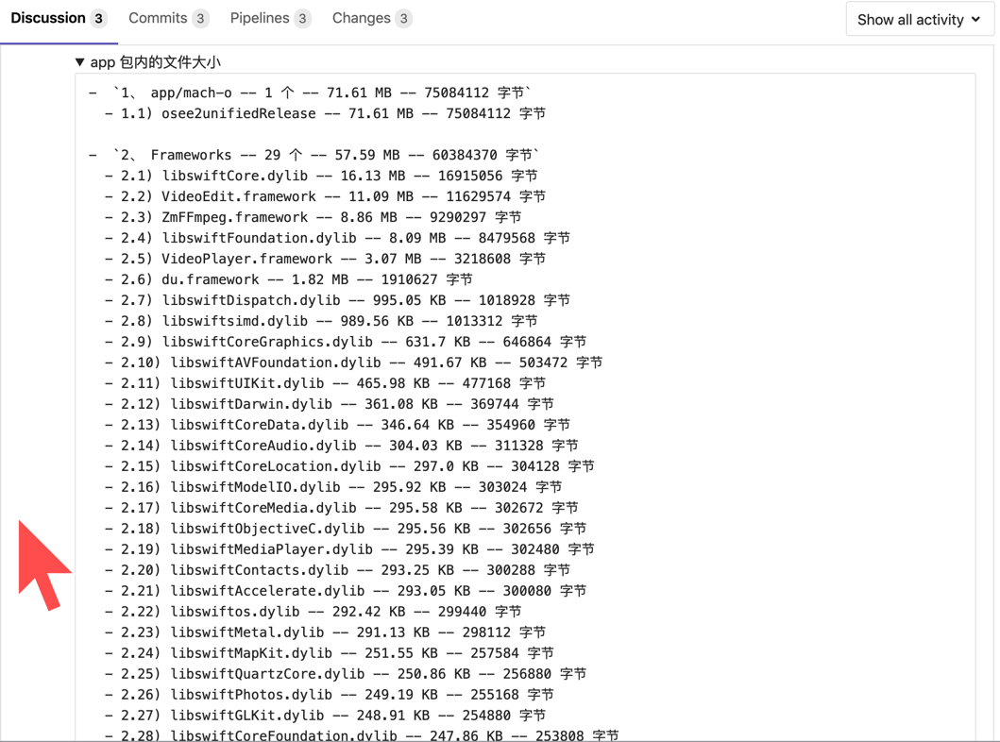

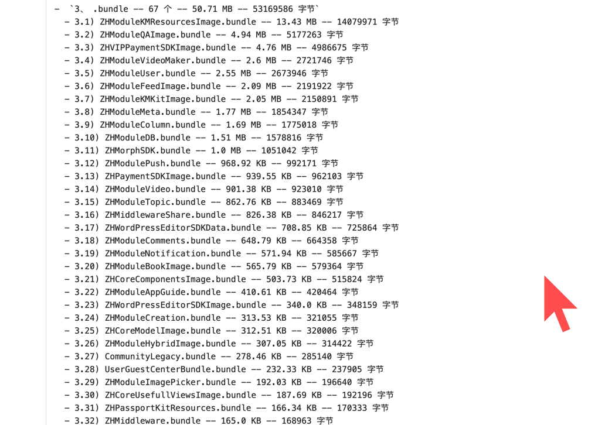

- 内容太多，只贴出几个比较大头的文件类型
- 经过分析，发现几个比较占大头的东西
  - 可执行文件 本身
  - Swift 的几个动态库、以及我们自己的几个动态库
  - 各个组件的 bundle 特别大，加起来有 **50 MB+**
  - 还有几张 GPUImage 自带的 png 图片，加起来也有 **5 MB** 左右
  - 最后还发现几个 app extension 也很大，**3MB+**
- 所以从这个分析中，大致确定了如下几个后续的优化方向
  - 可执行文件
  - 各个组件的 bundle
  - GPUImage
  - app extension
- 但是从这只能确定 **优化方式** ，但是没办法建立 **各个事业部的包体积标准值**
- 而后续更重要的是，给各个事业部建立 **标准值**，一旦不符合就不允许代码合并
- 所以为了寻找这个 **标准值** 还得往下继续

### 3. 增加 解析 linkmap 得到每个组件真实的 ==代码量== 大小

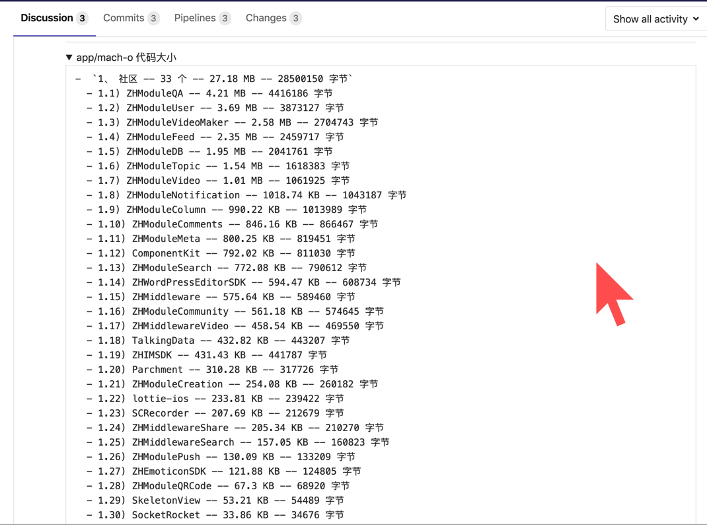

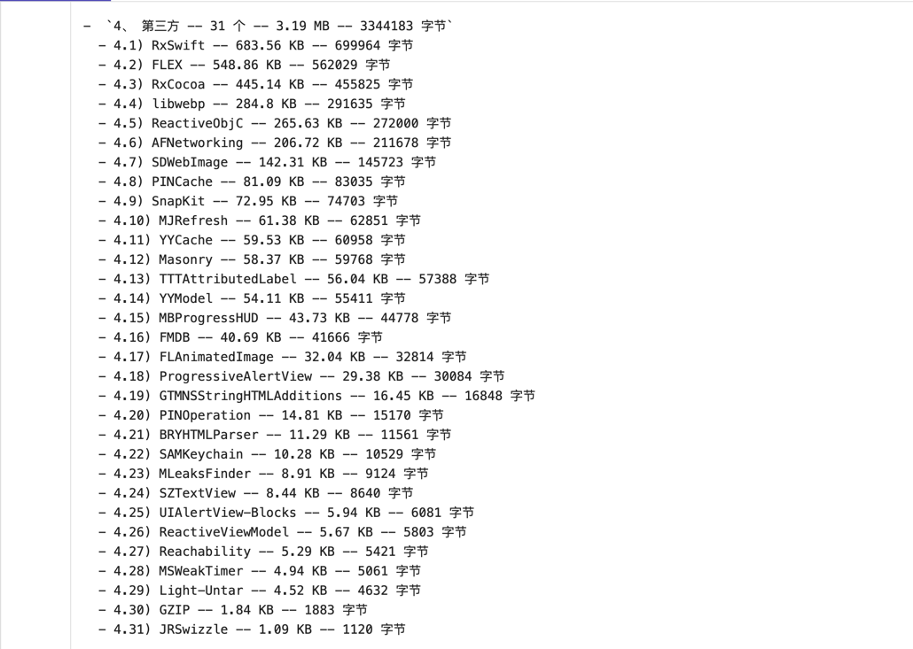

- 同上组件太多，就不一一贴出来了
- 从这个数据中，基本上能够比叫精确统计出每个组件最终占比 **app/mach-o** 的代码量大小了
- 但是也有一个问题
- 就是这只是 **代码** 大小，但是每一个组件还会包含其他的各种 **资源文件**
  - 图片
  - json
  - plist
  - 音视频
  - …..
- 而从这个方向是拿不到的

### 4. 增加统计每一个组件 ==fixed== framework = linkmap 大小 + (framework - framework/binary) 作为最终每个组件的 ==标准值==

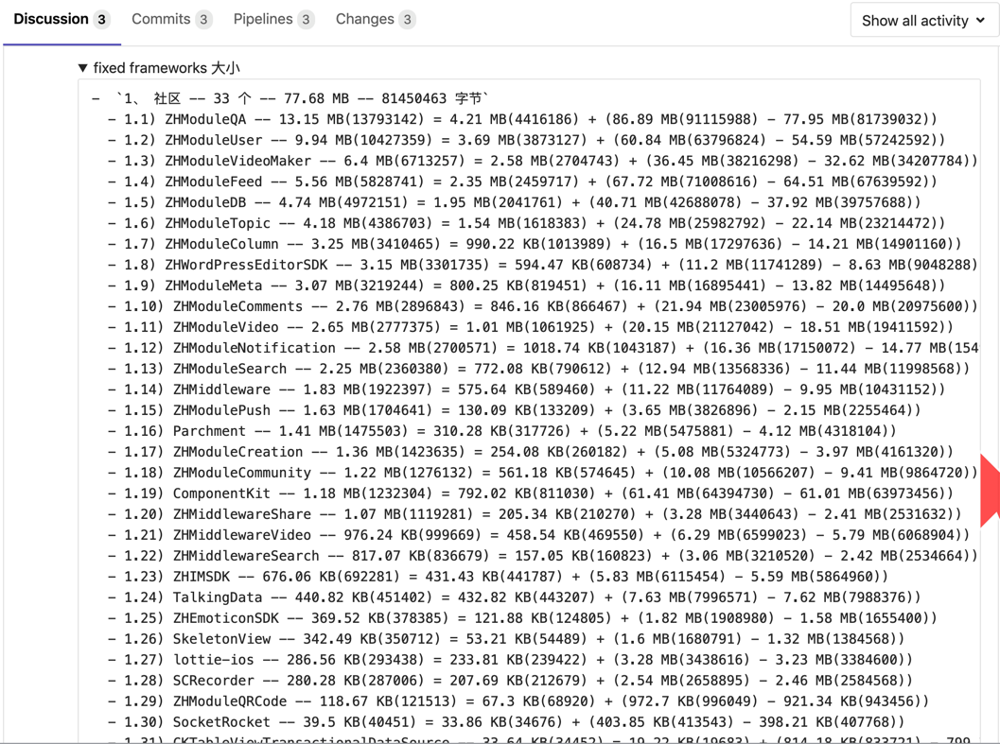

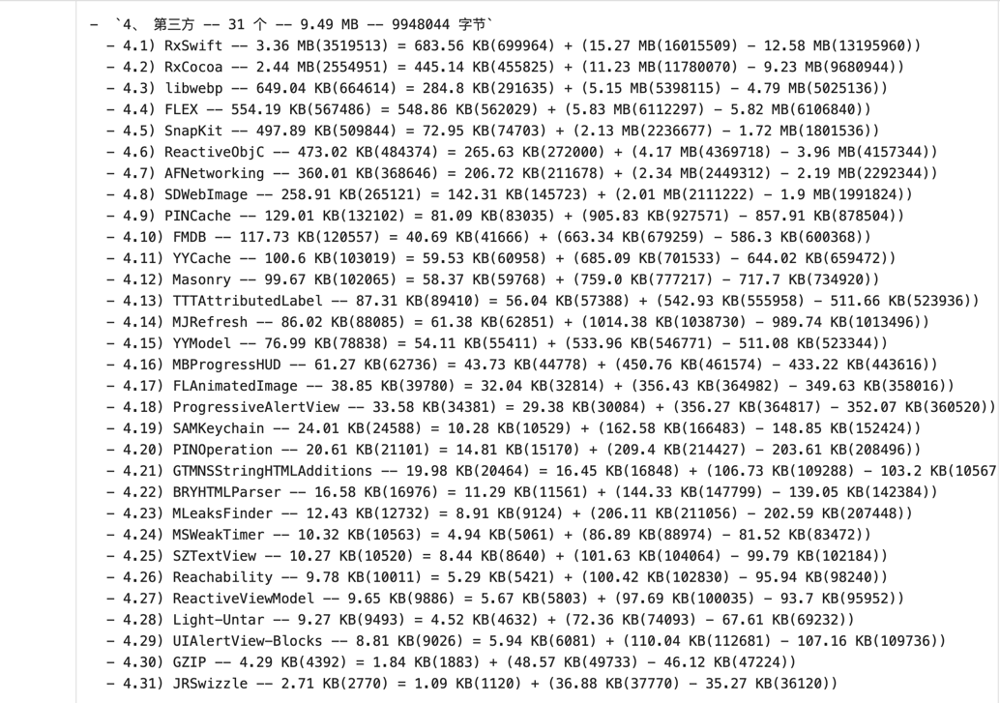

- 为什么要 framework - framework/binary 了？
- 因为我们的组件化对于每个组件都是独立编译好，提前存储的服务器上的，也就是说和 **主工程** 编译环境可能是不一样的
- 这就导致 MR 组件以 **源码** 构建时，和直接拉取服务器存储的 **二进制** 时的大小，会有一定的 **差异**
- 没有去深入为啥有这样的差异，所以直接自己发明了这样的一个计算公式
- 经过几个版本、平时的构建观察，这个值还是比较 **稳定** 的


## 3. 工具链: 目前来说我们的每一个 MR 都会有这样的检测数据

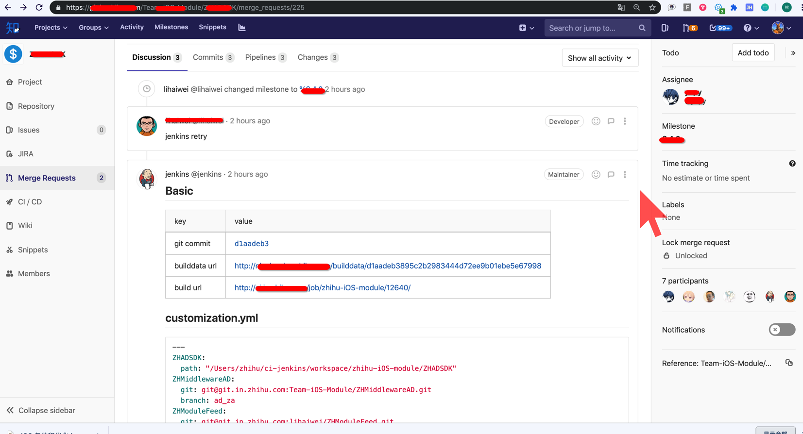

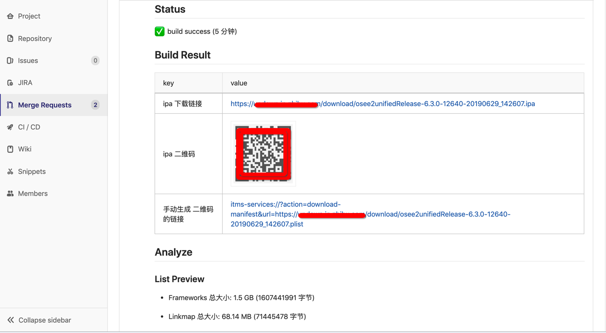

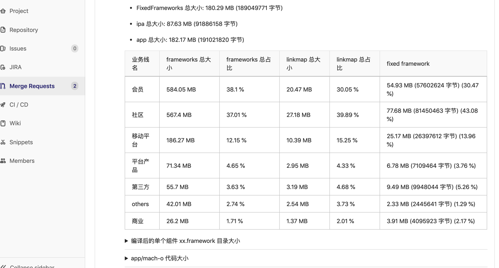

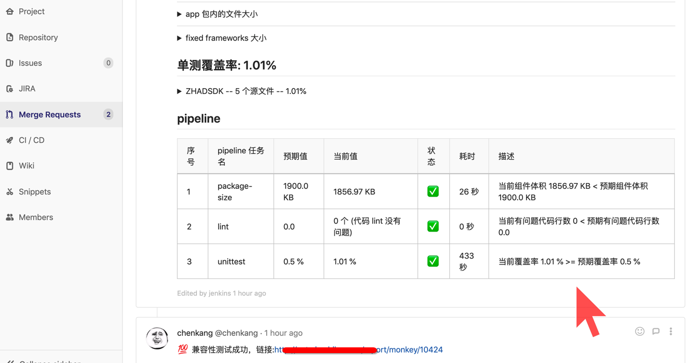

- 其中的 **Analyze** 部分是对 **2.** 中的分析代码，完整打包成工具链后的产出，点击查看具体详情
- 最后还有个 **pipeline** 检测数据，这个就是最终根据 **标准值** 建立的 组件是否 **允许合并** 的标准，后面再说


## 4. 解决 - 资源文件: app/xx.bundle 都特别大

### 1. 为什么 app/xx.bundle 都特别大？

- 通过解压或者分析工具，看到最终里面大部分都是 **2x、3x 的 png** 图片

- 直接就是 **裸放** 在 **bundle** 中的

- 这样放 png 图片的话，那么就 **绕开** 了 **xcassets catalog** 的特性，完全没有得到 苹果 的任何优化

- 反过来问下：是否只要使用 **xcassets** 管理 png 图片就一定要起到包体积优化了？

- 这个问题，我问了很多人，其实大多数都一知半解，基本都说不清楚，只知道有优化效果

- 而且我用 **错误** 的方式，还问懵过很多人 ...

### 2. 苹果给出的包体积优化三大步

- 1) xcassets catalog
- 2) bit code
- 3) On Demand Resources

具体大家可以看苹果文档或者网上各种xxx包体积优化，基本上也是烂大街了，就不多写了 ...

### 3. 对于我当前 app/组件.bundle 过大的问题, xcassets catalog 明显是我的最佳选择，但是我有几个疑问？

#### 疑问1: xcassets 对于 **独立** 的 组件/xx.bundle 是否还会有效？

- 因为我们的项目是 **组件化** 形式存在的，那么也就是说 **组件/bundle** 正常来说，应该是 **独立** 的

- 不太确定 apple 是否对 **app/xx.bundle/Assets.car** 仍然会有优化效果

- 这个问题我之前还问过很多的大厂的朋友，大部分都说不确定，也没在意过这个问题

- 中途还被 **误导** 得出了一个优化方向: 将 **各个组件/xcassets** 合并到 **app工程/xcassets** (但发现 百度 貌似就是这样做的)

- 虽然这样的效果很明显，最终只有一个 **app/Assets.car**

- 但是却需要更改 **组件** **读取图片** 的方式，改动确实有点大，所以并没有过多的考虑
  - 之前读取 **组件** 自己的 bundle
  - 现在却要改成读取 **app** 下的 main bundle

- 当时还真作为最终 xcassets 如果没办法实现优化情况下，最后的一个比较坏的打算

- 但是通过实践发现，appstore 下发的 ipa 其实对 **app/xx.bundle/Assets.car** 仍然会有优化效果

#### 疑问2: 如何 测试 迁移到 xcassets 之后，是否真的对 包体积 有减小的效果？

- 我首先尝试使用一个组件, 迁移成 xcassets 
  - 对于我们目前 **基础图片读取库** 并不需要做出修改
  - 这是我没预料到的，一开始以为还需要修改读取图片的方式
  - 起始不管是 **app/组件.bundle/xx.png** 还是 **app/xx.bundle/Assets.car** 
  - 最终读取图片都是 **app/组件.bundle** , 所以只要保证 **图片名不变** 就不用做任何的修改

- 本地 xcode 链接 iphone 真机, 发现效果确实直接出来了
  - 选择 **iphone5se** 真机编译
  - 得到的 **app/组件.bundle/Assets.car** 中确实只有 **2x** 倍图
  - 貌似确实可行，然后这个组件的修改我就提交了

- 但是最终 ci 打出的 ipa 包，却发现体积 **增大** 了？？？
  - 一开始我确实比较疑惑！
  - 苹果 明明说的是 **减小** 体积，但为何反而 **增大** 了？
  - 最开始我问了很多的朋友，有的说 **不知道**，有的说 **必须开启 bitcode** ...

- 幸亏没有盲目的相信别人, 于是查看各种苹果文档, 发现并没有说 **xcassets 和 bitcode** 有什么必要的关系
  - 所以我对这些人下的 **结论** 比较质疑的
  - 得出一个结论, 实践才能得真知
  - 但是觉得大家写博客文章, 也没必要 **过分** 摘抄, 一个人错之后, 其他的 99 人都是错的 ..

- 最开始我使用的 mac 上的 **app configuator** 工具, 在线安装各种 app 使用 **错误** 方式, 问懵逼了很多的人 
  - 微信、淘宝、头条、滴滴、美团 ...
  - 发现解压后的 app/Asessts.car 中都同时包含 2x 和 3x 图片
  - 而且 app/mach-o 也是同时有 armv7 和 arm64 两种架构的
  - 然后我以这种测试结果，去问了很多大厂的朋友，最终的结论: 不太清楚 ...

- 最后我通过使用 **越狱机** 来导出手机上的安装的 app 得出的结论:
  - 使用 **越狱机** 导出的 ipa => app
    - Assets.car 里面就又 **只有一种** 2x 或者 3x
    - app/mach-o 也 **只有一种** 架构了
  - 那么我大致得出的结论:
    - 我们 **上架时** 打的包 => universal 形式
    - 我们 **本地调试链接 xcode** 打的包 => only active achitecture 形式
    - 通过 **app configuator** 工具下载到的包 => universal 形式
  - 那么自然 ci 打出的包会比较大，而且也同样包含 2x 和 3x
  - 但是最终在 提交到 appstore 时候, 会有一份 **不同机型** 下的大小差异性表格，发现确实有 **1M大小 差异**

- 所以也确定 xcassets 确实可行的

- 而且在 ci 构建 universal 会导致包体积变大, 也需要在计算 各个事业部包体积标准值 过程中考虑到

### 4. bundle 对比 xcassets

- 并不是 xcassets 一定就比 bundle 好, 各有个的使用场景, 以及优缺点

- 只不过在包体积这块效果稍微会比 bundle 明显一些

- 通过最终包体积优化，发现确实使用 xcassets 相对来说会带来很多的优点
  - 1) 图片的读取效率
  - 2) 安装空间大大减小 (Assets.car 可大大减少字节对齐)
  - 3) ipa 下载大小减小 (appstore image slicing)

大致意思就是这样的，至于二者更多的性能对比，我就懒得写了，网上很多 ...

### 5. 问题来了，涉及到很 多个组件仓库，到底如何迁移到 xcassets ？

#### 方式1: 让各个组件仓库开发者，自己手动迁移

- 这种方式就是比较 **繁琐** ，需要各个仓库的开发者手动迁移

- 但是这个 **迁移过程** 我们可以提供 **自动化工具** 去完成，无须太多的手动操作，当然也是无法百分比自动化，比如有一些个性化 podspec 修改还是需要手动完成的

- 但是这个方式的好处时，后续可以使用 xcassets 各种新特性：color ...

- 也大大减小在 壳工程 集成阶段的 复杂性

#### 方式2: 各个组件仓库仍然保持现在结构，只是在 **壳工程构建** 时，自动做完一切的转换、以及 xcassets 合并

- 这个方式显然对于 **组件** 是最方便的，不用做任何的修改, 但是对于 **壳工程集成阶段** 就显得比较复杂了

- 但是后来发现 **百度** 确实是这么搞的，还提供了 **xcassets 缓存** 节省编译时间 (需要研究下 ~~)

- 最终 **没有** 选择的原因：确实有点复杂，工作量有点大 ...

### 6. 提供自动化工具，帮助 各个组件仓库 自动完成迁移

#### 1. 我们内部的 iOS command line tool 工具, 基本郎阔了日常的各种操作

```
 ~/Desktop  ks
NAME
    ks - 🐶 Kanshan, a command line tool for Zhihu iOS team.

SYNOPSIS
    ks [global options] command [command options] [arguments...]

VERSION
    2.0.12

GLOBAL OPTIONS
    --help    - Show this message
    --version - Display the program version

COMMANDS
    analysis, a      - 📊 Analysis
    generate, gen, g - ⌨️ 生成图片/字符串代码
    help             - Shows a list of commands or help for one command
    module, m        - 🐣 壳工程相关
    mr               - 🔵 gitlab merge request
    pod              - ⚽️ pod 相关
    setup            - 🌲 依赖环境
    uninstall        - 🚫 卸载
    update           - ♻️ 更新
    xcode, x         - 🛠️ Xcode
```

#### 2. 组件仓库/bundle 迁移成 组件仓库/xcassets 

```
ks g cvt
```

#### 3. 对 组件仓库/xcassets/xx.imageset 生成读取图片的 objc 文件

```
ks g x
```

#### 4. 最终一个 迁移后的 组件结构

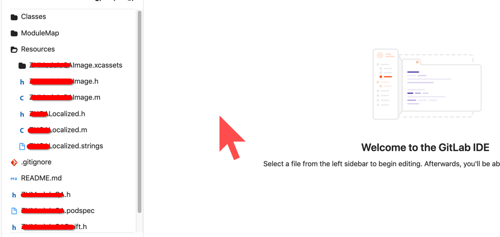

### 7. 有了自动化的工具之后，再来推进 各个组件仓库 迁移 xcassets 就好多了

- 无法让所有组件仓库，在一个版本中集中进行迁移，得根据他们自己的工作量来安排哪个版本上

- 最终我们花了大概 4个 版本的时间，大部分原则上需要完成迁移的组件，全部都顺利完成了迁移到 xcassets 的工作

- 最终收获的效果，也是很明显的，通过 appstore 后台显示的 ipa 下载大小，直接减小了 **12M+**

### 8. 其他资源文件

- 通过 MR 分析，**没有** 看到比较大的资源文件

- 所以暂时不做主要优化

- 只在 MR 分析阶段，加上大小限制


## 5. 解决 - 代码

### 1. 根据 MR 分析统计出的，每个事业部 排名靠前的组件 优先优化

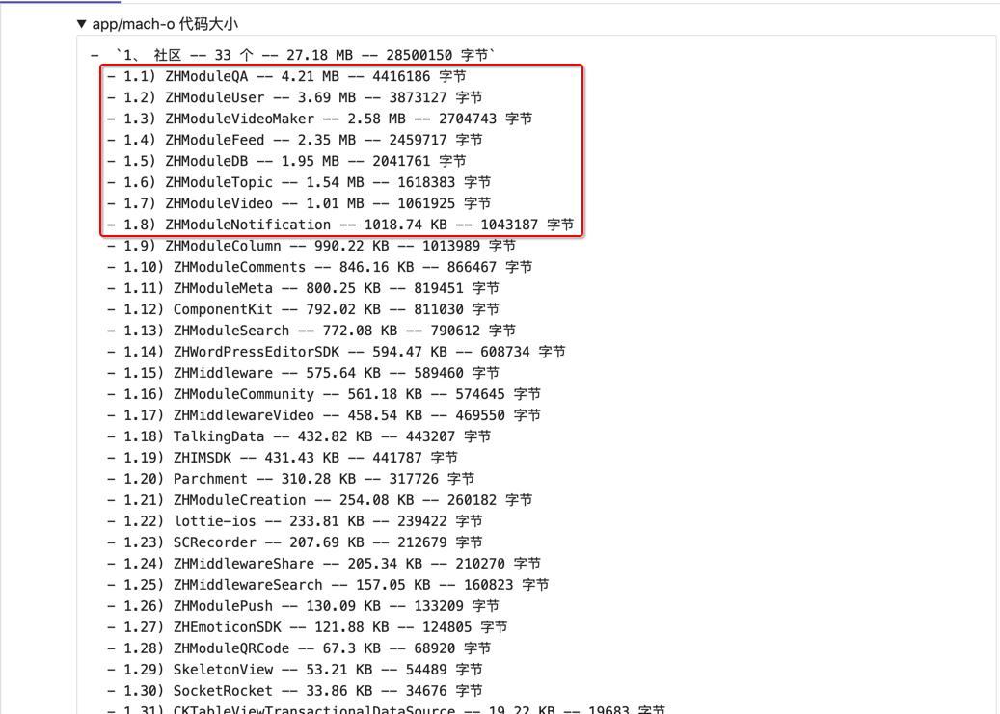

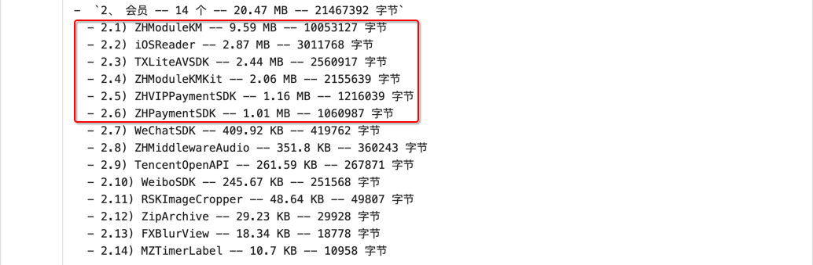

- 注：图上是现在已经优化后的大小了，之前的 MR 找不到了，大家可以意会下这种形式 (数据比这个图上的大很多 ..)

- 通过这个分析数据，主要是推动 **组件仓库** 开发者, 自己进行代码缩减（无用代码删除、合并、..）

- 由于时间比较短，所以这部分的优化，并没有提供太多的 **工具** 去帮助开发者找出哪部分代码

### 2. 没有做、感觉意义 不是特别大的事情

| 措施                                                         | 投入 & 收益                          |
| ------------------------------------------------------------ | ------------------------------------ |
| 建立 **版本对比** 机制，体现出每个组件相对 **某个标准值** 变化情况 | 比较大，但是一直没找到对比的基准值   |
| 输出每个组件代码中比较大的符号                               | 一般，一般没人看这个，而且输出特别多 |
| 对全局组件比较大的符号做一个排名                             | 一般，一般没人看这个                 |

### 3. 所以我们的措施就简单粗暴

- 直接给 **每一个事业部** 定下不能超过的 包体积 **最大上限值**
  - 对于 每一个 **组件的 MR** 不能超过 **自己的** 最大值
  - 对于 每一个 **事业部** 每天会跑 包体积分析 主工程 dev 分支代码，一旦超标就会 **发送邮件** 通知事业部老大周知

- 所以主要推动 各个事业部 **自己** 完成优化

- 而我们基础平台这边，提供一切 **必要性的工具、标准** 来帮助他们完成这个优化的工作


## 6. 准入机制: 实现类似 gitlab pipelie 控制每一个 MR 对包体积的增加

### 1. 比如限制每个组件的单侧覆盖率必须到某个值

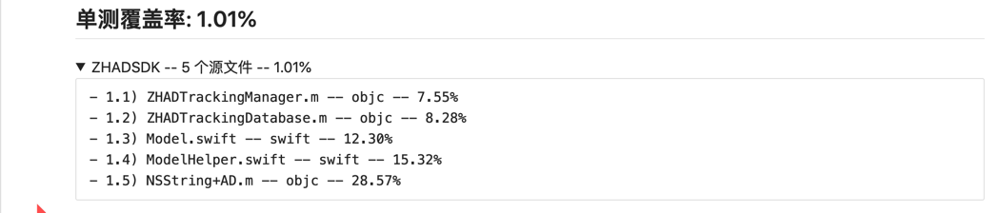

### 2. pipeline 包含: lint、单元测试、包体积分析

#### 1. 合法

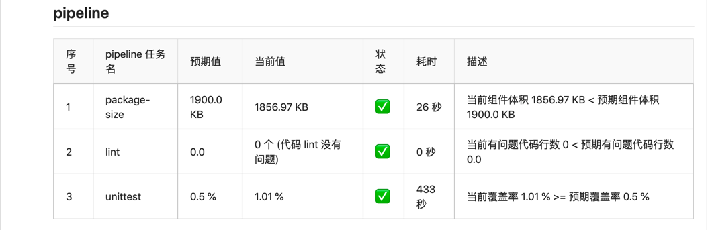

#### 2. 不合法

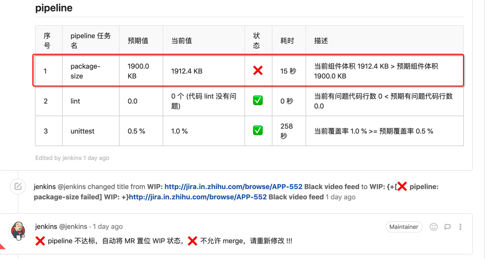

### 3. 最终 pipeline 不合标准的 MR, 会置为 不允许合并 状态

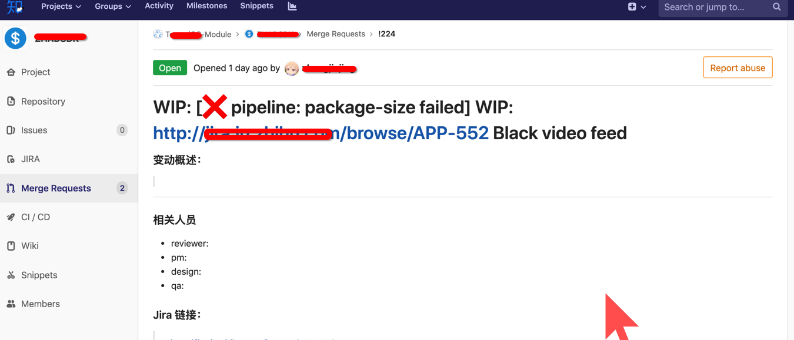

- 当然这都是针对 **MR** 阶段的

- 目前我们已经针对组件的 **创建、开发、MR、提测、发布、集成** 正在开发一条完善的系统，敬请期待 ..


## 7. 总结我们包体积优化措施、对应的下降趋势

| app 版本 | 优化方式 | ipa 下载大小 |
| -------- | -------- | ---------- |
| 4.39 ~ 4.41     | 包体积爆炸的版本 | 接近 150 MB |
| 4.42            | 开始优化的版本，主要是各个组件代码精简 | 134 MB |
| 4.43            | 各个组件继续代码精简、部分组件开始 xcassets 迁移 | 130 MB |
| 6.0.0           | 各个组件继续代码精简、部分组件继续 xcassets 迁移、工程编译设置 (LTO) | 121 MB  |
| 6.1.0           | 部分组件继续 xcassets 迁移、工程编译设置 (LTO) | 118 ~ 120 MB |
| 6.2.0           | 剩下组件继续 xcassets 迁移 | 117 ~ 120 MB |
| 6.3.0           | 所有组件完成 xcassets 迁移 | 106 - 110 MB |

注: iphone 设备上的 **安装** 大小的减小趋势也很大，但是不太记得了 ...

